# 第二部分:Oracle Cloud 上 Spring Cloud 数据流的数据处理管道

> 原文：<https://medium.com/oracledevs/part-ii-data-processing-pipelines-with-spring-cloud-data-flow-on-oracle-cloud-5681ebd2952d?source=collection_archive---------0----------------------->

这是本博客系列的第二部分(也是最后一部分),内容是关于 Oracle Cloud 上的 Spring Cloud 数据流

在**第 1 部分**中，我们介绍了一些**基础**、**基础设施**设置(Kafka、MySQL ),最后，我们在云上有了一个全功能的 Spring Cloud 数据流服务器——现在是时候使用它了！

 [## 第一部分:Oracle 应用容器云上的 Spring Cloud 数据流

medium.com](/oracledevs/part-i-spring-cloud-dataflow-on-oracle-application-container-cloud-cb8d59747dd9) 

在这一部分，您将

*   获得解决方案的技术概述，并查看一些内部细节——为什么和如何
*   在 [Oracle 应用容器云](https://cloud.oracle.com/application-container-cloud)上构建和部署数据流管道
*   最后测试一下…

# 在幕后

在我们看到实际操作之前，这里有一个概述，以便您了解您将要做什么，并对它为什么以这种方式工作有一个(粗略的)想法

在高层次上，这就是 Spring Cloud 数据流的工作方式(您可以随时阅读[文档](https://docs.spring.io/spring-cloud-dataflow/docs/current/reference/htmlsingle/)获取详细信息)

*   从注册**应用**开始，这些应用包含核心业务逻辑，并处理您将如何处理数据，例如，一个简单地转换它(从消息层)接收的数据的服务，或者一个将用户事件/活动泵入消息队列的应用
*   然后，您将创建一个**流定义**，您将在其中定义数据流的**管道**(使用您之前注册的应用程序)，然后部署它们
*   (下面是最精彩的部分！)一旦您**部署了**流定义、**管道**中的各个应用，这些应用将自动部署到 Oracle 应用容器云，这要感谢我们的[定制 Spring Cloud Deployer SPI 实现](https://github.com/ankitbansal/spring-cloud-dfs-accs)(这在[第 1 部分](/oracledevs/part-i-spring-cloud-dataflow-on-oracle-application-container-cloud-cb8d59747dd9)中有简要提及)

在高层次上，SPI 实现需要遵守由`org.springframework.cloud.deployer.spi.app.AppDeployer`概述的契约/接口，并提供以下方法的实现— `deploy`、`undeploy`、`status` 和`environmentInfo`

因此，该实现处理流水线/流处理应用的生命周期

*   创建和删除
*   提供状态信息

# 表演时间…！

## 应用程序注册

我们将从注册我们的流/数据处理应用开始

如第 1 部分所述，Spring Cloud 数据流使用 **Maven** 作为应用程序的来源之一，这些应用程序需要作为您构建的管道的一部分进行部署——更多详细信息[在此](https://docs.spring.io/spring-cloud-dataflow/docs/current/reference/htmlsingle/#arch-intro)和[在此](https://docs.spring.io/spring-cloud-dataflow/docs/current/reference/htmlsingle/#getting-started-maven-configuration)

你可以使用任何 Maven repo——我们使用的是 Spring Maven repo，因为我们将导入他们预先构建的入门应用。这里是配置它的 **manifest.json**

manifest.json for Data Flow server on ACCS

访问 Spring Cloud 数据流仪表板—导航到应用 URL，例如`[https://SpringCloudDataflowServer-mydomain.apaas.us2.oraclecloud.com](https://DataflowServer-ocloud100.apaas.us2.oraclecloud.com)/**dashboard**`

Spring Cloud Data Flow dashboard

出于这个博客的目的，我们将导入两个预构建的初学者应用程序

**http**

*   **类型** —来源
*   **角色** —将数据推送到消息代理
*   **Maven 网址** — `maven://org.springframework.cloud.stream.app:http-source-kafka:1.0.0.BUILD-SNAPSHOT`

**日志**

*   **类型** —水槽
*   **角色** —使用来自消息代理的数据/事件
*   **Maven 网址**——`maven://org.springframework.cloud.stream.app:log-sink-kafka:1.0.0.BUILD-SNAPSHOT`

还有另一类被称为**处理器**的应用——为了简单起见，这里不做介绍

> 有一堆这样的入门应用[让使用 Spring Cloud 数据流变得超级简单！](https://cloud.spring.io/spring-cloud-stream-app-starters/)

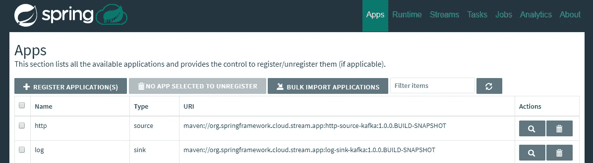

Importing applications

应用程序注册后，我们可以继续创建我们的数据管道。但是，在我们这样做之前，让我们快速浏览一下它会做什么…

## 示例管道/数据流概述

这是管道将封装的流程——一旦你到达**试驾**部分，你将看到这一点..所以继续前进！

*   **http** app - >卡夫卡专题
*   Kafka->**log**app->stdout

**http** 应用程序将为我们提供一个 REST 端点，以便向它发送`POST` 消息，这些消息将被推送到 Kafka 主题。 **log** 应用程序将简单地**消费**这些来自 Kafka 主题的消息，然后将它们发送到**stdout**——简单！

## 创建和部署管道

让我们开始创建流——你可以从我们刚刚导入的源和宿应用程序列表中选择(`http` 和`log`

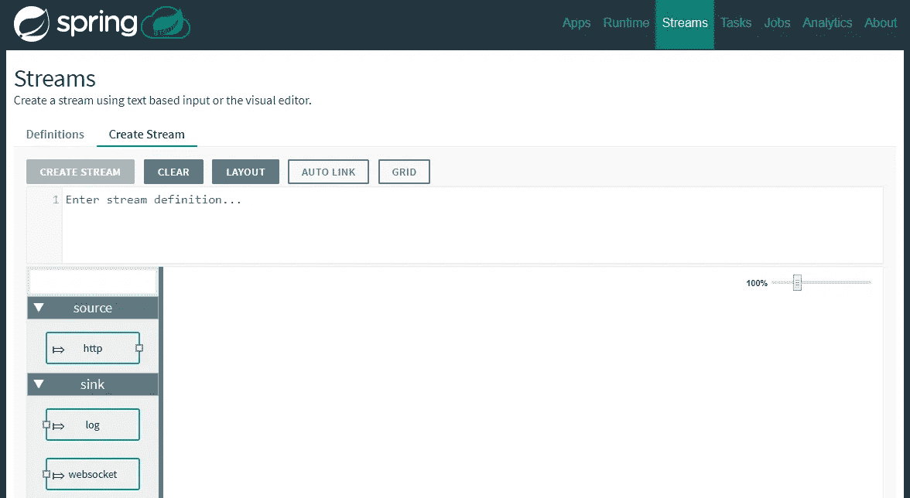

使用下面的流定义——只需用您在[第 1 部分](/oracledevs/part-i-spring-cloud-dataflow-on-oracle-application-container-cloud-cb8d59747dd9)的**基础设施设置**部分设置的事件中心云服务实例的名称替换`KafkaDemo`

Stream definition

您将看到管道的图形化表示(在我们的例子中非常简单)

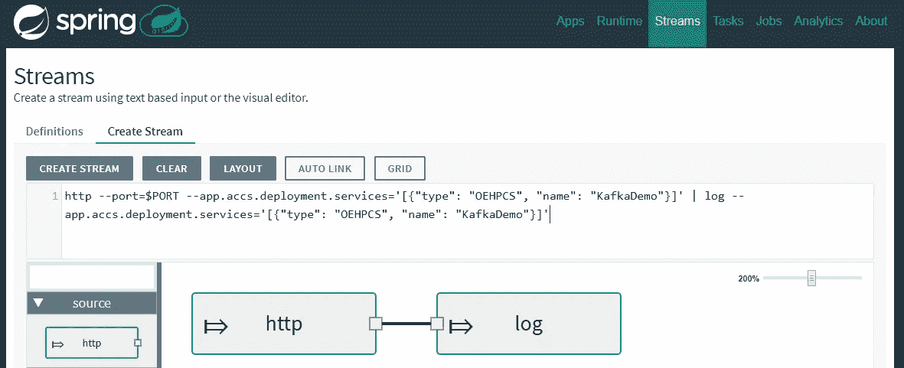

Stream definition

**创建**(和**部署**)管道

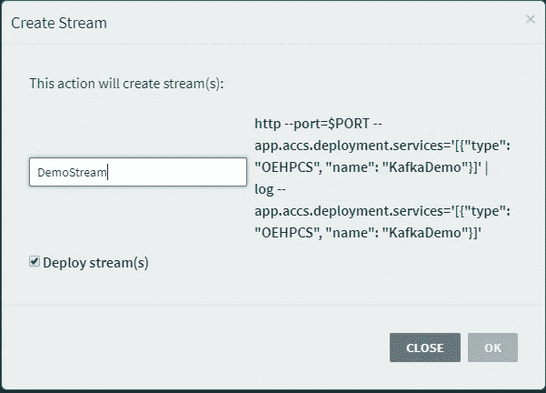

Deploy the stream definition

部署过程将被启动，同样的情况将反映在控制台上

Deployment in progress….

返回 Oracle Application Container Cloud 中的**应用**菜单，确认单个应用部署也已触发

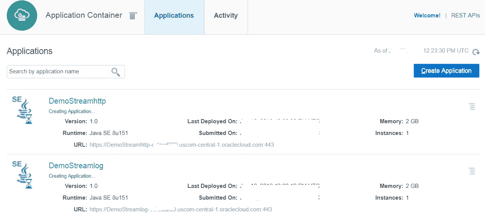

Deployment in progress…

打开应用程序详细信息并导航到**部署**部分，以确认两个应用程序都将**服务绑定**到流定义中指定的事件中心实例

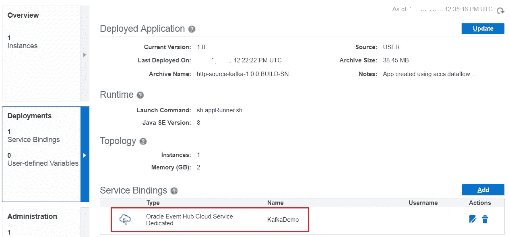

Service Binding to Event Hub Cloud

应用程序部署到 Oracle 应用程序容器云后，流定义的**状态**将变为**已部署**，应用程序也将显示在**运行时**部分

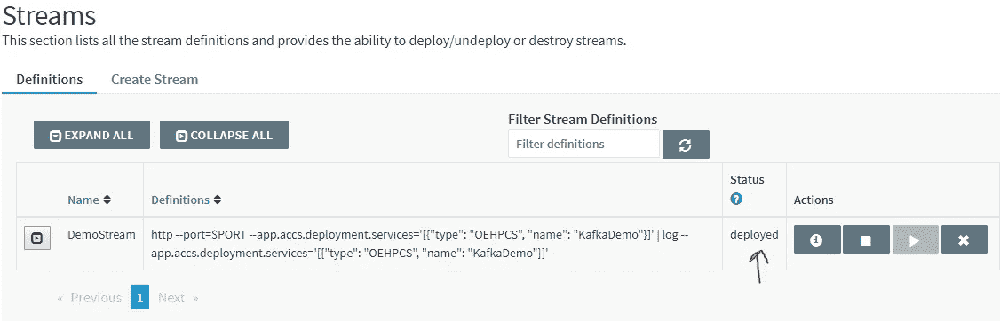

Deployment complete

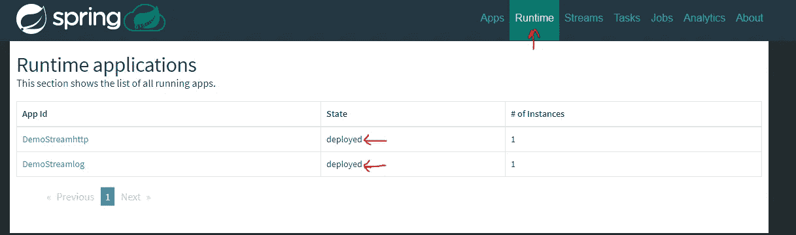

Spring Cloud Data Flow Runtime menu

## 将这些点连接起来..

在我们开始测试我们刚刚创建的数据管道之前，这里有两个图形表示来总结一切是如何逻辑连接的

Spring Cloud 数据流中的各个**管道组件**映射到 Oracle Application Container Cloud 中相应的**应用程序**——通过自定义 SPI 实现部署(在上文和第 1 部分中讨论过)

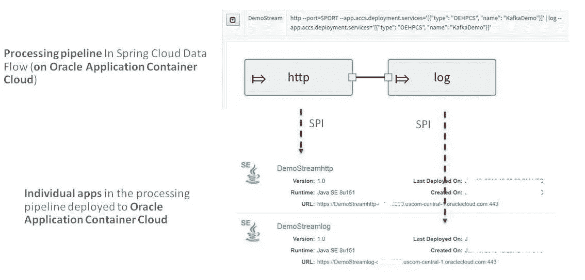

Spring Cloud Data Flow pipeline to application mapping

..这里描绘了与卡夫卡的逻辑联系

*   `http` app 推送卡夫卡专题
*   `log` 应用程序使用 Kafka 主题，并将消息发送到 stdout
*   默认情况下，主题是在 Kafka 中自动创建的*(您可以更改这一点),命名约定是流定义(`DemoStream`)和管道应用程序名称(`http`),由一个**点**(。)*

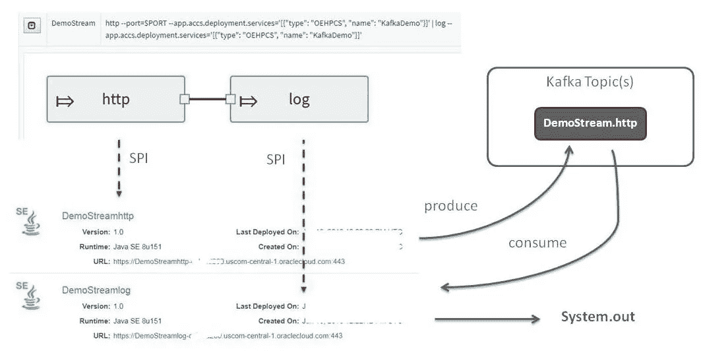

Pipeline apps interacting with Kafka

# 试车

测试数据管道的时间到了…

## 通过***http(source)***app 发送消息

`POST` 由 **http** 应用程序向 REST 端点公开的一些消息(从 Oracle 应用程序容器云控制台检查其 URL)——这些消息将被发送到 Kafka 主题并由 **log** 应用程序使用

`curl -X POST [https://**demostreamhttp**-ocloud200.uscom-central-1.oraclecloud.com/](https://demostreamhttp-ocloud200.uscom-central-1.oraclecloud.com/) -H ‘content-type: text/plain’ -d **test1**`

`curl -X POST [https://**demostreamhttp**-ocloud200.uscom-central-1.oraclecloud.com/](https://demostreamhttp-ocloud200.uscom-central-1.oraclecloud.com/) -H ‘content-type: text/plain’ -d **test12**`

`curl -X POST [https://**demostreamhttp**-ocloud200.uscom-central-1.oraclecloud.com/](https://demostreamhttp-ocloud200.uscom-central-1.oraclecloud.com/) -H ‘content-type: text/plain’ -d **test123**`

## 检查日志(接收器)服务

下载**日志** app 的日志进行确认。导航至应用程序详细信息，并查看**管理**部分的**日志**选项卡，点击

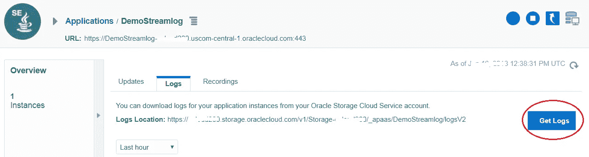

Check logs

您应该看到与发送到 HTTP 端点的消息相同的消息

Messages from Kafka consumed and sent to stdout

## 还有一种方法…

您还可以直接使用 **Kafka** (在事件中心云上)本身来验证这一点— *您所需要的只是创建一个自定义的* ***访问规则*** *来打开 Oracle 事件中心云上 Kafka 服务器虚拟机上的端口****6667****—*[*详情请点击*](https://docs.oracle.com/en/cloud/paas/event-hub-cloud/admin-guide/platform-access-rules-page.html)

现在，您可以使用控制台消费者直接检查 Kafka 主题，然后将消息发送到 HTTP 端点(如上所述)

`kafka-console-consumer.bat --bootstrap-server <event_hub_kakfa_IP>:6667 --topic **DemoStream.http**`

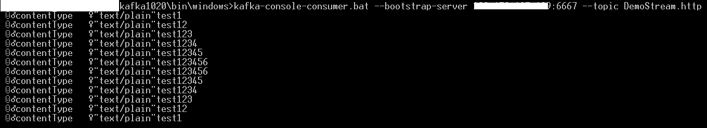

Messages from Kafka topic

## 取消部署

如果您触发流定义的**取消部署**或**销毁**，将会触发从 Oracle 应用容器云中删除应用

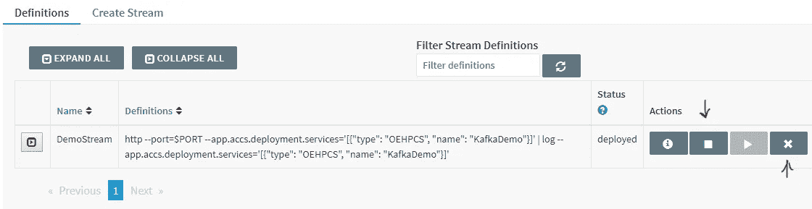

Un-deploy/destroy the definition

# 快速回顾

这就是这篇博客的全部内容，它标志着这个由两部分组成的博客系列的结束！

*   我们介绍了基本概念，并在 **Oracle 应用程序容器云**上部署了 **Spring Cloud 数据流**服务器及其相关组件，包括…
*   … **Oracle Event Hub Cloud** 作为基于 Kafka 的消息传递层， **Oracle MySQL Cloud** 作为持久 RDBMS 存储
*   然后，我们探索了一些幕后细节，并利用了我们的 Spring Cloud 数据流设置，其中…
*   …我们**构建了** & **部署了**一个简单的**数据管道**以及它的基本测试/验证

# 不要忘记…

*   查看 Oracle Application Container Cloud 教程—每个运行时都有适合的内容！

 [## Oracle 应用容器云服务—创建您的第一批应用

### Oracle 应用容器云服务教程。学习创建你的第一个应用程序。

docs.oracle.com](https://docs.oracle.com/en/cloud/paas/app-container-cloud/create-first-applications.html) 

*   关于应用程序容器云的其他博客

 [## 关于应用容器云的最新故事和新闻—中型

### 阅读关于应用容器云的最新文章。每天，成千上万的声音阅读、书写和分享重要的…

medium.com](/tag/app-container-cloud/latest) 

干杯！

> 本文表达的观点是我个人的观点，不一定代表甲骨文的观点。