# 第二部分:在 Oracle Cloud 上使用 Kafka Streams 开发流处理应用

> 原文：<https://medium.com/oracledevs/part-ii-develop-stream-processing-apps-using-kafka-streams-on-oracle-cloud-8ff06f47c853?source=collection_archive---------0----------------------->

这是关于 Oracle 云上的流处理微服务开发的两部分博客系列的最后一部分。在第一部分中，我们讨论了核心概念、架构和一些代码。

这一部分将涉及

*   不同 Oracle 云服务的设置和配置
*   部署和 CI/CD
*   运行应用程序并进行测试

# 设置和部署

## Oracle 活动中心云

我们不会讨论全部细节，因为这是简单明了且有据可查的。以下是高级步骤

*   创建一个 Kafka 代理(单节点，与 Zookeeper 放在一起)——[文档](http://docs.oracle.com/en/cloud/paas/event-hub-cloud/ehcug/creating-cluster.html)
*   创建主题(存储推文)——[文档](http://docs.oracle.com/en/cloud/paas/event-hub-cloud/ehcug/creating-topic.html)

你最终会得到这样的东西

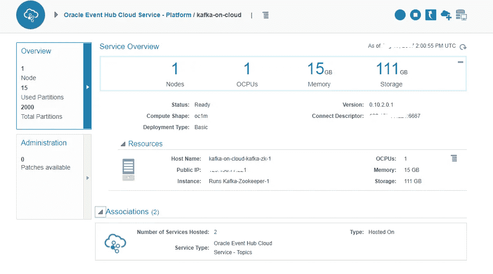

Managed Kakfa broker

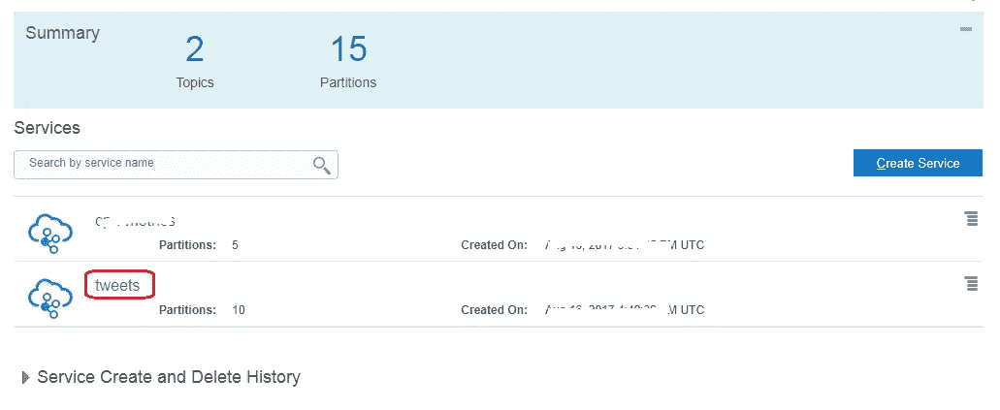

Kafka topic

**创建自定义访问规则**

您需要在 Oracle Event Hub Cloud 上的 Kafka 服务器虚拟机上创建一个自定义的**访问规则**来打开端口 **6667** 。这是为了让 Kafka Connect Twitter (source)连接器能够工作(细节如下)

> 我们在 Oracle Application Container 上的流处理应用在内部处理连接，并且**和**不需要打开任何端口

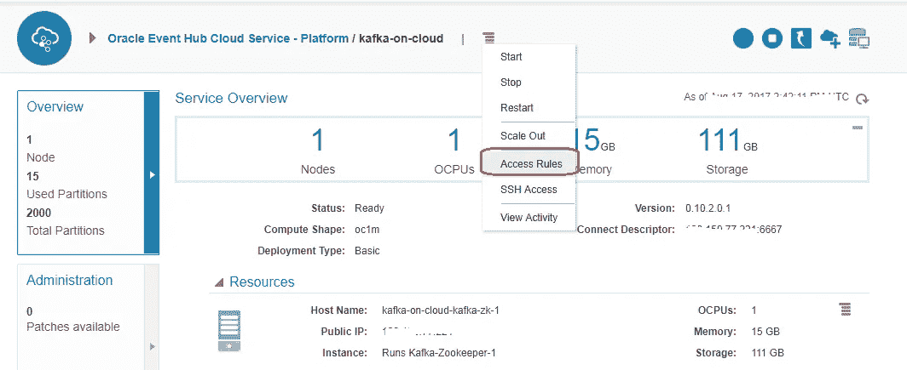

Navigate to Access Rules section

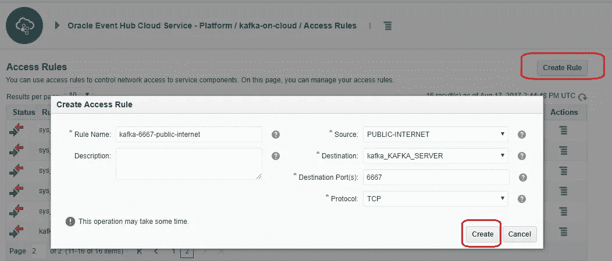

Create the new rule

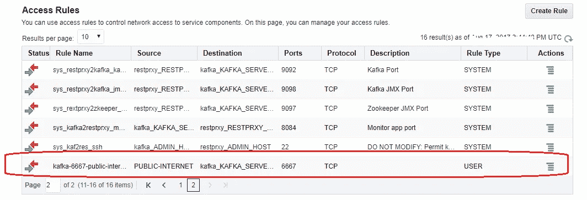

New Access Rule created successfully

## Oracle 应用容器云

在这种情况下，您唯一需要做的就是提供 Oracle 应用容器云缓存服务— [这是文档](http://docs.oracle.com/en/cloud/paas/app-container-cloud/cache/creating-cache-service.html)

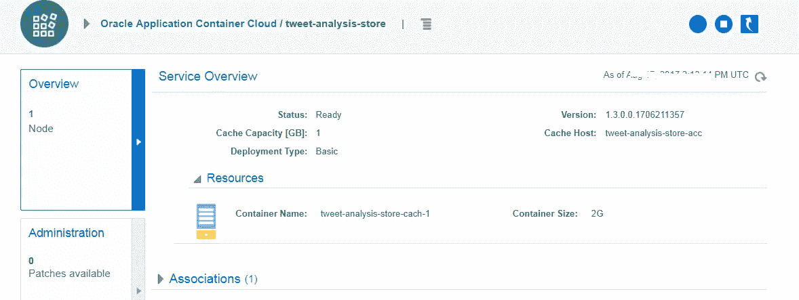

Oracle ACCS Cache (serves as stream processing state store)

## Oracle 开发人员云

您可以参考以前的博客(这里将重点介绍这个例子的一些细节)

**参考文献**

*   在 Oracle 开发人员云中引导应用程序— [项目&代码库创建](https://community.oracle.com/community/cloud_computing/oracle-cloud-developer-solutions/blog/2017/05/25/getting-started-with-kafka-based-microservices-using-oracle-event-hub-cloud-application-container-cloud-developer-cloud#jive_content_id_Project__code_repository_creation)
*   持续集成设置— [配置构建作业](https://community.oracle.com/community/cloud_computing/oracle-cloud-developer-solutions/blog/2017/05/25/getting-started-with-kafka-based-microservices-using-oracle-event-hub-cloud-application-container-cloud-developer-cloud#jive_content_id_Configure_build_job)
*   部署设置— [持续部署(CD)到应用容器云](https://community.oracle.com/community/cloud_computing/oracle-cloud-developer-solutions/blog/2017/05/25/getting-started-with-kafka-based-microservices-using-oracle-event-hub-cloud-application-container-cloud-developer-cloud#jive_content_id_Continuous_Deployment_CD_to_Application_Container_Cloud)

**部署配置**

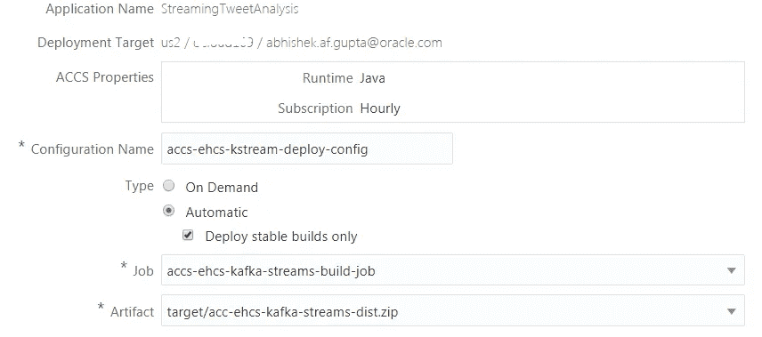

Deployment config part 1

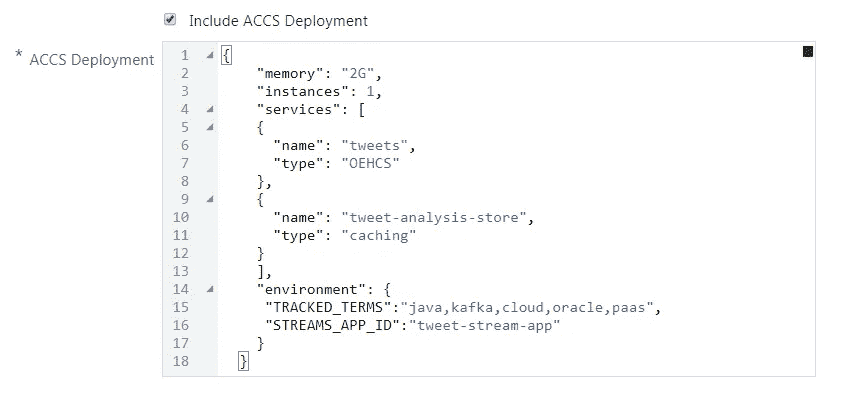

Deployment config part 2

**Oracle 开发人员云中的部署确认**

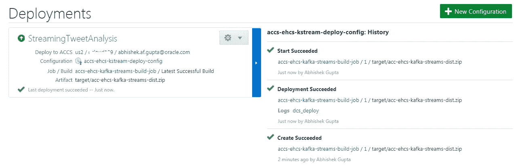

Deployments in Oracle Developer Cloud

**Oracle 应用容器云中的后期部署状态**

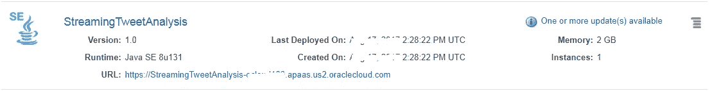

Oracle Application Container Cloud (applications list)

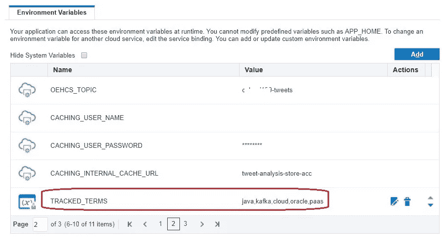

Environment variables for our application

## Kafka Connect Twitter 连接器

你可以阅读关于 Github 项目的详细信息——这里有一个关于如何设置连接器来使用来自 Twitter 的 tweets 并把它们转发到我们选择的 Kafka 主题的快速总结

*   [创建一个 Twitter 应用程序](https://github.com/Eneco/kafka-connect-twitter#creating-a-twitter-application)
*   在您的本地机器上安装 Kafka(这是必需的，因为 Kafka Connect 是与 Kafka 发行版捆绑在一起的)——只需[下载](https://kafka.apache.org/downloads)并解压即可！
*   克隆项目— `git clone [https://github.com/Eneco/kafka-connect-twitter.git](https://github.com/Eneco/kafka-connect-twitter.git)`
*   建造它— `mvn clean package`
*   配置`connect-simple-source-standalone.properties` —除了 Oracle Event Hub Kafka 集群信息(突出显示)之外，您可以保留默认设置

```
**bootstrap.servers=<oracle_ehcs_IP>:6667** key.converter=org.apache.kafka.connect.storage.StringConverter
value.converter=org.apache.kafka.connect.storage.StringConverter
key.converter.schemas.enable=true
value.converter.schemas.enable=true
internal.key.converter=org.apache.kafka.connect.json.JsonConverter
internal.value.converter=org.apache.kafka.connect.json.JsonConverter
internal.key.converter.schemas.enable=false
internal.value.converter.schemas.enable=false
offset.storage.file.filename=/tmp/connect.offsets
offset.flush.interval.ms=10000
```

*   配置`twitter-source.properties` —突出显示的属性是需要根据您的环境进行填充的属性

```
name=twitter-source
connector.class=com.eneco.trading.kafka.connect.twitter.TwitterSourceConnector
tasks.max=1
**topic=<name_of_oracle_ehcs_topic>
twitter.consumerkey=<as_per_your_twitter_app>
twitter.consumersecret=<as_per_your_twitter_app>
twitter.token=<as_per_your_twitter_app>
twitter.secret=<as_per_your_twitter_app>**
output.format=string
language=en
stream.type=filter
**track.terms=<keywords_of_your_choice>**
```

# 试验

## 触发 Kafka Connect Twitter 源作业

*   在类路径上设置 JAR—`export CLASSPATH=`pwd`/target/kafka-connect-twitter-0.1-jar-with-dependencies.jar`
*   运行连接器— `KAFKA_HOME/bin/connect-standalone.sh connect-simple-source-standalone.properties twitter-source.properties`

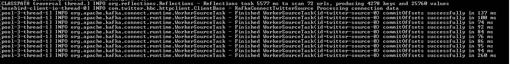

Kafka Connect Twitter connector in action

这将开始向 Kafka 主题推送 tweets，进而触发我们的流处理应用程序来搅动计数——您可以通过 REST 端点访问它

## 访问 REST 端点

*   查看您跟踪的特定关键字/标签(例如云)的数量— `curl [https://<accs_app_url>/stats/cloud](https://streamingtweetanalysis-ocloud109.apaas.us2.oraclecloud.com/stat/cloud)`。您将得到一个 JSON 结果

```
{
 “term”: “cloud”,
 “count”: 424
}
```

*   检查**所有**项的计数— `curl [https://<accs_app_url>/stat](https://streamingtweetanalysis-ocloud109.apaas.us2.oraclecloud.com/stat/cloud)s`

```
[
 {
 “term”: “java”,
 “count”: 49
 },
 {
 “term”: “kafka”,
 “count”: 8
 },
 {
 “term”: “cloud”,
 “count”: 424
 },
 {
 “term”: “oracle”,
 “count”: 38
 },
 {
 “term”: “paas”,
 “count”: 7
 }
]
```

# 测试 CI/CD 流

做一些代码修改，推送到 Oracle 开发者云服务 Git 库。这应该

*   自动触发构建，一旦成功将
*   自动触发部署流程，以及
*   将新的应用程序版本重新部署到应用程序容器云

这篇博文(及系列)到此为止！

# 不要忘记…

*   查看 Oracle 应用容器云的[教程](https://docs.oracle.com/en/cloud/paas/app-container-cloud/create-first-applications.html)——每个运行时都有适合的东西！
*   [应用容器云上的其他博客](http://bit.ly/2gR3nrV)

> *本文表达的观点仅代表我个人，不一定代表甲骨文的观点。*