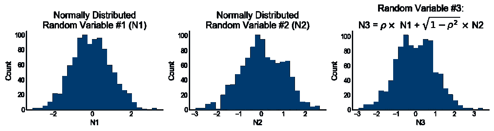
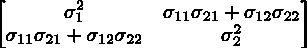

# 部分相关均匀分布随机数

> 原文：<https://medium.com/capital-one-tech/partially-correlated-uniformly-distributed-random-numbers-5ce82486b68a?source=collection_archive---------0----------------------->


作为一个从事金融风险建模的人，我经常使用[蒙特卡罗模拟](https://en.wikipedia.org/wiki/Monte_Carlo_method)，并且会遇到已经证明了某种程度的相关性的输入。如果您正在对任何人群或场景进行建模，我相信您也是如此。当我开始的时候，我以为我是在追求一个简单技术问题的简单技术答案——ge*生成两个均匀的、部分相关的随机分布*，有以下约束。

1.向*业务解释方法和数学。*

2.在 Excel 中实现。

为了解决这个问题，我将提出三个解决方案。第一种通常被视为“解决方案”,但实际上并不奏效——我将说明为什么它是错误的。第二个是一个不错的解决方案，可以工作，但是不能在 Excel 中实现(约束#2)。第三种解决方案是正确的，因为它适用于约束 1 和约束 2。对于这个解决方案，我将展示它的实现和显示它工作的图表。对于更倾向于数学的人，我将使用支持解决方案的代数来实现。

# 解决方案 1 —加权线性组合

部分相关随机数的初始占位符是两个不相关随机数(创造性地命名为 R1 和 R2)的加权和(姑且称之为 R3)。R3 与 R1 和 R2 有些关联。具体来说，R3 = a*R1 + (1-a)*R2 其中 0 ≤ a ≤ 1，本质上 ***a*** 是用于调整相关性的参数。可悲的是，这两个分布的相关性与*并没有简单的线性关系。*

**

**Fig.1: Plot of combination weight a vs. Pearson and Spearman correlation coefficients between R1 & R3\. The relationship between the correlation coefficients and a is non-linear which is evidenced by the fact that the line is not straight. Also, not shown in the plot, the relationship does not extend to negative partial correlations. The equality of the correlation coefficients reassures us of a ‘nice’ relationship between the two distributions.**

*此外，这种方法不允许产生部分相关为负的群体。更糟糕的是，统计学家并不惊讶，R3 不是均匀分布的(对于 0 < a <1 the null hypothesis of the [Kolmogorov-Smirnov 检验(KS 检验)](https://en.wikipedia.org/wiki/Kolmogorov%E2%80%93Smirnov_test)反对均匀分布的被拒绝):*

**

**Fig 2: Plot of the distributions. The distribution of R3 is not flat topped and its shape is dependent on the value of a.**

*结果是，如果使用 R3 分布，异常值就没有被充分代表。根据计算的目的，这可能会对结果的准确性产生负面影响。*

*解决方法是什么？“很明显”用的是冲天炉。我稍后会谈到这些。(还记得约束条件 1 吗？在我写这篇文章的时候，如果有一个适合我们约束的方案存在，我还没有遇到它。为了用 Python 实现高斯化铁炉解决方案，我的一个同事正在做一些我从大学一年级开始就没想过的严肃的微积分和线性代数。同样，第一个约束。*

# *解决方案 2 —植入二级分销*

*因此，这里有一个聪明的想法:使用 R1 作为具有σ的正态分布的平均值，并根据该分布生成 R3(我知道我是从 a 切换到σ，抱歉，但这种表示法在这里更有意义)。将此放入 while 循环中，以便 R3 的值被约束在一个区间上。R1 和 R3 之间会有一些关联。在大多数 stats 包(Python 是我的首选包)中，这一点的实现非常简单，如下所示:*

```
*import scipy.stats as stats
def generate_num(center, sigma):
    num = stats.norm.rvs(loc = center, scale = abs(sigma), size = 1)
    while (num < 0) | (num > 1):
        num = stats.norm.rvs(loc = center, scale = abs(sigma), size = 1)
    if sigma > 0:
        return num
    else:
        return 1 — num*
```

*结果看起来更好，并且产生具有部分负相关的群体的方法没有改变:*

**

**Fig. 3: Distributions of R1 & R2 where R2 is generated by seeding the mean of second distribution with R1\. The range of R2 is maintained with a loop that rejects values outside of the range*.*

**

**Fig. 4: Relationship between the standard deviation of the secondary distribution and the correlation coefficients of R1& R2.**

*但这有两个问题。*

*   *第一:如何*轻松*实现 Excel 中的 while 循环？如果您不实现 while 循环中的过滤，您将会得到一些超出[0，1]区间的 R3 值。*
*   *第二:R3 周期性地不能通过针对均匀分布的 KS 测试。*

# *解决方案 3——迈向冲天炉解决方案*

*当我重新试图理解 cupolas 时，我和一位同事进行了一次富有成效的谈话。他指出*“法线的线性组合总是法线。”*(如 Michael Vespe 所写)或者更优雅地说，“ [*具有正态分布的两个独立随机变量的线性组合也具有正态分布*](2.%09https:/www.statlect.com/probability-distributions/normal-distribution-linear-combinations) *。”虽然这种说法的数学基础并不十分基础，但它引起了共鸣。使用 Python 生成数值示例也很简单:**

```
*import math as mt
import scipy.stats as stats
rho = 0.8
n1 = stats.norm.rvs(size = 1000)
n2 = stats.norm.rvs(size = 1000)
n3 = rho * n1 — mt.sqrt(1 — rho * * 2) * n2*
```

*和 Excel:*

**

*Python 实现产生了以下发行版:*

**

**Fig. 5: Normal distributions.**

*在这种情况下，ρ = 0.8(对符号变化的另一个道歉，我们将在余下的文章中坚持ρ)，N1 和 N3 之间的皮尔逊相关系数是 0.82，并且不能用 KS 检验拒绝正态性的零假设。另一个有用的特性是，正态分布通过其累积分布函数(CDF)转换后会产生均匀分布。*

**

*Fig. 6: Uniform distributions resulting from transforming normal distributions in Fig 5\. with the normal CDF*

*最后一点——虽然我找不到关于相关性如何(或为什么)保持在 0.79 的封闭形式的解决方案(一般来说不是)，但它非常接近。好的是，这种接近保持在区间-1*

**

**Fig. 7: Relationship between r and the correlation coefficients of R1 & R3.**

*如果你需要的只是解决方案，就此打住，我们结束了。恭喜你！但是如果你想知道更多…*

# *钻研数学*

*再往前推一点，这个优雅的解决方案引发了两个问题。*

*   *首先，什么是圆顶，这是一个简化版本吗？*
*   *第二，为什么用 1-ρ的平方根保持线性*

# *这是一个圆顶吗？*

*快速回答:*对，我觉得是*。冲天炉是均匀分布变量的联合累积分布函数。如果你看一下[维基百科](https://en.wikipedia.org/wiki/Copula_(probability_theory))对高斯冲天炉的描述，步骤可以分解如下:它取两个均匀分布的变量，用正态百分点函数命中它们(每个现在都是正态分布)，组合它们，然后用正态累积分布函数命中组合，返回一个均匀分布的变量。*

# *为什么这会保持线性？*

*这方面的数学有点复杂。我不会在这里给出严格的证明，但希望我的一些计算能让你相信我没有凭空捏造。*

**

*这些计算遵循了由 [Wolfram](http://mathworld.wolfram.com/BivariateNormalDistribution.html) 提出的二元正态分布的解释。因此，首先，两个正态分布变量 x1 和 x2(μ= 0 且σ = 1)的联合概率为*

**

*两个变量 y1 和 y2 的二元正态分布为:*

**

*从陈述*“两个* [*独立随机变量的线性组合*](https://www.statlect.com/fundamentals-of-probability/independent-random-variables) *有一个* [*正态分布*](https://www.statlect.com/probability-distributions/normal-distribution) *也有一个正态分布”*我们可以建立 *y* ₁和 *y* ₂如下:*y*₁=σ₁₁*x*₁+σ₁₂*x **y* ₁和 *y* ₂各有均值 0，σ₁ = σ₁₁ + σ₁₂，σ₂ = σ₂₁ + σ₂₂有协方差矩阵***



X = [ *x* ₁、 *x* ₂]和 Y = [ *y* ₁、 *y* ₂]之间的关系可以用矩阵形式表示，这使得我们可以精确地计算出作为 y 的函数的 x:


现在，如果我们选择σ₁₁ = 1，σ₁₂ = 0，σ₂₁ = ρ，协方差矩阵中的非对角项是ρσ₁σ₂，则要求σ₂₂是 1-ρ的平方根。此外，当我们进行数学运算时，我们会得到:


所以，不是证明，而是一些建立信心的计算。

# 结论

我们已经生成了两个均匀分布的部分相关随机分布。该解决方案用脚本语言和 Excel 演示。部分相关的均匀分布可以通过任何其他分布的百分点函数进行转换，从而将此解决方案扩展到任意一组分布。最后，数学论证虽然有些复杂，但即使没有完全通过计算也能引起共鸣。该解决方案可以跨工具集实现，并且业务可以理解其解释，符合我们所述的两个标准。

***披露声明:以上观点为作者个人观点。除非本帖中另有说明，否则 Capital One 不属于所提及的任何公司，也不被其认可。使用或展示的所有商标和其他知识产权都是其各自所有者的所有权。本文为 2018 首都一。***