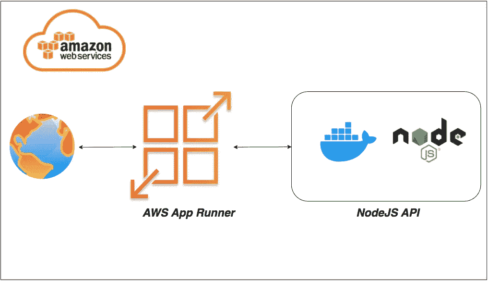

# 将环境变量传递给运行在 AWS App Runner 上的 NodeJS APIs

> 原文：<https://medium.com/bb-tutorials-and-thoughts/passing-environment-variables-to-nodejs-apis-running-on-aws-app-runner-11a332cbccc2?source=collection_archive---------0----------------------->

## 使用 Docker 运行时的示例项目的逐步指南

如果您希望通过选择运行时在托管平台上部署应用程序，AWS App Runner 是正确的选择。您可以使用 Docker runtime 运行整个 API，而不用担心您这边的配置。AWS 应用程序…