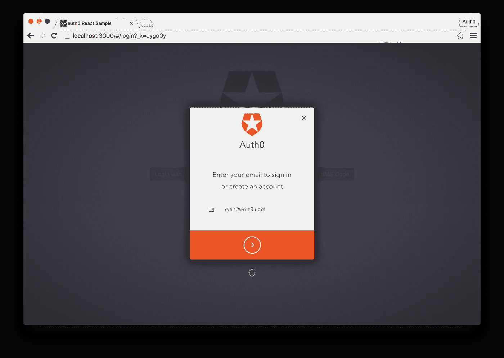

# 使用 React 和 Auth0 的无密码身份验证

> 原文：<https://medium.com/javascript-scene/passwordless-authentication-with-react-and-auth0-c4cb003c7cde?source=collection_archive---------1----------------------->


> 编者按:多年来，我一直告诉人们密码已经过时了。当我为“JavaScript 应用程序编程”编写密码部分时，我强烈推荐多因素身份验证等密码替代方案。自那以后，发生了多起泄露数百万用户名和密码的事件。很有可能你的一些密码被盗了。
> 
> 偶尔，我们会发现我们强烈推荐的产品或服务，并邀请其背后的公司参与赞助帖子。
> 
> 这就是为什么我非常兴奋地为您带来这篇由 [**瑞安·陈基**](https://twitter.com/ryanchenkie) **撰写的**的 Auth0 赞助帖子。我强烈建议你阅读它，并在你的下一个应用程序中加入无密码认证。****
> 
> ~埃里克·艾略特

了解无密码如何让您的用户和组织受益。

在今天的文章中，我们将构建一个通过 Auth0 进行无密码认证的 React 应用程序。为简洁起见，我们将使用 [Auth0 React Starter](https://github.com/auth0-samples/auth0-react-sample/tree/master/01-Login) 作为我们应用程序的基础。我们将研究无密码身份验证的优势，并了解它如何提供比传统身份验证方法更好的安全性。

# 什么是无密码？

顾名思义，无密码身份验证是一种用户无需输入密码的身份验证系统。相反，他们会提供一个标识符，如电子邮件地址或电话号码，身份验证系统会发送一个一次性密码或指向该标识符的链接，用户必须提供该密码或链接才能成功通过身份验证。密码或链接在有限的时间内有效，通常约为五分钟。每个登录请求都会生成一个新密码或链接，并使任何以前的密码或链接失效。在某种意义上，无密码身份验证也提供了开箱即用的双因素身份验证，因为用户必须能够访问他们提供的电子邮件帐户或电话号码。

无密码认证对用户和开发者都有好处。用户倾向于选择弱密码，并在多个服务中重复使用同一个密码。由此，我们可以推断，用户倾向于将便利性看得比安全性更重要。许多开发人员做出了实施更严格的密码要求的合理决定，但这通常会导致用户烦恼。从开发人员的角度来看，密码必须安全地加密和存储，即使遵循了所有的最佳实践，用户在受到威胁的第三方服务上重复使用密码在您的应用程序中也是易受攻击的。

# 谁在用无密码？

包括 [Medium](/) 、 [Slack](https://slack.com/) 和 [WhatsApp](https://www.whatsapp.com/) 在内的许多公司已经采用了无密码认证。无密码身份验证在 web 和移动应用程序中都可以找到，尤其适合移动应用程序，因为用户通常在他们的设备上接收一次性密码，从而形成非常直观的工作流。

# 我们将建造什么

在本文中，我们将介绍无密码，并了解它如何为用户身份验证提供直观而安全的工作流程。我们将介绍无密码身份验证的工作原理，它提供的好处，为了将理论付诸实践，我们将在 React 应用程序中实现无密码身份验证。

# React 和 Auth0 无密码

为了演示这一切是如何工作的，我们将构建一个使用 Auth0 的[无密码](https://auth0.com/passwordless?utm_source=eelliott&utm_medium=gp&utm_campaign=passwordless) [库](https://github.com/auth0/lock-passwordless)的无密码 [React](https://facebook.github.io/react/) 应用程序。首先，[注册一个免费的 Auth0 账户](https://auth0.com/signup?utm_source=eelliott&utm_medium=gp&utm_campaign=passwordless)，并查看[管理面板](https://manage.auth0.com/?utm_source=eelliott&utm_medium=gp&utm_campaign=passwordless)。我们将使用 [React 种子项目](https://github.com/auth0-samples/auth0-react-sample/tree/master/01-Login),这样我们可以节省一些时间。假设你对 React 有一些基本的了解，因为我们将跳过基本的 React 习惯用法。

seed 项目为我们的应用程序提供了一个良好的起点。我们有基本的路由、几个组件、一些助手，以及最重要的构建过程来传输和服务我们的代码。运行 *`npm install`* 以获取项目依赖关系。为了确保 seed 项目使用传统身份验证，请使用您的 Auth0 凭据编辑 *`.env`* 文件:

```
cp .env.example .env
```

通过运行 *`npm start`* 启动应用程序。接下来，导航到 *`localhost:3000`* 查看应用程序的运行情况。您应该能够通过提供电子邮件和密码来登录/注册。


# 无密码认证服务

现在让我们实现无密码认证。停止应用程序并运行:

```
npm install auth0-lock-passwordless --save
```

这将下拉 Auth0 无密码库并将其保存在我们的 *`package.json`* 文件中。接下来，打开位于 utils 目录下的 *`AuthService.js`* 。这是我们大部分无密码实现的地方。

在这里，您可以随意删除所有现有的代码——我们将重新实现功能并逐行解释。

我们的无密码认证服务已经完成，但是在测试我们的代码之前，我们必须从我们的 Auth0 仪表板启用无密码特性。导航到 https://manage.auth0.com 的，然后到**连接**，最后到**无密码**。这里有三个选项:短信、邮件、TouchID。SMS 将要求您拥有一个 Twilio 帐户和 API 密钥，以便您可以发送 SMS 消息。电子邮件功能允许您从 Auth0 的默认电子邮件提供商发送电子邮件，但您也可以设置自己的电子邮件提供商。最后，TouchID 功能允许你为 iOS 设备实现苹果的无密码解决方案。我们不会在这里实现 TouchID，因为这只能在移动应用程序上实现。

打开短信和电子邮件的开关。单击其中任何一个都会弹出一个模态对话框，允许您定制和编辑各种设置。其中一些是必需的，如 Twilio 的 API 密钥，而其他的如消息模板或一次性密码的到期时间是可选的。请随意编辑这些或保留推荐的默认值。


# 更新用户界面

打开无密码特性后，让我们回到我们的代码。打开 *`views/main/login/`* 目录下的 *`Login.js`* 。这里，我们将添加一个构造函数来检查现有帐户，并为我们在身份验证服务中创建的各种登录方法添加用户界面。

# 了解我们的路由是如何工作的

在我们开始测试我们的应用程序之前，让我们简单地看一下位于 *`/views`* 目录中的 *`routes.js`* 。这里我们不会对 seed 项目进行任何代码更改，但是我们应该注意一些重要的事情。看看下面的代码和注释。

# 测试我们的无密码应用

让我们测试我们的应用程序。webpack 构建系统应该已经自动重新编译了您所做的任何更改，因此导航到 *`localhost:3000`* 来查看您的应用程序的运行情况。你会看到一个登录页面，有三个登录选项。根据您选择的选项，选择一个并按照屏幕上的指示提供电子邮件或电话号码。


如果我们选择“使用电子邮件代码登录”选项，我们可以输入一个电子邮件地址。



一封电子邮件马上到达我们的收件箱，里面有一个我们可以用来认证的代码。


回到应用程序，输入电子邮件中的代码。


代码通过验证后，我们将进入显示我们电子邮件地址的主页。


# 更进一步

使用 Auth0 进行无密码身份验证既简单又强大。只需几行代码，我们就能构建一个 React 应用程序，实现 Auth0 的无密码库和多种类型的无密码身份验证。

无密码是一个很好的选择，但 Auth0 更进一步，允许我们轻松混合和匹配社交认证策略。除了为用户提供无密码选项之外，我们还可以使用同一个库来添加与脸书、Twitter 或谷歌等常见社交提供商的社交认证。

[文档](https://github.com/auth0/lock-passwordless)更详细地解释了如何做到这一点，但在一个登录模式中添加社交和无密码的最简单方法是使用一个助手功能，如*` lock . socialormagiclink()`*。如果我们想将它扩展到 React 应用程序中，它看起来会是这样的:

用户界面的差异会立即反映出来:


我们只需要在 Auth0 管理面板中添加我们的脸书和 Twitter 密钥，一切就都准备好了。

# 包扎

无密码身份验证是传统用户名和密码身份验证的一个很好的替代方案，因为它使用户更容易登录，并可以提高整体安全性。从头开始构建一个无密码的身份验证流可能很棘手，但是正如我们在本文中通过构建 React 应用程序所看到的，Auth0 使它变得很简单。Auth0 还允许我们混合和匹配各种身份验证策略来满足我们的组织需求，为我们提供了很大的灵活性。

***Ryan Chenkie*** *是一名来自加拿大的全栈开发人员，他为 Auth0 创建内容，包括深入的教程和最新框架和技术的种子项目，如 Angular 2、React 和 Aurelia。不编码的时候，他会和他的妻子出去玩，弹吉他，或者对外太空感到厌烦。*