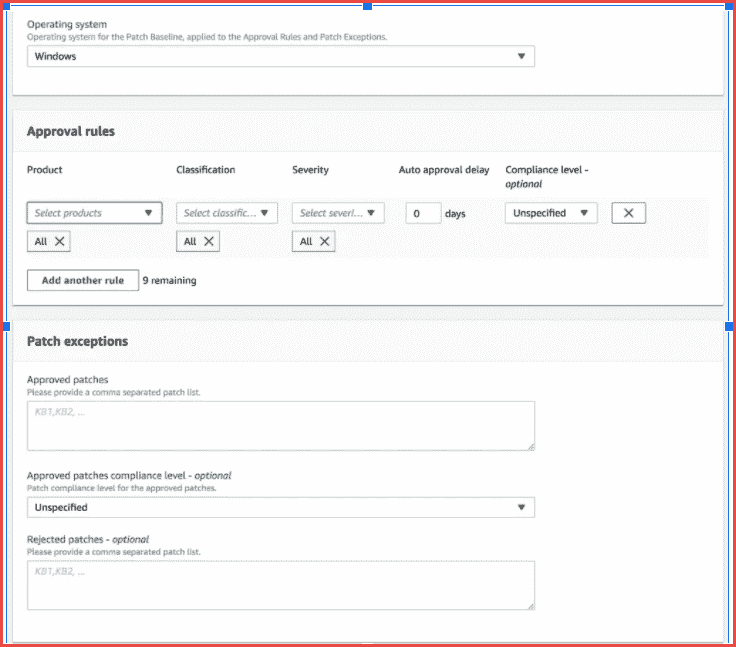

# 使用 AWS SSM 修补 Windows 和 Linux EC2 实例

> 原文：<https://medium.com/globant/patching-of-windows-and-linux-ec2-instances-using-aws-ssm-b409784a5bd7?source=collection_archive---------0----------------------->

**简介:**

在本文中，我们将了解如何使用 SSM 为 AWS EC2 机群打补丁，这是 AWS 云平台中打补丁流程的原生解决方案。SSM 可以自动执行任务、收集系统清单、应用操作系统补丁和执行脚本，而无需登录到实例(Linux / Windows)。通常，管理员维护一个 bastion 实例来登录到其他服务器，并且还管理登录到其他实例的密钥和密码。但是使用 SSM，我们不需要堡垒实例来登录其他服务器(无堡垒环境)。这为所有实例提供了额外的安全性。

你可能想读:[https://medium . com/globant/secure-RDP-to-ec2-private-instance-using-AWS-SSM-d 0 a1 cadd 9d 6](/globant/secure-rdp-to-ec2-private-instance-using-aws-ssm-d0a1cadd9d6)

本文涵盖了以下几点:

1.  先决条件
2.  缩写
3.  AWS 补丁管理器
4.  SSM 代理商
5.  配线框图
6.  为 EC2 创建 IAM 角色
7.  AWS 维护窗口
8.  补丁基线创建
9.  修补实例
10.  结论
11.  参考
12.  **先决条件**

AWS 云账户。

通过 SSM 创建和管理 Linux 和 Windows EC2 实例。

**2。缩写:**

1.  SSM → AWS 系统经理
2.  IAM →身份和访问管理
3.  EC2→弹性云计算
4.  SSH →安全外壳
5.  虚拟机→虚拟机

**3。AWS 补丁管理器**

修补程序管理器是 AWS Systems Manager 的一项功能，它可以自动使用与安全相关的更新和其他类型的更新来修补受管实例。您可以使用修补程序管理器为 Windows 和 Linux 操作系统应用修补程序。(在 Windows Server 上，应用程序支持仅限于 Microsoft 发布的应用程序更新。)您可以使用修补程序管理器在 Windows 实例上安装服务包，并在 Linux 实例上执行次要版本升级。您可以按操作系统类型为 Amazon Elastic Compute Cloud(Amazon EC2)实例群或您的本地服务器和虚拟机(VM)打补丁。这包括受支持版本的 Amazon Linux、Amazon Linux 2、CentOS、Debian Server、macOS、Oracle Linux、Red Hat Enterprise Linux (RHEL)、SUSE Linux Enterprise Server (SLES)、Ubuntu Server 和 Windows Server。您可以扫描实例以仅查看缺失修补程序的报告，也可以扫描并自动安装所有缺失的修补程序。

**注意:**另外，补丁管理器不支持操作系统主要版本的升级，如 Windows Server 2016 到 Windows Server 2019，或 SUSE Linux Enterprise Server(SLES)12.0 到 SLES 15.0。

**4。SSM 代理**

SSM 代理是 Amazon 软件，可以在 EC2 实例、本地服务器或虚拟机上安装和配置。SSM 代理使系统管理器能够更新、管理和配置这些资源。然后，SSM 代理使用 Amazon 消息传递服务(服务前缀:ec2messages)将状态和执行信息发送回 Systems Manager 服务。默认情况下，SSM 代理预安装在从以下 Amazon 机器映像(ami)创建的实例上:

*   亚马逊 Linux 1 和亚马逊 Linux 2
*   Amazon Linux 2 ECS 优化的基本 ami
*   macOS 10.14.x(莫哈韦)、10.15.x(卡特琳娜)和 11.x(大苏尔)
*   Ubuntu Server 16.04、18.04 和 20.04
*   2016 年 11 月或之后发布的 windows Server 2008–2012 R2 ami
*   Windows Server 2016 和 2019

**5。配线框图**


Block Diagram

**6。为 EC2 创建一个 IAM 角色**

在 AWS 控制台中搜索 IAM，然后单击“创建角色”,如下所示:


单击 IAM 后，您将看到以下窗口:


IAM Dashboard

点击角色→创建角色


Creation of IAM

创建一个 IAM 角色，附加**amazonecroleforssm**托管策略，如下所示:


Policy Selection

**7。AWS 维护窗口**

维护窗口用于定义在实例上执行破坏性操作的时间表，如修补操作系统和升级驱动程序等。每个维护窗口都有一个计划、一个持续时间和一组注册的目标。理想情况下，您希望在对组织影响最小的时候应用修补程序。现在，您已经成功地设置了一个角色，并用您的补丁基线注册了您的 Amazon EC2 实例，您将定义一个维护窗口，以便您可以控制您的 Amazon EC2 实例何时接收补丁。通过创建多个维护窗口并将它们分配给不同的补丁组，我们可以避免所有实例同时重新启动。

根据您的要求创建维护窗口:

1.  使用以下命令定义维护窗口。在此命令示例中，维护窗口将在 UTC 时间每周六晚上 10:00 开始。它将持续 4 小时，并且在维护窗口结束前 1 小时不会启动任何新任务。

```
$aws ssm create-maintenance-window — name SaturdayNight — schedule “cron(0 22 ? * SAT *)” — duration 4 — cutoff 1 — allow-unassociated-targets
```

有关为维护窗口定义基于 cron 的计划的更多信息，请参见[维护窗口的 Cron 和速率表达式](https://docs.aws.amazon.com/systems-manager/latest/userguide/sysman-cron.html#sysman-cron-maintenance-window)。

2.在定义了维护窗口之后，您必须向维护窗口注册 Amazon EC2 实例，以便系统管理员知道应该在这个维护窗口中修补哪个 Amazon EC2 实例。您可以使用用于将 Amazon EC2 实例与 AWS 提供的补丁基线相关联的同一个补丁组标记来注册该实例，如以下命令所示。

```
$ aws ssm register-target-with-maintenance-window — window-id YourMaintenanceWindowId — resource-type INSTANCE — targets “Key=tag:Patch Group,Values=Linux Servers”{“WindowTargetId”: “YourWindowTargetId”}
```

3.向维护窗口分配一个任务，该任务将在 Amazon EC2 实例上安装操作系统补丁。以下命令包括以下选项。

*   *name* 是任务的名称，是可选的。我把我的命名为修补。
*   *task-arn* 是您想要运行的任务文档的名称。
*   *max-concurrency* 允许您指定系统管理器应该同时修补多少个 Amazon EC2 实例。max-errors 确定 Systems Manager 应该何时中止任务。对于修补，该数字不能太低，因为如果一个实例失败，您不希望整个修补任务在所有实例上都停止。例如，您可以将其设置为 20%。
*   *service-role-arn* 是您在本文前面创建的 AmazonSSMMaintenanceWindowRole 角色的 [Amazon 资源名称](https://docs.aws.amazon.com/general/latest/gr/aws-arns-and-namespaces.html) (ARN)。
*   *task-invocation-parameters*定义特定于 AWS-RunPatchBaseline 任务文档的参数，并告知系统管理员您希望安装超时为 600 秒(10 分钟)的补丁。

```
*$ aws ssm register-task-with-maintenance-window — name “Patching” — window-id “YourMaintenanceWindowId” — targets “Key=WindowTargetIds,Values=YourWindowTargetId” — task-arn AWS-RunPatchBaseline — service-role-arn “arn:aws:iam::123456789012:role/MaintenanceWindowRole” — task-type “RUN_COMMAND” — task-invocation-parameters “RunCommand={Comment=,TimeoutSeconds=600,Parameters={SnapshotId=[‘’],Operation=[Install]}}” — max-concurrency “500” — max-errors “20%”**{**“WindowTaskId”: “YourWindowTaskId”**}*
```

**8。补丁基线创建**

我们可以创建一个自定义修补程序基准，因为这是一个可选步骤。如果您希望遵循您的标准规则，您可以创建一个，否则请遵循 AWS 规则。



如果您创建了自己的修补程序基准，则可以使用以下类别选择要自动批准的修补程序。

*   操作系统:Windows、亚马逊 Linux、Ubuntu Server 等等。
*   产品名称(针对操作系统):例如，RHEL 6.5、亚马逊 Linux 2014.09、Windows Server 2012、Windows Server 2012 R2 等等。
*   产品名称(仅适用于 Microsoft 在 Windows Server 上发布的应用程序):例如，Word 2016、BizTalk Server 等。
*   分类:例如，关键更新、安全更新等等。
*   严重性:例如，关键、重要等。

对于您创建的每个批准规则，您可以选择指定自动批准延迟或指定修补程序批准截止日期。

**8。修补实例**

要验证补丁程序合规性，必须执行系统扫描:

*   转到 EC2->运行命令，然后单击“运行命令”


下面是扫描 EC2 实例的结果:


**9。结论**

在本文中，我介绍了一个简单的场景，即设置 AWS Systems Manager (SSM)补丁管理器服务，定期为 Windows 服务器安装补丁。我们通过 PowerShell 执行了所有配置，但是您也可以使用 AWS CLI 和控制台来执行这些任务。由于我们必须配置各种各样的对象，这一开始似乎是一个令人生畏的过程，但是我鼓励您复制这里描述的代码并从中创建您自己的脚本。您将会看到，一旦您有了工作的基础代码，以后您就能够更容易地配置它。

10。参考文献

1.  https://docs . AWS . Amazon . com/systems-manager/latest/user guide/systems-manager-patch . html
2.  [https://docs . AWS . Amazon . com/systems-manager/latest/user guide/automation-walk-patch-Linux-ami-console . html](https://docs.aws.amazon.com/systems-manager/latest/userguide/automation-walk-patch-linux-ami-console.html)
3.  [https://AWS . Amazon . com/blogs/security/how-to-patch-Linux-workloads-on-AWS/](https://aws.amazon.com/blogs/security/how-to-patch-linux-workloads-on-aws/)