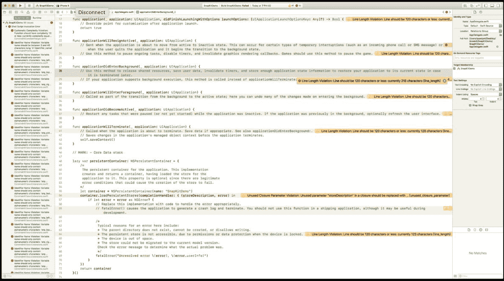
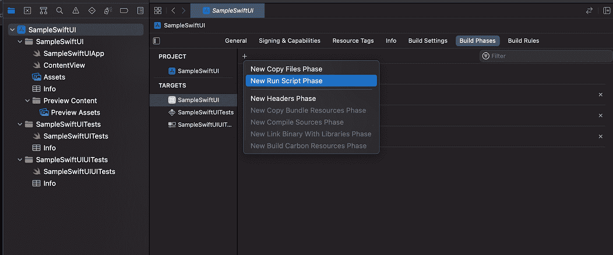
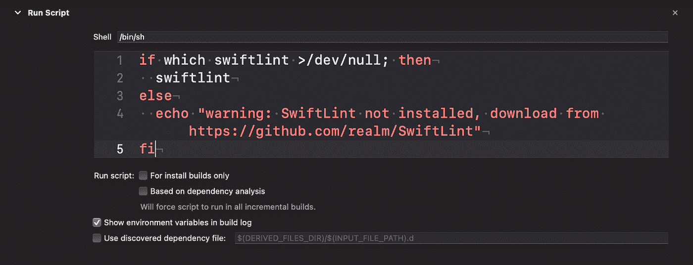
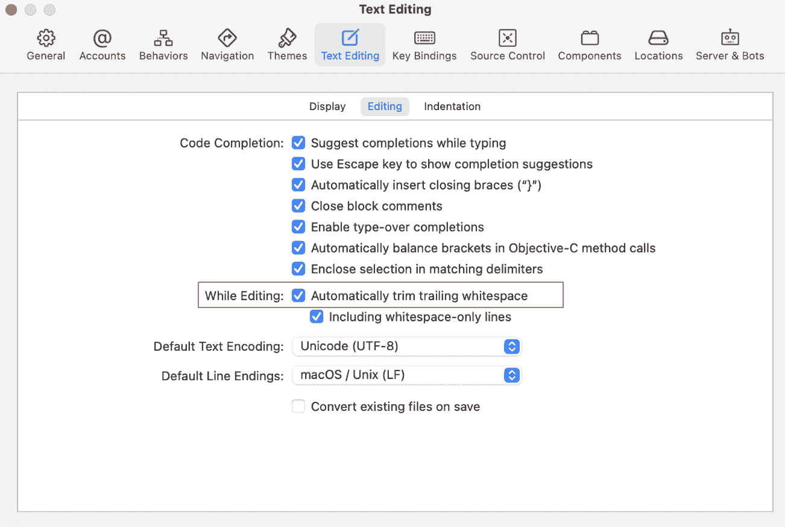

# 通向更干净代码的途径

> 原文：<https://medium.com/globant/pathway-to-cleaner-code-bde0c7b7b06e?source=collection_archive---------0----------------------->

对于一个开发团队来说，拥有一致且可维护的代码库变得很困难。由于不同开发人员对语言和约定风格的经验水平不同，代码变得难以理解和维护。

这就是雨燕前来救援的地方。It 是一个强制执行 swift 风格和惯例的工具，其结果是一个更易于管理、可读性和可理解的代码库。

SwiftLint 基于 [Swift 风格指南](https://github.com/github/swift-style-guide)的指导方针。

所以基本上它帮助我们:

*   维护更高水平的代码纪律
*   增加代码的可靠性

**规则:**

SwiftLint 执行 Swift 社区普遍接受的风格指南规则。swift lint 中包含 200 多条规则。规则列表及其信息可以在[这里](https://realm.github.io/SwiftLint/rule-directory.html)找到。

**规则包含:**

*   **禁用规则:**禁用默认启用集合中的规则(例如-冒号，-逗号，-控制语句)
*   **opt_in_rules:** 默认情况下它们是禁用的(即，您必须在您的配置文件中显式启用它们)。何时将规则标记为选择加入的准则:
*   可能有许多误报的规则(例如，empty_count)
*   太慢的规则
*   不是普遍认同的规则或仅在某些情况下有用的规则(例如，强制展开)
*   **only_rules:** 只有该列表中指定的规则才会被启用。不能与 disabled_rules 或 opt_in_rules 一起指定。
*   **analyzer_rules:** 这是一个完全独立的规则列表，仅由 analyze 命令运行。所有分析器规则都是选择加入的，因此这是唯一可配置的规则列表；disabled_rules only_rules 没有对等项。
*   **custom_rules:** 可以在配置文件中定义基于正则表达式的自定义规则。如果将自定义规则与 only_rules 结合使用，请确保将自定义规则作为项目添加到 only_rules 下。
*   **禁用内嵌规则**:

***** 可以使用源文件中的注释禁用规则，格式如下:

`***swiftlint:disable <rule1> [<rule2> <rule3>…]***`

***** 规则将被禁用，直到文件结束，或者直到 linter 看到匹配的启用注释:

`***swiftlint:enable <rule1> [<rule2> <rule3>…]***`

例子

*   包含 all 关键字将禁用`all`规则，直到 linter 看到匹配的启用注释

`***swiftlint:disable all***`

`***swiftlint:enable all***`

示例:

*   也可以通过添加`***:previous, :this or :next***`来修改禁用或启用命令，以便仅将命令分别应用于上一行、当前行或下一行。

示例:

*   您可以在 Xcode 项目中隐藏 Pod 警告，方法是为所有第三方依赖项在 Pod 文件中添加`***inhibit_all_warnings****!*`，或者为特定依赖项添加:inhibit_warnings = > true。比如:

要全面了解规则，请访问此处的。

**错误/警告:**

错误/警告看起来像 Xcode 的示例:

**关于 swiftlint 的酷事:**

1.  **多个配置文件:**有些情况下，需要有一个项目级配置，同时允许通过子配置在每个项目中覆盖。这可以通过添加多个配置文件轻松实现。这些文件被合并到一个配置中，然后作为单个配置文件应用。

**2。自动纠正:** Swift lint 可以通过运行命令自动纠正某些违规:`***swiftlint autocorrect***`

**注意:**该命令会用正确的版本覆盖光盘上的文件，因此请确保在运行该命令之前备份文件。

3.你也可以在你的配置文件中使用环境变量，通过在一个字符串中使用`***${SOME_VARIABLE}***` 。

**安装:**

1.  使用[自制](http://brew.sh/) : `***brew install swiftlint***`
2.  使用 [CocoaPods](https://cocoapods.org/) : `***pod ‘SwiftLint’ s***`暗示将此添加到您的 Podfile 中
3.  使用[薄荷](https://github.com/yonaskolb/mint) : `***$ mint install realm/SwiftLint***`
4.  使用预构建的包:通过从[最新的 GitHub 版本](https://github.com/realm/SwiftLint/releases/latest)下载`***SwiftLint.pkg***`来安装 SwiftLint 并运行它。
5.  从源代码安装:通过从这里的[克隆项目并运行`“***make install***”` (Xcode 13 或更高版本)，从源代码构建并安装。](https://github.com/realm/SwiftLint)

**整合:**

要将 Swiftlint 与 xcode 集成，请遵循以下步骤:

1.  在文件导航器中选择项目
2.  选择项目并转到“构建阶段”
3.  选择“+”并添加“新运行脚本阶段”

1.  插入以下内容作为脚本:

**奖励提示**:

*   可以使用命令检查所有规则:

`***$ swiftlint rules***`

*   如果您还希望修复违规，您的脚本可以运行:

`***swiftlint — fix && swiftlint***`

*   如果您已经通过 CocoaPods 安装了 SwiftLint，脚本应该是这样的:

`***${PODS_ROOT}/SwiftLint/swiftlint***`

*   SwiftLint 可以作为 [**预提交**](https://pre-commit.com/) 钩子运行。一旦[安装了](https://pre-commit.com/#install)，将它添加到您的存储库根目录下的 pre-commit-config.yaml 中:

**注意:**根据您选择的 SwiftLint 版本调整 rev。

*   通过在 Xcode 中配置一个设置，可以很容易地修复一些类似“`***Trailing whitespace violations***`”的警告

就是这样。安装 SwiftLint，将配置文件添加到您的根目录，并 lint up 您的项目！

现在您可以高枕无忧，在开发人员之间拥有一致且可管理的代码。

Image by [Alexas_Fotos](https://pixabay.com/users/alexas_fotos-686414/?utm_source=link-attribution&utm_medium=referral&utm_campaign=image&utm_content=1073427) from [Pixabay](https://pixabay.com/?utm_source=link-attribution&utm_medium=referral&utm_campaign=image&utm_content=1073427)

**参考文献**

[https://cocoapods.org/pods/SwiftLint](https://cocoapods.org/pods/SwiftLint)

[https://github.com/realm/SwiftLint](https://github.com/realm/SwiftLint)

[https://medium . com/developer insider/how-to-use-swift lint-with-xcode-to-enforce-swift-style-and-conventions-368e 49 e 910](/developerinsider/how-to-use-swiftlint-with-xcode-to-enforce-swift-style-and-conventions-368e49e910)

GitHub 链接:【https://github.com/realm/SwiftLint 

Swift API 指南:【https://www.swift.org/documentation/api-design-guidelines/ 