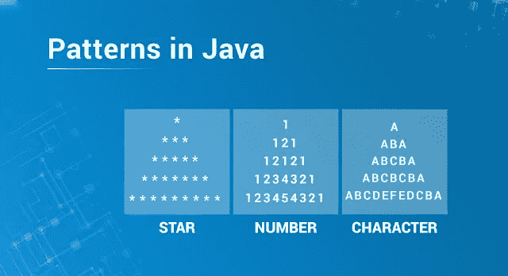

# Java 中的模式

> 原文：<https://medium.com/edureka/pattern-programs-in-java-f33186c711c8?source=collection_archive---------0----------------------->



Patterns in Java — Edureka

**Java 面试**会给程序员出难题，比如流程的严重程度。参加过这个过程的人会知道一个模式程序应该出现在程序列表中。这篇文章重点关注 Java 中的模式程序。我将这些项目分为以下几组:

# Java 中的模式程序

*   Java 中的星形模式
*   数字模式
*   字符模式

让我们开始吧。:-)

# Java 中的星形模式

首先，让我们从 **Java** 中的基本和常见的模式程序开始，即金字塔。

## 1.金字塔计划

```
 * 
   * * 
  * * * 
 * * * * 
* * * * *
```

让我们编写 java 代码来更好地理解这种模式。

```
public class Edureka
{  
    public static void pyramidPattern(int n) 
    {  
        for (int i=0; i<n; i++) //outer loop for number of rows(n)
        { 
        for (int j=n-i; j>1; j--) //inner loop for spaces
            { 
                System.out.print(" "); //print space
            }  
            for (int j=0; j<=i; j++ ) //inner loop for number of columns
            { 
                System.out.print("* "); //print star
            } 

            System.out.println(); //ending line after each row
        } 
    } 

    public static void main(String args[]) //driver function
    { 
        int n = 5; 
        pyramidPattern(n); 
    } 
}
```

## 2.直角三角形星形图案

```
*
* *
* * *
* * * *
* * * * *
```

让我们编写 java 代码来更好地理解这种模式。

```
public class Edureka 
{ 
    public static void rightTriangle(int n) 
    { 
        int i, j;  
        for(i=0; i<n; i++) //outer loop for number of rows(n) 
        {
        for(j=2*(n-i); j>=0; j--) // inner loop for spaces 
            {           
                System.out.print(" "); // printing space
            } 
            for(j=0; j<=i; j++) //  inner loop for columns
            {       
                System.out.print("* "); // print star
            }           
            System.out.println(); // ending line after each row
        } 
    } 
    public static void main(String args[]) 
    { 
        int n = 5; 
        rightTriangle(n); 
    } 
}
```

## **3。左三角星形图案**

```
 * 
         * * 
       * * * 
     * * * * 
   * * * * *
```

让我们编写 java 代码来更好地理解这种模式。

```
public class Edureka 
{ 
    public static void printStars(int n) 
    { 
        int i, j;  
        for(i=0; i<n; i++) //outer loop for number of rows(n)
        { 
        for(j=2*(n-i); j>=0; j--) // inner loop for spaces 
            {           
                System.out.print(" "); // printing space
            } 
            for(j=0; j<=i; j++) //  inner loop for columns
            {       
                System.out.print("* "); // print star
            }           
            System.out.println(); // ending line after each row
        } 
    } 
    public static void main(String args[]) 
    { 
        int n = 5; 
        printStars(n); 
    } 
}
```

## 4.Java 中的菱形图案程序

输入行数:5

```
 *
   ***
  *****
 *******
*********
 *******
  *****
   ***
    *
```

让我们编写 java 代码来更好地理解这种模式。

```
import java.util.Scanner;
public class Edureka
{
public static void main(String args[])
{
int n, i, j, space = 1;
System.out.print("Enter the number of rows: ");
Scanner s = new Scanner(System.in);
n = s.nextInt();
space = n - 1;
for (j = 1; j<= n; j++)
{
for (i = 1; i<= space; i++)
{
System.out.print(" ");
}
space--;
for (i = 1; i <= 2 * j - 1; i++)
{
System.out.print("*");
}
System.out.println("");
}
space = 1;
for (j = 1; j<= n - 1; j++)
{
for (i = 1; i<= space; i++)
{
System.out.print(" ");
}
space++;
for (i = 1; i<= 2 * (n - j) - 1; i++)
{
System.out.print("*");
}
System.out.println("");
}
}
}
```

## 5.向下三角形星形图案

输入行数:5

```
* * * * * 
* * * * 
* * * 
* * 
*
```

让我们编写 java 代码来更好地理解这种模式。

```
import java.util.Scanner;
public class Edureka
{
    public static void main(String[] args)
    {
    Scanner sc = new Scanner(System.in);

    System.out.println("Enter the number of rows: "); //takes input from user

    int rows = sc.nextInt();

    for (int i= rows-1; i>=0 ; i--)
    {
    for (int j=0; j<=i; j++)
    {
    System.out.print("*" + " ");
    }
    System.out.println();
    }
    sc.close();
    }
    }
```

## 6.镜像直角三角形星形程序

输入行数:5

```
 *
    **
   ***
  ****
 *****
******
```

让我们编写 java 代码来更好地理解这种模式。

```
import java.util.Scanner;
public class Edureka
{
    public static void main(String[] args)
    {
        Scanner sc = new Scanner(System.in);

        System.out.println("Enter number of rows: "); // takes input from user

        int rows = sc.nextInt();

        for (int i= 0; i<= rows; i++)
        {
            for (int j=1; j<=rows-i; j++)
            {
                System.out.print(" ");
            }
            for (int k=0;k<=i;k++)
            {
                System.out.print("*");
            } 
                System.out.println("");
        }
        sc.close();

    }
}
```

## 7.倒金字塔星形图案

输入行数:5

```
* * * * * 
 * * * * 
  * * * 
   * * 
    *
```

让我们编写 java 代码来更好地理解这种模式。

```
import java.util.Scanner;
public class Edureka
{
    public static void main(String[] args)
{
    Scanner sc = new Scanner(System.in);
    System.out.println("Enter the number of rows: ");

    int rows = sc.nextInt();        
    for (int i= 0; i<= rows-1 ; i++)
    {
        for (int j=0; j<=i; j++)
        {
            System.out.print(" ");
        }
        for (int k=0; k<=rows-1-i; k++)
        {
            System.out.print("*" + " ");
        }
        System.out.println();
    }
    sc.close();

}
}
```

## **8。右下镜星形图案**

输入行数:5

```
*****
 ****
  ***
   **
    *
```

让我们编写 java 代码来更好地理解这种模式。

```
import java.util.Scanner;
public class Edureka
{

    public static void main(String[] args)
    {
    Scanner sc = new Scanner(System.in); // takes input
    System.out.println("Enter number of rows: ");
    int rows = sc.nextInt();
    for (int i= rows; i>= 1; i--)
    {
    for (int j=rows; j>i;j--)
    {
    System.out.print(" ");
    }
    for (int k=1;k<=i;k++)
    {
    System.out.print("*");
    }
    System.out.println("");
    }
    sc.close();
    }
    }
```

## 9.右帕斯卡三角形

输入行数:5

```
* 
* * 
* * * 
* * * * 
* * * * * 
* * * * 
* * * 
* * 
*
```

让我们编写 java 代码来更好地理解这种模式。

```
import java.util.Scanner;
public class Edureka
{
    public static void main(String[] args)
    {
        Scanner sc = new Scanner(System.in);
        System.out.println("Enter the number of rows: ");

        int rows = sc.nextInt();        
        for (int i= 0; i<= rows-1 ; i++)
        {
            for (int j=0; j<=i; j++) 
            { 
            System.out.print("*"+ " "); 
            } 
            System.out.println(""); 
            } 
            for (int i=rows-1; i>=0; i--)
        {
            for(int j=0; j <= i-1;j++)
            {
                System.out.print("*"+ " ");
            }
            System.out.println("");
        }
        sc.close();
    }
}
```

## 10.左三角帕斯卡的

输入行数:5

```
 *
   **
  ***
 ****
*****
 ****
  ***
   **
    *
```

让我们编写 java 代码来更好地理解这种模式。

```
import java.util.Scanner;
public class Edureka
{

    public static void main(String[] args)
    {
        Scanner sc = new Scanner(System.in);
        System.out.println("Enter the number of rows: ");

        int rows = sc.nextInt();        
        for (int i= 1; i<= rows ; i++)
        {
            for (int j=i; j <rows ;j++)            
        {
                System.out.print(" ");
            }
            for (int k=1; k<=i;k++)
            {
            System.out.print("*");
            }
            System.out.println("");
            } 
            for (int i=rows; i>=1; i--)
        {
            for(int j=i; j<=rows;j++)
            {
                System.out.print(" ");
            }
            for(int k=1; k<i ;k++) 
            {
                System.out.print("*");
            }
            System.out.println("");

        }
        sc.close();
    }
}
```

## 11.沙漏星形图案

输入行数:5

```
* * * * * 
 * * * * 
  * * * 
   * * 
    * 
    * 
   * * 
  * * * 
 * * * * 
* * * * *
```

让我们编写 java 代码来更好地理解这种模式。

```
import java.util.Scanner;
public class Edureka
{
    public static void main(String[] args)
    {
        Scanner sc = new Scanner(System.in);
        System.out.println("Enter the number of rows: ");

        int rows = sc.nextInt();            
        for (int i= 0; i<= rows-1 ; i++)
        {
            for (int j=0; j <i; j++)
            {
                System.out.print(" ");
            }
            for (int k=i; k<=rows-1; k++) 
            {
            System.out.print("*" + " ");
            } 
            System.out.println("");
            } 
            for (int i= rows-1; i>= 0; i--)
        {
            for (int j=0; j< i ;j++)
            {
                System.out.print(" ");
            }
            for (int k=i; k<=rows-1; k++)
            {
                System.out.print("*" + " ");
            }
            System.out.println("");
        }
        sc.close();
    }
}
```

## 12.用字母表示一种模式

```
** 
* *
***
* *
* *
* *
```

让我们编写 java 代码来更好地理解这种模式。

```
import java.util.Scanner;
public class Edureka
{
    // Java program to print alphabet A pattern
    void display(int n)
    {
    // Outer for loop for number of lines
    for (int i = 0; i<=n; i++) {
    // Inner for loop for logic execution
    for (int j = 0; j<= n / 2; j++) {
    // prints two column lines
    if ((j == 0 || j == n / 2) && i != 0 ||
    // print first line of alphabet
    i == 0  && j != n / 2 ||
    // prints middle line
    i == n / 2)
    System.out.print("*");
    else
    System.out.print(" ");
    }
    System.out.println();
    }
    }
    public static void main(String[] args)
    {
    Scanner sc = new Scanner(System.in);
    Edureka a = new Edureka();
    a.display(7);
    }
    }
```

## 13.三角形星形图案

输入行数:5

```
 *
   * *
  *   *
 *     *
*********
```

让我们编写 java 代码来更好地理解这种模式。

```
import java.util.Scanner;
public class Edureka
{
     public static void main(String[] args)
        {
            Scanner sc = new Scanner(System.in);

            System.out.println("Enter the number of rows: ");

            int rows = sc.nextInt();

            for (int i=1; i<= rows ; i++)
            {
                for (int j = i; j < rows ; j++) {
                    System.out.print(" ");
                }   
                for (int k = 1; k <= (2*i -1) ;k++) {
                    if( k==1 || i == rows || k==(2*i-1)) {
                        System.out.print("*");
                    }
                    else {
                        System.out.print(" ");
                    }
                }
                System.out.println("");
            }
            sc.close();
        }
    }
```

## 14.向下三角形

输入行数:5

```
*********
 *     *
  *   *
   * *
    *
```

让我们编写 java 代码来更好地理解这种模式。

```
import java.util.Scanner;
public class Edureka
{
public static void main(String[] args)
{
    Scanner sc = new Scanner(System.in);
    System.out.println("Enter the number of rows: ");

    int rows = sc.nextInt();    
     for (int i=rows; i>= 1 ; i--)
    {
        for (int j = i; j < rows ; j++) {
            System.out.print(" ");
        }   
        for (int k = 1; k <= (2*i -1) ;k++) {
            if( k==1 || i == rows || k==(2*i-1)) {
                System.out.print("*");
            }
            else {
                System.out.print(" ");
            }
        }
        System.out.println("");
    }
    sc.close();
}
}
```

## 15.菱形星形图案

输入行数:5

```
 *
   * *
  *   *
 *     *
*       *
 *     *
  *   *
   * *
    *
```

让我们编写 java 代码来更好地理解这种模式。

```
import java.util.Scanner;
public class Edureka
{
    public static void main(String[] args)
{
    Scanner sc = new Scanner(System.in);

    System.out.println("Enter the number of rows: ");

    int rows = sc.nextInt();    
    for (int i=1; i<= rows ; i++) { for (int j = rows; j > i ; j--) {
            System.out.print(" ");
        }
        System.out.print("*");
        for (int k = 1; k < 2*(i -1) ;k++)
        { 
        System.out.print(" "); } if( i==1)
        { 
        System.out.println(""); 
        }
        else { System.out.println("*");
        } 
        } 
        for (int i=rows-1; i>= 1 ; i--)
        {
        for (int j = rows; j > i ; j--) {
            System.out.print(" ");
        }
        System.out.print("*");
        for (int k = 1; k < 2*(i -1) ;k++) {
            System.out.print(" ");
        }
        if( i==1)
            System.out.println("");
        else
            System.out.println("*");
    }
    sc.close();
}
}
```

现在我们已经用 Java 实现了星型模式程序。让我们更进一步，实现一些数字模式。

# Java 中的数字模式

## 1.简单数字程序

```
1 
1 2 
1 2 3 
1 2 3 4 
1 2 3 4 5
```

让我们编写 java 代码来更好地理解这种模式。

```
public class Edureka
{
    public static void printNums(int n) 
    { 
        int i, j,num; 

        for(i=0; i<n; i++) // outer loop for rows
        { 
            num=1; 
            for(j=0; j<=i; j++) // inner loop for rows
            { 
                // printing num with a space  
                System.out.print(num+ " "); 

                //incrementing value of num 
                num++; 
            } 

            // ending line after each row 
            System.out.println(); 
        } 
    } 
       public static void main(String args[]) 
    { 
        int n = 5; 
        printNums(n); 
    } 
}
```

## 2.java 中的数字模式程序

```
1 
2 3 
4 5 6 
7 8 9 10 
11 12 13 14 15
```

让我们编写 java 代码来更好地理解这种模式。

```
import java.util.Scanner;

public class Edureka
{            
        public static void main(String[] args) {
            int i, j, k = 1;
            for (i = 1; i <= 5; i++) {
                for (j = 1; j< i + 1; j++) {
                    System.out.print(k++ + " ");
                }

                System.out.println();
            }
        }

    }
```

## 3.Java 中的帕斯卡三角形程序

```
 1
           1   1
         1   2   1
       1   3   3   1
     1   4   6   4   1
```

让我们编写 java 代码来更好地理解这种模式。

```
import java.util.Scanner;

public class Edureka
{            
    public static void main(String[] args) {

        int n = 5;

        for (int i = 0; i < n; i++) {
            int number = 1;
            System.out.printf("%" + (n - i) * 2 + "s", "");
            for (int j = 0; j <= i; j++) {
                System.out.printf("%4d", number);
                number = number * (i - j) / (j + 1);
            }
            System.out.println();
        }

    }

}
```

## 4.Java 中的菱形图案程序

```
 1
  212
 32123
4321234
 32123
  212
   1
```

让我们编写 java 代码来更好地理解这种模式。

```
import java.util.Scanner;

public class Edureka
{            
    public static void main(String[] args) {
        for (int i = 1; i <= 4; i++)
        {
            int n = 4;

            for (int j = 1; j<= n - i; j++) 
            { 
            System.out.print(" ");
            }
            for (int k = i; k >= 1; k--)
            {
                System.out.print(k);
            }
            for (int l = 2; l <= i; l++)
            { 
            System.out.print(l); 
            } 
            System.out.println(); 
            } 
            for (int i = 3; i >= 1; i--)
        {
            int n = 3;

            for (int j = 0; j<= n - i; j++) { System.out.print(" "); } for (int k = i; k >= 1; k--)
            {
                System.out.print(k);
            }
            for (int l = 2; l <= i; l++)
            {
                System.out.print(l);
            }

            System.out.println();
        }

    }
}
```

## 5.Java 中的数字模式程序

输入行数:5

```
1 
2 2 
3 3 3 
4 4 4 4 
5 5 5 5 5
```

让我们编写 java 代码来更好地理解这种模式。

```
import java.util.Scanner;

public class Edureka
{            
    public static void main(String[] args) 
    {
        Scanner sc = new Scanner(System.in); //Taking rows value from the user    
        System.out.println("Enter the number of rows: ");    
        int rows = sc.nextInt();         
        for (int i = 1; i <= rows; i++) 
        {
            for (int j = 1; j <= i; j++)
            {
                System.out.print(i+" ");
            }

            System.out.println();
        }         
        sc.close();
    }
}
```

## 6.降序模式

输入行数:5

```
5 
5 4 
5 4 3 
5 4 3 2 
5 4 3 2 1
```

让我们编写 java 代码来更好地理解这种模式。

```
import java.util.Scanner;
public class Edureka
{
public static void main(String[] args)
{
Scanner sc = new Scanner(System.in);

//Taking rows value from the user

System.out.println("Enter the number of rows: ");

int rows = sc.nextInt();
for (int i = rows; i >= 1; i--)
{
for (int j = rows; j >= i; j--)
{
System.out.print(j+" ");
}

System.out.println();
}
sc.close();
}
}
```

## 7.直角三角形数字模式

输入行数:5

```
1 
2 1 
3 2 1 
4 3 2 1 
5 4 3 2 1
```

让我们编写 java 代码来更好地理解这种模式。

```
import java.util.Scanner;
public class Edureka
{

public static void main(String[] args) 
{
Scanner sc = new Scanner(System.in);

System.out.println("Enter the number of rows: ");

int rows = sc.nextInt();

for (int i = 1; i <= rows; i++) { for (int j = i; j >= 1; j--)
   {
       System.out.print(j+" ");
   }

   System.out.println();
}         
sc.close();
}
}
```

## 8.二进制数字模式

输入行数:5

```
10101
01010
10101
01010
10101
```

让我们编写 java 代码来更好地理解这种模式。

```
import java.util.Scanner;
public class Edureka
{

    public static void main(String[] args) 
    {
        Scanner sc = new Scanner(System.in);

        System.out.println("Enter the number of rows: ");

        int rows = sc.nextInt();

        for (int i = 1; i <= rows; i++) 
        {
            int num;

            if(i%2 == 0)
            {
                num = 0;

                for (int j = 1; j <= rows; j++)
                {
                    System.out.print(num);

                    num = (num == 0)? 1 : 0;
                }
            }
            else
            {
                num = 1;

                for (int j = 1; j <= rows; j++)
                {
                    System.out.print(num);

                    num = (num == 0)? 1 : 0;
                }
            }

            System.out.println();
        }

        sc.close();
    }
}
```

## 9.0/1 模式程序

输入行数:5

```
1
10
101
1010
10101
```

让我们编写 java 代码来更好地理解这种模式。

```
import java.util.Scanner;

public class Edureka
{            
    public static void main(String[] args) 
    {
        Scanner sc = new Scanner(System.in);

        System.out.println("Enter the number of rows: ");

        int rows = sc.nextInt();         
        for (int i = 1; i <= rows; i++) 
        {
            for (int j = 1; j <= i; j++)
            {
                if(j%2 == 0)
                {
                    System.out.print(0);
                }
                else
                {
                    System.out.print(1);
                }
            }

            System.out.println();
        }

        sc.close();
    }
}
```

## 10.菱形数字图案

```
1 2 3 4 5 
 2 3 4 5 
  3 4 5 
   4 5 
    5 
   4 5 
  3 4 5 
 2 3 4 5 
1 2 3 4 5
```

让我们编写 java 代码来更好地理解这种模式。

```
import java.util.Scanner;
public class Edureka
{
    public static void main(String[] args) 
    {

        int n = 5;  

        for (int i = 1; i <= n; i++) 
        {
            for (int j = 1; j < i; j++) 
            {
                System.out.print(" ");
            }

            for (int k = i; k <= n; k++) 
            {
            System.out.print(k+" ");
            }
            System.out.println();
            } 
            for (int i = n-1; i >= 1; i--) 
        {
             for (int j = 1; j < i; j++) 
            {
                System.out.print(" ");
            }
            for (int k = i; k <= n; k++)
            {
                System.out.print(k+" ");
            }

            System.out.println();
        }

    }
}
```

现在我们已经用 Java 实现了数字模式程序。让我们更进一步，实现一些字符/字母模式。

# Java 中的字母/字符模式

## 1.右字母三角形

```
A 
A B 
A B C 
A B C D 
A B C D E 
A B C D E F
```

让我们编写 java 代码来更好地理解这种模式。

```
import java.util.Scanner;

public class Edureka
{            
    public static void main(String[] args)
    {
        int alphabet = 65;
                for (int i = 0; i <= 5; i++)
        {
            for (int j = 0; j <= i; j++)
            {
                System.out.print((char) (alphabet + j) + " ");
            }
            System.out.println();
        }
    }
}
```

## 2.字母/字符模式程序

```
A 
B B 
C C C 
D D D D 
E E E E E 
F F F F F F
```

让我们编写 java 代码来更好地理解这种模式。

```
import java.util.Scanner;

public class Edureka
{            
    public static void main(String[] args)
    {
        int alphabet = 65;
                for (int i = 0; i<= 5; i++)
        {
            for (int j = 0; j <= i; j++)
            {
                System.out.print((char) alphabet + " ");
            }
            alphabet++;
            System.out.println();
        }
    }
}
```

## 3.k 形字符模式程序

```
A B C D E F 
A B C D E 
A B C D 
A B C 
A B 
A 
A 
A B 
A B C 
A B C D 
A B C D E 
A B C D E F
```

让我们编写 java 代码来更好地理解这种模式。

```
import java.util.Scanner;

public class Edureka
{public static void main(String[] args)
{
for (int i = 5; i >= 0; i--)
{
   int alphabet = 65;
   for (int j = 0; j <= i; j++)
   {
       System.out.print((char) (alphabet + j) + " ");
   }
   System.out.println();
}
for (int i = 0; i<= 5; i++)
{
   int alphabet = 65;
   for (int j = 0; j <= i; j++)
   {
       System.out.print((char) (alphabet + j) + " ");
   }
   System.out.println();
}
}
}
```

## 4.Java 中的三角形字符模式程序

```
 A 
    A B 
   A B C 
  A B C D 
 A B C D E 
A B C D E F
```

让我们编写 java 代码来更好地理解这种模式。

```
public class Edureka
{            
    public static void main(String[] args)
{
        for (int i = 0; i <= 5; i++) 
        { 
        int alphabet = 65;
        for (int j = 5; j > i; j--)
        {
            System.out.print(" ");
        }
        for (int k = 0; k <= i; k++)
        {
            System.out.print((char) (alphabet + k) + " ");
        }
        System.out.println();
    }
}
}
```

## 5.Java 中的菱形图案

输入 A 到 Z : F 之间的字符

```
 A
    B B
   C   C
  D     D
 E       E
F         F
 E       E
  D     D
   C   C
    B B
     A
```

让我们编写 java 代码来更好地理解这种模式。

```
import java.util.Scanner;

public class Edureka
{public static void main(String[] args) {
    char[] letter = { 'A', 'B', 'C', 'D', 'E', 'F', 'G', 'H', 'I', 'J',
            'K', 'L', 'M', 'N', 'O', 'P', 'Q', 'R', 'S', 'T', 'U', 'V',
            'W', 'X', 'Y', 'Z' };
    int letter_number = 0;
    String[] diamond = new String[26]; // array of strings
    System.out.print("Enter a Character between A to Z : ");

    Scanner reader = new Scanner(System.in);
    try {
        char user_letter = reader.next("[A-Z]").charAt(0);
        // search for letter number in the array letter
        for (int i = 0; i < letter.length; i++) {
            if (letter[i] == user_letter) {
                letter_number = i;
                break;
            }
        }

        // construct diamond
        for (int i = 0; i <= letter_number; i++) {
            diamond[i] = "";
            // add initial spaces
            for (int j = 0; j < letter_number - i; j++) {
                diamond[i] += " ";
            }

            // add letter
            diamond[i] += letter[i];

            // add space between letters
            if (letter[i] != 'A') {
                for (int j = 0; j < 2 * i - 1; j++) 
                { 
                diamond[i] += " "; } // add letter
                diamond[i] += letter[i]; 
                } 
                // Draw the first part of the diamond 
                System.out.println(diamond[i]);
                } 
                for (int i = letter_number - 1; i >= 0; i--)
                {
            // Draw the second part of the diamond
            // Writing the diamondArray in reverse order
            System.out.println(diamond[i]);
        }
    } catch (Exception e) {
        e.printStackTrace();
    } finally {
        reader.close();
    }

}
}
```

这就把我们带到了 java 博客中前 30 个模式程序的结尾。我希望您发现它提供了很多信息，并帮助您理解了 Java 基础知识。如果你想查看更多关于人工智能、DevOps、道德黑客等市场最热门技术的文章，你可以参考 [Edureka 的官方网站。](https://www.edureka.co/blog/?utm_source=medium&utm_medium=content-link&utm_campaign=30-pattern-programs-in-java)

请留意本系列中的其他文章，它们将解释 Java 的各个方面。

> 1.[面向对象编程](/edureka/object-oriented-programming-b29cfd50eca0)
> 
> 2.[Java 中的继承](/edureka/inheritance-in-java-f638d3ed559e)
> 
> 3.[Java 中的多态性](/edureka/polymorphism-in-java-9559e3641b9b)
> 
> 4.[Java 中的抽象](/edureka/java-abstraction-d2d790c09037)
> 
> 5. [Java 字符串](/edureka/java-string-68e5d0ca331f)
> 
> 6. [Java 数组](/edureka/java-array-tutorial-50299ef85e5)
> 
> 7. [Java 集合](/edureka/java-collections-6d50b013aef8)
> 
> 8. [Java 线程](/edureka/java-thread-bfb08e4eb691)
> 
> 9.Java Servlets 简介
> 
> 10. [Servlet 和 JSP 教程](/edureka/servlet-and-jsp-tutorial-ef2e2ab9ee2a)
> 
> 11.[Java 中的异常处理](/edureka/java-exception-handling-7bd07435508c)
> 
> 12.[高级 Java 教程](/edureka/advanced-java-tutorial-f6ebac5175ec)
> 
> 13. [Java 面试问题](/edureka/java-interview-questions-1d59b9c53973)
> 
> 14. [Java 程序](/edureka/java-programs-1e3220df2e76)
> 
> 15. [Kotlin vs Java](/edureka/kotlin-vs-java-4f8653f38c04)
> 
> 16.[依赖注入使用 Spring Boot](/edureka/what-is-dependency-injection-5006b53af782)
> 
> 17.[Java 中的可比性](/edureka/comparable-in-java-e9cfa7be7ff7)
> 
> 18.[十大 Java 框架](/edureka/java-frameworks-5d52f3211f39)
> 
> 19. [Java 反射 API](/edureka/java-reflection-api-d38f3f5513fc)
> 
> 20. [Java 教程](/edureka/java-tutorial-bbdd28a2acd7)
> 
> 21.[核心 Java 备忘单](/edureka/java-cheat-sheet-3ad4d174012c)
> 
> 22.[Java 中的套接字编程](/edureka/socket-programming-in-java-f09b82facd0)
> 
> 23. [Java OOP 备忘单](/edureka/java-oop-cheat-sheet-9c6ebb5e1175)
> 
> 24.[Java 中的注释](/edureka/annotations-in-java-9847d531d2bb)
> 
> 25.[Java 中的图书管理系统项目](/edureka/library-management-system-project-in-java-b003acba7f17)
> 
> 26.[Java 中的树](/edureka/java-binary-tree-caede8dfada5)
> 
> 27.[Java 中的机器学习](/edureka/machine-learning-in-java-db872998f368)
> 
> 28.[Java 中的顶级数据结构&算法](/edureka/data-structures-algorithms-in-java-d27e915db1c5)
> 
> 29. [Java 开发者技能](/edureka/java-developer-skills-83983e3d3b92)
> 
> 30.[前 55 个 Servlet 面试问题](/edureka/servlet-interview-questions-266b8fbb4b2d)
> 
> 31. [](/edureka/java-exception-handling-7bd07435508c) [顶级 Java 项目](/edureka/java-projects-db51097281e3)
> 
> 32. [Java 字符串备忘单](/edureka/java-string-cheat-sheet-9a91a6b46540)
> 
> 33.[Java 中的嵌套类](/edureka/nested-classes-java-f1987805e7e3)
> 
> 34. [Java 集合面试问答](/edureka/java-collections-interview-questions-162c5d7ef078)
> 
> 35。[*Java 中如何处理死锁？*](/edureka/deadlock-in-java-5d1e4f0338d5)
> 
> 36。 [*你需要知道的 50 个 Java 合集面试问题*](/edureka/java-collections-interview-questions-6d20f552773e)
> 
> *37。*[*Java 中的字符串池是什么概念？*](/edureka/java-string-pool-5b5b3b327bdf)
> 
> *38。*[*C、C++和 Java 有什么区别？*](/edureka/difference-between-c-cpp-and-java-625c4e91fb95)
> 
> 39。[*Java 中的回文——如何检查一个数字或字符串？*](/edureka/palindrome-in-java-5d116eb8755a)
> 
> 40。 [*你需要知道的顶级 MVC 面试问答*](/edureka/mvc-interview-questions-cd568f6d7c2e)
> 
> 41。[*Java 编程语言十大应用*](/edureka/applications-of-java-11e64f9588b0)
> 
> 42.[Java 中的死锁](/edureka/deadlock-in-java-5d1e4f0338d5)
> 
> 43.[Java 中的平方和平方根](/edureka/java-sqrt-method-59354a700571)
> 
> 44.[Java 中的类型转换](/edureka/type-casting-in-java-ac4cd7e0bbe1)
> 
> 45.[Java 中的运算符及其类型](/edureka/operators-in-java-fd05a7445c0a)
> 
> 46.[Java 中的析构函数](/edureka/destructor-in-java-21cc46ed48fc)
> 
> 47.[爪哇的二分搜索法](/edureka/binary-search-in-java-cf40e927a8d3)
> 
> 48.[Java 中的 MVC 架构](/edureka/mvc-architecture-in-java-a85952ae2684)
> 
> 49. [Hibernate 面试问答](/edureka/hibernate-interview-questions-78b45ec5cce8)

*原载于 2019 年 6 月 22 日*[*https://www.edureka.co*](https://www.edureka.co/blog/30-pattern-programs-in-java/)*。*