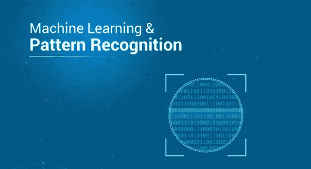
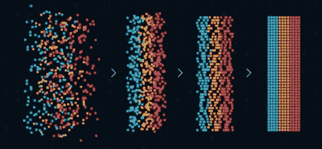
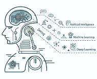

# 模式识别——它与机器学习有什么不同

> 原文：<https://medium.com/edureka/pattern-recognition-5e2d30ab68b9?source=collection_archive---------0----------------------->

Pattern Recognition — Edureka

模式识别是管理任何 AI 或 ML 项目的关键特征之一。机器学习行业无疑正在蓬勃发展，并且朝着好的方向发展。本文将涉及以下几点:

*   介绍
*   机器学习
*   模式识别
*   模式识别的特征
*   模式识别中的训练和学习模型
*   模式识别的应用
*   模式识别的优势
*   机器学习和模式识别的区别
*   摘要

# **简介**

在当今世界，许多不同类型的数据在系统之间流动，为了对数据进行分类，我们不能使用传统的编程方法，传统的编程方法具有检查某些条件并对数据进行分类的规则。

这个问题的解决方案是机器学习，在它的帮助下，我们可以创建一个模型，可以从数据中分类不同的模式。其中一个应用是垃圾或非垃圾数据的分类。

# **机器学习**

在机器学习中，我们不能指望一个模型是 100%准确的，但预测应该尽可能接近，以便它可以被归类到特定的类别中。在机器学习中，模型是基于一些算法创建的，这些算法从提供的数据中学习以做出预测。

这个模型建立在统计数据的基础上。机器学习需要一些数据来分析它，并自动创建一些可以预测事情的模型。为了从模型中获得良好的预测，我们需要提供具有不同特征的数据，以便算法能够理解给定问题中可能存在的不同模式。

# **模式识别**

借助机器学习中使用的算法来识别模式。识别模式是根据训练数据创建的模型对数据进行分类的过程，然后从模式中检测模式和特征。

模式识别是可以检测不同类别并获得关于特定数据的信息的过程。模式识别的一些应用是语音识别、天气预报、图像中的对象检测等。

# **模式识别的特点:**

*   模式识别从数据中学习。
*   即使部分可见，也能自动识别图案。
*   应该能够识别熟悉的模式。
*   应该从不同的角度和形状来识别图案。

# **模式识别中的训练和学习模型**

首先将数据分为训练集和测试集。从数据中学习可以知道系统的预测如何依赖于所提供的数据，以及哪种算法适合特定的数据，这是一个非常重要的阶段。由于数据分为两类，我们可以使用训练数据来训练算法，测试数据用于测试模型，正如已经说过的数据应该是多样的，训练和测试数据应该是不同的。

因此，我们将数据分成两组。通常，我们将数据分成两组，其中 70%的数据用于训练模型，算法从提供的数据中提取重要的模式并创建模型。测试集包含全部数据的 30%,然后用于验证模型的性能，即模型预测结果的准确性。

# **模式识别的应用**

*   **计算机视觉:**在模式识别的帮助下，可以识别图像中的物体，模式识别可以从图像或视频中提取某些模式，这些模式可以用于人脸识别、农业技术等。
*   **民政:**监视和交通分析系统，用于识别汽车等物体。
*   **工程:**语音识别广泛应用于 Alexa、Siri、Google Now 等系统。
*   **地质学:**岩石识别，它帮助地质学家探测岩石。
*   **语音识别:**在语音识别中，单词被视为一种模式，并广泛用于语音识别算法中。
*   **指纹扫描:**在指纹识别中，模式识别是广泛用于识别一个人的应用之一，用于跟踪组织中的出勤情况。

**模式识别的优势**

*   DNA 序列可以被解释
*   广泛应用于医疗领域和机器人领域。
*   使用模式识别可以解决分类问题。
*   生物特征检测
*   可以从不同的角度识别特定的物体。

# **机器学习和模式识别的区别**

ML 是一个从数据中学习而无需显式编程的方面，其本质上可以是迭代的，并且随着其不断执行任务而变得准确。ML 是模式识别的一种形式，其基本思想是训练机器识别模式并将其应用于实际问题。ML 是一种可以从数据中学习并不断更新自身以更好地执行的功能，但是，模式识别不学习问题，但是，它可以被编码以学习模式。模式识别被定义为基于从模式中获得的统计信息的数据分类。

模式识别在机器学习试图完成的任务中起着重要的作用。同样，人类通过识别模式来学习。模式不同于视觉模式、声音模式、信号、天气数据等。可以开发 ML 模型来理解使用统计分析的模式，统计分析可以进一步分类数据。结果可能是一个可能的值，或者取决于数据出现的可能性。

# **总结**

在本文中，我们了解了什么是机器学习和模式识别，以及它们如何协同工作以创建准确高效的模型。我们探索了模式识别的不同特征。此外，如何将数据划分为训练集和测试集，以及如何使用它们来创建可以提供准确预测的高效模型。它们的应用是什么，它们之间的区别是什么？

到此，我们结束这篇文章。如果你想查看更多关于人工智能、DevOps、道德黑客等市场最热门技术的文章，那么你可以参考 [Edureka 的官方网站。](https://www.edureka.co/blog/?utm_source=medium&utm_medium=content-link&utm_campaign=pattern-recognition)

请留意本系列中的其他文章，它们将解释深度学习的各个其他方面。

> 1. [TensorFlow 教程](/edureka/tensorflow-tutorial-ba142ae96bca)
> 
> 2. [PyTorch 教程](/edureka/pytorch-tutorial-9971d66f6893)
> 
> 3.[感知器学习算法](/edureka/perceptron-learning-algorithm-d30e8b99b156)
> 
> 4.[神经网络教程](/edureka/neural-network-tutorial-2a46b22394c9)
> 
> 5.[什么是反向传播？](/edureka/backpropagation-bd2cf8fdde81)
> 
> 6.[卷积神经网络](/edureka/convolutional-neural-network-3f2c5b9c4778)
> 
> 7.[胶囊神经网络](/edureka/capsule-networks-d7acd437c9e)
> 
> 8.[递归神经网络](/edureka/recurrent-neural-networks-df945afd7441)
> 
> 9.[自动编码器教程](/edureka/autoencoders-tutorial-cfdcebdefe37)
> 
> 10.[受限玻尔兹曼机教程](/edureka/restricted-boltzmann-machine-tutorial-991ae688c154)
> 
> 11. [PyTorch vs TensorFlow](/edureka/pytorch-vs-tensorflow-252fc6675dd7)
> 
> 12.[用 Python 进行深度学习](/edureka/deep-learning-with-python-2adbf6e9437d)
> 
> 13.[人工智能教程](/edureka/artificial-intelligence-tutorial-4257c66f5bb1)
> 
> 14.[张量流图像分类](/edureka/tensorflow-image-classification-19b63b7bfd95)
> 
> 15.[人工智能应用](/edureka/artificial-intelligence-applications-7b93b91150e3)
> 
> 16.[如何成为一名人工智能工程师？](/edureka/become-artificial-intelligence-engineer-5ac2ede99907)
> 
> 17. [Q 学习](/edureka/q-learning-592524c3ecfc)
> 
> 18. [Apriori 算法](/edureka/apriori-algorithm-d7cc648d4f1e)
> 
> 19.[用 Python 实现马尔可夫链](/edureka/introduction-to-markov-chains-c6cb4bcd5723)
> 
> 20.[人工智能算法](/edureka/artificial-intelligence-algorithms-fad283a0d8e2)
> 
> 21.[机器学习的最佳笔记本电脑](/edureka/best-laptop-for-machine-learning-a4a5f8ba5b)
> 
> 22.[12 大人工智能工具](/edureka/top-artificial-intelligence-tools-36418e47bf2a)
> 
> 23.[人工智能(AI)面试问题](/edureka/artificial-intelligence-interview-questions-872d85387b19)
> 
> 24. [Theano vs TensorFlow](/edureka/theano-vs-tensorflow-15f30216b3bc)
> 
> 25.[什么是神经网络？](/edureka/what-is-a-neural-network-56ae7338b92d)
> 
> 26.[tensor flow 中的对象检测](/edureka/tensorflow-object-detection-tutorial-8d6942e73adc)
> 
> 27.[人工智能中的阿尔法贝塔剪枝](/edureka/alpha-beta-pruning-in-ai-b47ee5500f9a)

*原载于 2019 年 8 月 26 日*[*www.edureka.co*](https://www.edureka.co/blog/pattern-recognition/)*。*