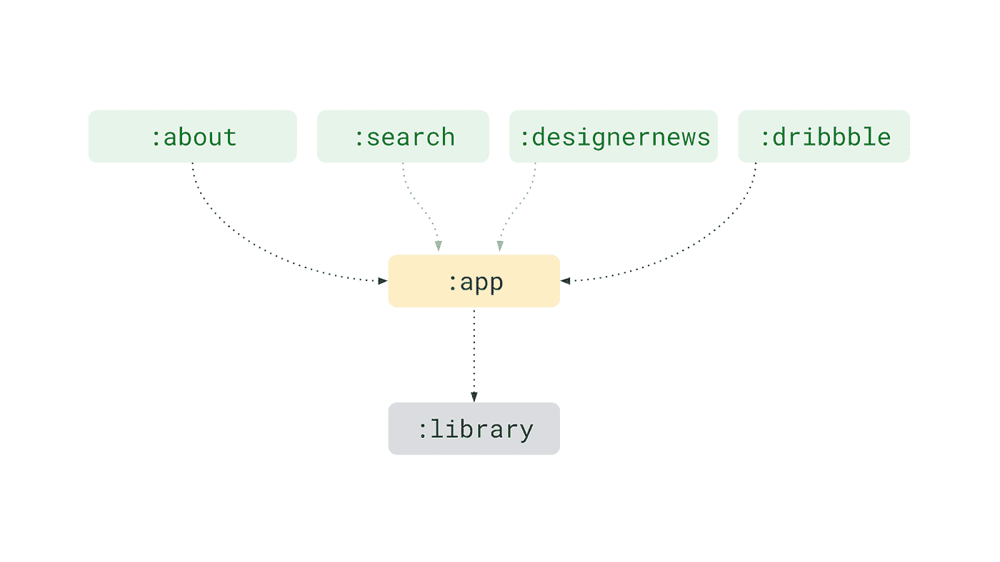

# 从动态特性模块访问代码的模式

> 原文：<https://medium.com/androiddevelopers/patterns-for-accessing-code-from-dynamic-feature-modules-7e5dca6f9123?source=collection_archive---------3----------------------->

> **更新**:删除了使用 ServiceLoader 的内容，因为 R8 不再支持将它用于动态特性，并且由于性能问题，不建议在没有 R8 优化的情况下使用它。

在这篇文章中，我将向你展示如何解决在你的项目中使用动态特性模块时出现的一个常见问题:在编译期间，你的基本应用程序无法访问它们内部定义的代码…除非你使用反射😱。

仅仅提到反射就足以吓跑一些开发人员，但是有几个优雅的解决方案可以安全地访问您需要的东西，最多使用一个反射调用…以及一个聪明的优化技术来将这个数字降到零！

继续阅读，了解你可以采取的两种不同的方法:简单反射，以及它如何在一个示例模块化应用程序中与 Dagger2 一起工作，可在 [GitHub](https://github.com/googlesamples/android-dynamic-code-loading) 上获得。

# 为什么是动态功能模块？

去年，我们推出了 Android 应用捆绑包和 Google Play 的动态交付，以帮助开发人员减少应用大小并简化发布流程。了解更多关于[应用捆绑包](https://developer.android.com/guide/app-bundle/)的优势。

但改用应用捆绑包只是第一步。新的格式为模块化您的代码库提供了新的可能性，从而为用户提供更加定制化的体验。

在 Google I/O 2019 上，我们[宣布](https://android-developers.googleblog.com/2019/05/whats-new-in-play.html)按需和[有条件](https://developer.android.com/studio/preview/features#conditional-delivery)模块的[全面上市，让你决定何时安装应用的某些部分。](https://developer.android.com/studio/projects/dynamic-delivery/on-demand-delivery)

对于按需模块，当用户导航到你的应用程序中的一个可选功能时，你使用 Play Core API 来安装新的代码和资源；对于条件模块，它们的可用性将在安装时由用户的设备配置决定，例如硬件和软件功能、用户的国家或 Android OS 版本。

这些新的、可定制的模块类型的共同点是，它们都使用`com.android.dynamic-feature` Gradle 插件。我们将称它们为**动态特征模块**，或 **DFMs** 。当您将应用作为 Android 应用捆绑包分发时，Play Store 会在适当的时候将这些模块作为单独的 apk 发送到用户的设备。

# 从库到动态功能模块

将一些库模块迁移到 DFM 需要对项目结构进行重要的改变，也就是反转基本特性和任何动态特性之间的依赖关系。

Dynamic feature modules (top) depend on base application. Application depends on regular libraries.

在使用库的标准项目结构中，基`com.android.application`模块**依赖于** `com.android.library`模块，这意味着你可以自由使用基模块库中定义的任何类。

然而，对于 DFM，基本`com.android.application` **是对** `com.android.dynamic-feature`模块的依赖，这意味着你可以在 DFM 中使用基本模块及其库中定义的任何类，但是**你不能在编译时从基本应用程序引用 DFM 中定义的任何代码**。

一旦 DFM 生成的 apk 安装到您的应用程序中(不管交付机制:安装时、按需或有条件)，它们的代码在运行时就可供类加载器使用。

> 当您拥有点播模块时，请记住始终使用 Play Core 库中的 [SplitCompat](https://developer.android.com/guide/app-bundle/playcore#access_downloaded_modules) 。

根据您的使用情况，这个问题有几个显而易见的解决方案。如果您需要从 DFM 获得的只是启动一个活动，您可以简单地传递它的名称(作为一个`String`；您不能使用`.class`符号，因为该类在编译时不可访问)到`startActivity`:

这是我们在[动态特征示例](https://github.com/googlesamples/android-dynamic-features)中使用的方法。如果你想了解如何使用 Play Core 库安装点播模块，也可以去看看。

 [## Google samples/Android-动态-功能

### 通过在 GitHub 上创建一个帐户，为 Google samples/Android-dynamic-features 开发做出贡献。

github.com](https://github.com/googlesamples/android-dynamic-features) 

在接下来的部分中，我将向您展示如何从 DFM 加载一个定制类(在它被安装之后)并在基本模块中访问它。您可以在[动态代码加载示例](https://github.com/googlesamples/android-dynamic-code-loading)中找到本文所用示例的完整代码。

 [## Google samples/Android-动态代码加载

### 动态功能模块的 Android 动态代码加载示例。-Google samples/Android-动态代码加载

github.com](https://github.com/googlesamples/android-dynamic-code-loading) 

# 项目设置

在我们将要看到的示例代码中，应用程序包含一个简单的计数器，用户可以通过按一个按钮来递增。每次重新启动应用程序时，计数器都会重置，除非用户安装了一个按需模块，其中包含让应用程序将计数器状态保存到存储中的代码。

当然，这不是你在真正的应用程序中会做的事情，但它给了我们一个简化的工作场景，你可以适应自己的动态加载代码。

示例代码的组织方式是在主源代码集中找到共同的部分，但是每种动态访问代码的方法都是以自己的变体实现的。

基本模块“app”包含这些共享类:

*   [MainActivity](https://github.com/googlesamples/android-dynamic-code-loading/blob/master/app/src/main/java/com/google/android/samples/dynamiccodeloading/MainActivity.kt) 包含 UI、
*   [AbstractMainViewModel](https://github.com/googlesamples/android-dynamic-code-loading/blob/master/app/src/main/java/com/google/android/samples/dynamiccodeloading/AbstractMainViewModel.kt) 包含逻辑，但是需要在每个构建变体中被子类化以提供`abstract fun initializeStorageFeature()`

您可以使用 Android Studio 中的构建变体切换器在这两种方法之间切换:

`storage`模块是为按需交付而配置的动态特征模块。在本文中，我们将讨论如何从基本的`app`模块中访问位于`storage`模块中的类。

# 从实现中分离出接口

首先，我们需要为我们的动态特性代码创建一个接口。我们在`app`模块中定义了它，这样它就可以用来直接调用特性实现的任何函数。

我的存储特性的接口很简单:它需要能够存储和检索一个整数。

因为我们将该接口的实现留在 DFM 模块中定义，所以实现者可以自由选择他们的构造函数是什么样子。我们的存储特性将需要一个`Context`，甚至可能请求一些其他的依赖项(比如一个`Logger`)，实现可能如下所示:

为了使获取这个具体的`StorageFeature`实现的实例变得简单，并将实例化留给实现者，我们还将使用单个`get()`方法定义一个存储特性`Provider`接口，在给定必要的依赖关系的情况下，该方法将返回一个准备使用的`StorageFeature`:

同样，我们将把接口放在基本模块中，而 DFM 将包含实现。

您可以在这里查看接口定义[，有一点小小的不同:我使用了另一个接口来保存特性的](https://github.com/googlesamples/android-dynamic-code-loading/blob/master/app/src/main/java/com/google/android/samples/dynamiccodeloading/StorageFeature.kt)`[Dependencies](https://github.com/googlesamples/android-dynamic-code-loading/blob/master/app/src/main/java/com/google/android/samples/dynamiccodeloading/StorageFeature.kt#L43)`，这将对我稍后的 Dagger 设置有用，但在其他情况下并不真正需要。

# 方法 1:直接反射调用

在我们的基础应用程序模块中获得`StorageFeature`实例的最直接的方法是一个反射调用。如果您在阅读本文时正在检查示例，请切换到`reflectDebug`构建变体。

看看`reflect`源集中的第一个 [MainViewModel 实现](https://github.com/googlesamples/android-dynamic-code-loading/blob/master/app/src/reflect/java/com/google/android/samples/dynamiccodeloading/MainViewModel.kt):

注意，我使用标准的`Class.forName()`来获得`Provider`的类句柄，但是 Kotlin 给了我们一个非常好的方法来获得它的单例实例——object instance。这是因为我的[提供者被声明为 kot Lin](https://github.com/googlesamples/android-dynamic-code-loading/blob/master/storage/src/reflect/java/com/google/android/samples/storage/StorageFeatureImpl.kt#L43)T10:

如果你没有使用 Kotlin 或者不想使用`object`，你可以回复到常规的`[Class#newInstance(](https://developer.android.com/reference/java/lang/Class.html#newInstance()))`呼叫。

一旦有了对`Provider`的引用，就不再需要任何反射调用，只需调用`get()`，继续通过`StorageFeature`接口调用特性代码，具有编译时安全性。

# 与 Dagger2 集成

还可以与 Dagger 2 集成，帮助在 DFM 端实例化对象图。在`daggerDebug`构建版本中检查它。

到目前为止，我们已经处理了一个非常简单的情况，其中功能代码只需要一个`Context`，然后就能够创建并返回一个`StorageFeature`对象。

实际上，您的依赖项可能要复杂得多，使用依赖项注入框架(如 Dagger2)可以帮助您确保正确的依赖项被实例化并传递给 DFM。

由于 Gradle 模块依赖关系的设置方式，我们不能在 DFM 中使用基础 Dagger 组件的子组件。然而，我们可以使用另一种叫做[组件依赖](https://dagger.dev/api/latest/dagger/Component.html#dependencies--)的机制来从父组件获得所需的依赖。您在[特征组件](https://github.com/googlesamples/android-dynamic-code-loading/blob/master/app/src/dagger/java/com/google/android/samples/dynamiccodeloading/di/BaseDagger.kt#L32)中声明依赖关系:

我们将使用`[StorageFeature.Provider](https://github.com/googlesamples/android-dynamic-code-loading/blob/master/storage/src/dagger/java/com/google/android/samples/storage/StorageFeatureImpl.kt#L48)`实现来实例化特性组件并返回`StorageFeature`:

剩下的就是传递所需依赖项的方法。因为我们希望 Dagger 也能做到这一点，所以我们实际上可以让我们的[基础组件实现](https://github.com/googlesamples/android-dynamic-code-loading/blob/master/app/src/dagger/java/com/google/android/samples/dynamiccodeloading/di/BaseDagger.kt#L33) `[Dependencies](https://github.com/googlesamples/android-dynamic-code-loading/blob/master/app/src/dagger/java/com/google/android/samples/dynamiccodeloading/di/BaseDagger.kt#L33)` [接口](https://github.com/googlesamples/android-dynamic-code-loading/blob/master/app/src/dagger/java/com/google/android/samples/dynamiccodeloading/di/BaseDagger.kt#L33):

现在每当你试图编译你的应用程序，Dagger 会告诉你是否有任何依赖项丢失。例如，我确保基础组件绑定了一个`Logger`对象，这样它就可以将它作为`StorageFeature.Dependencies`的一部分传递给特性组件

最后，我们在基础模块中有一个自定义的`[@Provides](https://github.com/googlesamples/android-dynamic-code-loading/blob/master/app/src/dagger/java/com/google/android/samples/dynamiccodeloading/di/BaseDagger.kt#L54)` [方法](https://github.com/googlesamples/android-dynamic-code-loading/blob/master/app/src/dagger/java/com/google/android/samples/dynamiccodeloading/di/BaseDagger.kt#L54)，它将负责通过反射获取`StorageFeature.Provider`，传入所需的依赖项并缓存结果:

这当然是让 Dagger 与你的应用程序中的动态特性模块一起工作的一种方式，但是这很大程度上取决于你当前的 Dagger 设置。您可以随意从这个示例中获取想法，或者使用适合您当前架构的任何内容。

例如，您可以尝试在注入位置使用`[dagger.Lazy](https://dagger.dev/api/2.0/dagger/Lazy.html)<StorageFeature>`，而不是在模块中缓存结果。

> ***无论您选择哪种方法，您都必须确保仅在 DFM APK 安装到您的应用程序后实例化 StorageFeature 对象图。***
> 
> ***如果您的 DFM 是有条件或按需交付的，记得先用*** `[***SplitInstallManager.installedModules***](https://developer.android.com/guide/app-bundle/playcore#manage_installed_modules)` ***确认。***

# 额外学习

模块化是一个非常广泛的话题，它的含义远不止简单的类加载，比如应用程序的整体架构，甚至最终用户将看到的最终 UX。在本文中，我重点解决了一个特定的问题:通过反射从 DFM 加载代码。

如果你想了解更多关于应用模块化和寻找合适架构的知识，看看[伊吉特·博雅](https://medium.com/u/4ee17deb0f17?source=post_page-----7e5dca6f9123--------------------------------)和[弗洛里纳·芒特内斯库](https://medium.com/u/d5885adb1ddf?source=post_page-----7e5dca6f9123--------------------------------)在谷歌 I/O’19 上的演讲:

您还可以在一个真实的应用程序中应用与本文中描述的技术类似的技术时，查看所做的代码更改:

 [## 通过 florina-muntenescu 拉取请求#680 在不同的模块中分割数据源进行搜索…

### 📢类型更改错误修复新功能增强重构📜描述中断数据源。现在每个模块…

github.com](https://github.com/android/plaid/pull/680) 

此外， [Ben Weiss](https://medium.com/u/65fe4f480b1c?source=post_page-----7e5dca6f9123--------------------------------) 不久前发表了一篇更一般的文章，是关于模块化格子的案例研究:

 [## 拼布格子——从整体到模块化应用

### 我们如何和为什么模块化格子布和未来

medium.com](/androiddevelopers/a-patchwork-plaid-monolith-to-modularized-app-60235d9f212e) 

本文所基于的动态代码加载示例使用了 [Play 核心库](https://developer.android.com/guide/app-bundle/playcore)。为了从 Play 中启用按需模块交付，您应该熟悉 API 并按照链接的文档页面中的说明正确地实现它。

记得订阅我们的 [Android 开发者出版物](https://medium.com/androiddevelopers)，了解更多关于 Android、Play、Kotlin 等的故事！

 [## 安卓开发者

### Android 开发者在 Medium 上的官方出版物

medium.com](https://medium.com/androiddevelopers)