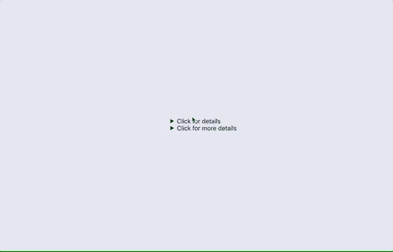
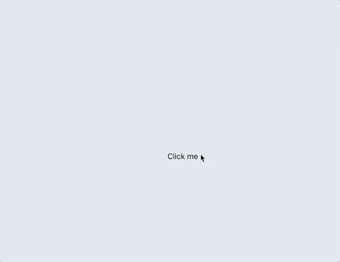
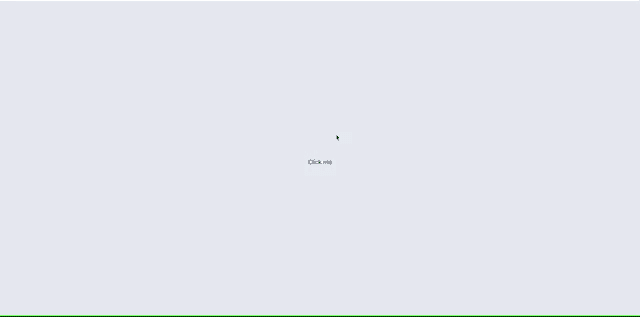
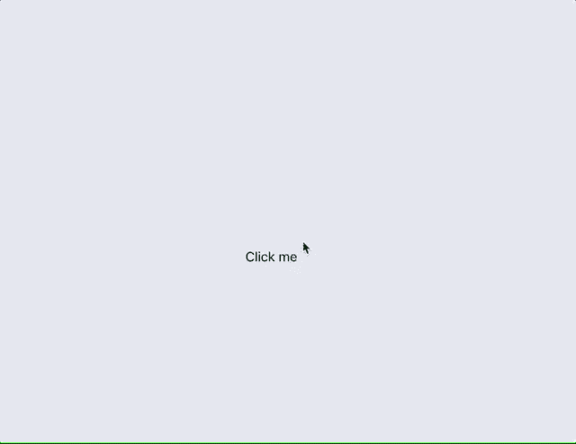

# 关注细节

> 原文：<https://medium.com/walmartglobaltech/paying-attention-to-details-eb0c43d0b02b?source=collection_archive---------3----------------------->


Photo by [Florian Olivo](https://unsplash.com/@rxspawn?utm_source=medium&utm_medium=referral) on [Unsplash](https://unsplash.com?utm_source=medium&utm_medium=referral)

我不得不构建和使用的最常见的 UI 组件之一，似乎是每天都在使用的，是一个在一些用户交互(如单击或点击)后内容显示在容器中的组件。

用于实现这种交互的一些组件是

*   手风琴
*   工具提示
*   情态动词
*   遮掩

我在构建此类组件时遇到的一些常见问题是:

*   倾向于使用非语义的通用标签
*   我们需要强大的状态管理，尤其是在使用 React 处理所有可能的用例时。
*   纯粹的 CSS 解决方案有时不足以实现响应式设计，导致 JavaScript 膨胀。

## 输入<details>标签</details>

[HTML5 < details >](https://developer.mozilla.org/en-US/docs/Web/HTML/Element/details) 标签是实现这些组件的一个很好的解决方案。与< summary >标签配合使用，它可以用来快速构建显示和隐藏容器中内容的小部件。



Details in action

正如在示例中看到的，它可以开箱即用来实现一个简单的类似手风琴的模式。

然而，我们可以进一步增强 details 标签，并使用它为更广泛的用例制作更多的组件。

下面的例子使用 React，但是也可以使用普通的 JavaScript 轻松实现。

提示:对于这些例子，一定要添加一个移除细节箭头的 CSS 规则

```
details summary::-webkit-details-marker { display:none;}
```

## 情态的

我们可以使用

<details>和<summary>标签编写一个简单的组件，它将被调用为:</summary></details>

```
<Container launchText="Click me" content={<h2>Hello There!</h2>} />
```

该组件有两个支柱:

`launchText` —用户将通过点击或轻敲与之交互以显示内容的摘要的组件或文本。

`content` —要在容器中显示的组件或文本。

我们将添加一些样式在屏幕中央显示模态内容

结果:



正如我们所看到的，容器组件是最小的，更具描述性。这里唯一需要注意的是，为了关闭 details 标签，我们必须包含一个对 details DOM 节点的引用，并在单击关闭按钮时在其上设置`open=false`。

我们可以进一步扩展这个概念，创建一个完整的页面覆盖

## 覆盖物

要创建全页面模式覆盖，请将三个样式规则更改为:

结果:



## 工具提示

<details>也可以用来创建工具提示或弹出按钮。我们需要做的只是添加一些样式和伪元素。</details>

结果:



正如我们所见，

<details>& <summary>标签提供了一个清晰的接口来构建一些常见的 UI 组件。</summary></details>

使用

<details>标签有一些注意事项，比如:</details>

*   浏览器兼容性:根据[can use](https://caniuse.com/#search=details)，87%的桌面浏览器和 96%的移动浏览器支持细节标签。如果你支持 IE11 & Edge，这可能不是一个理想的解决方案，但对于移动体验会很有用。
*   直接 DOM 访问:正如我们在示例中看到的，我们需要访问 DOM 节点来删除`open`属性。直接访问 DOM 可能是一个缺点，尤其是在使用 React 这样的框架时，但是我会测试各种用例，并在放弃这种方法之前分析组件的性能。

现在你知道了。创建语义一致的 UI 元素来隐藏和显示内容的简单方法。只要记得盯着

<details>😉</details>