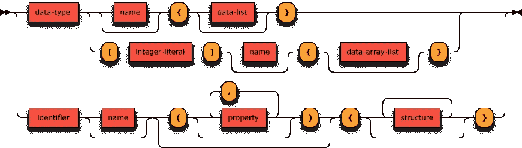
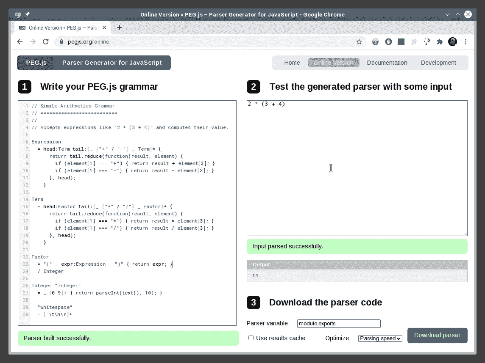

# 专注于计算 JavaScript 中的表达式

> 原文：<https://medium.com/globant/peg-away-at-evaluating-expressions-in-javascript-15159511fa97?source=collection_archive---------0----------------------->

通过使用解析表达式语法，以简单而强大的方式安全地评估 JavaScript 中的表达式


最近，在我从事的一个前端项目中，客户需要能够通过输入使用数字、变量和函数的公式来定义计算。问题是:如何验证和(安全地)评估这样的表达式？

如果你想让用户编写纯 JavaScript 代码(这不是一个非常友好的解决方案，除非用户是开发人员……)，你可以使用`eval()` [函数](https://developer.mozilla.org/en-US/docs/Web/JavaScript/Reference/Global_Objects/eval)，但这可能会允许用户输入*任何* JavaScript 代码——这可能会破坏应用程序，或者创建一个[安全漏洞](https://en.wikipedia.org/wiki/Code_injection)！

在本文中，我们将看到如何使用解析表达式语法(PEG)来轻松地允许我们定义自己的表达式语言，并且我们将看到它的完整 JavaScript 实现。

# 定义我们的目标

让我们从定义我们想要达到的目标开始。如上所述，允许用户输入纯 JavaScript 代码，用`eval()`评估，并不能真正削减它——不友好(用户不是开发者！)而且，此外，容易有风险。

由于网站的大多数(如果不是全部)用户都熟悉 [Excel](https://support.microsoft.com/en-us/office/overview-of-formulas-in-excel-ecfdc708-9162-49e8-b993-c311f47ca173) ，所以决定使用这种风格的公式，并根据用户的实际需要提供一组函数。然后，我们应该接受如下公式——注意，最初的等号是 Excel 中的标准符号，所以我也需要它:

*   简单算术:`=(1+2)/3`
*   变量:`=SPEED*TIME`
*   数学函数:`=POWER(1+INTEREST/100, MONTHS)`
*   逻辑表达式:`=IF(DAYS>0, DAILY_FEE*DAYS, 0)`

让我们看看如何建立这个！

# 定义和识别语法

我们在这里写的是一种表达式语言——那么语言通常是如何定义的呢？一些常见的工具(其中包括)是[上下文无关文法](https://en.wikipedia.org/wiki/Context-free_grammar)(CFG)[扩展的巴科斯诺尔形式](https://en.wikipedia.org/wiki/Extended_Backus%E2%80%93Naur_form) (EBNF)，甚至[铁路图](https://en.wikipedia.org/wiki/Syntax_diagram)。



A sample railroad diagram for [OpenDDL](http://openddl.org/)

为一种语言编写编译器或解释器通常需要首先编写一个*扫描器*或*标记器*(它将读取输入语言并将其分成标记，如操作符或变量名)，然后是一个解析器和解释器(它将检查输入是否满足语法规则，然后正确地评估它)。

有很多工具可以用来编写编译器和解释器，但是我决定使用 [PEG.js](https://pegjs.org/) ，因为它可以简化编码。PEG 代表*解析表达式语法*，让你用一个工具定义要处理的语言的语法，以及如何评估它。更好的是，它有一个[在线页面](https://pegjs.org/online)，你可以在其中输入一个 PEG 并以一种非常简单的方式尝试:这对开发帮助很大！



PEG.js provides an [online environment](https://pegjs.org/online) that allows faster and simpler development

安装 PEG.js 相当简单；只需遵循网上找到的简短说明。之后，您必须为您的语言编写语法，然后使用`peg.js`生成一个 JavaScript 文件，该文件将解析和评估表达式。在我的例子中，需要的命令如下:

```
./node_modules/pegjs/bin/peg.js article.pegjs -f commonjs
```

运行这个命令将读取源文件(`article.pegjs`)并产生一个名称相似的输出文件(`article.js`)，由于有了`-f commonjs`参数，它适合与 Node.js 一起使用。在浏览器中，你可以用`-f es`来代替。为了以防万一，看看所有的 [CLI 选项](https://github.com/pegjs/pegjs/blob/master/docs/guides/command-line.md)。

生成 JavaScript 文件后，您可以如下使用它。

为了解析(在我们的例子中，是评估)一个字符串，您必须仅仅`require(...)`(对于浏览器是`import`)生成的 JavaScript 文件，并调用它的`parse(...)`方法。你可以传递一个额外的带有变量值的 options 对象，就像我在这里做的那样，当你计算表达式时，这些变量将是可用的，我们将在下面看到。

# 识别数字

让我们从下往上开始，看看什么是数字，以及如何使用它们。识别数字并不太难，但是对于实数和整数，我们需要两个不同的规则。

很明显，规则似乎与数字有关，但是下划线是怎么回事，为什么它们无处不在？使用 PEG，我们没有单独的输入扫描器，所以如果我们想允许(但忽略)额外的空白，我们必须自己做。最后一行的规则定义了空白:零个或多个空格、制表符、换行符或回车符。(一些怪异的符号，像方括号、`+` 和`*`，是[正则表达式](https://en.wikipedia.org/wiki/Regular_expression)的一部分；它们的用法在 PEG 中很常见。)我们必须在任何我们希望用户能够输入空白的地方都包含`_`符号。

> 在 PEG 中，数字规则的顺序非常重要:在我们的例子中，如果我们颠倒这两个规则的顺序，带句点的数字将被理解为整数(因为第一个规则是完全匹配的)，而不是实数。

现在让我们来看看如何解释数字。在第一种情况下，我们得到一个包含三个元素的数组，它的第一个和第三个元素本身就是数组，具有匹配的数字。例如，当解析 22.0960 时，数字会是`[["2", "2"], ".", ["0", "9", "6", "0"]]`，所以应用`flat()`会将数组转换为`["2", "2", ".", "0", "9", "6", "0"]`，然后将它们连接起来，成为`"22.0960"`，其求值最终会产生等价的数字。对于整数我们不需要展平，所以逻辑更简单。

> 每个语法规则后面的 JavaScript 代码定义了当输入文本匹配相应的模式时将返回什么值。对于数字，我们只返回等值；对于更复杂的表达式，返回值将取决于相关子表达式的单个值。

我们还没有看到如何*使用*数字(只是如何识别和评估它们),但让我们先看看如何处理变量，然后我们将返回到在表达式中使用两者。

# 包括变量

现在我们知道了如何处理数字，让我们添加变量。让我们定义变量名将使用小写字母、数字和下划线。识别变量并不困难；我们再次使用正则表达式。

正如我前面提到的，当您使用您生成的 JavaScript 解析器时，您可以向它传递一个`options`对象。在我们的例子中，我传递了一个带有`values`属性的对象，它本身是一个带有我想要共享的变量的对象。所以，我们需要做的是将变量名称中的字符连接在一起，然后在`options.values`中访问相应的属性；简单！

我们现在有了一种既能识别数字又能识别变量的方法；我们如何在表达式中使用它？那是我们必须处理的下一个项目。

# 做基本算术

如何用语法定义算术运算是一个众所周知的课题。这里的关键问题是组织语法，以便正确处理运算符优先级。基本模式如下，将根据通常的 [PEMDAS](https://en.wikipedia.org/wiki/Order_of_operations) 规则计算涉及加、减、乘、除和取幂的表达式。

让我们一条一条来。第一个，`EXCEL`，将是我们语法的入口点(初始符号):公式以等号开始，后面是表达式。我们将暂时跳过下一行(关于`EXPR`的那一行),但是我们很快会回来的！

> 我们再次在所有允许空格的地方加上了下划线。

以下三个规则(用于`EXP_AS`、`EXP_PD`和`EXP_X`)正确地应用了操作符优先级，确保 1+2*3 将被计算为 7，而不是 9。我想使用 mnemotecnic 名称来表示操作的符号(所以`EXP_AS`是因为“AS”=“加法/减法”)，但是我也想使用`EXPR`来表示表达式，这就是为什么我添加了`EXPR = EXP_AS`规则，这碰巧节省了我很多时间，正如我们将看到的！

> 对于所有一元和二元运算符，计算值取决于表达式中单个术语的先前计算值。

最后，什么是`VALUE`？第一个规则允许前导减号，所以你可以写`-2`，例如。第二个规则提供了括号，最后两个规则表明，如果数字或变量被识别，则使用它们的值。

# 添加数学函数

让我们添加一些数学函数！用户希望拥有他们已经习惯的功能，如`ROUND()`或`POWER()`。为了添加它们，我们必须修改`VALUE`的语法。

> `"POWER"i"`末尾的`i`意味着大写和小写字符将被认为是相等的，因此用户可以键入`POWER(...)`或`power(...)`或任何其他类似的方式。

我还包括了一些对数函数，我们可以很容易地添加更多的函数。为了简洁，我使用了几个辅助函数，定义在代码的顶部。

我们现在有了算术表达式，包括函数调用——但是能够使用逻辑函数(如`IF()`或`AND()`)和比较运算符被认为是非常重要的；让我们添加那些。

# 允许逻辑表达式

逻辑函数在概念上与数学函数非常相似，所以添加逻辑函数很容易也就不足为奇了。

增加的函数(`IF()`、`OR()`、`AND()`、`NOT()`、`FALSE()`、`TRUE()`)是大家熟知的 [Excel 逻辑函数](https://support.microsoft.com/en-us/office/logical-functions-reference-e093c192-278b-43f6-8c3a-b6ce299931f5)，经常使用。

我们也应该可以比较表达式，所以我们把这个加上吧……但是我们有一个问题:比较是在加减之后进行的，所以`a+b>c-d`应该求值为`(a+b)>(c-d)`。这意味着我必须修改 PEG，添加一个新的比较符号(`EXP_C`来匹配我们的命名标准)，这就是中间的`EXPR`符号有所回报的地方；变化很小。

有了这些函数，客户获得了计算所需的一切——即使后来需要一些额外的功能，它们也很容易被包含进来。

# 进一步试验

如果你做到了这一步，那么你可以开始给我们的表情添加更多的功能，这是我后来加入的一些功能列表:

*   使用`%`后缀表示百分比；`22%`应解释为 0.22
*   在`AND()`和`OR()`中允许多个术语，如`AND(a,b,c,d)`
*   添加字符串和与字符串相关的运算符(如`&`)和函数(如`CONCAT()`和`FIND()`)
*   用操作符和函数添加日期——像`"2020–09–22"`这样的字符串应该被解释为一个日期，并且您应该能够将一个数字添加到一个日期(并获得一个未来的日期)或者将两个日期相减以得到它们之间的天数。
*   除了单个变量，允许数组和矩阵。

不言而喻，您还可以添加更多的函数——而且在大多数情况下，Excel 函数可以用一两行 JavaScript 实现，所以没什么大问题。

# 总结

让我们用表达式计算器的完整代码来结束这篇文章；正如我们之前说过的，如果你愿意，你可以[在线](https://pegjs.org/online)测试它。我认为用不到 80 行代码编写这段代码已经很不错了——而且代码也很容易扩展！

我们在这里已经看到了使用 PEG 是如何轻松地为类似 Excel 的表达式实现解析器和求值器的。这只是触及了 PEG.js 所允许的表面，您还可以用它来处理更复杂的语法；我建议看一下文档，了解一下您可以处理的所有[表达式类型](https://pegjs.org/documentation#grammar-syntax-and-semantics-parsing-expression-types)。

总结一下:一个简短的，很好的解决难题的方法！

> D 不要错过我关于这个主题的第二篇文章，展示了对这里显示的代码的一些增强和修正。

# 阅读更多

在 PEG.js 自己的网站[上阅读所有关于 peg . js 的内容。](https://pegjs.org)

如果你对钉住汇率的理论基础感兴趣，你应该读一读布莱恩·福特 2004 年的原始论文。

最后，[理解 Roman Redziejowski 的 PEG](http://ceur-ws.org/Vol-1698/CS&P2016_01_Redziejowski_Trying-to-understand-PEG.pdf) ，可以帮助弥合 CFG 和 PEG 的经典解析之间的鸿沟。[一些](http://ceur-ws.org/Vol-1032/paper-33.pdf) [其他](https://citeseerx.ist.psu.edu/viewdoc/download?doi=10.1.1.416.7378&rep=rep1&type=pdf) [文章](https://www.researchgate.net/publication/262239402_From_EBNF_to_PEG/link/597845830f7e9b2777264725/download)由同一作者帮忙从 EBNF 搬到钉住。