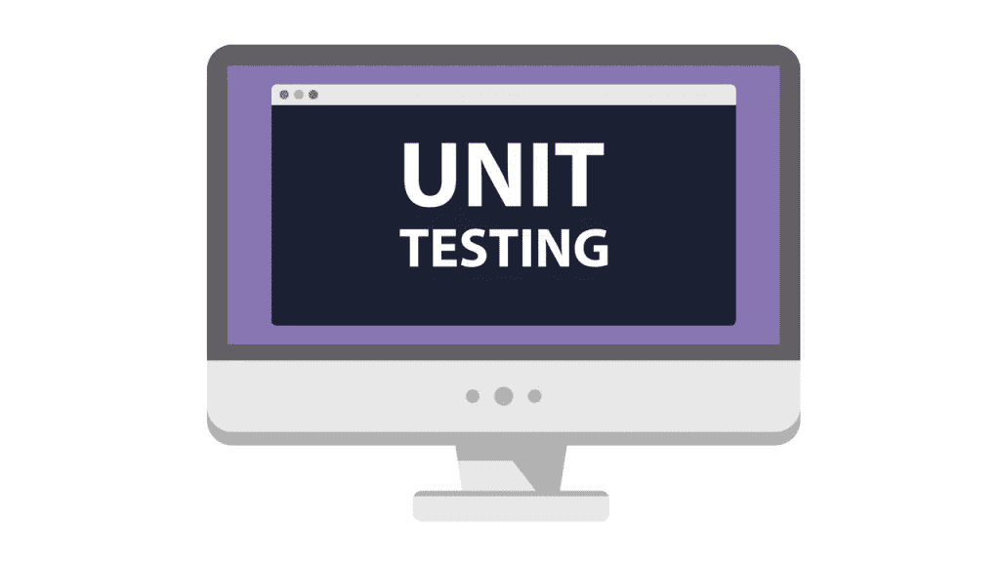
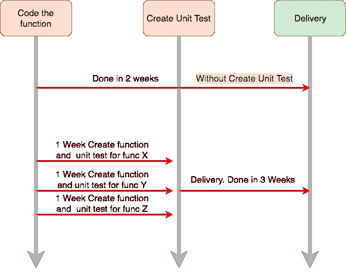
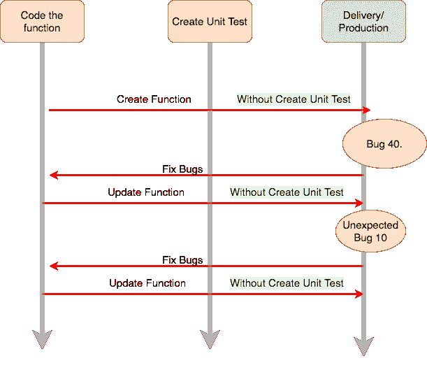
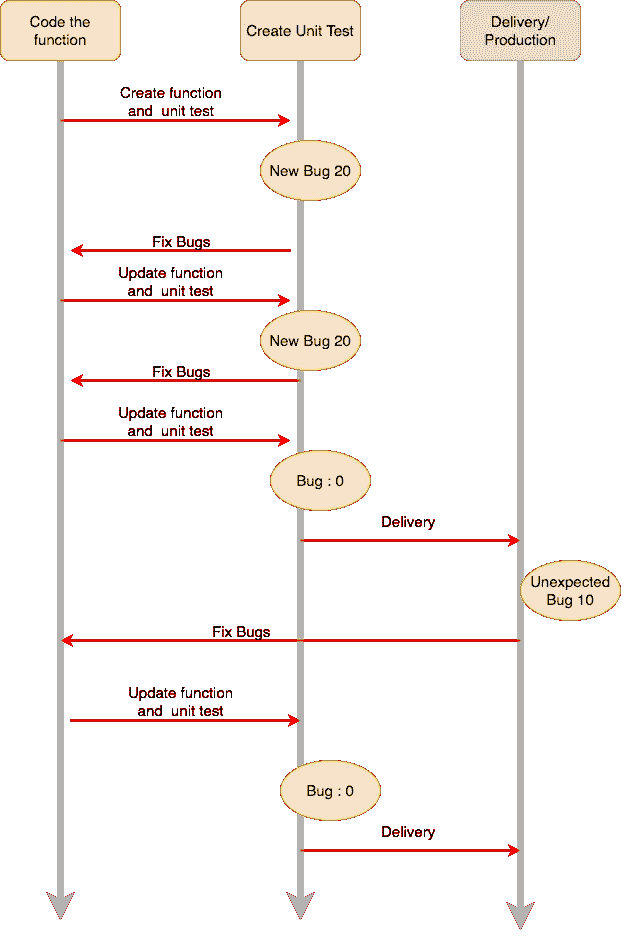

# Pendapatku Mengenai Unit Testing

> 原文：<https://medium.easyread.co/pendapatku-mengenai-unit-testing-1c08e036380a?source=collection_archive---------1----------------------->

## Ini adalah pendapatku mengenai Unit Testing pada Software Engineering



Unit Testing Images from Google

Coba kamu bayangkan, sekarang kamu sedang berada di dapur. Kamu akan membuat sebuah makanan ringan, misalnya *telur dadar* . Kemudian untuk membuat makanan tersebut, kamu pertama-tama akan menyiapkan peralatan yang akan digunakan, misalnya sebuah kompor, panci atau wajan, sendok goreng, dan pisau. Selain peralatan yang digunakan, kamu juga harus menyiapkan bahan-bahan yang diperlukan seperti telur, garam, minyak dan lain sebagainya.

*Nah* , lalu mari kita mulai membuatnya. Ketika kita membuat sebuah masakan, kita harus mengikuti langkah-langkah dan aturan yang ditetapkan dengan sesuai tanpa kurang satu hal pun. Misalnya langkah-langkah yang harus diikuti adalah sebagai berikut.

*   Pecahkan 2 buah telur ke dalam sebuah mangkuk. Pastikan telur yang akan digunakan dalam kondisi yang baik.
*   Kocok telur sekitar 10 menit
*   Bubuhkan garam dan lada sekitar **setengah sendok teh** (1sdt). Tidak kurang dan tidak lebih.
*   Panaskan wajan di kompor dengan suhu berkisar **60° C** lalu panaskan mentega atau minyak yang akan kamu gunakan. Tunggu selama **3 menit** .
*   Tuangkan telur yang sudah kamu kocok ke dalam wajan yang tadi, lalu tunggu selama **2 menit** .
*   Telur sudah siap untuk disajikan.

Ketika kamu mulai membuat masakan kamu tersebut, kamu akan terlebih dahulu melakukan hal-hal berikut.

*   Sebelum menuangkan telur ke dalam mangkuk, kamu akan memecahkan telur tersebut. **Jika kondisi telur tidak bagus** , kamu akan **menggantinya** dengan telur yang lain. Ini adalah hasil yang diharapkan.
*   Ketika kamu mengocok telurnya **kurang dari 1 menit** , telur **tidak akan menyatu** secara merata, lalu kamu akan mengocoknya kembali. Ini juga adalah hasil yang diharapkan.
*   Ketika kamu membubuhkan **2 sendok teh** garam atau lada ke dalam telur yang sudah dikocok, telur tersebut akan **sangat asin** . Jika telur keasinan, maka solusinya kamu akan **menambahkan telur lagi** untu mengurangi rasa asin. Ini adalah hasil yang diharapkan.
*   Ketika kamu memasaknya dengan **suhu lebih dari 100°C** , telur akan **hangus** dan **gosong** . Kamu harus **mengurangi** suhunya.

Semua hasil yang diharapkan sudah terpenuhi, sehingga ketika kamu melakukan semua langkah-langkah di atas, kamu telah selesai melakukan semua *test* terhadap setiap fungsi, langkah, *method* , dan unit yang ada. Jika nantinya terjadi kesalahan seperti kebanyakan garam, kamu sudah tahu bagaimana cara mengatasinya. Itulah yang dapat dijelaskan sebagai **Unit Testing** .

# Mencakup Setiap Standar Hasil Yang Diharapkan

Unit testing akan menuntun kamu untuk mendapatkan hasil yang diharapkan untuk setiap unit atau fungsi. Contohnya misalnya memasak telur dadar yang dijelaskan di atas. Kita sudah memiliki standard dari hasil yang diharapkan ketika memasak telur.

*Nah* , sekarang lupakan tentang memasak telur. Sekarang kita terapkan pada dunia pemograman. Misalnya kita memiliki sebuah fungsi sederhana dalam *Golang* .

```
func Login(username, password string) error{
 if len(password) < 6 {
   return NewErrNotValidPassword
 }
 user,err:= DB.getUserFromDB(username){
 if err != nil {
    return NewErrInternalServerError
  }if user == nil {
    return NewErrUserNotExist
  }if user.Password != password {
    return NewErrWrongPassword
  }

  // Login Successs
  return nil
}
```

Lalu kita memiliki unit test untuk fungsi di atas, seperti berikut.

```
func TestLoginSuccess(){
 username:="lolcats"
 password:= "youknowhoiam"mockDB:= new(mockDB)
 mockDB.On("getUserFromDB", username).ShouldReturn(user,nil)err:= Login(username,password)
 assert.NoError(err)
}func TestPasswordNotValid(){
 username:="lolcats"
 password:= "you" // Less than 6 char
 err:= Login(username,password)
 assert.Error(err)
 assert.Equal(err , NewErrNotValidPassword)
}func TestUserNotExist(){
 username:="tamvansek"
 password:= "youknowhoiam"mockDB:= new(mockDB)
 mockDB.On("getUserFromDB", username).
 ShouldReturn(nil,nil) // DB return emptyerr:= Login(username,password)
 assert.Error(err)
 assert.Equal(err , NewErrUserNotExist)
}func TestWrongPassword(){
 username:="lolcats"
 password:= "wrongPassword"mockDB:= new(mockDB)
 mockDB.On("getUserFromDB", username).ShouldReturn(user,nil)err:= Login(username,password)
 assert.NoError(err)
 assert.Equal(err,NewErrWrongPassword)}
```

Jika kamu melihat unit test yang sudah dibuat, kamu harus memahami apakah hasil yang diharapkan dari setiap fungsi. Misalnya, sebuah *password* harus terdiri dari minimal 6 karakter, jika kurang dari yang ditetapkan, maka akan terjadi *error* . Akan tetapi, jika test yang dilalui malah menghasilkan *no error found* , maka kamu harus mencari apa yang salah dalam *code* kamu.

# Menambahkan Waktu Dalam Proses Pengerjaan



Ketika mengerjakan unit test pada aplikasi kita, kita membutuhkan tambahan waktu. Karena kita harus membuat semua test atau percobaan kemungkinan dari setiap fungsi yang kita miliki. Selain membuat dan menambahkan proses *logic* pada aplikasi kita, kita memerlukan *ekstra job* untuk membuat test yang memenuhi semua kondisi. Dan hal ini akan lebih lama jika kita menggunakan metode pendekatan **TDD (Test Driven Development)** .

# Mengurangi Error/Bug Pada Tahap Prodcution

Ketika kamu membuat aplikasi kamu tanpa menambahkan unit testing, tentu saja kamu dapat merilis aplikasi kamu lebih cepat, akan tetapi pengguna akan lebih mudah menemukan *error* dari aplikasi yang kamu bangun.



Bandingkan jika kamu memiliki unit test.



Ketika kamu membuat aplikasi tanpa test, pengguna kamu dapat menemukan 50 *bugs* . Hal tersebut dapat membuat pengguna menjadi kesal, marah dan tidak menyukai aplikasi yang kamu bangun. Bandingkan jika kamu memiliki unit test, *bugs* yang sebelumnya dapat ditemukan oleh pengguna kamu, sudah kamu atasi dan pengguna kamu hanya akan menemukan 10 *bugs.* Atau tentu saja dapat disimpulkan, aplikasi kamu lebih dipercaya untuk dirilis ke pengguna.

Seperti saat kamu memasak telur dadar. Bayangkan jika kamu memasak 50 buah telur dadar dengan 100 buah telur, lalu dari telur-telur yang kamu pakai, terdapat 1 buah telur dalam kondisi yang tidak baik. Lalu kamu tetap memasaknya tanpa memperhatikan kondisi telur, dan kamu tidak melakukan langkah-langkah yang sesuai. Kamu hanya mencampurkan semua telur dan ketika kamu selesai memasaknya, dan menyajikan ke orang-orang. Bayangkan apa yang akan mereka katakan tentang telur dadar buatan kamu?

# Kesimpulan

Unit testing merupakan hal bagus, yang akan meningkatkan kualitas produk kamu. Di perusahaan saya sekarang, ketika seseorang membuat fitur baru, ia diharuskan untuk menambahkan unit test pada setiap fungsinya.

*Yah* , meskipun terkadang membosankan untuk mengerjakannya. Rasanya seperti menambahkan unit test pada setiap fungsi adalah kerjaan baru yang harus diselesaikan.

Pernah suatu hari, saya sangat senang karena fungsi yang saya kerjakan sudah selesai. Asumsi saya fungsi tersebut akan berjalan dengan baik. Tetapi meskipun fungsinya berjalan dengan baik, pada akhirnya saya tetap harus menambahkan unit test pada fungsi yang saya buat dan harus mencakup semua kemungkinan yang ada dalam fungsi tersebut. Kemudian, saya merasa ***“WTF. What a climax killer*** , ***Damn. So, boring*** *”.*

Akan tetapi hal tersebut pada akhirnya meningkatkan rasa percaya diri saya pada apa yang saya kerjakan. Dan selanjutnya saya akan lebih fokus pada hal lainnya seperti *integration* *test* dengan *real database* dan *services.*

*Nah* , jadi unit testing merupakan salah satu hal yang penting dilakukan, akan tetapi masih banyak lagi jenis testing yang perlu ada pada aplikasi kamu, misalnya *integration testing* , *end to end testing* , *load testing* dan lain sebagainya. Jadi untuk lebih meyakinkan pengguna dengan aplikasi kamu, lebih baik kamu mulai menambahkan testing pada aplikasi kamu. **Selamat mencoba** 😄

***Translated into Bahasa Indonesia, originally written by*** [***Iman Tumorang***](https://medium.com/u/ef42567fbbae?source=post_page-----1c08e036380a--------------------------------) ***at*** [***https://hackernoon.com/my-honest-opinion-about-unit-testing-84eee5e893ad***](https://hackernoon.com/my-honest-opinion-about-unit-testing-84eee5e893ad)

如果你认为这本书值得一读，给我一个👏
也在你的 twitter、facebook 等网站上分享，这样其他人也可以阅读。