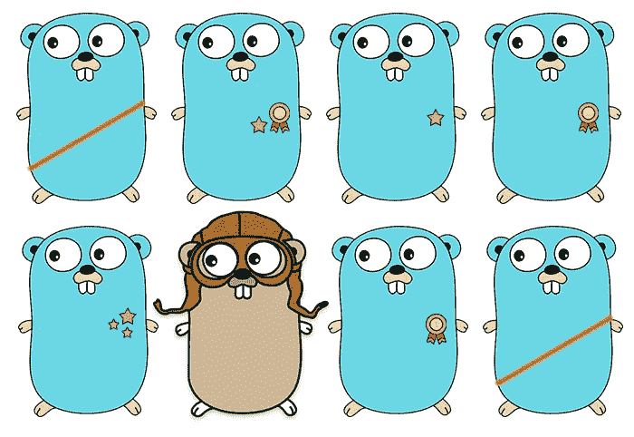

# Pengalaman Saya Belajar Golang

> 原文：<https://medium.easyread.co/pengalaman-saya-belajar-golang-94478b98331d?source=collection_archive---------0----------------------->

golang

Haloo, selamat malam! Ini adalah tulisan pertama saya di medium, di tulisan kali ini saya mau *share* perjalanan saya belajar *Golang* . Mungkin bisa ditiru teman-teman bagi yang baru mulai atau akan mulai belajar *Golang* .

Sekitar 6 bulan yang lalu awalnya saya berkenalan dengan *Golang. S* ebenernya mendengar nama *Golang* sendiri itu sekitar tahun 2015, namun waktu itu saya tidak ada niat untuk mempelajari bahkan mencari tahu sedikit saja mengenai *Golang* juga tidak ada. Tetapi sekarang sudah 5 bulan terakhi ini, saya melewati masa-masa dengan si *Golang* , sehingga beberapa teman saya mulai menyebut saya “ *Golang Boy* ”.

Sebenarnya saya memulai belajar *Golang* ketika lulus SMK sekitar bulan April 2018\. Persiapan waktu itu adalah saya mencoba mendownload video “ *Membuat Rest API dengan Golang* ” *,* yang mana video ini sampai saat ini belum pernah saya lihat isinya, jadi hanya didownload saja. Awalnya saya mempelajari *Golang* karena tuntutan pekerjaan saja, kebetulan *startup* tempat saya bekerja, yang awalnya hanya *remote* meminta saya untuk *onsite* setelah lulus. Ketika *remote,* teknologi yang saya kerjakan menggunakan PHP, namun ketika lulus saya disuruh untuk belajar *Golang.* Bahkan ketika saya sedang belajar *Golang,* ada kabar lagi kalau calon tempat saya bekerja akan berpindah teknologi ke Node.JS dan kebetulan waktu itu saya udah lumayan bisa, jadi saya berhenti mempelajari *Golang* .

Setelah saya lulus, saya melanjutkan kerja di *startup* tempat saya *remote* dahulu. Namun di hari kedua saya bekerja ada kabar mengejutkan. *Startup* yang jadi tempat saya bekerja memutuskan berhenti. Beruntungnya saya tidak jadi pengangguran karena saya dan salah satu *founder* *startup* ini berpindah ke *startup* lain, dimana nantinya saya menjadi *backend engineer* dan beliau menjadi CTO di *startup* baru ini.

Tempat kerja saya yang baru ini berfokus di [*network monitoring*](https://ketitik.com/) dimana di tempat inilah saya belajar sekaligus mempraktekan langsung. Oke, mungkin terlalu banyak basa-basinya berikut rangkuman step-step saya belajar golang

## Belajar dari [Tour Of Go](https://tour.golang.org)

Hal yang saya lakukan ketika mengenal bahasa baru adalah dengan belajar sintaksnya terlebih dahulu. *Golang* mempunyai fasilitas yang cukup menarik dan sudah runtut dimana ada halaman *tour golang* yang akan membawamu berkeliling berkenalan dengan sintaks-sintaks golang. Kesan pertama *sih* tidak begitu kaget dengan sintaksnya karena malah dimudahkan, karena di *Golang* tidak ada semicolon bisa dan pernyataan if juga tanpa tanda “( )”. *Golang* itu dibuat dan dikemas menyerupai bahasa C dan kebetulan di SMK diajarkan bahasa C untuk pemrograman dasar jadi saya cukup cepat memahami sintaks *Golang.* Kurang lebih 1 hari saya selesai menjalankan tour of Go.

## Belajar membuat Rest API

Mungkin sebagian besar saat ini membuat Rest API itu seperti suatu pengenalan untuk mengenal suatu bahasa. Sebenarnya karena untuk kebutuhan kerja juga jadi saya memutuskan membuat suatu mini *project* APi CRUD. Ketika belajar Rest API dengan *golang,* saya sarankan membuat dengan seVanila mungkin atau sepolos mungkin jangan [menggunakan framework,](https://medium.com/code-zen/why-i-don-t-use-go-web-frameworks-1087e1facfa4) karena *native* *Golang* sudah sebagian besar menyediakan. Kalau terpaksa menggunakan ya boleh saja *sih.*

Rest API yang saya bangun, untuk router saya menggunakan [Gorilla Mux](http://gorillatoolkit.org/pkg/mux) . Waktu itu *database* yang saya gunakan adalah MongoDB sehingga saya memakai *package driver* dari mgo/bson, tetapi untuk sekarang *driver* tersebut sudah unmaintained dan MongoDB sudah membuat driver resminya. Jadi ketika sekarang belajar bisa mencoba menggunakan yang terbaru. Jika kalian menggunakan *database* yang berbasis SQL, saya sarakan menggunakan db/sql.

## Belajar Meningkatkan Kualitas Kode dan Testing

Setelah saya bisa membuat Rest API dan mulai berkontribusi untuk membuat *tools network monitoring* di tempat kerja, saya kira belajar saya berhenti sampai disitu, ternyata tidak. Saya merasakan bahwa dunia IT khususnya di *software development* begitu luas. Dimana saya dikenalkan dengan *unit testing, tdd, design pattern, linting, CI/CD, microservices* dll. Dalam belajar *Golang* saya sarankan untuk belajar *pattern* dan juga *testing.* Kedua ini sangat berkaitan. Jujur ketika saya mempelajari dua hal ini, cukup pusing bagi saya untuk memahaminya. Ada referensi buku yang cukup jelas ketika kalian belajar *pattern* dan *testing* . Buku ini juga mengenalkan ***TDD(Test Driven Development).***

referensi ebook yang bagus untuk belajar golang

Buku itu awalnya sayatemukan gratis di *packtpub.* Namun ternyada ada 2 *chapter* yang tidak ada di versi gratisnya. Jadi saya memutuskan untuk meminta bos saya untuk membelinya wkwk. Jadinya dibelilah buku itu tersebut seharga kurang lebih 600 ribu. Buku ini cukup bagus untuk meningkatkan kualitas koding kita serta belajar menulis program *Golang* sesuai kaidah yang diberikan. Memang perlu waktu dan pemahaman ekstra untuk mempelajarinya namun semua itu akan indah ketika sudah bisa hehe :D

## Terus Ngoding!!! Dan Cari Case Baru

Yaaa, terus ngoding akan membuatmu cepat menyelesaikan masalah-masalah dalam membangun software. Terus ngoding akan melatih cara berpikirmu untuk menyelesaikan masalah dengan *Golang.* Jangan terfokus terhadap masalah yang sama terus, carilah *case* baru. Kalau saya ketika kerjaan kelar dan casenya sama, biasanya saya mencari case baru untuk mengerjakan soal-soal logika, atau soal-soal di hackerrank. Karena selain melatih kemampuan ngoding juga akan melatih otak kamu.

## Kalo Bisa Cari Guru atau Teman yang Sudah Mahir

Ada pepatah yang mengatakan jikalau kita berteman dengan penjual parfurm maka kita akan mendapat seminimal mungkin adalah bau wangi parfurmnya. *Nah* dengan punya teman atau kenalan yang sudah mahir tentunya kamu akan dibimbing dalam belajar serta dimudahkan juga. Karena belajar otodidak juga lumayan sulit, serta biasanya case-case baru akan selalu datang.

Jadi kurang lebih tulisan diatas merupakan pengalaman saat saya terjun ke golang. *Alhamdulillah,* saat ini saya sudah bisa menerapkan TDD, dan *pattern.* Saya sangat berterimakasih kepada [tempat kerja saya](http://ketitik.com) saat ini karena banyak sekali *case* dan ilmu baru yang saya dapat [disini](http://ketitik.com) . Jadi buat teman-teman yang sedang belajar *Golang* atau akan belajar *Golang* semoga beberapa gambaran diatas bisa sedikit mencerahkan.

Terimakasih 😃