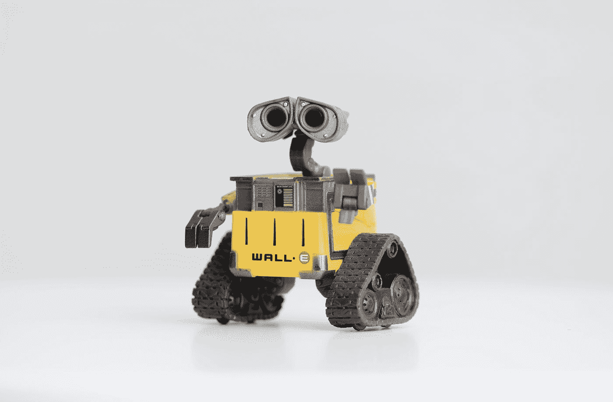

# Pentingnya 1:1 yang Rutin untuk Tim yang Lebih Sehat

> 原文：<https://medium.easyread.co/pentingnya-1-1-yang-rutin-untuk-tim-yang-lebih-sehat-7513214b34ed?source=collection_archive---------0----------------------->

## Alasan kenapa kamu harus mulai menerapkan 1:1 secara rutin ditempatmu bekerja, khususnya buat kamu software engineer.

Photo by [Charles Deluvio](https://unsplash.com/@charlesdeluvio?utm_source=medium&utm_medium=referral) on [Unsplash](https://unsplash.com?utm_source=medium&utm_medium=referral)

Hi, Iman disini, kembali lagi dengan saya yang sudah cukup lama tidak menulis tulisan berbahasa Indonesia 😄.

Dikarenakan wabah pandemi Covid-19 yang belum kunjung reda, hal ini menjadi salah satu alasan saya untuk menulis lagi di Medium. Kegelisahan dan rasa khawatir dengan keadaan sekitar, negara, dan manusia, sepertinya tidak akan mengubah keadaan. Pada akhirnya, di ruangan kecil ini, hanya ada saya seorang dengan pikiran saya.

*Nah* , di kesempatan ini, saya ingin mencoba menulis satu topik yang ringan dan sederhana tetapi masih tetap berkaitan dengan *Software Engineering,* yaitu tentang ***pentingnya 1:1 rutin kepada atasan kita.***

Yap, **1:1 ( *one on one* )** , atau sering disebut juga 4 mata, antara pihak A, dan pihak B.

Di dunia pekerjaan sendiri, sebenarnya 1:1 bukanlah hal yang terbilang baru. Sudah cukup banyak orang/perusahaan yang melakukannya. Biasanya diskusi 1:1 merupakan saat dimana terdapat 2 pihak yang terlibat, dan berdiskusi dalam menyelesaikan masalah atau sekedar berbagi cerita. Topik yang dibahas di dalam 1:1 tersebut tidak selalu berhubungan dengan pekerjaan yang sedang dikerjakan tetapi bisa juga mengenai karir, masalah tim dan kerjasama, bahkan masalah pribadi, dsb.

Di dunia *software engineering* sendiri, 1:1 biasanya terjadi antara pegawai (salah satu tim *engineer* ) dengan atasannya ( *techlead* atau pun *manager* ). *Nah* , umumnya *sih,* para *engineer* melakukan 1:1 ke atasan pada edisi tertentu ( *special* ), misalnya ketika *performance review* , atau ketika mau *resign* . *koreksi jika saya salah hehe 😏.

Hal ini saya sebutkan berdasarkan pengalaman pribadi saya. Saya sendiri sudah 3 kali pindah perusahaan, 2 perusahaan pertama, persis seperti yang saya sebutkan di atas. Jadi biasanya kita akan ada sesi 1:1, hanya ketika mendekati *performance review* atau ketika hendak pamit *resign* , atau ketika ada masalah berat terkait pekerjaan, dan ingin meringankan beban saja sehingga hendak bertanya ke atasan untuk mendapatkan solusi. Tetapi, tak jarang juga ketika saya lagi pusing, dan ada masalah, saya akan memilih untuk memendam saja, hingga akhirnya saya tumpuk, dan hal tersebut menjadi pemicu untuk “ *melirik rumput tetangg* a”.

> “Awalnya sih coba coba, eh malah lulus test dan dapat offer”.

Apakah sekilas hal tersebut pernah kejadian juga tidak pada teman-teman sekalian? 😏

Jadi kenapa *sih* , 1:1 yang rutin penting dan perlu dilakukan di dalam sebuah perusahaan?

# 1:1 yang Rutin dapat Meningkatkan Velocity Tim

Mungkin sebagai *software engineer, meeting* sana-sini pastinya cukup membuang waktu, ditambah kita memiliki banyak *task* yang menumpuk. Jadi mendengar kata 1:1 mungkin yang terbesit ialah bahwa akan ada *meeting* lainnya yang bersifat membuang-buang waktu.

*Well* , memang secara sekilas *sih,* bisa jadi begitu karena biasanya setiap orang merasa, 1:1 hanya dilakukan ketika terjadi hal penting saja. Kalau tidak penting, untuk apa menghabiskan waktu? Karena waktu tersebut bisa kita gunakan untuk menyelesaikan pekerjaan lainnya.

Photo by [Marius Haakestad](https://unsplash.com/@mariushaak?utm_source=medium&utm_medium=referral) on [Unsplash](https://unsplash.com?utm_source=medium&utm_medium=referral)

Tetapi, kita bukan lah robot, *software engineer* juga seorang manusia, yang punya hati dan emosi. Ada disaat-saat kita jenuh akan pekerjaan, atau ada disaat-saat masalah kecil, masalah sepele saja, ternyata tanpa kita sadari dapat mempengaruhi emosi dan perilaku kita. Saat emosi dan perilaku tidak stabil, tentunya akan berdampak pada produktivitas kita yang membutuhkan konsentrasi tinggi karena berkutat dengan kodingan dan logika

Saya kasih contoh saja dari saya sendiri. Beberapa bulan yang lalu, saya merasa sangat jenuh dengan pekerjaan saya. Saya harus menyelesaikan pekerjaan saya tepat waktu, tepatnya pada akhir Mei kemaren, dimana pekerjaan tersebut mulai saya kerjakan dari awal April. Dan pekerjaan tersebut dapat terbilang besar.

Meski demikian, saya selalu ada sesi 1:1 dengan beberapa orang, diantaranya *Techlead* , lalu *Product Manager* , dan *Engineering Manager* . Dan sesi 1:1 tersebut saya lakukan setiap 2 minggu sekali secara rutin.

*Nah,* hal apa saja yang saya bicarakan di sesi 1:1 tersebut?

*   **Ke *Techlead* , saya biasanya bicara tentang kehidupan saya.** Selanjutnya dia akan menanggapi saya, seperti bertanya tentang pandemi yang kita alami saat ini. Pertanyaan seperti *apakah saya sendiri, butuh teman,* dan sebagainya akan ia tanyakan. Kami tidak membahas tentang pekerjaan, karena pekerjaan sudah ada *meeting* tersendiri di *daily standup* , atau *sprint planning* . Kalau saya bilang saya butuh teman untuk berbicara, dia pun akan membuat game session bersama teman-teman lainnya secara rutin, dimana kita akan bermain game online di sore hari. Dan ini sangat membuat saya merasa lebih *fresh* dan kembali termotivasi untuk bekerja meski dibawah tekanan pandemi dan deadline.
*   **Ke *Product Manager* , saya bicara tentang *roadmap* , *north star project* yang sedang kita kerjakan** **ini, mimpi besar yang akan kita capai dimasa depan ketika produk ini sudah rilis.** Topik ini membuat saya masih *keep on track* , tetap fokus pada tujuan akhir, dan tidak kehilangan arah. Terkadang juga saya dan PM berbicara tentang game, atau tentang wanita :D. Bahkan PM saya ikut bermain dota dengan saya ketika sedang *party* bermain dota. Tetapi yang pasti sih, setiap 1:1 kita selalu wajib bahas north star roadmap kita.
*   **Ke *Engineering Manager* , saya curhat tentang blocker.** Misalnya saya butuh di *unblock* agar tim infra memprioritaskan project kami di server terlebih dahulu. Atau kadang saya curhat tentang ***career* *path*** saya, apa yang harus saya lakukan agar saya bisa naik ke level selanjutnya. Atau kadang jika tidak ada topik menarik, kami juga membahas tentang kehidupan, sebuah topik yang berat tentunya, tapi saya tetap enjoy. karena saya menjadi lebih dekat dengan *Engineering Manager* saya.

Sadar ataupun tidak sadar, semua kegiatan sesi 1:1 diatas membuat saya tetap termotivasi dan produktif. Tidak hanya saya, tetapi keseluruhan tim pun merasakan hal yang sama. Dan ini malah menigkatkan kecepatan atau *velocity* kita bekerja.

Saya tidak bisa bayangkan bagaimana kalau kami tidak ada 1:1 rutin, mengingat beban pekerjaan yang saya emban sangat tidak normal dibandingkan pekerjaan-pekerjaan saya sebelumnya. Pastinya saya stress sendiri, merasa dituntut berlebihan, dan pada akhirnya melirik lirik rumput tetangga 😏.

# 1:1 yang Rutin Membantu Fokus pada Goals

Selain tentang menjaga emosi dan menyelesaikan masalah, saat 1:1 juga waktu yang tepat untuk membahas *goals* dari kita “ *seorang* *engineer* ”, baik itu OKR/KPI dari tim atau personal.

Photo by [Ales Krivec](https://unsplash.com/@aleskrivec?utm_source=medium&utm_medium=referral) on [Unsplash](https://unsplash.com?utm_source=medium&utm_medium=referral)

Saya ingat beberapa bulan lalu, setiap 1:1 dengan *Engineering Manager* , dia pasti bertanya tentang *goals* saya personal. Saat itu saya menjawab, saya ingin sekali saja menjadi pembicara di acara meetup komunitas.

1 minggu berselang dari sesi 1:1 tersebut, beliau langsung mencari event di komunitas, lalu meminta tim PR( *Public Relations* ) dan Marketing kantor untuk menghubungi komunitas tersebut agar melakukan *meetup* di kantor kita, dan saat itu juga, saya pun di minta menjadi *speaker* di event tersebut. Kesempatan tersebut akhirnya menjadi kejadian tidak terlupkan, dimana saya pertama kalinya berbicara di sebuah *meetup* komunitas.

Dan dari situ, saya pun makin merasa kagum pada manager saya, bagaimana dia peduli dengan *personal growth* dan *personal goals* saya. Dan tentu saja ini bisa terjadi karena kita sering 1:1\. Ini tidak terjadi dalam satu malam, karena buat saya yang pemalu, butuh banyak waktu agar saya berani berbicara dengan manager terutama tentang *personal goals* saya. Namun karena kami sudah sering 1:1, saya pun merasa terbiasa dan mulai berani mengungkapkan hal tersebut ke manager saya.

Hal yang penting disini adalah tentunya bukan hanya 1:1 rutin saja, tetapi juga merupakan ***action item*** yang kita simpulkan di sesi 1:1 tersebut dan dengan melakukannya rutin, kita akan tetap fokus pada *action item* sampai *goals* tercapai.

Saya juga pernah mengalami di kantor lama dulu, 1:1 dengan atasan, saya mengatakan ingin melatih *skill* saya dan saya ingin ini itu, dsb. Tetapi sesi 1:1 itu hanya kami lakukan sekali saja. Sang atasan hanya membuat catatan, lalu mengatakan akan mengusahakannya nanti. Tetapi karena beliau sibuk, sampai saya *resign* , semua yang dia janjikan tidak ada yang terjadi. Itulah mengapa 1:1 yang rutin dapat mengatasi ini.

Dengan 1:1 rutin, kita dapat tetap mengingatkan *action item* yang belum kita laksanakan, sehingga tidak kelupaan dengan sibuknya pekerjaan. *Personal goals* atau personal OKR/KPI dapat kita *track* disetiap sesi 1:1\. Sehingga kita sebagai individu akan terus berkembang. Dan jika setiap individu dalam tim berkembang, tentunya akan membawa *impact* yang besar terhadap tim. Dan jika semua tim memberikan *impact* , maka perusahaan tersebut akan menjadi kantor yang menyenangkan untuk bekerja.

# 1:1 yang Rutin Membantu Evaluasi dan Perbaikan Proses dan Tim

Di sesi 1:1, juga bisa merupakan waktu yang tepat untuk evaluasi masing masing pihak. Berdiskusi tentang keadaan di 2 minggu terakhir apakah ada kendala, atau adakah area yang perlu di perbaiki baik dari *engineer* , tim, atau pun dari manager atau malah dari perusahaan itu sendiri?

Ini seperti kejadian beberapa bulan lalu, ketika itu, saya sedang dalam *project* *refactor* . Karena projectnya lumayan besar, saya pun 1:1 setiap minggu dengan manager saya, yang biasanya sekali 2 minggu, tetapi menjadi setiap minggu.

Apa yang kami lakukan adalah hanya sekedar *short checkin* , dengan *action* *item* yang akan kami lakukan untuk seminggu kedepan. Lalu apa yang perlu diperbaiki dari minggu sebelumnya.

Misalnya, di minggu lalu, saya tidak jadi *deploy* aplikasi ke staging. Ternyata ada *blocker* dari tim infra. Saat kita evaluasi, ternyata hal tersebut merupakan kesalahan saya yang tidak menginformasikan tim infra jauh-jauh hari. Atau, saat saya mau *develop* , saya tidak ada akses pada beberapa *resources* , saya juga bisa meminta langsung direct akses kepada manager saya di sesi itu. Jadi kita pun evaluasi, apa yang bisa kita lakukan masing masing, agar saya atau tim bisa bekerja dengan baik tanpa *terblock* lagi.

Photo by [Ravi Roshan](https://unsplash.com/@ravi_roshan_inc?utm_source=medium&utm_medium=referral) on [Unsplash](https://unsplash.com?utm_source=medium&utm_medium=referral)

Pernah juga saya lakukan sesi 1:1 dengan *techlead* , kita bicara tentang masalah tim, yang terlihat ataupun yang dapat kita rasakan. Jadi disaat sesi 1:1 itu, saya dan *techlead* saya berdiskusi bagaimana proses yang yang sekarang kami lakukan (misal *development flow* , atau *deployment flow* , dan sebagainya) apakah ada kendala yang perlu diperbaiki. Atau adakah *feedback* terhadap tim, khususnya di dua minggu terakhir, adakah masalah yang tidak saya suka dengan tim, dan banyak lainnya.

Meski masalah tim baiknya diselesaikan di *retro-meeting* (kalau menggunakan scrum), tetapi terkadang ada masalah yang kita enggan untuk memberitahukannya ke tim secara *public* . Sehingga baiknya diutarakan saat sesi 1:1 dengan *techlead* .

Sehingga dengan melakukan sesi 1:1 yang rutin kepada *techlead* , dapat membantu *techlead* untuk mendapatkan *feedback* langsung dari setiap *engineer* yang di pimpinnya. Dan *feedback-feedback* tersebut tentunya akan membantu sang *techlead* melihat lebih detail seperti apa masalah dilapangan, seperti apakah proses *onboarding engineer* baru terlalu ribet, atau apakah *knowledge* tim kurang rata, sehingga misalnya jika memang *knowledge* tim kurang merata, sang *techlead* bisa membuat sesi sharing *knowledge* yang dihadiri oleh para anggota tim. Atau ada konflikkah antara anggota tim?, dan sebagainya.

Ini tentunya sangat berguna dan membantu tim itu lebih cepat bergerak dan berkembang.

# Kesimpulan

Kita *software engineer* bukanlah robot, kita juga manusia yang punya hati dan emosi. Kita sudah mendapat tekanan begitu berat dari *error* dan bug di kodingan kita. Memulai sesi 1:1 yang rutin dengan managermu, tentu akan membantumu tetap fokus dan termotivasi. Tidak hanya akan berdampak pada dirimu sendiri, juga akan berdampak pada timmu.

Dan dari sisi *management* , saat tim termotivasi, maka *velocity* tim ataupun perusahaan tersebut juga akan meningkat. Meluangkan waktu 15–30 menit ke karyawan tentunya tidak akan membuat perusahaan merugi besar, tidak akan membuat fitur-fitur baru akan *delayed* untuk di release.

Saya berbagi ini karena saya sudah melihat manfaatnya, khususnya di tengah pandemi ini, saat beban mental kita para *engineer* meningkat berkali-kali lipat. Kita yang sudah pusing dengan kodingan, lalu harus pusing di kamar terus karena *social distancing* . Yang dulu biasanya ngoding sambil ngafe di *Starbucks* , atau ke mall buat cari inspirasi tapi harus mengurung diri dan bekerja dari rumah. Tentu saja ini meningkatkan stress kita.

Dengan berbagi ini, semoga teman-teman *engineer* lainnya tetap semangat, dan jika mungkin sudah mulai jenuh, mulailah ajak managermu untuk sesi 1:1, ceritakan bebanmu, jangan langsung lirik rumput tetangga😏.

Masalah akan tetap masalah, kalau kamu tidak pecahkan. Mungkin masalahnya ada di *personality* kamu, jadi meskipun pindah ke rumput tetangga, kamu pastinya bakalan tetap jenuh dan *demotivated* . Jadi meminta *feedback* dari managermu, mungkin akan memberikanmu pandangan tentang apa yang salah dengan kejenuhan atau kekurangan motivasi yang kamu alami.

Atau mungkin masalahnya di manager kamu, mungkin ada sesuatu yang membuatmu tidak nyaman, maka baiknya selesaikanlah dengannya, jika tidak ada solusi lagi, barulah lirik lirik rumput tetangga yang lebih hijau 😏.

Mungkin akan terasa aneh untuk memulainya dan menjadikan kegiatan ini rutin (untuk perusahaan yang belum memiliki sesi 1:1 yang rutin), tapi itu hanya akan sementara saja, sisanya hanya tinggal membiasakan diri saja dan menjadikannya *culture* pada tim, lalu *culture* pada perusahaan.

> Stay safe everyone, and keep coding to shape the world