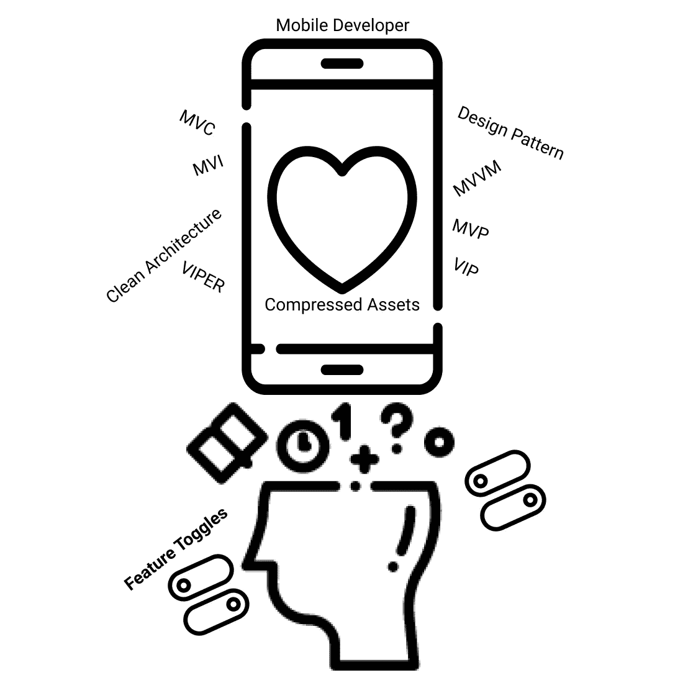
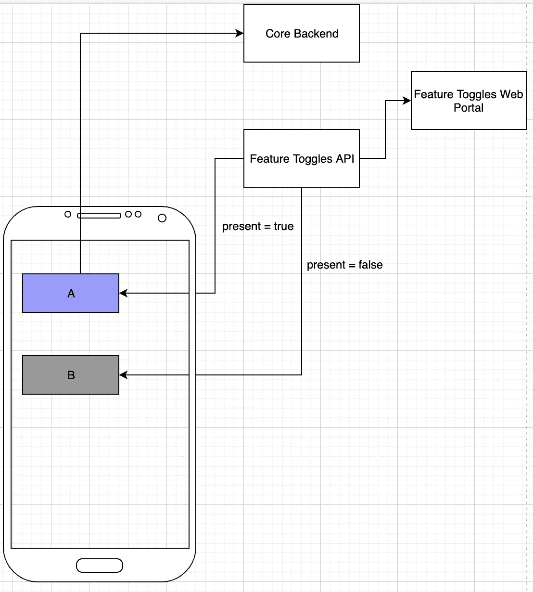

# Pentingnya Feature Toggles (Feature Flags) Untuk Mobile Apps

> 原文：<https://medium.easyread.co/pentingnya-feature-toggles-feature-flags-untuk-mobile-apps-a31302c247f9?source=collection_archive---------3----------------------->

## Pengenalan Singkat Mengenai Feature Toggles

Image For Cover

# Pengenalan Feature Toggles

Pernahkah kamu membuat aplikasi mobile, entah itu Android atau iOS? Saya yakin pasti sebagian besar *mobile developer* memperhatikan bagaimana membangun aplikasi mobilenya dengan *clean architecture* , agar proses *development* kedepannya lebih mudah dan fleksibel. Banyak versi *clean architecture* yang dapat digunakan. Mulai dari MVC, MVI, MVVM, VIPER, VIP, dan MVsomething serta VIsomething yang lain. Namun, apakah hanya *clean architecture* saja yang perlu di perhatikan untuk membangun aplikasi mobile? Tentu saja tidak. Ada hal lain yang tak kalah penting untuk diperhatikan yaitu ***Feature Toggles*** (atau ada yang menyebutnya ***Feature Flags*** ).

> “Feature Toggles (often also refered to as Feature Flags) are a powerful technique, allowing teams to modify system behavior without changing code.”
> 
> — Martin Fowler

Dari pengertian diatas singkatnya *Feature Toggles* itu teknik untuk melakukan modifikasi fitur atau sistem tanpa mengubah kodenya. Kalau masih bingung dari pengertian tersebut, saya beri contoh sebuah studi kasus pemanfaatan *Feature Toggles* .

# Studi Kasus

Saat ini saya memiliki aplikasi mobile yang sudah dipakai ratusan ribu user. Karena saya suka akan inovasi, akhirnya saya membuat fitur baru dengan bertujuan untuk membuat user yang memakai aplikasi saya terus menggunakannya dan merekomendasikan aplikasi ini ke temannya agar dipakai juga. Fitur baru yang saya buat sudah naik ke *production* dan user dari aplikasi saya mulai mencoba dan menggunakanya. Namun 1 hari setelah fitur tersebut rilis ternyata fitur tersebut memiliki *bug* di aplikasi mobile. Karena saya tidak menerapkan *Feature Flags* saya harus memperbaiki *bug* tersebut.

Ada beberapa cara yang bisa saya lakukan untuk menangani kasus ini.
— **Pertama,** saya bisa mematikan aplikasi *backend* fitur tersebut, namun bisa dilakukan jika aplikasi *backend* fitur tersebut berdiri sendiri. Meskipun cara tersebut berhasil, pengguna masih dapat melihat UI dari fitur baru tersebut di aplikasinya dan user akan mendapat error terus menerus karena aplikasi *backend* saya matikan dan itu dapat memberikan pengalaman yang buruk kepada user dan besar kemungkinan akan banyak review buruk di *Playstore* ataupun *AppStore* mengenai aplikasi saya.
— **Kedua,** saya harus memperbaiki aplikasi mobilenya dan merilis kembali ke *Playstore* atau *AppStore.* Cara ini memang berhasil, namun saya memerlukan waktu untuk memperbaiki *bug* tersebut, kemudian menunggu review dari *Playstore* atau *AppStore* . Mungkin untuk proses review *Playstore* lumayan cepat hanya sekitar 2-8 jam saja, tetapi menunggu review untuk *AppStore* sangatlah lama bisa mencapai 2 minggu atau 1 bulan. Tentu saja saya tidak ingin user aplikasi saya terus mendapatkan bug dan pengalaman yang buruk ketika memakai aplikasi saya.

*Nah,* kini masalah terbesar bagi seorang *developer* aplikasi mobile bukanlah hanya mengenai bagaimana mengembangkan aplikasi mobile dengan arsitektur yang baik. Salah satu masalah yang penting untuk selalu dipikirkan adalah ketika aplikasi mobile sudah rilis ke provider store maka kita tidak memiliki kuasa penuh akan aplikasi yang kita rilis tersebut *.* Meskipun kita telah mengupdate *bug* aplikasi kita, kita tidak bisa menjamin semua user yang memakai akan langsung mengupdatenya.

# Feature Toggles

Maka dari itu ada teknik *Feature Toggles* diperkenalkan, dimana kita dapat mengontrol aplikasi mobile kita. Salah satu penerapan untuk aplikasi mobile adalah kita dapat mengontrol komponen mobile mana yang seharusnya ditampilkan ke user. Untuk penerapanya saya memberikan contoh sederhana yang dapat kalian lakukan.

Kita dapat membuat sebuah API yang berisi komponen android mana atau fitur mana yang seharusnya ditampilkan, API tersebut kita panggil ketika aplikasi pertama kali dibuka. Jadi, ketika aplikasi tersebut dibuka maka dia akan bertanya kepada *Feature Toggles* API, fitur atau komponen mana saja yang harus disajikan kepada user.

Simple Feature Flags for Mobile Apps

Kita juga membuat web portal untuk mengontrol komponen atau fitur mana saja yang seharusnya di tampilkan kepada user. Dengan menggunakan *Feature Toggles* seperti ini jika terdapat *bug* pada aplikasi kita, kita dapat dengan mudah menghilangkan sementara fitur tersebut, tanpa perlu menunggu. Kita dapat memperbaikinya tanpa memberikan pengalaman buruk kepada user meskipun nanti kita tetap memperbaiki dan merilis ulang aplikasi kita, namun dengan menonaktifkan fitur tersebut dari aplikasinya, kita dapat mengurangi pengalaman buruk user ketika menggunakan aplikasi kita.

# Kesimpulan

Studi kasus diatas adalah salah satu contoh pemanfaatan *Feature Toggles.* Banyak pemanfaatan lain untuk *Feature Toggles* itu sendiri, serta *Feature Toggles* tidak hanya diterapkan di aplikasi mobile, namun bisa di aplikasi web, backend atau aplikasi yang lainnya.

> Membangun sebuah aplikasi bukan hanya tentang clean architecture, design pattern dll, namun juga tentang bagaimana kita membuat aplikasi yang menyelesaikan masalah, mudah digunakan, dan memiliki keandalan. Sebagai seorang developer bukan hanya berfikir dari sudut pandang teknikal namun juga harus berfikir dari sudut pandang yang lainya.

Thanks 😁