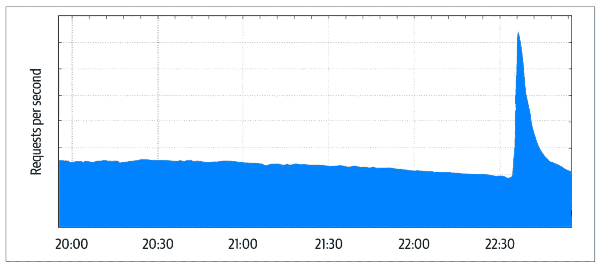

# Pentingnya Membangun Sistem yang Aman dan Andal

> 原文：<https://medium.easyread.co/pentingnya-membangun-sistem-yang-aman-dan-andal-a15f7a3f94eb?source=collection_archive---------0----------------------->

## Building Secure and Reliable Systems Series — Part 1

Baru-baru ini Indonesia dihebohkan dengan berita peretasan data 91 juta pelanggan Tokopedia yang dijual dengan harga 74 juta rupiah di [pasar gelap](https://www.cnnindonesia.com/teknologi/20200503120157-185-499513/penelusuran-91-juta-data-bocor-tokopedia-dijual-rp74-juta) . Sebenarnya kasus ini bisa terjadi pada perusahaan apa saja. Facebook pernah terkena [hal yang serupa](https://www.nytimes.com/2018/09/28/technology/facebook-hack-data-breach.html) , 50 juta pengguna terkena imbasnya. Twitter pernah menyuruh 330 juta pengguna untuk [mengganti kata sandinya](https://www.theverge.com/2018/5/3/17316684/twitter-password-bug-security-flaw-exposed-change-now) .

Keamanan ( *security* ) adalah hal yang sangat krusial untuk sebuah sistem informasi digital, namun keandalan ( *reliability)* pun tak kalah pentingnya. Membangun sistem yang aman dan juga andal terbilang sulit. Yuk kita bahas hubungan antar keduanya. Tulisan ini merupakan seri pertama dari intisari buku “ [Membangun Sistem yang Andal dan Aman ( *Building Secure & Reliable Systems* )](https://landing.google.com/sre/static/pdf/SRS.pdf) ” karya tim Google SRE.

# Building Secure and Reliable Systems — Series List

**1\. Pentingnya Membangun Sistem yang Aman dan Andal — You’re here** [**2.1\. Mengenal Lawan-Lawan dalam Membangun Sistem yang Aman dan Andal — Bagian 1**](https://medium.com/easyread/mengenal-lawan-lawan-dalam-membangun-sistem-yang-aman-dan-andal-bagian-1-8d6fb8bb22b3)[**2.2\. Mengenal Lawan-Lawan dalam Membangun Sistem yang Aman dan Andal — Bagian 2**](https://medium.com/easyread/mengenal-lawan-lawan-dalam-membangun-sistem-yang-aman-dan-andal-bagian-2-edf29bb74de0)[**3\. Meningkatkan Keamanan dengan Proksi, Sebuah Studi Kasus di Google**](https://medium.com/easyread/meningkatkan-keamanan-dengan-proksi-sebuah-studi-kasus-di-google-ddfc5e24fd6a)[**4\. Mempertimbangkan Aspek Keamanan dan Keandalan Sedari Awal**](https://medium.com/easyread/mempertimbangkan-aspek-keamanan-dan-keandalan-sedari-awal-68465a8814da)

# **Aman vs Andal**

Untuk mempertimbangkan sisi keamanan dan keandalan sistem, kita harus melihat dari berbagai aspek risikonya. Saat merancang *keandalan* sistem, kita harus selalu berpikir suatu saat nanti **sistem akan mengalami kegagalan** . Saat merancang *keamanan* sistem, kita harus selalu berpikir suatu saat nanti **sistem akan diserang dan diretas** . Walaupun keduanya sangat penting, selalu ada *tradeoff* antara keamanan dan keandalan.

*   ***Redundancy***
    Biasanya kita merancang sistem yang andal dengan menambah *redundancy* pada sistem *.* Apa itu *redundancy* ? Kita ambil gedung sebagai contoh. Gedung memiliki pintu keluar utama, tapi juga punya pintu keluar darurat saat terjadi kebakaran atau gempa. Artinya, gedung punya pintu keluar yang *redundant* . Memang benar *redundancy* membuat sistem menjadi lebih andal, tapi juga menambah jalur masuk peretas untuk mengacaukan sistem, atau biasa disebut dengan *attack surface* . **Peretas cukuplah menemukan satu jalur saja untuk menggapai tujuan jahatnya** .
*   ***Manajemen Insiden*** Saat responder insiden berusaha memadamkan gangguan pada sistem, keberadaan peretas bisa mengacaukan kolaborasi dan informasi. Untuk memadamkan insiden keandalan, biasanya kita perlu banyak orang untuk memperkaya perspektif, supaya penyebab gangguan utama ( *root cause* ) cepat ketemu. Sebaliknya, untuk memadamkan insiden keamanan, kita perlu sesedikit mungkin orang yang bisa menyelesaikan permasalahan secara efektif, sehingga peretas tidak sempat berlama-lama memanfaatkan situasi. **Kita harus terbiasa membagikan informasi ke orang lain hanya saat diperlukan saja ( *need-to-know basis* )** .

# Confidentiality, Integrity, Availability

Pernah mendengar istilah [CAP theorem](https://en.wikipedia.org/wiki/CAP_theorem) pada sistem terdistribusi? Sistem yang andal dan aman punya istilah serupa, namanya CIA ( *Confidentiality, Integrity, Availability* ). Sistem yang andal dan sistem yang aman sama-sama memperhatikan prinsip *confidentiality, integrity,* dan *availability,* tapi melalui lensa yang berbeda. Gampangnya, perbedaan mendasar di keduanya terlihat dari ada atau tidaknya peretas di dalam sistem. Dari sisi keandalan, “pelaku peretas” biasanya bersifat pasif (misalnya *bug* atau kegagalan *hardware* ), sedangkan dari sisi keamanan, pelaku peretas bersifat aktif dan sengaja menyerang, bisa kita kenal sebagai “hacker”.

Sistem andal tidak boleh melanggar prinsip *confidentiality.* Misalnya, sistem *chat* yang melanggar prinsip ini memiliki bug yang membuat pesan *chat* dikirimkan orang lain yang bukan tujuannya, alias tersasar. Selain itu, sistem aman yang mengikuti prinsip ini harus menghalangi peretas aktif untuk bisa mengakses, merusak, atau menghapus data. Supaya lebih jelas yuk kita lihat contoh CIA satu persatu, bagaimana masalah keandalan bisa membuat suatu sistem menjadi tidak aman.

## Confidentiality

Pada industri dirgantara, sempat kejadian kasus [stuck in transmit](https://www.faa.gov/air_traffic/publications/atpubs/aim_html/chap4_section_2.html) , dimana mikrofon pilot pesawat selalu berada dalam posisi *transmit* , sehingga percakapan apapun tersiarkan secara langsung, termasuk percakapan yang tidak semestinya terdengar. Ini melanggar prinsip *confidentiality.* Pada kasus ini, tidak ada peretas yang terlibat, tapi kesalahan pada *hardware* menyebabkan pilot membagikan percakapan yang tidak diinginkan.

## Integrity

Pelanggaran pada *data integrity* tidak selalu melibatkan peretas. Google pernah mengalami kegagalan *integrity check* kriptografi pada beberapa blok data. Tim Google SRE memutuskan untuk menulis perangkat lunak yang mengkalkulasi secara masif *integrity* di setiap versi data dengan *single-bit flip* , dimana 0 jadi 1, dan sebaliknya. Akhirnya terbukti penyebabnya karena *single-bit flip* , dan tim berhasil memulihkan data aslinya.

## Availability

*Availability* tentu saja sangat diperhatikan oleh keandalan dan keamanan. Peretas bisa mengeksploitasi sistem yang lemah dan menghalangi admin untuk melakukan operasi seperti biasa. Peretas juga bisa mengendalikan perangkat berskala besar untuk membanjiri server dengan trafik , biasa dikenal dengan istilah DDoS ( *distributed denial-of-service* ).

Perangkat Google Home dan Chromecast pernah memiliki [bug](https://www.reddit.com/comments/9iivc5) yang mengirimkan trafik berskala besar saat mengatur *clock* , sehingga memberikan beban yang tidak terduga pada layanan *central clock* Google. Hal ini bisa mirip sekali dengan adanya berita hangat yang membuat jutaan pengguna mengakses *query* Google pada saat yang bersamaan. Contohnya, saat kejadian gempa 4,5 SR di San Francisco pada tengah malam Oktober 2019.

Trafik layanan Google saat kejadian gempa 4,5 SR di San Francisco pada 14 Oktober 2019

# Kesamaan Sistem yang Aman dan Andal

Keamanan dan keandalan merupakan aspek yang sangat rentan terhadap perubahan sistem. Keduanya sulit dikerjakan saat sistem sudah ada di *production* , sehingga sebaiknya kita memasukkan keduanya dalam perancangan sistem sedini mungkin. Keduanya memerlukan perhatian dan pengujian terus-menerus di seluruh siklus pengembangan sistem. Yuk kita bahasa satu-persatu, apa saja kesamaannya.

## Tidak Terlihat

Aman atau tidaknya sistem, andal atau tidaknya sistem, sama-sama tidak terlihat saat semuanya berjalan dengan baik. Namun, sasaran utama dari tim keandalan dan tim keamanan adalah memperoleh serta menjaga kepercayaan dari pengguna dan partner. Kunci terpenting dari kerpercayaan ini adalah **komunikasi yang baik** , tidak hanya saat gangguan atau insiden, tapi juga saat sistem sedang berjalan dengan baik.

## Evaluasi

Sistem yang sempurna dari sisi keandalan dan keamanan mustahil untuk dicapai. Kita bisa menggunakan pendekatan risiko untuk mengevaluasi *cost* dari insiden negatif, dan juga *cost* untuk mencegah insiden terjadi.

Untuk mengevaluasi keandalan sistem, kita bisa menggunakan [*error budget*](https://landing.google.com/sre/workbook/chapters/error-budget-policy/) *,* dimana ketika komponen yang sama mengalami gangguan berulangkali dan telah melewati “anggaran” atau batas, tim harus berhenti mengembangkan fitur, dan fokus untuk meningkatkan keandalan komponen tersebut.

Untuk mengevaluasi keamanan sistem, kita bisa mengadakan pengujian peretasan ( *adversarial testing* ), sebuah simulasi penyerangan yang dilakukan oleh peretas beretika. Dari sini, kita bisa tahu seberapa efektif sistem berhasil mendeteksi dan seberapa besar konsekuensi dari penyerangan.

## Sederhana

Merancang sistem sesederhana mungkin adalah salah satu cara terbaik untuk meningkatkan kemampuan kita dalam mengevaluasi sistem dari sisi keandalan dan keamanan. Sistem yang sederhana memperkecil *attack surface* , mengurangi potensi interaksi sistem yang tak terduga, dan mempermudah manusia (kita, para pengembang sistem) untuk mengerti dan menguasai sistem. Saat terjadi insiden, penguasaan sistem sangat penting bagi responder untuk memadamkan gangguan dan mengurangi MTTR ( *mean time to recovery* ).

## Evolusi

Sistem tidak bisa terhindar dari perubahan atau evolusi, secanggih dan seelegan apapun dirancang pada awalnya. Penyebabnya banyak sekali, mulai dari kebutuhan bisnis sangat dinamis, perubahan pada skala penggunaan, dan infrastruktur yang semakin hari semakin kompleks. Pengembang sistem juga tidak henti-hentinya mengambil jalan pintas dan mengakumulasi *technical debt* .

Google pun tidak terhindar dari insiden yang muncul akibat dari evolusi sistem. YouTube pernah mengalami *down* lebih dari satu jam di tahun 2018 karena perubahan kecil pada *library* *logging* -nya.

## Tahan Banting

Sistem harus bisa tahan banting dari berbagai kondisi yang tak terduga. Dari sisi keandalan, biasanya kondisi tak terduga disebabkan oleh beban yang tinggi atau gagalnya komponen. Untuk mengatasi masalah keandalan sistem pada beban yang tinggi, kita bisa membagi-bagi bebannya ( *processing less* ) atau mengurangi *cost* pemrosesan setiap *request* ( *processing more cheaply* ). Untuk mengatasi masalah gagalnya komponen, keandalan dapat ditingkatkan dengan *redundancy* dan membedakan *failure domain* yang membatasi dampak dari sebuah kegagalan sistem atau komponen.

Namun, saat komponen-komponen sudah membentuk sistem yang cukup kompleks, sulit untuk menghindari gangguan keamanan. Cara mengatasinya adalah dengan teknik ***Defense in depth*** *,* yang membuat mekanisme pertahanan *redundant* yang berlapis-lapis, dan ***Distinct failure domains*** , yang membatasi “area peledakan” dari gagalnya sebuah komponen *.*

Kita dapat mengimplementasi *Distinct failure domains* dengan membatasi *scope* suatu kredensial. Misalnya, kredensial internal yang digunakan di Google punya batasan terhadap region. Jika peretas berhasil menjebol satu region, maka ia tidak bisa memperluas penyerangannya ke region lainnya.

Selain dari peretas eksternal, kita juga harus mempertimbangkan potensi penyerangan dari dalam atau internal. Prinsip *least privilege* dapat mencegah hal ini, dimana pengguna hanya diberikan *privilege* yang diperlukan untuk melakukan tugasnya saja.

## Memasuki Tahap Production

Saat menerjemahkan perancangan ke tahap implementasi untuk *production* , kita tetap harus memperhatikan aspek keamanan dan keandalan. Lakukan *code review* , pengujian sistem, dan *deploy* terbatas dengan teknik *canary.*

## Investigasi Sistem dan *Logging*

Kita harus berasumsi bahwa keandalan dan keamanan sistem akan gagal. Saat ini terjadi, rancang perencanaan untuk deteksi dini dan pemulihan dengan seksama.

*Logging* yang baik merupakan teknik dasar dari deteksi kegagalan dan alat bantu untuk pemulihan. *Logging* yang rinci pada umumnya baik untuk sistem, dengan beberapa catatan. Untuk skala besar, *logging* yang terlalu rinci membuat analisis menjadi sulit dan *cost* -nya mahal.

Dibandingkan dengan untuk keandalan, l *ogging* untuk keamanan perlu perhatian lebih. Kita tidak boleh memasukkan informasi sensitif pada *log* , seperti kredensial dan data personal, karena ini bisa menjadi target sasaran peretas.

## Respon terhadap Krisis

Saat insiden darurat atau krisis, tim harus berkolaborasi secara cepat dan tanggap, karena *worst case* -nya insiden bisa membuat bisnis mengalami kebangkrutan dalam hitungan menit saja. Pada tahun 2014, seorang peretas berhasil membuat perusahaan *hosting* Code Spaces bangkrut dalam hitungan jam, dengan mengambil alih perangkat admin dan menghapus semua data, termasuk *backup* . Pada saat penanganan krisis, perlu adanya rantai komando yang jelas, *checklist* , *playbook* , dan protokol yang solid.

## Pemulihan

Memulihkan sistem dari gangguan keamanan biasanya memerlukan pembaruan *patch* pada sistem. Kita harus membuat proses yang bisa mempercepat hal ini, menggunakan mekanisme yang dicoba secara reguler dan cukup andal. Namun, ini seperti pedang bermata dua. Pembaruan yang cepat berpotensi untuk membuat *bug* dan isu performa yang menyebabkan kerusakan yang besar. Kita harus bisa menyeimbangkan pembaruan *patch* keamanan dan mengkategorikannya, lagi-lagi berdasarkan analisis risiko dan kebutuhan.

Keamanan dan keandalan sistem merupakan komponen penting bagi bisnis dan memilki banyak kesamaan. Keduanya merupakan komponen pengembangan yang seringkali dikorbankan supaya fitur lebih cepat rilis, tapi sangat mahal diperbaiki saat sudah terjadi gangguan di *production* .

Penulis merupakan penggiat sistem Cloud, Kubernetes, dan Container di Indonesia. Ia seorang [CNCF ambassador](https://www.cncf.io/people/ambassadors/) , [Google Developer Expert](https://developers.google.com/community/experts) , dan Kubernetes maintainer. Gabung dengan grup [telegram Kubernetes dan Cloud Native Indonesia](http://t.me/kubernetesindonesia) untuk diskusi berbagai hal menarik seputar perkembangan teknologi Cloud Native, atau bantu menerjemahkan [dokumentasi Kubernetes](http://kubernetes.io/id) ke [bahasa Indonesia](http://bit.ly/k8s-docs-id-m3) .