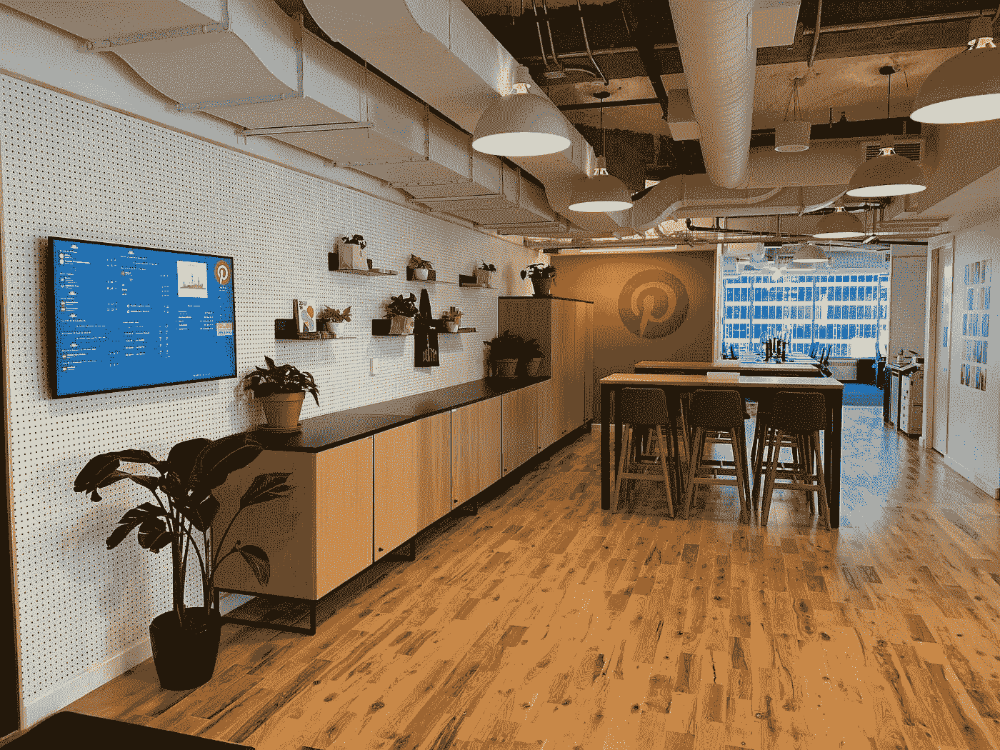
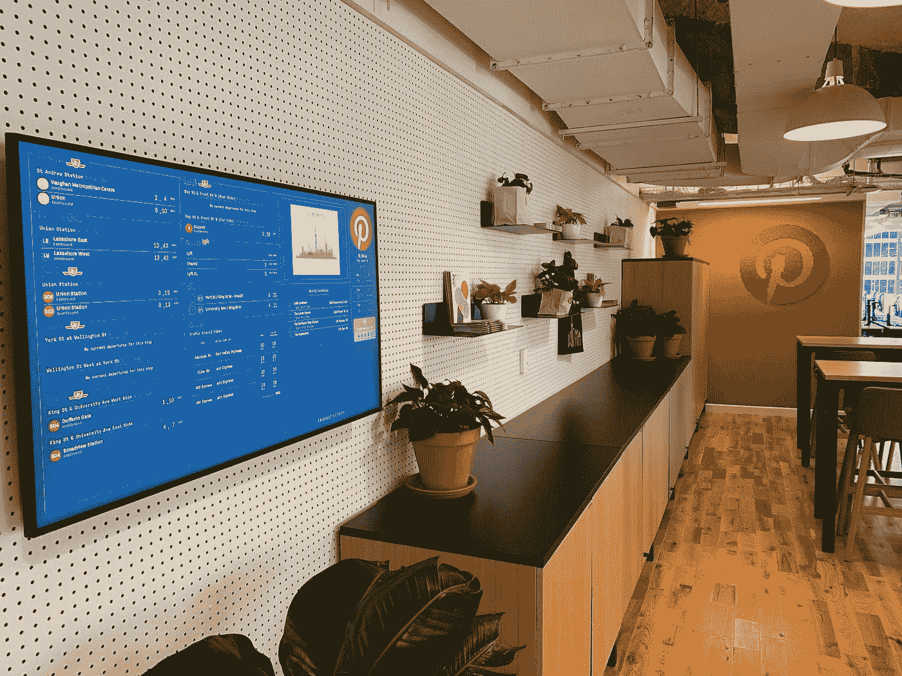

# 产品背后的人:见见国际产品负责人和多伦多领导 Rahim Daya

> 原文：<https://medium.com/pinterest-engineering/people-behind-the-product-meet-rahim-daya-head-of-international-product-toronto-lead-52e29ca29945?source=collection_archive---------5----------------------->

Rahim Daya |多伦多技术主管和国际产品主管

Rahim Daya，土生土长的多伦多人，在 Pinterest 工作了近 4 年，负责 Pinterest 的国际产品以及多伦多的技术团队。在我们的虚拟 [Pinterest 工程之前:参加多伦多团队](https://pinterestengineering-meettheteamtoronto.splashthat.com/)活动，了解 Rahim，并了解更多关于 Pinterest 不断增长的工程中心即将开展的令人兴奋的购物、机器学习和货币化工作。

## **你能告诉我们你在 Pinterest 的角色，分享一下你的职业生涯吗？**

我于 2017 年加入 Pinterest，领导搜索产品团队，并帮助 Pinners 通过基于我们系统中数千亿个 pin 的视觉和文本信号的混合显示相关结果来发现新的灵感。我还领导了我们的 Pin-to-Pin 推荐工作，这是 Pinterest 上 Pinners 探索新想法的一个关键方式，以找到合适的内容来激发新的兴趣。我在搜索和 Pin-to-Pin 推荐方面的工作有很大一部分侧重于改善我们的国际体验，这使我成为目前负责国际产品的领导，这是我们增长和未来盈利的关键领域，也是我们将工程业务扩展到多伦多的关键。

在 Pinterest 之前，我在 LinkedIn 负责招聘人员搜索产品。在这个职位上，我的团队彻底改变了招聘人员帮助雇主更容易地找到候选人的方式，将他们每次搜索找到的相关候选人数量增加了一倍。我在产品管理方面的第一份工作是在 Groupon 的推荐团队，负责电子邮件推荐产品。

***Kitchen area in Pinterest’s Toronto office space***

## **Pinterest 为什么要在多伦多扩张？该地区有哪些机会？**

在过去的两年里，Pinterest 探索了新的方法来接触伟大和有代表性的工程师，特别是那些机器学习专家。当我们查看 Pinterest 的工程师在哪里接受培训时，我们了解到其中 10%的人去了加拿大的大学，最典型的是滑铁卢大学和多伦多大学。

加拿大的大学也在 ML 培训上投入了大量资金，多伦多的人才质量在世界上是数一数二的。多伦多的新工程办公室是一种将当地工程师引入团队的方式，同时也为多伦多的工程社区做出了贡献。

## **作为机器学习工程师加入 Pinterest 多伦多团队有什么好处？**

对于 Pinterest 的 ML 工程师来说，两个最大的机会是:

1.  能够访问网上最大的人类策划的想法的数据集来开发和测试复杂的模型
2.  与机器学习领域的领导者互动，了解新技术和前沿技术(更多详情见下文)

作为一个拥有超过 4.5 亿月活跃用户和超过 3000 亿个独特的、有组织的 pin 的产品，我们的 ML 系统可以从中学习，Pinterest 是机器学习工程师的绝佳机会。随着这个不断增长的数据集将兴趣图映射到个性化和可操作的建议，Pinterest 的工程师们创建了领先的 ML 模型，如我们在[产品属性理解](/pinterest-engineering/understanding-product-attributes-for-shoppers-77268c746c87)方面的工作，以推动具有购物意图的受众的电子商务，以及[包容性产品体验](/pinterest-engineering/powering-inclusive-search-recommendations-with-our-new-visual-skin-tone-model-1d3ba6eeffc7)，该体验根据肤色范围过滤美容结果，并已应用于 AR Try on 等下一代技术。此外，Pinterest 拥有行业 ML 专家正在构建的下一代技术，包括[迪帕克·阿加瓦尔](https://www.linkedin.com/in/dipu1025/)、[查克·罗森伯格](https://www.linkedin.com/in/chuckrosenberg/)、[巴拉吉·克里什纳普拉姆](https://www.linkedin.com/in/balajikrishnapuram/)、[纳迪亚·法瓦兹](https://www.linkedin.com/in/nadiafawaz/)和[朱尔·莱斯科维奇](https://www.linkedin.com/in/leskovec/)。与这些导师一起工作的机会将使我们的多伦多团队成员发展他们作为 ML 工程师的能力。

## **是什么让 Pinterest 独一无二或与众不同？**

Pinterest 对我来说有两个特别之处。首先，我喜欢 Pinterest 的团队，在疫情期间，与同事的互动是我最怀念的事情。我每天都和非常聪明的人一起工作，并对我所做的工作感到挑战。我还喜欢 Pinterest 是一项关于 Pinner 的服务，而不是关于其他人的服务。网上有很多与他人联系的地方，但 Pinterest 是人们为自己做计划的地方。花时间在 Pinterest 上可以让 Pinners 投资于自己，并找到创造他们热爱的生活的灵感，这在与 Pinners 合作时体现出来。作为产品经理，如果我的用户已经喜欢这个产品，我的工作会变得更容易。

## **告诉我们 Pinterest 在 2021 年的一些最重要的优先事项。多伦多团队的成员将如何帮助实现这些计划？**

Pinterest 专注于三个关键领域来发展我们的公司；内容创作、广告和购物。我们在购物方面的投资，尤其是任何 Pinterest 用户发现和购买商品的能力，是我们最新的关注领域，也是 Pinterest 的主要增长机会。多伦多将容纳我们一半的购物团队，多伦多团队的成员将直接构建购物技术，推动 Pinterest 未来 10 年的增长。

## 对于 Pinterest 的未来，尤其是多伦多办事处的未来，你最感兴趣的是什么？

我对 Pinterest 在购物未来的投资以及创造用户今天只能梦想的购物体验的潜力感到兴奋。当我三年前开始在 Pinterest 工作时，我们的视觉技术团队专注于理解图像相似性。现在，该团队可以识别图像中的物体、产品上的图案甚至时尚风格。我们有机会创造一种购物体验，就像走进一家商店，那里的一切都是个性化的，符合您的口味，这也将使更多各种规模的企业获得新的受众。多伦多团队将是构建 Pinterest 购物体验的核心部分。

## **你有什么结束语吗？**

作为一个在多伦多长大并就读于滑铁卢大学的人，我很高兴能在多伦多领导我们的团队，并为启动我职业生涯的社区做出贡献。我希望 Pinterest 在多伦多的投资能够帮助培养下一代工程领导者，因为多伦多越来越成为顶级科技人才的中心。

*想了解更多关于 Pinterest 的多伦多机会，并了解 Rahim 团队的其他成员？参加我们的虚拟****Pinterest Engineering:在 3 月 4 日(星期三)举行的会见团队*** *活动，了解我们的多伦多领导、工程经理和招聘人员。RSVP* [*此处*](https://pinterestengineering-meettheteamtoronto.splashthat.com/) *。*