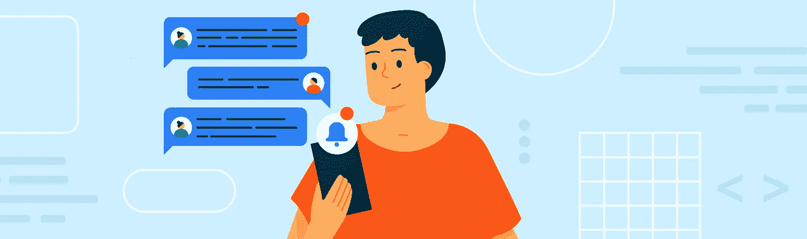

# 人员通知

> 原文：<https://medium.com/androiddevelopers/people-notifications-2a2e4fb6ee96?source=collection_archive---------5----------------------->



Illustration by [Molly Hensley](https://dribbble.com/Molly_Hensley)

在 [Android 11](https://developer.android.com/preview) 中，我们让 Android 变得更加以人为本和富有表现力，重新想象我们在手机上交谈的方式，并构建一个可以识别和优先考虑你生活中最重要的人的操作系统。作为这种体验的一部分，Android 11 中的对话通知出现在阴影顶部的专用区域，具有以人为本的设计和特定于对话的操作，如以气泡形式打开对话，在主屏幕上创建对话快捷方式，或设置提醒。

这篇文章着眼于影响通知排名的许多因素，以帮助你理解你的应用程序发送的通知如何为你的用户进行优先排序。

# 什么是通知？

[通知](https://developer.android.com/guide/topics/ui/notifiers/notifications)是用户界面中向用户传达某种信息的信号，比如新闻提醒、来自朋友的聊天消息或关于即将到来的事件的提醒。

有不同类型的通知，但在这篇博客文章中，我们将重点关注人物通知，因为它们在我们使用手机的方式中发挥着重要作用，也是当今移动设备的核心功能和用法之一。

# 人员通知

*人物通知*是在上下文中有一个[人物或多个](https://developer.android.com/reference/androidx/core/app/NotificationCompat.Builder#addPerson(java.lang.String))人物的消息。自 Android 8 (Oreo)以来，人员通知在抽屉通知的视觉层次结构中得到了提升，优先于正在进行的或关键/主要的通知。在人员通知中，当通知具有[人员上下文](https://developer.android.com/reference/androidx/core/app/NotificationCompat.Builder#addPerson(java.lang.String))和联系人 [URI 分配](https://developer.android.com/reference/android/app/Person.Builder#setUri(java.lang.String))时，您的通知排名会更高。


Notification drawer visual hierarchy

作为一名应用程序开发人员，确保您将通知用于正确的目的是很重要的，并且您不会滥用与您的特定通知无关的空间。例如，日历应用程序上关于即将到来的事件的通知不应该在对话空间中显示为紧急通知。尽管 Android 允许用户通过[通知渠道](https://developer.android.com/training/notify-user/channels)来配置通知的频率、可见性和重要性，但违反良好实践会降低应用的价值和可信度，并会对你在 Play Store 中的地位产生负面影响。

# 通知排名

对于那些对排序细节或者通知如何排序、区分优先级和分类感兴趣的人来说，[通知记录](https://android.googlesource.com/platform/frameworks/base/+/master/services/core/java/com/android/server/notification/NotificationRecord.java)值得一提。它包含用于对通知进行分级的所有相关信息以及进行分级计算的位置。通知基于各种因素进行排名:频道设置(频道前通知的优先级，Android 8.0 之前)、噪音、新鲜度和上下文。要查看决定排名的各种标准，请查看所有实现了[notification signal extractor](https://android.googlesource.com/platform/frameworks/base/+/refs/heads/master/services/core/java/com/android/server/notification/NotificationSignalExtractor.java)的类。

[validate notification people](https://android.googlesource.com/platform/frameworks/base/+/master/services/core/java/com/android/server/notification/ValidateNotificationPeople.java)提取器值得注意，因为它与人有关。通过 validatePeople 方法调用，它设置一个 affinity 位作为根据重要性对通知进行排序的标准。

```
private RankingReconsideration validatePeople(Context context, final NotificationRecord record) {...final PeopleRankingReconsideration rr = validatePeople(context, key, extras, record.getPeopleOverride(), affinityOut);final float affinity = affinityOut[0];record.**setContactAffinity**(affinity);...return rr;}
```

密切关系基于以下因素而增加:通知是否是有效的联系人，有效的联系人是否来自用户的联系人，以及该联系人是否被加星或者是收藏夹。

# Android 11 和对话

在 Android 11 中，有一些变化进一步突出了与人相关的功能的重要性。[消息风格通知](https://developer.android.com/reference/androidx/core/app/NotificationCompat.MessagingStyle#NotificationCompat.MessagingStyle(java.lang.CharSequence))现在在抽屉/阴影中有一个专门的部分。

除了新的对话空间，Android 10 中预览的[气泡](https://developer.android.com/guide/topics/ui/bubbles)建立在通知之上，并允许从浮动覆盖图轻松链接到您的对话。


The dedicated conversation space and bubbles elevates the people focus experience

如果你看一下[对话 API](https://developer.android.com/preview/features/conversations)中快捷方式的发布，遵循一定的准则，对话也可以在系统的各个部分出现；促进分享，并允许在特定环境中与人进行某些活动。

# 以人为本

Android 11 中的这些变化标志着该平台在进一步投资和改善人们沟通方面的方向。有关 Android 11 和 API 指南中这些变化的更多信息，请查看 Android 开发者文档中的[对话](https://developer.android.com/preview/features/conversations)。

# 相关信息

[对话](https://developer.android.com/preview/features/conversations)

[安卓通知](https://material.io/design/platform-guidance/android-notifications.html)