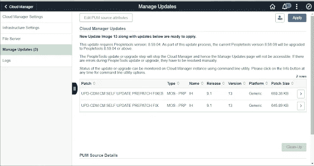
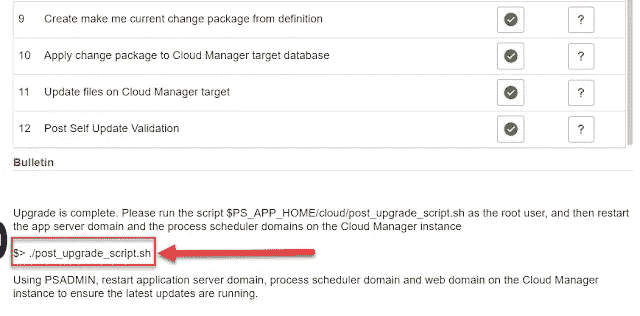
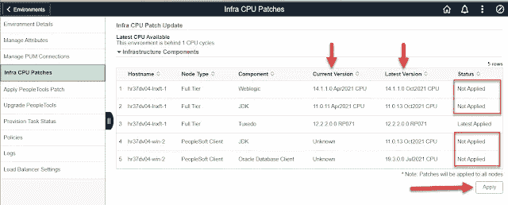

# PeopleSoft 云管理器 13

> 原文：<https://medium.com/version-1/peoplesoft-cloud-manager-13-14550d322242?source=collection_archive---------7----------------------->

2021 年 11 月 11 日，甲骨文发布了对 PeopleSoft 云管理器的最新更新。Cloud Manager 是 PeopleSoft 应用程序，用于管理 Oracle 云基础架构中的其他 PeopleSoft 环境。

在第 1 版中，我们使用 OCI 运行许多 PeopleSoft 系统，用于开发、原型制作、R&D 和客户演示目的，云管理器在帮助我们更轻松、更快速地处理日常事务方面发挥着重要作用。

我想写两件非常有趣的事情。

# 云管理器自我更新

首先是云管理器的[自我更新特性。下面的截屏显示了我的云管理器 12 实例已经检测到图像 13 现在可用、下载并准备好 ***应用*** 。](https://docs.oracle.com/cd/F48809_01/pcd91pbr13/eng/pcd/cmif/AutomaticallyApplyingUpdatesUsingManageUpdates.html)

这不是我第一次使用云管理器中的管理更新功能，但这是第一次云管理器还将执行 PeopleTools 自身升级，作为应用 Image 13 的应用程序更新的“让我成为当前”流程的一部分。

总之，自我更新过程将执行以下步骤:

1.  调配云管理器的新 PUM 源映像 13
2.  将任何 PRPs 应用于 PUM 源图像
3.  将目标(自身)升级到 PeopleTools 8.59.04
4.  为目标创建并应用 PUM 协议 13 的变更包

所有这些都在不到 4 小时内完成！相当令人印象深刻。

注意:在这个完全自动化的过程结束时，有一个涉及运行 post_upgrade_script.sh 的手动步骤。这在 PeopleBooks 中有所介绍，并在 Cloud Manager 手动更新状态页面中有所介绍。需要注意两件事:

1.  在运行此脚本之前，您必须使所有环境都处于启动状态，因为此脚本的任务之一是更新每个目标环境上的一些脚本，并且(当然)每个环境必须可供脚本更新文件。
2.  当您运行这个 post_upgrade_script 时，PUM 源代码环境必须可用(即正在运行),因此请确保在您运行这个脚本之前不要点击**清除**按钮。

# DPK 环境红外补丁

我想说的第二件事是，云管理器现在支持**基础 DPK 修补**。自 2018 年云管理器 6 以来，您已经能够执行 [PeopleTools 升级和补丁](https://i-like-trains.blogspot.com/2018/09/peopletools-857-upgrade-magic.html)。现在，从 Cloud Manager 13 开始，我们可以在中间层和 Windows 客户端节点上修补 WebLogic、Tuxedo、Java 和 Oracle 客户端。下面的截图显示了在 PeopleTools 8.59 上运行的 HCM Image 37 环境。它显示了中间层堆栈和 PeopleSoft 客户端的当前版本，并指示有最新版本可供应用。这两个节点的应用过程大约需要 30 分钟。非常好，现在非常安全！

【https://i-like-trains.blogspot.com】最初发表于**。**

**

***关于作者** 格雷厄姆·史密斯是 PeopleSoft Technology here in Version 1 的负责人。*