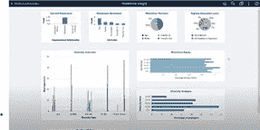

# PeopleSoft Kibana —提供强大的人员洞察力

> 原文：<https://medium.com/version-1/peoplesoft-kibana-providing-powerful-people-insights-fee660e5d08a?source=collection_archive---------4----------------------->

您知道 PeopleSoft 现在有几个交付的分析仪表板吗？是的，它们都已设置好，随时可供您使用，就像下图中与招聘相关的那个一样。

如您所见，这些仪表板是一个很好的起点，让您可以直观地了解 Kibana 如何帮助您的组织提供战略决策，并且数据备份唾手可得。所以现在你已经有了洞察力，可以采取行动了！

您是否知道 Oracle PeopleSoft 已经提供了以下仪表盘？

✔劳动力洞察，包括按年龄和性别进行的比较。

✔健康与安全，包括事故类型和地点。

✔时间和劳动力，包括实际时间和计划时间。

✔缺勤管理-缺勤分部趋势，按类型列出的缺勤。

✔招聘解决方案-内部与外部，技能热图。

除此之外，这一领域的未来增强功能还会不断出现。我特别期待看到在即将发布的版本中，在福利和薪资方面会有什么样的表现。

以下是我对这些仪表板为何会成为组织人力资源和管理团队战略决策的**去处**的十大想法:

1.用户不需要技术。他们可以一目了然地看到**信息**，并可以轻松地进行深入的互动，以获得详细的见解。

2.用户可以使用可操作的链接直接找到记录— **这有多简单？**

3.一幅画可以表达千言万语——这是千真万确的。谁不喜欢一张可以在会议上谈论的照片呢？热图真的**有助于数据“弹出”**在用户面前。

4.抓住管理层的注意力关注数据告诉你的信息。

5.用户可以很容易地**识别趋势**并**采取快速行动。**

6.如此多有趣的可视化功能**可用，例如图表、表格和地理地图——你可以根据用户的需求和他们的需求来构建。**

7.过去，直线经理们一直在呼吁数据的透明性，他们可以用来做决策的信息——现在你有了。

8.**无影响**在线处理和安全基于搜索授权。

9.如果升级到**工具 8.59** ，那么数据可以使用实时索引——是的，更新数据，你的分析信息将是准确的。

10.最后，但同样重要的是，**无需额外的许可费用！**

总之，您现在拥有了一个开放且可用的数据窗口，它没有额外的成本，可根据您的业务需求进行配置，并将有助于组织政策和决策的制定。你甚至可以带着这些数据在会议上走来走去，提供支持你的见解的证据，让人力资源处在基于事实而不是操纵数据的组织决策的最前沿。

真的没有任何借口来解决这个问题，从 Oracle 提供的产品开始。然后，您可以在此基础上进行构建，使其成为您组织的独特之处——在开发自己的产品时问问自己——我们的业务需要什么来通知我们在正确的时间立即采取行动？交付的分析只是一个起点。

对于有影响力的人来说，没有什么会失去，但会有很多收获。

如果你有兴趣看 Jo Randles @Version1 制作的演示仪表板的视频，请联系我们，我会发给你。

一如既往，如果你正在寻找建议和指导，请随时联系。

**关于作者**

Caroline Cavell 是 PeopleSoft Portfolio @Version1 的管理顾问。她使用 PeopleSoft 应用程序已经超过 25 年了。

你可以在 Caroline.Cavell@version1.com 联系我