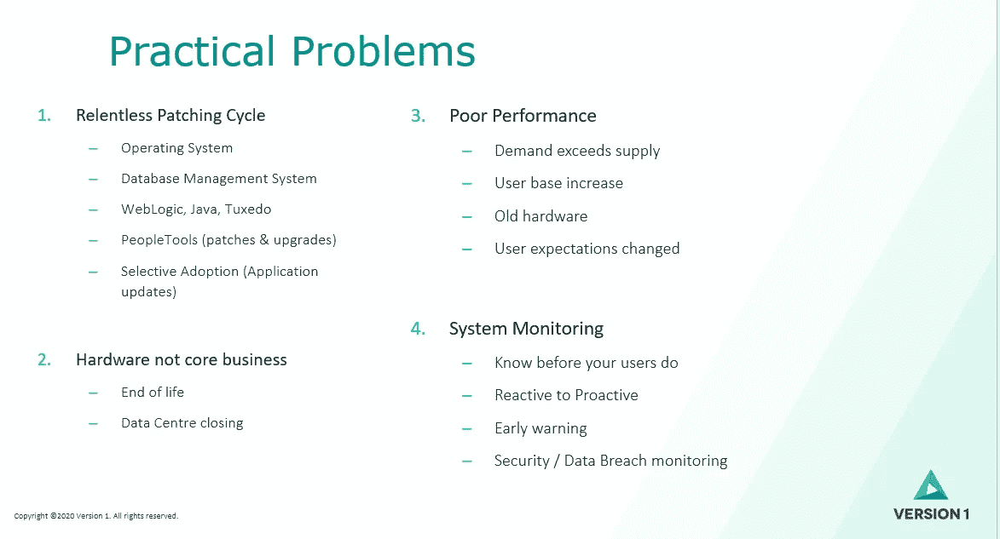

# 仁科 OCI:实用的艺术

> 原文：<https://medium.com/version-1/peoplesoft-on-oci-the-art-of-the-practical-8950196d4125?source=collection_archive---------5----------------------->

我最近在 Quest Reconnect ENVISION 大会上做了一个演讲，分享了我在[**【OCI】**](https://docs.oracle.com/cd/E52319_01/infoportal/opc.html)上运行 **PeopleSoft 的想法。这是一次精彩的会议，承载了来自 Oracle PeopleSoft 团队的新闻，也是与 PeopleSoft 社区其他成员会面的绝佳机会。**

Quest Reconnect ENVISION 2021

知道什么是可能的或者什么是可能的总是好的。没有这一点，我们永远不会推动自己去梦想或想得更大。但是，有时我们只是想听听“*现在什么是实际可能的*”。我的演讲旨在回答这个问题，并解决我们大多数人在向用户提供 PeopleSoft 服务时面临的 4 大实际问题。

如果你是 Quest 社区的成员，你可以在这里观看我的会议记录[https://questoraclecommunity . org/learn/recordings-presentations/PeopleSoft-on-OCI-the-art-of-the-the-practical/](https://questoraclecommunity.org/learn/recordings-presentations/peoplesoft-on-oci-the-art-of-the-practical/)

或者你可以在这里查看我的幻灯片[https://tinyurl.com/psonociv2](https://tinyurl.com/psonociv2)(100 MB)

如果您有兴趣了解更多关于 PeopleSoft 公共云基础架构的信息，请联系我们。

 [## PeopleSoft 到 Oracle 云基础设施(OCI) |第 1 版

### 凭借 20 多年的 PeopleSoft 经验，第 1 版被客户投票选为 Oracle 的头号合作伙伴，是一款…

www.version1.com](https://www.version1.com/it-service/peoplesoft-to-oracle-cloud-infrastructure/)