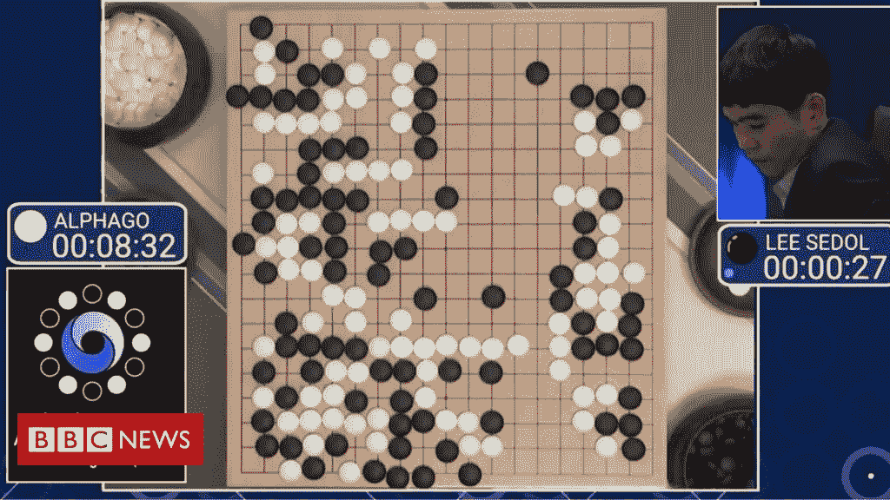
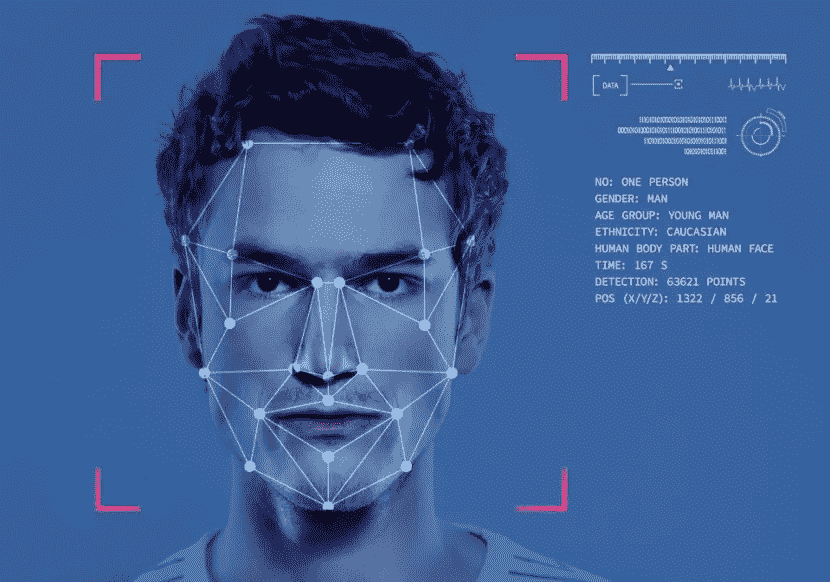
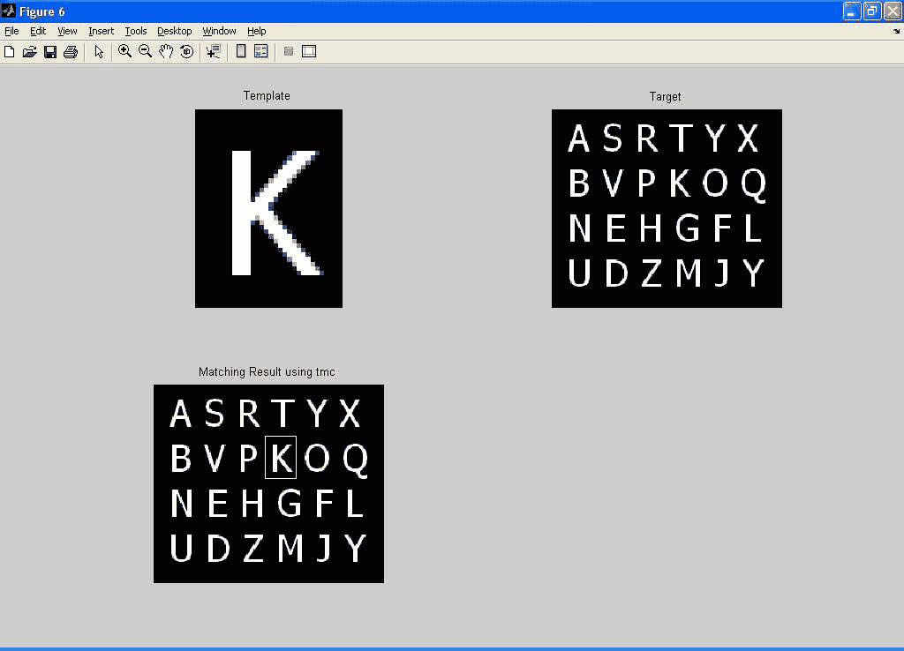
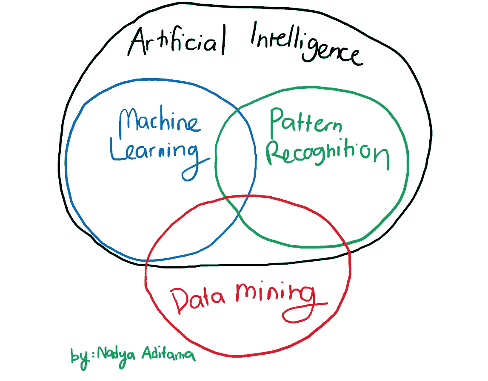

# Perbedaan Machine Learning, Artificial Intelligence, Data Mining, dan Pattern Recognition dan Hubungannya.

> 原文：<https://medium.easyread.co/perbedaan-machine-learning-artificial-intelligence-data-mining-dan-pattern-recognition-dan-177901d6b12a?source=collection_archive---------1----------------------->

Photo by [Arseny Togulev](https://unsplash.com/@tetrakiss?utm_source=medium&utm_medium=referral) on [Unsplash](https://unsplash.com?utm_source=medium&utm_medium=referral)

H ai semua, kalian pasti sudah tidak asing lagi dengan keempat istilah ini. Ini adalah salah satu tugas kuliahku pada semester 1 yang lalu dimana aku harus mencari tahu perbedaan dari *Machine Learning, Artificial Intelligence, Data Mining,* dan *Pattern Recognition* dari beberapa referensi. Serta aku harus mencari hubungan dari keempat bidang tersebut.

Nah, kali ini aku mau mencoba menyampaikan pendapatku mengenai hal tersebut. Nah sebelum itu, kita kenalan dulu yuk sama mereka.

# *Artificial Intelligence*

Pada zaman sekarang, para ilmuwan dari ranah *computer science* berusaha untuk melatih komputer agar mempunyai kemampuan seperti manusia. Nah kemampuan tersebut disebut dengan *Artificial Intelligence* atau biasa disingkat dengan AI.

Menurut buku *Artificial Intelligence : A Modern Approach* dari Stuart Russel, pendekatan AI dibagi menjadi 4, yaitu

1.  ***Thinking Humanly*** , membuat mesin berpikir seperti manusia.
2.  ***Thinking Rationaly*** , membuat mesin dapat melakukan penalaran.
3.  ***Acting Humanly* ,** membuat mesin dapat melakukan sesuatu yang dapat dilakukan manusia.
4.  ***Acting Rationallly*** , membuat mesin dapat melakukan sesuatu yang logis berdasarkan penalaran yang dilakukan.

Oke, sudah terbayang ya definisinya. Nah, untuk membangun sebuah teknologi AI dapat digunakan empat teknik utama. Menurut buku *Artificial Intelligence* dari Suyanto, terdapat empat teknik AI, yaitu

1.  ***Searching*** , mencari solusi dalam menyelesaikan masalah
2.  ***Reasoning*** , melakukan penalaran berbasis logika
3.  ***Planning*** , membuat perencanaan untuk menyelesaikan masalah
4.  ***Learning* ,** mempelajari suatu hal dari data atau pengalaman sebelumnya

Contoh aplikasi AI di dunia nyata sudah banyak, salah satunya adalah AlphaGo, salah satu teknologi AI yang dapat mengalahkan Lee Se-dol, seorang master permainan Go. Hmmm kira-kira teknik apa saja yang dipakai dalam membangun teknologi AI ini ya? Silakan cari tahu.

Sumber: BBC News

# Machine Learning

Menurut Tom M. Mitchell dari buku *Machine Learning* , definisi *machine learning* adalah sebagai berikut

> Sebuah komputer dikatakan belajar dari eksperimen E, yang mengacu pada beberapa task T, dan ukuran performansi P, jika performansi dari task T, yang diukur dengan P, ditingkatkan dengan pengalaman E.

Dengan menggunakan *Machine Learning* , komputer dapat menjalankan tugasnya dengan baik dengan memanfaatkan pengalaman masa lalu. Pengalaman tersebut berbentuk data atau langkah-langkah yang pernah dilakukan sebelumnya.

Contoh pengaplikasian dari *Machine Learning* adalah pengenalan wajah berbasis gambar. Dengan teknologi tersebut, komputer akan dapat mengenali wajah seseorang, baik itu namanya, maupun jenis kelamin ataupun usianya. Komputer akan dilatih dengan cara mempelajari berbagai macam gambar wajah orang tersebut dengan menggunakan algoritma *Machine Learning* .

Sumber : RecFaces

# Data Mining

Menurut Aggarwal dan Charu C. dalam buku *Data Mining The Textbook* , definisi *Data Mining* adalah sebagai berikut

> Data Mining merupakan ilmu yang yang mempelajari tentang pengumpulan, pembersihan, pemrosesan, penganalisaan, dan mendapatkan insight dari data.

Singkatnya, dalam *Data Mining* kita akan menggali *knowledge* atau *insight* yang penting dari sekumpulan data yang bervolume besar dan beragam. Tahapan *Data Mining* menurut buku *Data Mining The Textbook* adalah sebagai berikut

1.  ***Data Collection*** *,* melakukan pengumpulan data dari berbagai sumber.
2.  ***Feature Extraction and Data Cleaning*** *,* melakukan pemilihan fitur data yang penting dan melakukan pembersihan data seperti menghilangkan *missing value* atau menyamakan format data.
3.  ***Analytical Processing and Algorithm*** , menggali pengetahuan dan *insight* yang bisa didapatkan dari suatu data.

Task *Data Mining* sendiri dibagi menjadi dua, yaitu

1.  **Prediktif,** melakukan prediksi keluaran berdasarkan fitur dari suatu data, baik berupa angka maupun kategori.
2.  **Deskriptif,** menampilkan representasi dari kumpulan data, sehingga akan didapatkan suatu *insight* untuk mengambil keputusan.

Contoh pengaplikasian *Data Mining* adalah *market basket analysis* .

Photo by [Mehrad Vosoughi](https://unsplash.com/@mehrad_vosoughi?utm_source=medium&utm_medium=referral) on [Unsplash](https://unsplash.com?utm_source=medium&utm_medium=referral)

Dalam *market basket analysis* , kita menganalisis kombinasi barang apa saja yang dibeli oleh pelanggan di toko. Dengan adanya informasi tersebut, para pegawai dapat mengatur kembali peletakan barang di rak, contohnya jika banyak pelanggan yang membeli susu dan sereal, maka susu dan sereal akan diletakan di tempat yang berdekatan.

# Pattern Recognition

*Okay, last one is pattern recognition* . Pengertian *Pattern Recognition* menurut Christoper M. Bishop dalam buku *Pattern Recognition and Machine Learning* adalah sebagai berikut

> Bidang pengenalan pola berkaitan dengan penemuan secara otomatis keteraturan data dengan menggunakan algoritma komputer dan menggunakan keteraturan tersebut untuk melakukan beberapa aksi seperti mengklasifikasi data menjadi kategori yang berbeda.

Jadi, *Pattern Recognition* ini adalah sebuah teknik untuk memanfaatkan keteraturan atau pola pada suatu data dengan menggunakan algoritma tertentu. Pola yang dimaksudkan adalah fitur yang merepresentasikan suatu data. Lalu apa bedanya dengan *Machine Learning* ? Nah singkatnya di *Pattern Recognition* ini ada sebuah teknik dimana kita tidak memerlukan teknik *Machine Learning* , yaitu *template matching* . Contohnya adalah sebagai berikut

Contoh Template Matching (Sumber : Mathworks)

Dalam kasus ini, kita ingin mendeteksi huruf K dengan menggunakan template huruf K. Template ini akan dicocokan dengan gambar target yang berisi kumpulan huruf, sehingga pada akhirnya huruf K akan ditemukan setelah dilakukan pencarian *per patch* gambar.

Nah kita sudah berkenalan dengan keempat bidang tersebut. Jadi bagaimana hubungannya? Berdasarkan penjelasan sebelumnya, hubungan keempat bidang tersebut dapat digambarkan sebagai berikut

Keterkaitan *Artificial Intelligence*, Machine Learning, Data Mining, dan Pattern Recognition

Dari gambar tersebut, kita dapat fokus ke tiga poin penting ini

1.  ***Machine Learning*** dan ***Pattern Recognition*** merupakan **bagian dari *Artificial Intelligence*** . Karena meniru kemampuan manusia untuk mempelajari suatu bidang dengan data-data yang tersedia ( *Learning* ).
2.  ***Pattern Recognition*** dan ***Machine Learning*** **beririsan** . Hal tersebut disebabkan karena ada metode *Pattern Recognition* yang tidak melibatkan *Machine Learning* , seperti metode template matching yang tidak memerlukan teknik *Machine Learning* untuk mengenali pola.
3.  ***Data Mining*** beririsan dengan **ketiga bidang ini** . Tujuan utama dari *Data Mining* adalah mendapatkan *knowledge* dan *insight* dari sebuah data. Terdapat dua metode *Data Mining* yang dapat memerlukan *Machine Learning* , yaitu *clustering* dan *classification* . Namun terdapat step data mining yang tidak memerlukan *Machine Learning* , seperti *data cleaning.*

Nah sekian penjelasan dariku. Jika pendapat kalian bertentangan bisa mencoba berdiskusi di kolom komentar ya. Terimakasih sudah berkunjung. Semoga bermanfaat!

# **Sumber**

1.  Mitchell, T. M. (1997). Machine Learning. Germany: McGraw-Hill.
2.  Norvig，p .，Russell，S. J. (2016 年)。人工智能:现代方法。联合王国:皮尔逊。
3.  Aggarwal，C. C. (2015 年)。教科书。德国:斯普林格国际出版公司。
4.  Bishop，P. o. N. C. C. M .，Bishop，C. M. (2007)。模式识别和机器学习。瑞士:施普林格。
5.  苏扬托。(2014).人工智能搜索、推理、规划、丹学习。万隆:信息卡。