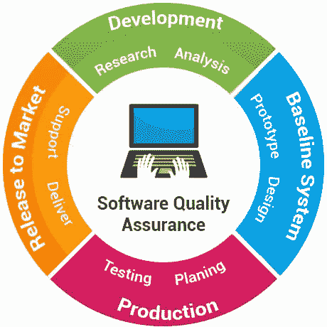

# Perbedaan Software Testing dan Software Quality Assurance

> 原文：<https://medium.easyread.co/perbedaan-software-testing-dan-software-quality-assurance-31899237bedb?source=collection_archive---------0----------------------->

## Apa sih bedanya Software Testing dan Software Quality Assurance

Beberapa waktu yang lalu, seorang teman kuliah saya mengirimkan sebuah pesan *whatsapp* dan dalam pesan itu ia bertanya?

> **“Lily, kalau mau jadi *Quality Assurance as known as QA* itu mulainya dari mana sih?”** .

Lalu saya pun kebingungan mau menjawab apa. Karena bagi saya bagaimana saya bisa menjadi seorang QA juga sesuatu hal yang sangat saya syukuri. Saya mulai menjadi seorang QA pada saat kerja praktik. Bermodalkan pengetahuan dasar tentang *software testing* yang diajarkan diperkuliahan dan topik tugas akhir yang dikerjakan, perlahan-lahan membuat saya mengerti sedikit demi sedikit mengenai s *oftware testing* . Tentang apa **e *xpected result, bug, error, failure* ,** dan sebagainya.

Sebenarnya kalau ditanya demikian kepada saya, jujur saja, saya tidak bisa jawab. Kenapa? Karena tidak semua QA *requirement-* nya sama. Sekarang *based on requirement* saja, tentunya minimal paham *Software Development Life Cycle.*

Software Testing dan Software Quality Assurance

Okay, sekian kata pengantarnya. sesuai dengan judul artikel kita akan mulai dasarnya dulu yaitu *Software Testing* dan *Software Quality Assurance* . QA sebaiknya harus mengerti apa itu *software testing* , apa *software quality assurance.* Ternyata kedua istilah ini memiliki perbedaan yang cukup signifikan namun saling berkaitan juga.

*Image taken from Google Images*

Kalau dari sudut pandang saya, perbedaannya begini.

***Software*** ***Testing*** itu adalah satu bidang atau bagian dari tahapan pembangunan atau pengembangan suatu perangkat lunak yang khusus untuk **melakukan pengujian suatu perangkat lunak yang sedang dibangun atau dikembangkan** .

Lah, mengapa harus diuji perangkat lunaknya? Bukannya kalau sudah dibangun atau dikembangkan seharusnya sudah selesai? Tinggal pakai saja perangkat lunaknya?

Oh ,tidak boleh begitu. Semua harus diuji. Masa iya kita memberikan sesuatu yang belum diuji? Sama seperti kita akan membeli barang , anggap barangnya adalah *Laptop* , tentu kita akan uji dulu bukan? Begitu juga dengan perangkat lunak yang akan kita *deliver* atau kita berikan untuk digunakan oleh pengguna, kita harus **uji dulu perangkat lunaknya yang dibangun sudah dapat digunakan belum?**

Apakah semua fungsi komponen dalam perangkat lunak bekerja atau tidak? Apakah fungsi dalam komponen sudah berfungsi dengan semestinya atau belum? Apakah perangkat lunak atau software sudah sesuai dengan keinginan *stakeholder* atau belum?

Lalu bagaimana dengan *software quality assurance* ?

***Software Quality Assurance*** atau SQA adalah sebuah proses yang dilakukan untuk memastikan atau meyakinkan bahwa **semua proses atau aktivitas dalam pembangunan atau pengembangan perangkat lunak berjalan sesuai dengan standard atau ketentuannya.**

**Ketentuan atau standard ini beragam, tidak semua lingkungan pekerjaan menerapkan standard yang sama .** Semua tergantung aturan main dari masing masing *team* , divisi atau bahkan perusahaan.

SQA harus memastikan semua proses? Proses yang mana? Proses apa? Jawabannya proses **SDLC! *Software Development Life Cycle*** atau Daur hidup atau siklus pengembangan perangkat lunak. Semua tahapan pada pembangunan atau perangkat lunak di setiap divisi/team pasti sudah ada *standard* atau prosedurnya masing-masing.

Seorang QA tugasnya memastikan bahwa aktivitas tersebut berjalan sesuai prosedurnya. QA akan mulai dari aktivitas *defining requirement* atau menentukan kebutuhan yang diminta user, kebutuhan ini kemudian dirancang bagaimana proses penyimpanan datanya, bagaimana tampilan dari perangkat lunak yang akan dibangun, lalu dilanjutkan dengan proses menuliskan kode program oleh *developer* , kemudian dilanjutkan dengan proses pengujian, perbaikan setelah dilakukan pengujian hingga akhirnya *release* .

Sebenarnya secara definisi, terlihat perbedaan antara *Software Testin* g dan *Software Quality Assurance* bukan? Software testing **fokus pengujiannya yaitu produknya atau perangkat lunaknya** , sedangkan SQA berfokus **pada seluruh kegiatan, proses , aktivitas, bahkan metode yang digunakan dalam pembangunan dan pengembangan perangkat lunak termasuk fase *testing* .**

Namun, tidak semua QA melakukan tugas seperti itu di Indonesia, umumnya QA akan berfokus pada pengujian perangkat Lunak. Kembali lagi, semua tergantung prosedur divisi/team atau bahkan perusahaan pengembangnya. Tidak semua rata sama. Demikian semoga berguna ya readers!

**Happy Testing all! 😉**

# Referensi

[What Is Software Quality Assurance (SQA): A Guide For Beginners](https://www.softwaretestinghelp.com/software-quality-assurance/)