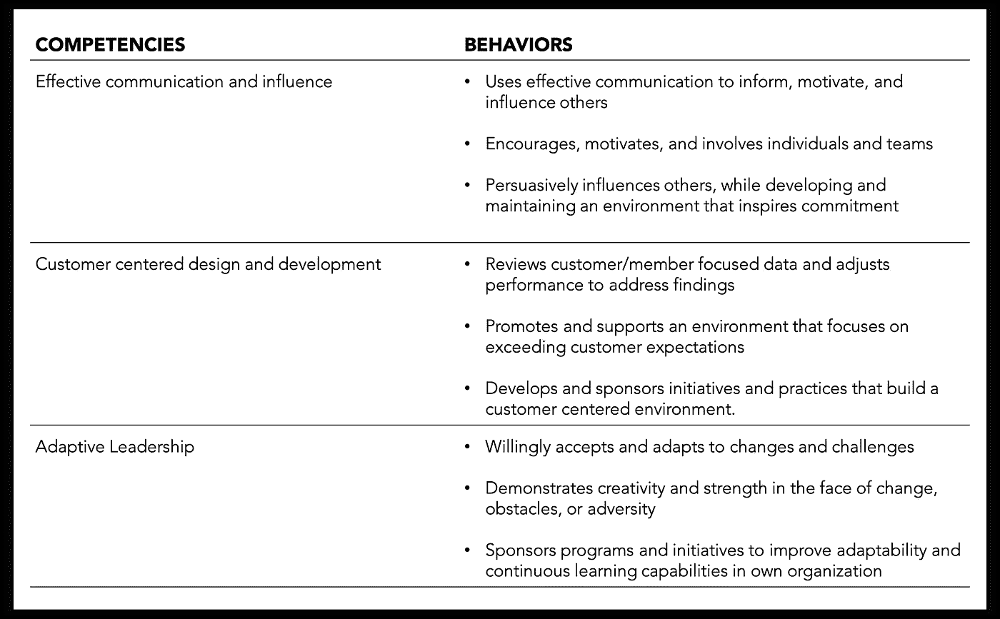

# 感知，无形的现实:我的年度评估如何几乎毁了我的一年

> 原文：<https://medium.com/walmartglobaltech/perception-the-invisible-reality-how-my-annual-evaluation-almost-ruined-my-year-960de98e4399?source=collection_archive---------3----------------------->

Photo Credit: [AOosthuizen](https://www.istockphoto.com/photo/chess-pawn-standing-in-a-spotlight-that-make-a-shadow-of-king-with-darkness-actistic-gm899065132-248088847)

Photo Credit: [carlofornitano](https://www.istockphoto.com/photo/scacchi-fotografati-su-una-scacchiera-gm914929854-251809240)

# **感知的力量**

年度评估。对于有些人来说，这是一个焦虑的时刻，因为我们等待着对我们每年的成就做出判断。

基于一年来收到的反馈，我相信自己的评估会很顺利。但在那决定性的一天，事情并没有像预期的那样发展。

现在不要误会，我非常愿意接受建设性的反馈。我真的很珍惜这个机会，去了解自己作为一名领导者可以怎样提高自己。但当我阅读这篇评论时，我发现被描述的那个人并不是我认识的那个人。

我是否给人的印象是喜欢用恐惧来激励自己，而不是营造一种开放、诚实和透明的文化氛围？从产品开发的角度来看，我是否是一个缺乏以客户为中心的人？

我知道我有时会说得直接一点，但根据反馈所描绘的人与我所代表的价值观完全相反。到底发生了什么？

随着这些话的深入，我在大约 30 秒钟内经历了一波情绪波动:

震惊->沮丧->愤怒->失望->理解

那一刻，我意识到了感知的真正力量。

我为自己描绘的现实并不是别人所看到的。现在我有两个选择:一是沮丧，对所有针对我的指控提出异议；二是接受反馈，想出一个改变人们对我的看法的计划。

我选择了后者。这篇文章概括了我目前正在努力完成的过程。

Photo Credit: [AOosthuizen](https://www.istockphoto.com/photo/white-pawn-standing-alone-in-spotlight-on-chess-board-between-black-pieces-artistic-gm899065120-248088846)

# **感知:看不见的现实**

感知是一个强大的概念。这就是**无形的现实**！

无形的现实是当别人的观点开始定义你是谁的有偏见的意见。这些观点可以来自多种来源:你个人的行为方式，同事、熟人或朋友对你的评价，或者其他人对你的任何判断或看法。

如果你对自己的看法和别人对你的看法脱节，就会产生一个认知鸿沟。

有几个原因，为什么感知差距可能发生，然而，对于这个员额，我们将重点关注缺乏一个一致的现实。

下面的三个技巧可以用来帮助缩小认知差距，并开始创造一个一致的现实的过程。

> ***技巧 1:通过展示一致的行为*** 定义你希望别人如何看待你

这项技术可以帮助你确定你希望别人如何看待你的核心能力和行为。

下图根据我的评估反馈突出显示了重点领域。

我们的目标是将此作为一种工具，让您始终专注于*展示正确的行为。*

> ****技巧 2:打造个人品牌****

*这种技巧集中在两个部分:(1)建立一个影响者和赞助者的网络(2)识别合适的机会来展示你想与现实联系起来的行为。*

*与重要的人建立关系网
影响者和赞助者将会帮助你塑造无形的现实。这些可能包括:*

*   **导师:*主张让你对自己的能力目标负责的人。*
*   **学员:*向你寻求个人和专业指导，以帮助他们在工作中取得成功的人。*
*   **团队成员:*如果你是人事经理或团队领导，这些人代表着将你视为日常活动领导者的人。*
*   **内部合作伙伴:*这些代表您可能与之合作的组织外部的个人。*

***做重要的事情** 专注于让你的努力与你的人际网络所关心的目标相一致。这样做可能有助于改变影响者和赞助商对你的看法。例如:*

*   **导师:*确定你可以帮助推动或合作的重要项目，作为展示你能力的机会。*
*   **学员:*帮助学员解决他们正在努力解决的挑战性问题。*
*   **团队成员:*用你重视的核心能力和行为以身作则，帮助你的团队解决他们可能面临的挑战。*
*   *内部伙伴:寻找机会减少对整个组织有广泛影响的流程和沟通挑战。*

*为了建立你的个人品牌，你必须有一个强大的影响力和赞助商网络，他们会代表你强调你所展示的能力和行为。*

*我们的目标是利用他人来重塑你对自己的看法。*

> ****技巧 3:收集持续的反馈，并对改变持开放态度****

*这项技术验证了你是否正在缩小感知差距。关键是与你的关系网定期举行会议，以评估他们对你在最重要的事情上的表现的看法。以下是一些有助于反馈会议的技巧:*

*   **提供清晰的反馈:*明确你希望收到的反馈类型以及你为什么需要它。此外，确认该员工乐于向您提供反馈。*
*   *保持真实:与个人建立个人联系。这样做将加强关系，确保反馈回路建立在诚实和信任的基础上。*
*   **让事情变得简单:*避开正式的 360 度反馈邮件，选择面对面的会议，或者在适当的时候寻求实时反馈。*
*   *对反馈持开放态度:当你收到反馈时，要表现得很好，保持开放的态度，并承认需要改进的地方。*

*目标是建立一个开放的沟通渠道，表明你愿意根据需要调整自己的行为。*

**

*Photo Credit: [AOosthuizen](https://www.istockphoto.com/photo/chess-pawn-standing-in-a-spotlight-that-make-a-shadow-with-darkness-gm899065376-248088859)*

# ***创造一致的现实***

*我改变别人对我看法的个人旅程是一次大开眼界的经历。这让我能够不断地自我反省，并问自己这样的问题:“此时此刻，别人是如何看待我的？这是否符合我想要表达的价值观和行为？”。*

*我意识到一个人对我的看法是主观的，帮助重塑他们心态的最佳方式是创造一个一致的现实来解决感知差距。*

*如果你在工作中遇到了类似的挑战，记住三个技巧来帮助你创造一个一致的现实:*

*   **技巧 1* :通过展示一致的行为来定义你希望别人如何看待你——列出你的三大能力以及与之相关的行为。以此为指导，帮助你专注于你希望人们如何看待你。*
*   **技巧 2:* 建立你的个人品牌——确定合适的影响者和赞助商来建立你的支持网络。将你的目标与对他们重要的计划、项目或挑战联系起来。*
*   **技巧 3:* 收集持续的反馈，并对改变持开放态度——主动寻求他人对你看法的反馈。记住，要坦率地说出你想要的反馈类型，当你收到反馈时，要思想开放，愿意改变。*

*上面的技巧将帮助你确定哪里有感知差距，并为你提供你需要的信心和技能，以创造一个别人如何看待你的一致现实。*