# 使用单层感知器的声纳数据分类

> 原文：<https://medium.com/edureka/perceptron-learning-algorithm-d30e8b99b156?source=collection_archive---------1----------------------->

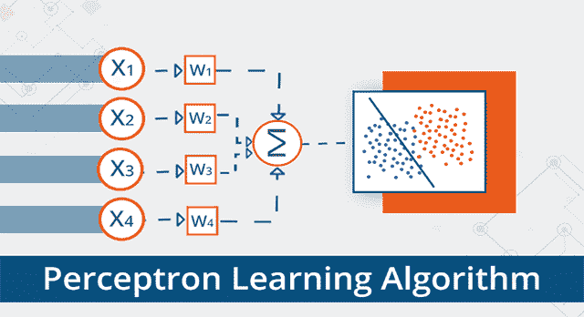

Perceptron learning Algorithm — Edureka

众所周知，感知器是创建深度神经网络的基本构件。因此，很明显，我们应该从感知器开始我们的深度学习之旅，并学习如何使用 TensorFlow 来实现它，以解决不同的问题。以下是本文将涉及的主题:

*   感知器作为线性分类器
*   使用张量流库实现感知器
*   使用单层感知器的声纳数据分类

# 分类问题的类型

人们可以将所有可以使用神经网络解决的分类问题分为两大类:

*   **线性可分问题**
*   **非线性可分问题**

基本上，如果你可以用一条线将数据集分成两类，那么这个问题就是线性可分的。*例如，从一群猫狗中分离出猫*。相反，在非线性可分离问题的情况下，数据集包含多个类，并且需要非线性线来将它们分成各自的类。*比如手写数字的分类*。让我们通过绘制线性可分问题和非线性问题数据集的图表来形象化两者之间的差异:

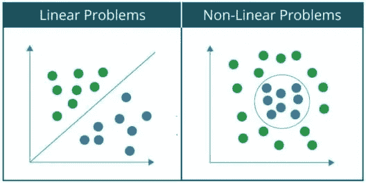

因为你们都熟悉 AND 门，我将用它作为例子来解释感知器如何作为线性分类器工作。

> **注:**当您处理更复杂的问题时，例如图像识别，您想要捕捉的数据中的关系变得高度非线性，因此需要一个由多个人工神经元组成的网络，称为人工神经网络。

# 感知器作为与门

众所周知，在所有其他情况下，如果两个输入都是 1 和 0，则与门产生的输出为 1。因此，感知器可用作分隔符或判定线，将与门的输入集分为两类:

*   **类别 1:** 输出为 0 的输入，位于判定线以下。
*   **类别 2:** 输出为 1 的输入，位于判定线或分隔符上方。

下图显示了上述使用感知器对与门输入进行分类的想法:

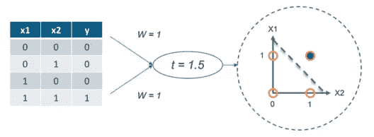

到目前为止，您已经了解线性感知器可以用于将输入数据集分为两类。但是，它是如何对数据进行分类的呢？

在数学上，可以将感知器表示为权重、输入和偏差(垂直偏移)的函数:

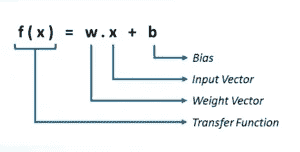

*   感知器接收的每个输入都根据其对获得最终输出的贡献量进行了加权。
*   偏差允许我们移动决策线，以便它能够最好地将输入分成两类。

理论讲得够多了，让我们看看这篇博客中关于感知器学习算法的第一个例子，我将从头开始使用感知器实现与门。

# 感知器学习算法:与门的实现

## 1.导入所有需要的库

我将从导入所有需要的库开始。在这种情况下，我只需要导入一个库，即 TensorFlow:

```
#import required library
import tensorflow as tf
```

## 2.定义输入和输出的向量变量

现在，我将为我的感知器创建用于存储输入、输出和偏差的变量:

```
#input1, input2 and bias
train_in = [
    [1., 1.,1],
    [1., 0,1],
    [0, 1.,1],
    [0, 0,1]]

#output
train_out = [
[1.],
[0],
[0],
[0]]
```

## **3。定义权重变量**

现在，我需要定义权重变量，并在开始时给它分配一些随机值。因为这里有三个输入(输入 1、输入 2 和偏差)，所以每个输入需要 3 个权重值。因此，我将为我们的权重定义一个形状为 3×1 的张量变量，它将用随机值初始化:

```
#weight variable initialized with random values using random_normal()
w = tf.Variable(tf.random_normal([3, 1], seed=12))
```

> **注意:**在 TensorFlow 中，变量是处理不断变化的神经网络权重的唯一方式，这些权重随着学习过程而更新。

## 4.为输入和输出定义占位符

在 TensorFlow 中，您可以指定占位符，以便在运行时接受外部输入。因此，我将定义两个占位符——x 代表输入，y 代表输出。稍后，您将理解如何向占位符输入内容。

```
#Placeholder for input and output
x = tf.placeholder(tf.float32,[None,3])
y = tf.placeholder(tf.float32,[None,1])
```

## 5.计算输出和激活函数

如前所述，感知器接收的输入首先乘以各自的权重，然后，所有这些加权的输入相加在一起。然后，将该求和值反馈给 activation，以获得最终结果，如下图所示，后面是代码:

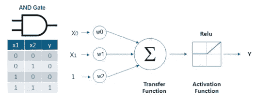

```
#calculate output 
output = tf.nn.relu(tf.matmul(x, w))
```

> **注意:**在这种情况下，我使用了 **relu** 作为我的激活函数。其他重要的激活功能将在这篇关于感知器神经网络的博客中进一步介绍。

## 6.计算成本或误差

现在，我需要计算误差值 w.r.t 感知器输出和期望输出。通常，该误差被计算为均方误差，其仅仅是感知器输出和期望输出之差的平方，如下所示:

```
#Mean Squared Loss or Error
loss = tf.reduce_sum(tf.square(output - y))
```

## 7.最小化误差

TensorFlow 提供了缓慢改变每个变量(权重和偏差)的优化器，以便在连续迭代中最小化损失。最简单的优化器是梯度下降，我将在这种情况下使用。

```
#Minimize loss using GradientDescentOptimizer with a learning rate of 0.01
optimizer = tf.train.GradientDescentOptimizer(0.01)
train = optimizer.minimize(loss)
```

## 8.初始化所有变量

当你调用 *tf 时，变量没有被初始化。变量*。因此，我需要使用以下代码显式初始化 TensorFlow 程序中的所有变量:

```
#Initialize all the global variables
init = tf.global_variables_initializer()
sess = tf.Session()
sess.run(init)
```

## **9。迭代训练感知器**

现在，我需要训练我们的感知器，即在连续迭代中更新权重和偏差的值，以最小化错误或损失。在这里，我将在 1000 个纪元中训练我们的感知机。

```
#Compute output and cost w.r.t to input vector
sess.run(train, {x:train_in,y:train_out})
cost = sess.run(loss,feed_dict={x:train_in,y:train_out})
print('Epoch--',i,'--loss--',cost)
```

在上面的代码中，您可以观察到我是如何使用 feed_dict 将 train_in(与门的输入集)和 train_out(与门的输出集)分别提供给占位符 x 和 y 来计算成本或误差的。

## 输出:

以下是我的感知器模型经过训练后得到的最终输出:

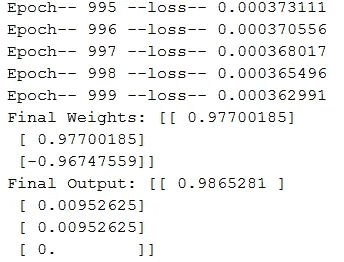

## **激活功能**

如前所述，激活函数应用于感知器的输出，如下图所示:

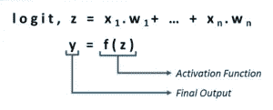

在前面的例子中，我已经向您展示了如何使用具有 relu 激活功能的线性感知器对 AND 门的输入集执行线性分类。但是，如果您希望执行的分类本质上是非线性的，该怎么办呢？在这种情况下，您将使用一种非线性激活功能。一些突出的非线性激活函数如下所示:

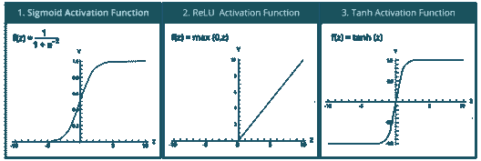

TensorFlow 库提供了应用激活函数的内置函数。下面列出了上述激活功能的内置功能:

*   **tf.sigmoid(x，name =无)**

1.  按元素计算 x 的 sigmoid
2.  对于元素 x，sigmoid 的计算公式为-y = 1/(1+exp(-x))

*   **tf.nn.relu(功能，名称=无)**

1.  将校正后的线性计算为— *max(features，0)*

*   **tf.tanh(x，name =无)**

1.  计算 x 元素的双曲正切值

到目前为止，您已经学习了感知器如何工作，以及如何使用 TensorFlow 对其进行编程。因此，是时候向前迈进，应用我们对感知机的理解来解决声纳数据分类的一个有趣用例了。

# 使用单层感知器的声纳数据分类

在这个用例中，我得到了一个声纳数据集，其中包含了 208 种模式的数据，这些模式是通过在不同条件下以不同角度从金属圆柱体(水雷)和岩石上反射声纳信号而获得的。现在，如你所知，**水雷**是一种放置在水中的独立爆炸装置，用于破坏或摧毁水面舰艇或潜艇。因此，我们的目标是建立一个模型，可以根据我们的数据集预测物体是水雷还是岩石。


现在，让我们看看我们的声纳数据集:

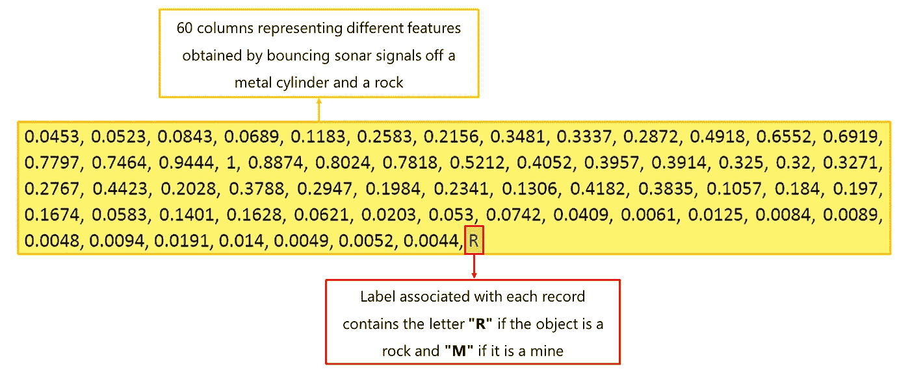

这里，整个基本过程将与 AND 门的过程相同，差别很小，为了避免混淆，将对其进行讨论。让我向您介绍使用单层感知器对声纳数据集执行线性分类的所有步骤:

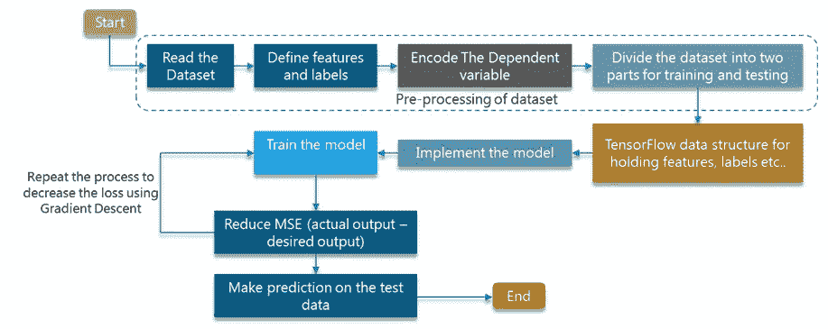

既然您已经对这个用例中涉及的所有步骤有了很好的了解，让我们继续使用 TensorFlow 对模型进行编程:

## 1.导入所有需要的库:

首先，我将从下面列出的所有必需的库开始:

*   **matplotlib 库:**提供绘制图形的函数。
*   **tensorflow 库:**提供实现深度学习模型的函数。
*   **pandas、numpy 和 sklearn 库:**提供数据预处理的功能。

## 2.读取和预处理数据集:

在前面的例子中，我定义了输入和输出变量 w.r.t. AND Gate，并显式地为它分配了所需的值。但是，在像声纳这样的实际用例中，您将获得需要读取和预处理的原始数据集，以便您可以围绕它训练您的模型。

*   首先，我将使用 read_csv()函数读取 CSV 文件(输入数据集)
*   然后，我将把特征列(自变量)和输出列(因变量)分别分离为 X 和 y
*   输出列由字符串分类值“M”和“R”组成，分别表示 Rock 和 Mine。因此，我将它们标记为 0 和 1wr . t . ' M '和' R '
*   在我将这些分类值转换成整数标签后，我将使用 one_hot_encode()函数应用一个热编码，这将在下一步中讨论。

```
#Read the sonar dataset
df = pd.read_csv("sonar.csv")
print(len(df.columns))
X = df[df.columns[0:60]].values
y = df[df.columns[60]]

#encode the dependent variable as it has two categorical values
encoder = LabelEncoder()
encoder.fit(y)
y = encoder.transform(y)
Y = one_hot_encode(y)
```

## 3.一个热编码器的功能:

一个 Hot 编码器根据列中存在的标签数量添加额外的列。在这种情况下，我有两个标签 0 和 1(代表岩石和矿井)。因此，将添加两个额外的列，对应于每个分类值，如下图所示:

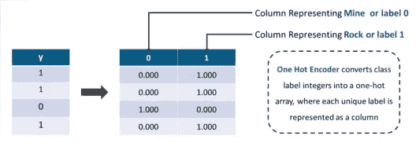

```
#function for applying one_hot_encoder
def one_hot_encode(labels):
  n_labels = len(labels)
  n_unique_labels = len(np.unique(labels))
  one_hot_encode = np.zeros((n_labels,n_unique_labels))
  one_hot_encode[np.arange(n_labels), labels] = 1
  return one_hot_encode
```

## 4.将数据集划分为训练和测试子集

在处理任何深度学习项目时，您需要将您的数据集分成两部分，其中一部分用于训练您的深度学习模型，另一部分用于在模型训练完成后验证模型。因此，在这一步中，我还会将数据集分成两个子集:

*   训练子集:用于训练模型
*   测试子集:它用于验证我们训练好的模型

我将使用 sklearn 库中的 train_test_split()函数来划分数据集:

```
#Divide the data in training and test subset
X,Y = shuffle(X,Y,random_state=1)
train_x,test_x,train_y,test_y = train_test_split(X,Y,test_size=0.20, random_state=42)
```

## 5.定义变量和占位符

这里，我将为以下实体定义变量:

*   **学习率:**权重将被调整的量。
*   **训练时期:**迭代次数
*   **成本历史:**一个数组，存储连续时期的成本值。
*   **权重:**用于存储权重值的张量变量
*   **偏差:**用于存储偏差值的张量变量

除了变量，我还需要可以输入的占位符。因此，我将为我的输入创建占位符，并在稍后用数据集填充它。最后，我会调用 global_variable_initializer()来初始化所有的变量。

```
#define all the variables to work with the tensors
learning_rate = 0.1
training_epochs = 1000

cost_history = np.empty(shape=[1],dtype=float)

n_dim = X.shape[1]
n_class = 2

x = tf.placeholder(tf.float32,[None,n_dim])
W = tf.Variable(tf.zeros([n_dim,n_class]))
b = tf.Variable(tf.zeros([n_class])
```

## 6.计算成本或误差

类似于与门实现，我将计算我们的模型产生的成本或误差。在这种情况下，我将使用 ***交叉熵*** 来计算误差，而不是均方误差。

```
y_ = tf.placeholder(tf.float32,[None,n_class])
y = tf.nn.softmax(tf.matmul(x, W)+ b)
cost_function = tf.reduce_mean(-tf.reduce_sum((y_ * tf.log(y)),reduction_indices=[1]))
training_step = tf.train.GradientDescentOptimizer(learning_rate).minimize(cost_function)
```

## 7.在连续的时期中训练感知器模型

现在，我将在连续的纪元中训练我的模型。在每个时期中，计算成本，然后基于该成本，优化器修改权重和偏差变量，以最小化误差。

```
#Minimizing the cost for each epoch
for epoch in range(training_epochs):
    sess.run(training_step,feed_dict={x:train_x,y_:train_y})
    cost = sess.run(cost_function,feed_dict={x: train_x,y_: train_y})
    cost_history = np.append(cost_history,cost)
    print('epoch : ', epoch,  ' - ', 'cost: ', cost)
```

## 8.基于测试子集的模型验证

如前所述，训练模型的准确性是基于测试子集计算的。因此，首先，我将把测试子集输入到我的模型中，并获得输出(标签)。然后，我会将从模型中获得的输出与实际或期望的输出进行比较，最后，我会计算正确预测占测试子集总预测的百分比。

```
#Run the trained model on test subset
pred_y = sess.run(y, feed_dict={x: test_x})

#calculate the correct predictions
correct_prediction = tf.equal(tf.argmax(pred_y,1), tf.argmax(test_y,1))
accuracy = tf.reduce_mean(tf.cast(correct_prediction, tf.float32))
print("Accuracy:",sess.run(accuracy))
```

## 输出:

以下是培训完成后您将获得的输出:

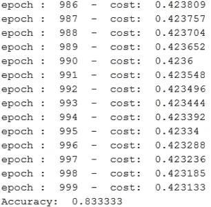

如你所见，我们得到了 83.34% 的准确度，这已经足够下降了。现在，让我们通过绘制**成本对时期数量**的图表来观察成本或误差在连续时期中是如何减少的:

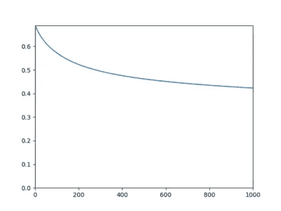

**使用单层感知器进行声纳数据分类的完整代码**

```
#import the required libraries
import matplotlib.pyplot as plt
import tensorflow as tf
import numpy as np
import pandas as pd
from sklearn.preprocessing import LabelEncoder
from sklearn.utils import  shuffle
from sklearn.model_selection import train_test_split

#define the one hot encode function
def one_hot_encode(labels):
    n_labels = len(labels)
    n_unique_labels = len(np.unique(labels))
    one_hot_encode = np.zeros((n_labels,n_unique_labels))
    one_hot_encode[np.arange(n_labels), labels] = 1
    return one_hot_encode

#Read the sonar dataset
df = pd.read_csv("sonar.csv")
print(len(df.columns))
X = df[df.columns[0:60]].values
y=df[df.columns[60]]
#encode the dependent variable containing categorical values
encoder = LabelEncoder()
encoder.fit(y)
y = encoder.transform(y)
Y = one_hot_encode(y)

#Transform the data in training and testing
X,Y = shuffle(X,Y,random_state=1)
train_x,test_x,train_y,test_y = train_test_split(X,Y,test_size=0.20, random_state=42)

#define and initialize the variables to work with the tensors
learning_rate = 0.1
training_epochs = 1000

#Array to store cost obtained in each epoch
cost_history = np.empty(shape=[1],dtype=float)

n_dim = X.shape[1]
n_class = 2

x = tf.placeholder(tf.float32,[None,n_dim])
W = tf.Variable(tf.zeros([n_dim,n_class]))
b = tf.Variable(tf.zeros([n_class]))

#initialize all variables.
init = tf.global_variables_initializer()

#define the cost function
y_ = tf.placeholder(tf.float32,[None,n_class])
y = tf.nn.softmax(tf.matmul(x, W)+ b)
cost_function = tf.reduce_mean(-tf.reduce_sum((y_ * tf.log(y)),reduction_indices=[1]))
training_step = tf.train.GradientDescentOptimizer(learning_rate).minimize(cost_function)

#initialize the session
sess = tf.Session()
sess.run(init)
mse_history = []

#calculate the cost for each epoch
for epoch in range(training_epochs):
    sess.run(training_step,feed_dict={x:train_x,y_:train_y})
    cost = sess.run(cost_function,feed_dict={x: train_x,y_: train_y})
    cost_history = np.append(cost_history,cost)
    print('epoch : ', epoch,  ' - ', 'cost: ', cost)

pred_y = sess.run(y, feed_dict={x: test_x})

#Calculate Accuracy
correct_prediction = tf.equal(tf.argmax(pred_y,1), tf.argmax(test_y,1))
accuracy = tf.reduce_mean(tf.cast(correct_prediction, tf.float32))
print("Accuracy:",sess.run(accuracy))

plt.plot(range(len(cost_history)),cost_history)
plt.axis([0,training_epochs,0,np.max(cost_history)])
plt.show()
```

# 结论

在这篇关于感知器学习算法的文章中，您了解了什么是感知器，以及如何使用 TensorFlow 库实现它。您还了解了感知器如何用作线性分类器，我演示了如何使用感知器来实现“与”门。最后，我向前迈了一步，应用感知器解决了一个实时用例，在这个用例中，我对声纳数据集进行了分类，以检测出**岩石**和**矿井**之间的差异。

如果你想查看更多关于人工智能、DevOps、道德黑客等市场最热门技术的文章，那么你可以参考 [Edureka 的官方网站。](https://www.edureka.co/blog/?utm_source=medium&utm_medium=content-link&utm_campaign=perceptron-learning-algorithm)

请留意本系列中的其他文章，它们将解释深度学习的各个其他方面。

> 1.[张量流教程](/edureka/tensorflow-tutorial-ba142ae96bca)
> 
> 2. [PyTorch 教程](/edureka/pytorch-tutorial-9971d66f6893)
> 
> 3.[tensor flow 中的对象检测](/edureka/tensorflow-object-detection-tutorial-8d6942e73adc)
> 
> 4.[神经网络教程](/edureka/neural-network-tutorial-2a46b22394c9)
> 
> 5.什么是反向传播？
> 
> 6.[卷积神经网络](/edureka/convolutional-neural-network-3f2c5b9c4778)
> 
> 7.[胶囊神经网络](/edureka/capsule-networks-d7acd437c9e)
> 
> 8.[递归神经网络](/edureka/recurrent-neural-networks-df945afd7441)
> 
> 9.[自动编码器教程](/edureka/autoencoders-tutorial-cfdcebdefe37)
> 
> 10.[受限玻尔兹曼机教程](/edureka/restricted-boltzmann-machine-tutorial-991ae688c154)
> 
> 11. [PyTorch vs TensorFlow](/edureka/pytorch-vs-tensorflow-252fc6675dd7)
> 
> 12.[用 Python 进行深度学习](/edureka/deep-learning-with-python-2adbf6e9437d)
> 
> 13.[人工智能教程](/edureka/artificial-intelligence-tutorial-4257c66f5bb1)
> 
> 14.[张量流图像分类](/edureka/tensorflow-image-classification-19b63b7bfd95)
> 
> 15.[人工智能应用](/edureka/artificial-intelligence-applications-7b93b91150e3)
> 
> 16.[如何成为一名人工智能工程师？](/edureka/become-artificial-intelligence-engineer-5ac2ede99907)
> 
> 17.[问学习](/edureka/q-learning-592524c3ecfc)
> 
> 18. [Apriori 算法](/edureka/apriori-algorithm-d7cc648d4f1e)
> 
> 19.[马尔可夫链与 Python](/edureka/introduction-to-markov-chains-c6cb4bcd5723)
> 
> 20.[人工智能算法](/edureka/artificial-intelligence-algorithms-fad283a0d8e2)
> 
> 21.[机器学习的最佳笔记本电脑](/edureka/best-laptop-for-machine-learning-a4a5f8ba5b)
> 
> 22.[12 大人工智能工具](/edureka/top-artificial-intelligence-tools-36418e47bf2a)
> 
> 23.[人工智能(AI)面试问题](/edureka/artificial-intelligence-interview-questions-872d85387b19)
> 
> 24. [Theano vs TensorFlow](/edureka/theano-vs-tensorflow-15f30216b3bc)
> 
> 25.[什么是神经网络？](/edureka/what-is-a-neural-network-56ae7338b92d)
> 
> 26.[模式识别](/edureka/pattern-recognition-5e2d30ab68b9)
> 
> 27.[人工智能中的阿尔法贝塔剪枝](/edureka/alpha-beta-pruning-in-ai-b47ee5500f9a)

*原载于 2017 年 12 月 8 日 www.edureka.co*[](https://www.edureka.co/blog/perceptron-learning-algorithm/)**。**