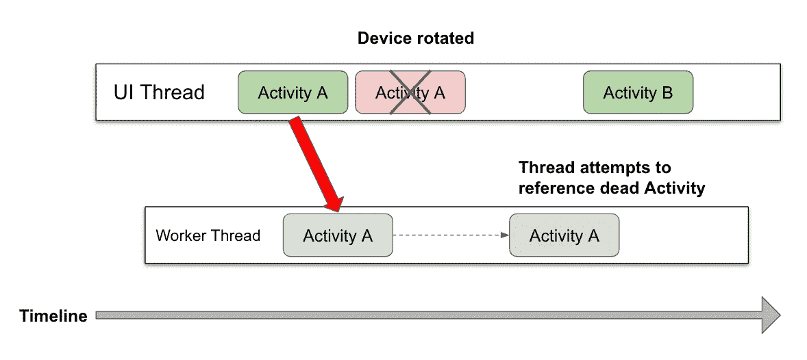

# 内存泄漏的性能考虑:Android 食谱

> 原文：<https://medium.com/google-developer-experts/performance-considerations-for-memory-leaks-an-android-cookbook-4de35f240292?source=collection_archive---------0----------------------->

## 基于“用 Android 编程 Kotlin:用 Android 编程 Kotlin”的快速参考指南

**

*在野外，Android 面临着影响性能和电池寿命的现实挑战。例如，并不是每个人的移动计划中都有无限的数据，或者可靠的连接。Android 应用程序必须相互竞争有限的资源。*

*性能考虑允许您检查可能影响应用程序伸缩能力的问题。如果您可以在代码库中使用这些策略中的任何一种作为“易得之果”,那么非常值得进行一些简单的改进，从而大大减少整体内存消耗。*

*在以下情况下会发生内存泄漏:*

*   *当堆占用分配的内存**的时间比需要的时间**长时*
*   *当一个对象在内存中被分配，但是对于正在运行的程序来说**是不可到达的***

*内存泄漏可以在应用程序代码、依赖项、Android 操作系统甚至 JVM 中找到。很难提供 Android 中可能的内存泄漏的详尽列表，但显示广泛的范围可以帮助我们更好地描述内存泄漏的情况(以及快速改进/修复)。*

# *Android 组件和冲突的生命周期*

*Android 由一个运行组件库组成。 [Android 应用程序组件](https://developer.android.com/guide/components/fundamentals#Components)每个都有自己的生命周期，由 Android 框架创建、管理和销毁，而不是由应用程序代码创建、管理和销毁。这使得 Android 操作系统与其他操作系统的工作方式不同，也使得 Android 中的内存泄漏如此…..很特别。下面是相关示例以及如何处理这些示例的快速记分卡:*

```
***1\. Statically-saved Android UI components** → remove
**2\. Android UI interaction/DI within non-Android classes** → remove
**3\. Playing with Bitmaps** → reduce, reuse, recycle!*
```

## ***1。静态保存的 Android UI 组件** →移除*

*静态保存的引用被永久存储在 JVM 中，这意味着在应用程序的整个生命周期中，它不会被垃圾收集。避免在 Java 中使用静态关键字或者在 Kotlin 的伴随对象中意外保存 Android `Activity` / `View`。*

*Android 中的一个`View`通过`getContext()`隐式引用了与之关联的`Activity`，并且也能够引用它自己的子节点。如果任何对象在被销毁时碰巧持有对一个`Activity`、它的`Context`或它的任何视图的引用，那么`Activity`将连同它的整个`View`树一起泄漏。大泄漏。*

*所以去掉那些对 UI 组件的静态引用！*

## ***2。来自非 Android 类的 Android UI 交互/DI**→移除*

*开发人员通常会在非组件类中注入 Android 组件。然而，这样做的问题是，这也要求开发人员试图自己管理 Android 组件的生命周期。这并不是不可能做到，更多的是考虑到生命周期中所有可能的情况是非常困难的。这也包括 Android Jetpack 组件，如`Navigation`和`Composable`视图！*

*只在 Android 组件类中保留 Android 组件和交互:这样，处理生命周期问题就不是你工作的一部分了。*

*一个常见的错误——永远不要将 an `Activity` / `Fragment`(或其`Context`)直接注入到您的 presenter 类中！*

*使用一个接口绑定到相关的`Activity` / `Fragment`就是我们如何发送一个回调来更新 UI，同时将 UI 交互的责任保留在`Activity` / `Fragment`中。*

*业务逻辑旨在保持状态，即使在活动本身死亡之后…但仅仅是状态！*

## *3.玩位图→减量化，再利用，再循环！*

*位图很容易耗尽应用程序的内存预算。例如，Pixel 手机上的摄像头拍摄的照片高达 4048 x 3036 像素(1200 万像素)。如果使用的位图配置是`ARGB_8888`，从内存中解压缩和加载一张照片需要大约 48MB 内存(4048 x 3036 x 4 字节)。如此大的内存需求会立即耗尽应用程序的所有可用内存，这对用户没有好处！*

*这就是为什么尽可能减少、重复使用和回收位图是很重要的。降低你的图像质量如果你把它作为一个小的 AVI，缓存和重复使用已经绘制好的位图。*

*位图不仅是可能消耗的主要来源，而且如果你忘记回收，它们也是可能的内存泄漏的来源。*

*当不再使用位图时，使用`bitmap.recycle()`来回收内存。如果你的应用程序显示大量的位图数据，很可能会遇到`[OutOfMemoryError](https://developer.android.com/reference/java/lang/OutOfMemoryError)`。`[recycle()](https://developer.android.com/reference/android/graphics/Bitmap#recycle())`方法帮助应用程序尽快回收内存。*

# *冲突的生命周期…但是使用线程:(*

*使用线程已经很复杂了，需要理解线程安全规则。一个线程有自己的生命周期，独立于任何 Android 组件的生命周期:一个线程启动，做一些工作，当工作完成时，线程死亡。如果工作没有完成/取消，那么线程就不能死。*

*下面是并发内存泄漏的可能来源以及如何处理它们的快速记分卡示例:*

```
***4\. Android UI references in background threads** → remove **5\. Non-static inner classes within Views/Activities** → remove*
```

## *4.后台线程中的 Android UI 引用→移除*

*假设创建了一个工作线程，它在活动本身创建后不久就在后台线程中保存了对某个活动的引用。在 Android 内存管理中，每个线程都由堆中的“区域”来表示。没有一个区域可以访问另一个“区域”中的对象。*

*当用户运行应用程序并旋转设备时，活动被破坏。从活动创建的工作线程将继续运行，直到其工作完成。不幸的是，这项工作永远不会完成，这是由于最近无法访问对先前活动实例的引用。*

*GC 可能无法处理死的活动引用，更糟糕的是:当线程结束时，它试图更新对活动的引用，但没有什么可更新的，导致应用程序崩溃。*

**

*所以 Android UI 组件不是线程安全的。可以终止一个活动，但这不一定会终止一个后台线程。由于这种易变的复杂性，内存泄漏是可能的，因为组件的任何实例都很容易变成死负载。*

*我们应该如何从线程工作中更新 UI？这里的技巧是强制顶级活动或片段成为负责更新 UI 对象的唯一系统。*

*开发人员有责任确保繁重的工作被发送到后台线程。如果 UI 必须更新，那么在更新 UI 之前，结果被返回给主线程*。**

## *5.视图/活动中的非静态内部类→删除*

*内的内部类保存对封闭类的隐式引用，直到对象被销毁。这是一个棘手且常见的内存泄漏源，尤其是在线程方面:*

*如果`TileImageView`的实例被破坏，一个隐式引用将被任何一个保持`TileImageLoadedCallback`存活的线程所劫持。*

*用`static`关键字*标记内部类可能是*的一种解决方案，因为静态类在没有显式引用的情况下可能不会引用包含类的成员，并且被认为是顶级声明。*

*这个问题也可以通过传递如下所示的侦听器模式来解决:*

*现在我们传递一个监听器来触发`onSuccess`调用，这个调用现在在它的父类中实现。当`onSuccess`启动一个新线程时，它不再持有对父类的隐式引用(在本例中是`MapTileActivity`)。*

*您在代码库中发现了这些简单的变化吗？如果是这样，您可以通过使用 Android studio 中的内存分析器进行`.hprof`记录来修复您自己的内存泄漏并检查内存消耗的差异！您还可以导入您的`.hprof`记录，以便使用 Eclipse 的[内存分析器](https://www.eclipse.org/mat/)更深入地研究，或者使用其他开源性能工具，例如 [Perfetto](https://perfetto.dev/) 。*

# *我如何发现 Android 中其他类型的内存泄漏？*

*你需要两件事:1)内存分析，2)深入了解 Android 组件生命周期和内存管理。如果你喜欢这篇文章，你可以在新出版的 [*用 Kotlin 编程 Android:用协程*](https://www.oreilly.com/library/view/programming-android-with/9781492062998/) *实现结构化并发中找到更多关于 Android 性能和内存管理的深入考虑。**

*你也可以看看这个迷你系列的[第二部分](https://hinchman-amanda.medium.com/performance-considerations-for-memory-leaks-an-android-cookbook-part-2-b797a6e6b6e2)来看看另一组快速的低投入大回报的胜利！*