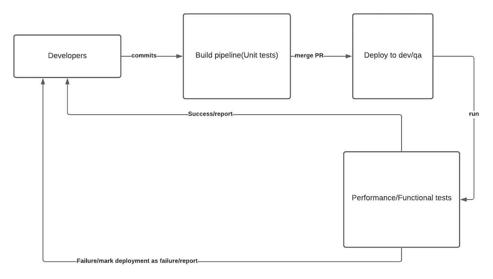

# CICD 的性能/功能测试

> 原文：<https://medium.com/walmartglobaltech/performance-functional-tests-in-cicd-7d6e889f0a1f?source=collection_archive---------1----------------------->


Photo Credit: [herbert2512](https://pixabay.com/users/herbert2512-2929941/)

在本文中，我们将讨论 CI/CD 期间应用程序服务的性能/功能测试的角色和重要性。

想象一个在 CI/CD 管道中没有自动化测试的应用程序，没有明确的方法

*   测试稳定性，自动微调满足 SLA 需求所需的合适内存/CPU 内核。
*   对于开发人员以自动化方式提交的每个更改，测试应用程序整体的端到端功能是完整的。

## 性能测试:

编写性能测试是为了确保应用程序

*   满足预期的响应时间
*   可以处理应用程序的 SLA 活动用户
*   变化负载下的应用稳定性

有多种工具可以自动化性能测试。我们在沃尔玛使用一个名为 Automaton 的自制 SAAS 工具，它利用 JMeter 代理来自动化性能测试。设置非常简单，只需在一个 json 文件中配置应用程序 SLA 需求，该文件配置虚拟用户、SLA 响应时间等。

```
{
  "projectName": "some-project",
  "request": [
    {
      "transactionName": "some-action",
      "rampUp": {
        "totalVU": 30,
        "initaldelay": 0,
        "rampupvu": 30,
        "rampduration": 1,
        "holdrampup": 1,
        "duration": 1
      },
      "api": [
        {
          "name": "some-action",
          "method": "GET",
          "url": "https://some-endpoint",
          "headers": {
            "content-type": "application/json"
          },
          "validate": [
            {
              "validation_type": "response_code",
              "condition": "equals",
              "text": "200",
              "scope": "all"
            }
          ]
        }
      ]
    }
  ]
}
```

## 功能测试:

编写功能测试是为了测试应用程序的端到端功能，这可能涉及与多个服务的交互。

我们有用 Java Cucumber framework 编写的服务功能测试，其中测试是用 gherkin 语言以行为驱动的开发方式编写的。一个典型的测试可能如下所示，来自 JIRA 测试套件，通过 JIRA 集成。

```
Feature: Is it Friday yet?
  Everybody wants to know when it's Friday

  Scenario: Sunday isn't Friday
    Given today is Sunday
    When I ask whether it's Friday yet
    Then I should be told "Nope"
```

## CICD 的性能/功能测试:

在成功的应用服务构建(在此阶段执行单元测试)和成功的部署之后，性能和功能测试在 CICD 管道中被调用。

*   性能测试确保服务稳定、快速、可靠，并满足 SLA 需求。
*   功能测试确保在将更改作为服务的一部分进行部署后，应用程序的端到端功能仍然保持良好。



Performance/Functional tests in CICD pipeline

从上图中可以看出，在将应用程序部署到开发/qa 环境后不久，性能和功能测试开始执行，报告被发送到 slack 渠道/电子邮件。如果执行性能或功能测试失败，部署将被标记为失败，并开始部署的回滚。

在测试成功的情况下，性能测试报告/功能测试报告被发送给团队。

## 性能测试报告:

发送的性能测试报告包括

*   成功请求的数量
*   达到的 TPS(每秒事务数)
*   失败请求的数量

这些指标始终可用于调整容器的给定 pod 上的内存/CPU 核心，以满足 SLA 需求。

## 功能测试报告:

部署日志中的功能测试报告将帮助开发人员确保端到端的功能不会受到应用程序中添加的每个新功能的干扰。在典型的微服务架构中，这将涉及功能测试，其中多个服务可以相互通信，以确保通信仍然完好无损，并符合业务需求。

## 结论:

对 CI/CD 管道进行自动化的性能/功能测试只会使应用程序以自动化的方式为最坏的情况做好准备。明智的做法是预见到未来可能出现的问题，因为活动用户数量会出现意想不到的高峰，应用程序功能会自动检查每一个变化。

最后，一个好的开发人员会睡个好觉，并保持适当的工作生活平衡，这只能通过尽可能地自动化事情来实现，只有当计算之神生气时才进行人工干预。