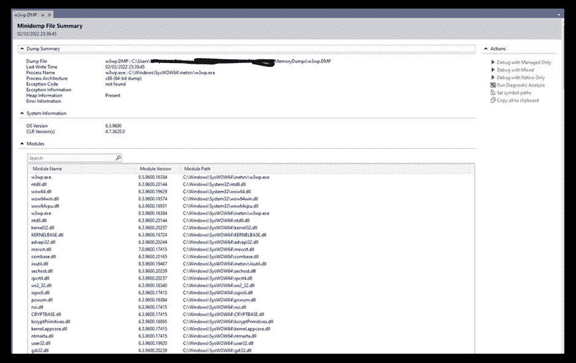

# IIS 工作进程(W3PWP.EXE)的性能影响和故障排除。

> 原文：<https://medium.com/version-1/performance-impact-and-troubleshooting-iis-worker-w3pwp-exe-process-cce911d8cbea?source=collection_archive---------4----------------------->

IIS 中托管的 web 应用程序的性能可能会受到工作进程达到或最大限度地利用 CPU 资源的影响，并显示 100%,这导致后续请求因缺乏资源而堆积。我写这篇文章是因为我在生产机器上的一个项目中遇到了类似的问题，这些问题阻碍了用户，并且我们听到了很多关于应用程序运行缓慢的抱怨。

利用 CPU 资源的 IIS 工作进程可能是由各种原因造成的。在这篇博客中，我们将调查一些最大的可能性以及如何解决它们。

**可能导致 IIS 工作进程(w3pwp.exe)使用最大 CPU 资源 w3pwp.exe 的一些常见原因有:**

1.  请求在 ASP.NET 管道中受阻或受阻
2.  web 应用程序中的高错误率
3.  高网络流量
4.  碎片帐集
5.  效率低下。网络代码
6.  应用程序依赖关系过时或有问题

我将只讨论上述场景中的某些要点，并深入探讨第 1 点，以识别和分析它。

**请求在 ASP.NET 管道受阻或被卡**

这里要做的第一件事是查看当前正在运行的请求，并调查它们是否被阻塞或挂起。这可能会给出哪些请求花费了很长时间或被阻塞的简要指示。可能存在排队的请求，这些请求并不直接是问题的一部分，也不是警报的原因。

## 识别

ASP.NET 请求的生命周期中有许多步骤。基本步骤包括认证、授权、评估 http 请求和完成请求。如果面临任何性能问题，首先要识别特定的 http 模块。

打开 IIS 管理控制台，您可以查看正在运行的工作进程，选择导致高 CPU 的有问题的 IIS 应用程序池，并查看当前正在运行的请求。

**从 IIS 中选择工作进程，可以看到当前正在运行的 IIS 工作进程。**

双击应用程序池名称，它将让您查看所有当前正在执行的请求。您可以看到每个请求位于 ASP.NET 管道的不同部分，并且当前正在执行不同的 HTTP 模块。

上面的快照为您提供了当前正在执行的请求的信息。

*   URL:正在执行的完整 URL
*   time:web 请求执行的总时间，以毫秒为单位
*   客户端:发起请求的用户的 IP 地址
*   状态:请求当前正在其中运行的 IIS 管道的阶段
*   模块:当前正在执行的 ASP.Net 模块。

## **分析**

要更深入地了解实际问题的原因，您可以从 w3wp.exe 进程中获取类似于下面的内存转储:

然后使用微软或 visual studio 的 [debugdiag](https://www.microsoft.com/en-us/download/details.aspx?id=58210#:~:text=The%20Debug%20Diagnostic%20Tool%20(DebugDiag,in%20any%20user%2Dmode%20process.) 之类的工具来分析内存转储，缩小导致请求阻塞的线程范围。让我们看看如何才能理解相同。

点击 Start Analysis，它将生成一个类似下面示例的报告，其中包含 CPU 时间排名靠前的线程，以及线程中是否发生了导致线程阻塞的任何错误的详细信息。

在 visual studio 中打开与下面相同的文件，对线程运行分析将为您提供更多的信息，以便您进行识别和操作。

点击上图右上方的“运行诊断分析”,获取详细信息，进一步确定根本原因。

## **可能的解决方案**

线程上的异常将清楚地指出是哪部分代码导致线程中断和请求阻塞。我遇到的一些提示。

1.  在上面的案例中，我们有一个场景，[并发字典修改陷阱](https://aloiskraus.wordpress.com/2021/08/11/concurrent-dictionary-modification-pitfalls/)
2.  检查并设置应用程序的应用程序池，以及时清除重置。
3.  另一种可能的情况是增加[RequestQueueLimitPerSession](https://docs.microsoft.com/en-us/dotnet/framework/migration-guide/retargeting/4.6.2-4.7)。

## **网络应用中的高错误率**

工作进程高 CPU 使用率的另一个可能原因是您可能不知道的大量应用程序错误，其中一些错误可能被用户收到的一般消息或普通消息所掩盖。我们可以确保使用错误监控或应用程序性能管理工具来识别错误。其他地方或更常见的地方是生成的 IIS 日志，其中包含请求的详细信息、响应、请求的任何问题、网络相关故障等。这应该是你开始调查的理想地点。

此外，您可以在 windows 中查看性能监视器，并使用如下计数器对其进行分析:

*   NET CLR Exceptions-->/秒抛出的异常数:检查此项以查看您的应用程序是否抛出了大量异常。您的应用程序可能会有许多隐藏的错误，从而导致严重的性能问题。任何例外都是不好的，但有些是不可避免的。
*   W3SVC _ W3WP--> % 500 已发送 HTTP 响应:任何带有 500 状态代码的请求都是内部服务器错误。确保这个百分比非常低。应该是 0–1%。

## **网络流量高**

有时，工作进程高 CPU 使用率的一个简单解释可能是 web 流量的增加。

您可以使用 IIS 日志文件来查看特定日期的请求池数量，您可以使用像 [IIS 日志浏览器](https://www.finalanalytics.com/products/httplogbrowser)这样的工具来分析请求，这可以提供时间戳、URL、状态、失败原因、客户端 IP 等主要细节。也给你的报告工作，以确定最命中网址，最失败的网址等。

## **垃圾收集**

微软。NET 利用[垃圾收集](https://docs.microsoft.com/en-us/dotnet/standard/garbage-collection/?redirectedfrom=MSDN)来管理内存的分配和释放。

根据您的应用程序所做的事情，应用程序内存的分配和清理可能会导致大量的垃圾收集活动。例如，在大型对象堆上使用大量大型字符串变量会导致垃圾收集问题。

若要衡量垃圾收集是否会给应用程序带来问题，请检查以下 Windows 性能计数器:

**。NET CLR Memory - > %如果这个数字大大超过 5–10 %,您需要进一步调查内存使用情况。**

垃圾收集也有两种模式。您可能需要启用[服务器模式](https://msdn.microsoft.com/en-us/library/cc165011(v=office.11).aspx)，这不是默认模式。

## **效率低下。网络代码**

效率低下。如果没有其他结果，就需要研究一下. NET 代码。可以使用[之类的剖析器。NET Profiler](https://docs.microsoft.com/en-us/dotnet/framework/unmanaged-api/profiling/profiling-overview) 或[ANTS performance Profiler](https://www.red-gate.com/products/dotnet-development/ants-performance-profiler/)捕获被调用的函数并进一步分析它们。profiler 提供了 CPU 使用的开销情况，因此如果您已经使用了 85%以上，那么运行 profiler 将会很困难，这可能会导致它达到 100%并使应用程序不可用。

## **应用依赖关系过时或有问题**

拥有第三方依赖关系会导致使用旧的、易受攻击的版本，识别应用程序上的依赖关系，并定期更新它们，以更新安全、漏洞、内存泄漏或任何其他由于这些依赖关系而可能发生的问题，这些依赖关系没有清楚地记录。

## **结论**

希望在阅读完这篇文章后，您将有一个起点来分析您的性能问题，改进它，而不是在一个关键阶段，您的应用程序将因为 100%的 CPU 使用率而被折腾。我希望这篇简短的文章给你一个视角，并指导你采取必要的步骤来解决这个问题。

**关于作者:** 达尔山·拉维普拉卡什(Darshan Raviprakash)是一名大四学生。Net 开发人员在这里的版本 1。