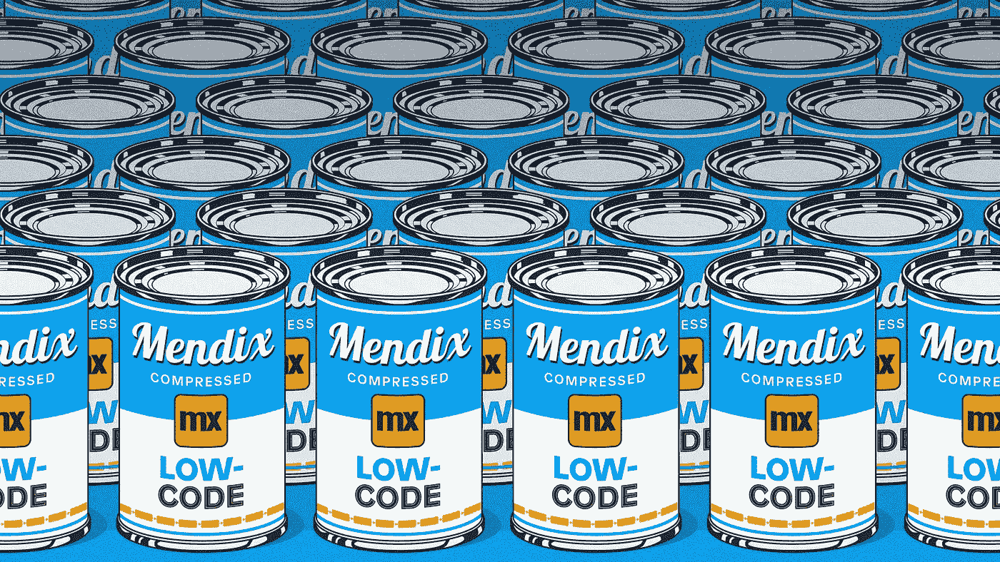
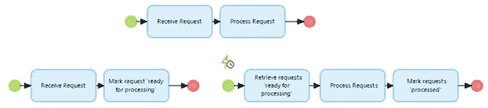
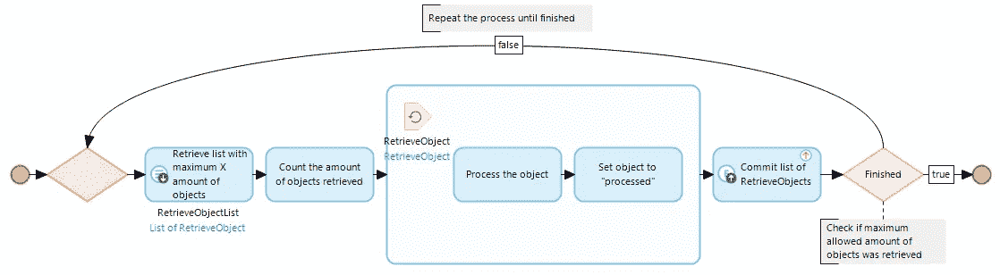
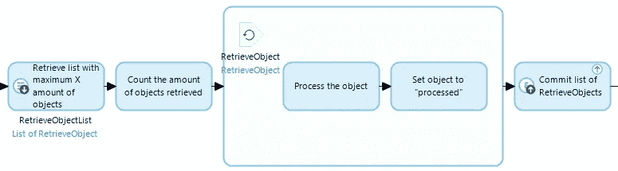

# Mendix 中的性能建模—批处理

> 原文：<https://medium.com/mendix/performance-modeling-in-mendix-batch-processing-1ed245a1e23b?source=collection_archive---------1----------------------->

# 尽管有些人可能会说像 Mendix 这样的低代码平台限制了开发人员可以构建的东西，但是构建支持复杂业务流程的应用程序是非常容易的。但是就像其他编程语言一样，你需要密切关注性能。

# 在这一系列的博客中，我将讨论在保持 Mendix 应用程序正常运行中起重要作用的几个方面。

# 第 2 部分:批处理

批处理可以缓解各种潜在的性能问题。无论是数据清理、转换、生成报告，还是只需更新业务流程中的大量对象；使用批处理将提高应用程序的性能。

批处理是您不希望给最终用户带来麻烦的事情，因此它与多个步骤中流程的解耦或分离密切相关。由于大多数批处理过程是通过预定事件运行的，您将在以下示例中看到，几乎所有批处理过程都实现了固有的过程分离。

Separation of process and processing via batches

在这篇博客中，我将重点讨论批处理部分，因为这是性能优势的来源。我将解释在哪些情况下批处理可以提高性能，并且我将更详细地介绍批处理的用例以及实现类型。在讨论不同的场景时，我还将添加一些提示、技巧和在实现批处理过程时需要注意的事情。

## 批处理的类型

批处理的实现有很多原因。这可能是因为您不想让最终用户不得不等待一个过程结束。因此，不是在同一个事务中执行它，而是在一个对象上设置一个*已处理属性* 为某个状态，并实现一个定期检查是否有任何对象需要处理的预定事件。

也可能是您希望将传入消息的处理分散到更长的时间内，以避免系统过载。传入的消息被保存，并由批处理过程周期性地拾取。

第三个选择是转换，这是大多数开发人员都非常熟悉的。通常，当添加新功能时，旧数据需要更新以适应新的工作方式。通过设置默认值或者例如重新计算系统中的每个订单来设置新添加的属性。

## 批处理的单个微流执行

大多数 Mendix 顾问都会记得，在 Mendix 中构建批处理的默认方式是学习以下结构:

Default batch process structure: Process entire list through loop functionality

可能会有一些变化，在重复该过程之前清除列表，为下一次检索增加偏移量，和/或创建一个额外的*提交列表*，以便在整个过程完成时只提交一次。
这些类型的微流可能一天只需要执行一次，因为整个对象列表是一次性处理的。

然而，如果我们完全诚实的话，这真的不是一个批处理过程。因为单个微流是在单个事务中执行的，所以对于在该微流中执行的每个后续检索，该过程将变得更慢。
你也不能保证这个过程需要多长时间，因为这取决于需要处理的对象总数。

就我个人而言，我并不喜欢这种批处理，但是我会给你一个提示，它可能会让你避免一些意想不到的奇怪行为:

> 当实现如上所述的批处理过程时，检查您为检索到的对象执行的过程是否对检索到的对象的属性或关联有影响是非常重要的。

这对于确定是否需要使用*偏移量*非常重要。

> 如果对象的处理影响了它是否匹配下一次检索的 XPath 约束，则不需要使用偏移量，因为对象没有被检索，因此不需要被跳过。

**例如:**

如果删除操作在下一次检索之前执行，则批量删除不需要偏移。如果您正在使用一个*处理过的属性*，如果提交操作在下一次检索之前执行，您就不需要偏移。

## 批处理的快速微流执行

为了确保批处理的每次执行花费相同且可预测的时间，您可以减少执行之间的间隔，并且每次执行只执行一次检索。

Actual batch process structure: Only perform one retrieve and commit per transaction

使用这种实现，您实际上是在成批处理对象，因为每个检索、处理和提交序列都是在单独的事务中执行的。

因为这种实现意味着您需要多次执行流程，通常是快速连续地执行，这也可能意味着您需要实现自定义功能，以确保执行只发生在一天中不会影响其他流程的那些时刻。

> **创建一个*批处理*实体，您可以在其上设置一天中流程可以运行的时间范围。**

例如，通过这种设置，您可以确保每 5 分钟运行一次批处理，但只能在晚上 1:00 到 4:00 之间运行。当然，计划的事件将全天执行，但是只执行一个简单的检查来确定实际的流程不应该被执行。

## 总结&下一步做什么

批处理可以分散应用程序的负载，可以减少最终用户的等待时间，如果实现正确，将大大减少执行的数据库事务的数量。

在本系列的第 1 部分中，我谈到了索引来提高检索速度。通过批处理保持数据的整洁，肯定也有助于提高应用程序的速度。

去看看您的应用程序中任何现有的批处理进程，它们可能会受益于 ***快速微流执行*** 的实现方式。此外，仔细看看当最终用户提出请求时可能不需要直接执行的流程(因此可以安排进行批处理)。

最后，看看您的应用程序中的数据何时以及如何被大量处理或清理，以及这些过程是否被执行了足够的次数，是否应该被拆分，或者在一天中的其他时间执行。

## 阅读更多

 [## 极限和偏移| Mendix

### 最近，我遇到了一个问题，我导入到我的应用程序中的数据没有得到更新，尽管我…

www.mendix.com](https://www.mendix.com/blog/limits-and-offsets/)  [## 检测并解决性能问题- Studio Pro 9 操作指南| Mendix 文档

### 任何应用程序都可能遇到性能问题。本文档描述了您可能遇到的一些性能问题…

docs.mendix.com](https://docs.mendix.com/howto/monitoring-troubleshooting/detect-and-resolve-performance-issues) 

*来自发布者-*

如果你喜欢这篇文章，你可以在我们的 [*中页*](https://medium.com/mendix) *找到更多类似的文章。对于精彩的视频和直播会话，您可以前往*[*MxLive*](https://www.mendix.com/live/)*或我们的社区*[*Youtube PAG*](https://www.youtube.com/c/MendixCommunity/community)*e .*

*希望入门的创客，可以注册一个* [*免费账号*](https://signup.mendix.com/link/signup/?source=direct) *，通过我们的* [*学苑*](https://academy.mendix.com/link/home) *获得即时学习。*

有兴趣更多地参与我们的社区吗？你可以加入我们的 [*Slack 社区频道*](https://join.slack.com/t/mendixcommunity/shared_invite/zt-hwhwkcxu-~59ywyjqHlUHXmrw5heqpQ) *或者那些想要更多参与的人，看看加入我们的*[*Meetups*](https://developers.mendix.com/meetups/#meetupsNearYou)*。*