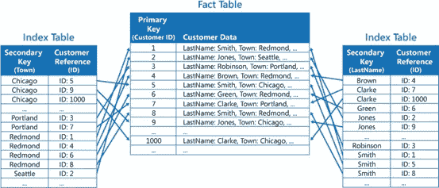
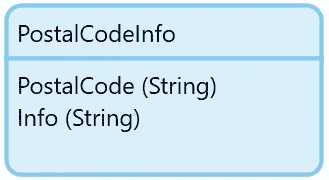
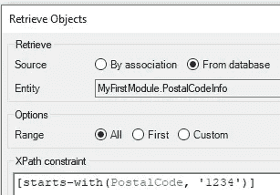

# Mendix 中的性能建模—索引

> 原文：<https://medium.com/mendix/performance-modelling-in-mendix-indexes-e5d6688d2701?source=collection_archive---------3----------------------->

Performance modeling in Mendix — Indexes

# 尽管有些人可能会说像 Mendix 这样的低代码平台限制了开发人员可以构建的东西，但是构建支持复杂业务流程的应用程序是非常容易的。就像其他编程语言一样，你需要密切关注性能。

# 在这一系列的博客中，我将讨论在保持 Mendix 应用程序正常运行中起重要作用的几个方面。

# **第一部分:索引**

当被要求查看一个性能不佳的 Mendix 应用程序时，我首先要做的事情之一是询问最大的实体是什么(数据库中预期的对象数量和属性数量)，然后询问是否实现了任何索引。
大多数时候，我得到的回答是这样的:“我以前实际上没有使用过索引”，或者“我不知道应该在何时何地添加索引”。

> [索引](https://docs.mendix.com/refguide/indexes)提高检索对象的速度。如果在搜索字段中使用了索引属性，那么数据库检索的 XPath 约束不仅适用于微流，还适用于数据网格、列表视图和模板网格的 XPath 约束！

在这篇博客中，我将解释并展示 Mendix 中实体的索引是如何工作的，我如何实现索引，并提供一些关于在 Mendix 中使用索引的有用提示和技巧。

## 指数是做什么的？

向表中添加索引会创建一个新表，该表只包含选定的一个或多个属性以及作为列的主键。请参见下面的示例。

Customer table with index tables for searching on Town or LastName

Mendix 应用程序数据库中的常规事实表总是按 Mendix ID 排序(这是所有 Mendix 对象的主键)。通过创建索引表，当执行包含索引表排序所依据的属性的查询时，可以更快地找到数据。相应的主键，在我们的例子中是 Mendix IDs，然后可以传递给事实表来检索原始和完整的对象。

> 在上面的例子中，所有住在 Redmond 的客户都可以很快找到。这是因为它们都在左侧索引表中分组在一起，因为它是按属性 Town 排序的。因为所有包含 Redmond as 值的对象都被分组在一起，所以不需要检查整个表。

## 我应该如何实现索引？

最好是，当应用程序的性能不再最佳时，不要添加索引。相反，您希望考虑表的未来大小，并在那些将来从中受益最大的实体上实现索引。在开发开始时，或者当您已经在生产环境中运行时，添加索引的过程非常相似。

1.  **确定哪些实体被查询得最多，具有很多属性，或者可能包含很多对象。**
2.  **识别查询中最常用的实体属性。**
3.  **确保对同一实体的查询以相似的方式构建，以实现索引的重用并防止不必要的索引**
4.  **添加指标并测试，如果可能的话，绩效结果的差异。**

## 提示、技巧和最佳实践

不要对每一个单独的属性(或者变化很小的属性)都进行索引！每个索引创建一个新表，使你的数据库变得更大。对象的每次更新也会导致所有相关索引表的更新。
其次，将索引放在大多数值相同的属性上(例如布尔值)，并不会真正提高性能，因为表的大部分仍然需要计算。

**索引对于检索量远大于变化量的实体最有用！**
索引稍微降低了表更新的性能，因为索引表也需要更新，但是它们极大地提高了检索的性能。

**确保索引的顺序(如果使用多个属性)与检索约束的顺序相同！**
只有当 XPath 约束与索引属性的顺序相同时，才会使用多属性索引。

> 从左到右检查索引，从上到下评估 XPath 约束。

**向现有应用程序添加索引会影响您的下一次部署。** 如果您有一个包含大量对象的实体，创建新索引会影响您下一次部署的数据库同步部分，因为需要创建一个全新的索引表。测试停机对具有相似数据量的另一个环境的影响。

## 真实世界的例子

假设您的应用程序中有一个 PostalCode 表，其中保存了荷兰的所有 postal code(即“1234AB”)。大约有 460，000 个。

我们将执行下面的检索，第一次是在没有索引的表上，第二次是在添加了索引之后。

Retrieve all PostalCodeInfo objects for postal codes that start with 1234

在没有索引的情况下，对 460，000 个对象的表进行检索的平均持续时间大约为 **260 毫秒**。
在我们为 PostalCode 属性添加了一个索引之后，这个数字下降到了 **3 毫秒！！！** 这几乎减少了执行查询所需的时间 **99%!当然，260 毫秒可能听起来不多，但是如果这个查询每分钟执行数百次，您肯定会注意到不同之处！**

## 总结&下一步做什么

从上面的例子可以看出，索引非常强大，可以大大提高检索速度。由于对数据库大小和更新速度的额外影响，请确保不要过度。确保根据检索和索引的约束和属性顺序正确设置它们。

看看你的一个应用程序，找到“最大的”实体，它们被检索的地方，实现并测试你的第一个索引！

## 阅读更多

 [## 索引- Studio Pro 9 指南| Mendix 文档

### 索引是在实体的底层数据库表上为其创建数据库索引的属性列表…

docs.mendix.com](https://docs.mendix.com/refguide/indexes)  [## 对您的 Mendix 应用程序进行负载测试

### 作为一名 Mendix 性能专家，我很高兴我们的 Mendix APM R&D 团队为我们的 Mendix 开发了一个加载工具…

www.clevr.com](https://www.clevr.com/blog/mendix/load-testing-your-mendix-application)  [## 实现应用性能的社区最佳实践- Studio Pro 9 操作指南| Mendix…

### 本文档由 Mendix 社区创建并为其服务。它以实践的形式收集性能最佳实践…

docs.mendix.com](https://docs.mendix.com/howto/general/community-best-practices-for-app-performance)  [## 检测并解决性能问题- Studio Pro 9 操作指南| Mendix 文档

### 任何应用程序都可能遇到性能问题。本文档描述了您可能遇到的一些性能问题…

docs.mendix.com](https://docs.mendix.com/howto/monitoring-troubleshooting/detect-and-resolve-performance-issues) 

*来自发布者-*

*如果你喜欢这篇文章，你可以在我们的* [*中页*](https://medium.com/mendix) *找到更多喜欢的。对于精彩的视频和直播会话，您可以前往*[*MxLive*](https://www.mendix.com/live/)*或我们的社区*[*Youtube PAG*](https://www.youtube.com/c/MendixCommunity/community)*e .*

*希望入门的创客，可以注册一个* [*免费账号*](https://signup.mendix.com/link/signup/?source=direct) *，通过我们的* [*学苑*](https://academy.mendix.com/link/home) *获得即时学习。*

有兴趣加入我们的社区吗？你可以加入我们的 [*Slack 社区频道*](https://join.slack.com/t/mendixcommunity/shared_invite/zt-hwhwkcxu-~59ywyjqHlUHXmrw5heqpQ) *或者那些想要更多参与的人，看看加入我们的*[*Meetups*](https://developers.mendix.com/meetups/#meetupsNearYou)*。*