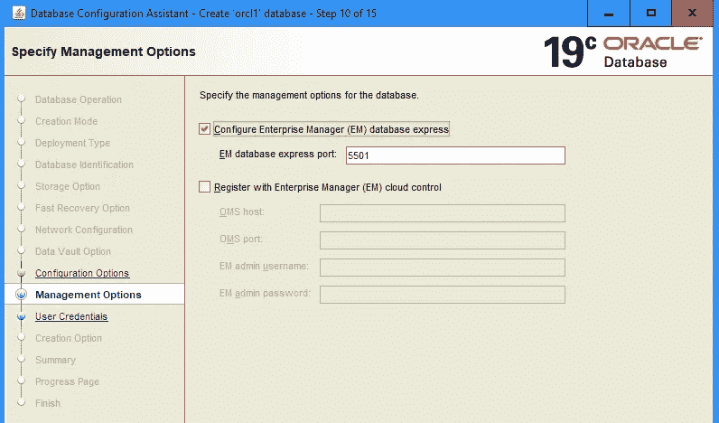
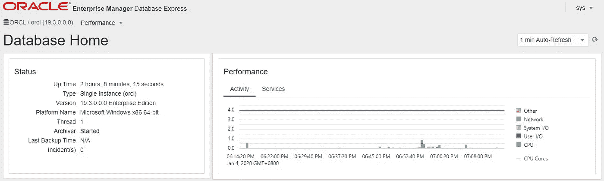
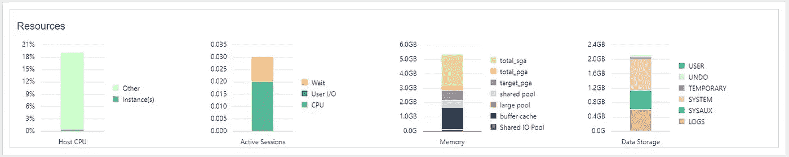
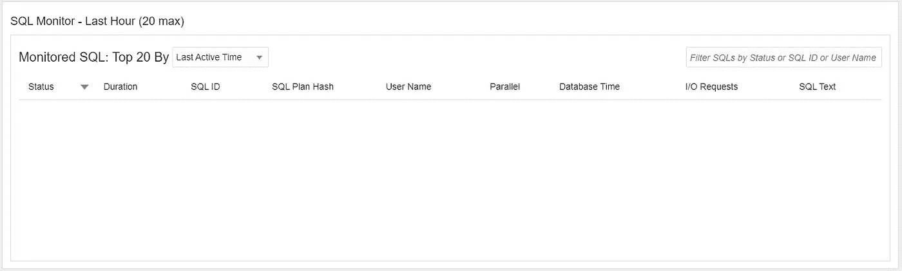
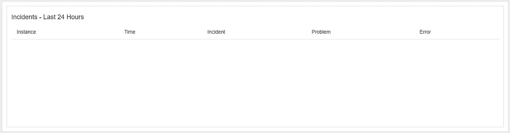
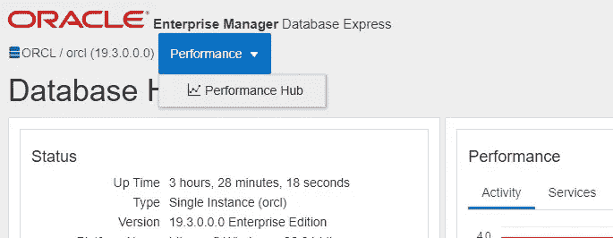
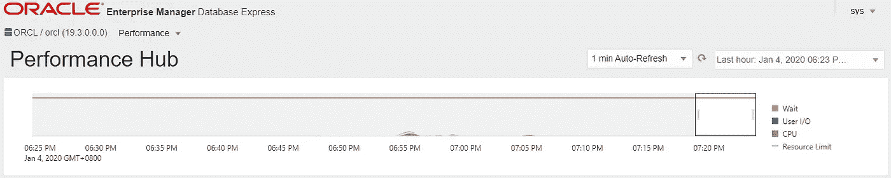
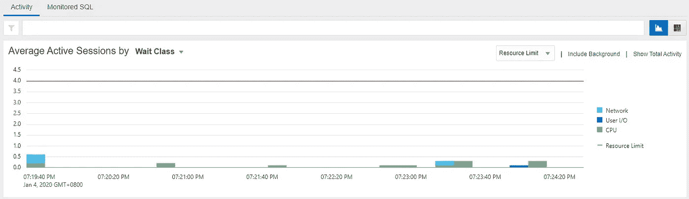
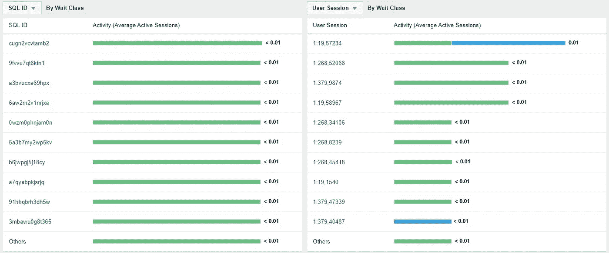

# 使用 Oracle 19c Enterprise Manager Database Express 进行性能监控

> 原文：<https://medium.com/oracledevs/performance-monitoring-with-oracle-19c-enterprise-manager-database-express-707e2977ffae?source=collection_archive---------0----------------------->

启用 Oracle Enterprise Manager Database Express 的最简单方法是使用数据库配置助手创建数据库。

使用数据库配置助手，选择高级配置而不是基本配置。随后，在构建数据库之前，将出现以下屏幕:

Ensure to select the ‘Configure Enterprise Manager (EM) database express’ option of the advanced configuration

首次启用 Enterprise Manager Database Express 时，端口将默认为 5500。为其他实例配置 Enterprise Manager Database Express 时，将使用 5500 以上的端口。

当 Database Configuration Assistant 创建了数据库后，将显示 Enterprise Manager Database Express 的 URL。对于使用 Enterprise Manager Database Express 配置的第一个实例，端口将是 5500，因此 URL 将类似于下图所示:

[https://*hostname.domainname.com*:5500/em/shell](https://ph5cg5223rqv.cscmws.cscmws.com:5500/em/shell)

Enterprise Manager Database Express 的登录页面将要求提供身份证明。

可以使用数据库的 Oracle 系统帐户，这将把用户带到首页。

首页顶部显示当前数据库状态，以及过去一小时的活动。

向下滚动显示 CPU、会话、内存和存储的快照。

底部将显示 SQL 监视器范围内的任何 SQL。

如果当前范围内没有 SQL，则不会显示任何内容。

通过“性能”选项卡导航到 Oracle Enterprise Manager Database Express 的第二页。

第二页的顶部给出了等待事件的时间序列摘要。

然后，平均活动会话如下:

页面尾部显示了平均活动会话的明细。

现在，Oracle 19c Enterprise Manager Database Express 肯定会继续成为您最喜爱的性能监控工具之一。

*Paul Guerin 是一名专注于 Oracle 数据库的国际顾问。Paul 在东南亚的全球交付中心工作，但他的客户来自澳大利亚、欧洲、亚洲和北美。此外，他还出席了一些世界领先的甲骨文会议，包括甲骨文 2013 年世界开放大会。自 2015 年以来，他的工作一直是 IOUG 最佳实践技巧小册子以及 AUSOUG、Oracle Technology Network 和 Oracle Developers (Medium)出版物的主题。2019 年，他被授予 My Oracle 支持社区最有价值贡献者。他是一名 DBA OCP，并将继续参与 Oracle ACE 计划。*