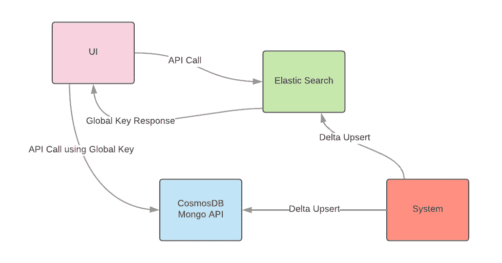
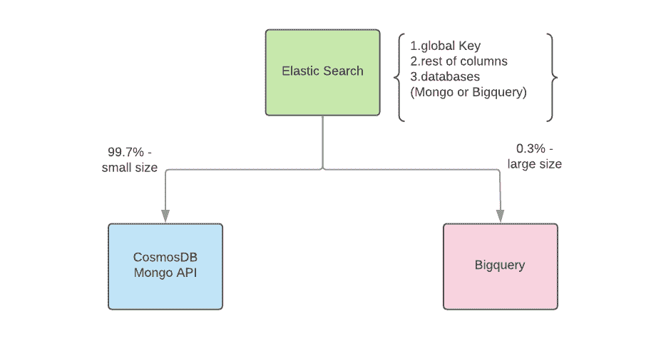
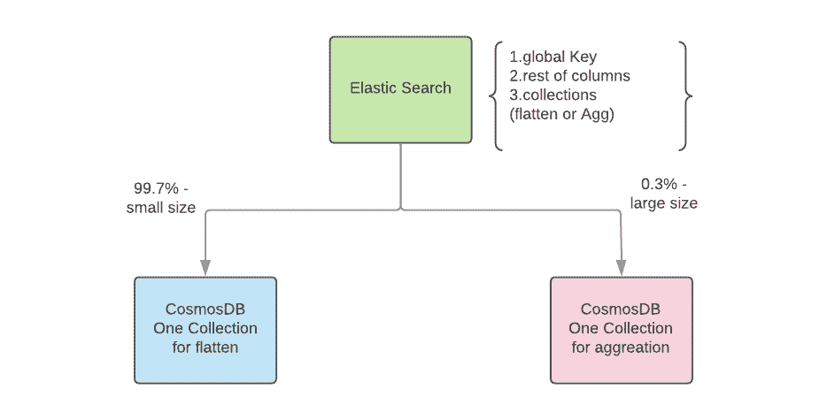

# 热门话题问题的性能保护程序

> 原文：<https://medium.com/walmartglobaltech/performance-saver-for-hot-topic-issue-d87d9fa6ea39?source=collection_archive---------4----------------------->

搜索热门话题的小指南


Photo credit: Pixabay

我们设计并实现了很多搜索平台，就像这篇博客提到的:[使用 Solr 和 Cassandra](/walmartglobaltech/tricks-to-make-your-search-10x-faster-using-solr-and-cassandra-f6af53d5a25c) 让你的搜索速度提高 10 倍的技巧。我们可以从搜索引擎和 NoSQL 数据库中获得很多好处。如果你有任何设计问题，请阅读上面的博客。

在这篇博客中，我们将讨论在设计甚至实现搜索平台后可能面临的一些其他情况。

# 议程

*   情况陈述和动机
*   新方法
*   从新设计中获益
*   摘要

# 情况陈述和动机

> 在考虑了速度是我们这里的第一公民和数据量之后，我们真正考虑的是**【NoSQL】**加上**搜索引擎**在一起。

在某些情况下，除了获取原始数据，我们还需要处理如何处理聚合数据。那么 MongoDB 作为细节级存储将是一个不错的选择。而 CosmosDB-Mongo API 将是 HIPAA 数据的另一个不错的选择。

在我们之前的博客中，我们使用下面的初始设计来达到这些要求。



Figure 1 - initial design

根据图 1，在面对一些热点话题数据点之前，我们流程的性能表现良好。我们大约有 0.3%的数据包含大量记录(超过 500，000 条)。因为 CosmosDB 有一些性能问题，我们试图做更多的头脑风暴来找到下面的两个备份计划:

1.  装载前进行预计算，
2.  横向拆分热门话题数据——只需将 0.3%的数据放入另一个集合+改进索引设计。

在对这些方法进行了测试和概念验证之后，仍然存在一些薄弱环节。

1.  如果我们使用预计算，将不会有动态聚合，因为我们无法对一些方法(如 mod、mid 或更复杂的流程)进行多一级聚合。
2.  因为即使对于 0.3%的数据来说，数据大小也是非常大的，即使这些数据都在一个分片下，ComosDB 仍然需要处理这些数量的数据，这在进行聚合时会影响性能。更糟糕的情况是会出现超时问题。

# 新方法

## 挑战

*   如何利用现有的套件解决这个问题？
*   我们如何平衡努力和表现？
*   我们如何提供动态聚合？

我们找到了一种方法来做一个弹性搜索作为一个“负载平衡器”,通过一些小的改变来帮助提高性能。我在下面提出了两种方法，在获取性能和动态聚集之间做了一些权衡。

## 解决方法

1.  ***综合动态聚合和可接受性能***



Figure 2 - comprehensive *dynamic aggregation and acceptable performance*

在图 2 中，我们在 CosmosDB Mongo 和 BigQuery 中保留了相同的数据。在弹性搜索索引中，我们有一个字段来决定用户可以从哪个数据源获取数据(CosmosDB Mongo 或 BigQuery)。

在这种设计中，我们有以下优点和缺点:

*   我们没有复杂的加载逻辑，因为我们在两个数据库上模拟相同的数据。
*   我们有高度的聚合灵活性。
*   我们可以将获取时间减少到 10 秒，但这仍然不是一个完美的性能。

2. ***部分*** d ***动态聚合和超级性能***



Figure 3 - p*art* d*ynamic aggregation and super performance*

在图 3 中，设计原理与图 2 相同。我们用另一个 Mongo 集合替换 BigQuery，并对各种聚合进行预计算。

在这种设计中，我们有以下优点和缺点:

*   我们将有复杂的加载和获取逻辑，因为有两种不同的数据格式——扁平化和聚集。
*   对于 0.3%的数据，我们有一个聚合限制。
*   我们可以有完美的抓取性能

# 从新设计中获益

我为所有三种方法中的普通和热门话题创建了一个度量标准。这两种新方法都将获取时间从 30 秒提高到 10 秒甚至几毫秒。

```
+-----------+------------+---------------------+-----------------+
|    Size   |  CosmosDB  | CosmosDB+BQ+nonagg  |   CosmosDB+agg  | 
+-----------+------------+---------------------+-----------------+
|  normal   |  267 (ms)  |     267 (ms)        |     267 (ms)    |
| hot topic | 29383 (ms) |    10000 (ms)       |     200(ms)     |
+-----------+------------+---------------------+-----------------+
```

除了缩短获取时间，我们还可以获得以下好处:

*   两种新方法都易于设置
*   作为“负载平衡器”的弹性搜索
*   支持
*   节省了使用额外资源的巨大成本。

# 摘要

使用新方法可以快速改善一些搜索平台问题。还有一些其他潜在的解决方案，我们可以在未来的博客中讨论。