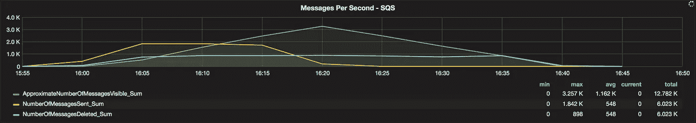

# 事件驱动的微服务的性能测试

> 原文：<https://medium.com/capital-one-tech/performance-testing-of-event-driven-microservices-f5de74305985?source=collection_archive---------0----------------------->

让我们回到软件开发的早期…

…对交付同类最佳产品的追求以及日益激烈的竞争导致了软件开发周期的加快。这些周期几乎没有时间考虑构建复杂的整体应用程序的影响。随着不断发展，这些应用程序的复杂性不断增加，维护变得越来越困难…

快进到现在。技术专家已经亲身经历了构建如此复杂的整体应用程序的陷阱。问题包括但不限于:

*   大型的 monoliths 很难维护，追踪软件错误也成为一项乏味的任务。
*   *他们共享公共图书馆。库的更新或添加会导致依赖性问题，如果处理不当，会产生不一致的系统。这也可能需要重新启动整个系统来进行更新，从而导致停机时间增加。*
*   *对开发者来说，Monoliths 代表了一种技术锁定，因为它们被绑定到最初应用的软件语言和框架上。*
*   单体限制了可扩展性。由于资源的复杂性和依赖性，创建多个实例来处理传入流量的常用策略在这里可能不起作用。

渐渐地，基于更小更易维护的服务来构建软件应用程序的需求被发现了。这导致了[反单体模式](http://www.pwc.com/us/en/technology-forecast/2014/cloud-computing/features/microservices.html)，基于微服务的架构就是其中之一。

The evolution of code and software development

# 什么是基于微服务的架构？

微服务是一个*“通过消息交互的最小独立进程。”*这可以是更细粒度和面向任务的，这意味着微服务通常更小、专用、可独立部署、更易于测试、可伸缩、可维护，并且可以利用分布式架构**。**

一个微服务架构就变成了[**一个分布式的应用，它的所有流程都是微服务，更小、独立、专用、可独立部署、可测试、可扩展、可维护。**](https://arxiv.org/pdf/1606.04036v1.pdf)

**基于微服务的架构是最近对面向服务架构(SOA)的扩展。然而，一个关键的区别是，SOA 更关注可重用性和隔离，而基于微服务的架构更关注用系统替换大型应用程序，这些系统可以增量发展，并且更容易使用较小的服务进行管理。**

***这篇之前的 Capital One DevExchange 文章* [*通过 DevOps*](https://developer.capitalone.com/blog-post/delivering-microservices-for-enterprise-with-devops/) *为企业提供微服务，从企业的角度深入剖析了微服务架构。***

**通常，微服务具有智能端点，并且是事件驱动的；即**基于一个事件，它们接收一个请求，处理它，并相应地生成一个响应**。具有 HTTP 端点的微服务很少向外部应用程序公开 API。从应用程序的角度来看，一个应用程序由许多微服务组成，每个微服务在一个协调良好、松散耦合的服务集系统中执行一个专门的任务。**

**但是这提出了一个问题:**“如何测试一个事件驱动的微服务，它没有 HTTP 端点，并且不能从任何 web 界面直接访问？”****

# **微服务在行动**

**如今，电子商务、金融、医疗保健和多个其他领域的应用都在使用基于微服务的架构。让我们举例说明微服务在金融领域的工作方式。**

**考虑一个涉及各种组件和接口的货币转账交易，比如 web 应用程序、REST API、微服务、消息代理和 NoSQL 数据库。**

**1.用户登录到 web 应用程序**

**2.用户执行交易**

**3.消息被发送到消息代理的*事务启动*主题**

**4.所有订阅的队列都接收消息，而 *RECORDCREATOR* 微服务——监听其中一个队列——分析消息**

**5.在数据库中创建一个事务，并向消息代理的记录创建主题发送消息**

**6.文件创建者微服务然后提取消息并生成数据文件**

****

**User transaction flow in a microservice based architecture**

# **如何对微服务进行功能测试**

**在开始性能测试之前，让我们先检查一种对微服务进行功能测试的方法。**

**从上面的例子来看，每个微服务都是在事件发生时触发的，所有的交互都是基于消息的。对于一个测试记录创建者微服务的质量工程师来说，**向消息代理发送一条消息，并验证插入到 NoSQL 数据库中的数据。**这证实了微服务的功能性！**

**如果微服务的唯一功能是向其他队列发送消息，那么为同一个主题订阅多个队列。使用一个专用于预期功能的队列和另一个“测试队列”来检查消息是否由消息代理转发。**

# **如何测试微服务的性能**

**微服务的功能测试保证了预期需求的质量。然而，一款同类最佳的应用要经过**功能、性能*和*安全测试**。此外，在基于微服务的架构中，需要对应用的所有单个组件进行性能测试，包括微服务、API、数据库、web 应用以及整个应用。这些单独组件的性能测试为应用程序的整体性能奠定了基础。**

**让我们看看如何对事件驱动的微服务进行性能测试。以下是 *RECORDCREATOR* 微服务性能测试中涉及的组件和工具列表:**

## ****组件:****

**亚马逊社交网络/SQS，NoSQL 数据库**

## ****工具:****

*   ****JMeter** —一个 java 应用程序，旨在加载测试功能行为并测量被测应用程序的性能。**
*   ****influxDB** —一个开源的[时间序列数据库](https://en.wikipedia.org/wiki/Time_series_database)。**
*   **Grafana——这是一个[开源度量分析&可视化套件](http://grafana.org/)。它最常用于可视化基础设施和应用程序分析的时间序列数据。**
*   ****cloud watch—**Amazon cloud watch 是一项针对 AWS 云资源和运行在 AWS 上的应用程序的监控服务。**

## ****范围:****

**性能测试包括各种各样的测试。包括但不限于负荷试验、压力试验、浸泡试验等。然而，在本例中，我们将在一段固定的时间内执行负载测试，以了解微服务的**吞吐量**(即处理的消息)。**

## ****假设**:**

**1.微服务部署在 AWS EC2 实例上，并为 EC2 实例和 SQS 队列启用了 CloudWatch 监控。**

**2.消息大小符合 SQS 消息大小的要求。**

**3.亚马逊 SQS 订阅了有效的社交网络主题。**

**4.测试在独立的 AWS EC2 实例上执行。**

**5.influxDB 实例可用，并且 influxdb.conf 文件中的参数被更新以支持 Graphite 作为输入源。**

**6.Grafana 仪表板实例可用。**

## ****测试设置:****

**为了测试一个 *RECORDCREATOR* 微服务的性能，使用 JMeter 向 Amazon SNS topic 发送大量消息。然后借助 SQS 指标来计算服务吞吐量，例如来自亚马逊 CloudWatch 的 *NumberOfMessagesSent、NumberOfMessagesDeleted、approximaturenumberof messages visible*，以及基于来自亚马逊 SQS 的消息和在 NoSQL 数据库中创建的交易的时间戳差异的*响应时间*指标。这里需要注意的一点是，只有当微服务在其可见性超时到期之前处理并确认消息时，有效消息才会从 SQS 中删除。**

**作为参考，亚马逊简单队列服务的 CloudWatch [指标定义如下:](http://docs.aws.amazon.com/AmazonCloudWatch/latest/monitoring/sqs-metricscollected.html)**

*   ****NumberOfMessagesSent —** 添加到队列中的消息数。**
*   ****number of messages deleted—**从队列中删除的消息数。**
*   ****approximatuenumberofmessages visible—**可从队列中检索的消息数。**

## **步骤:**

****1。**创建一个接受 transactionId 并向 Amazon SNS 主题发送消息的 Java 类。**

****2。**用 AbstractJavaSamplerClient 扩展这个 Java 类，使之兼容 JMeter 的 Java 请求采样器。**

****3。**现在，将这个 java 文件转换成一个 jar 文件，放在 JMeter 安装目录的 lib/ext 文件夹中。此外，将依赖的 jar 文件放在同一个目录中，尤其是。基于程序文件中指定的导入的 jar 文件。**

****4。**打开 JMeter 并创建一个新的测试计划。向计划中添加一个线程组，因为这有助于我们配置用户(线程)数量、测试执行持续时间和循环计数。**

****5。**给线程组添加一个随机变量组件。这有助于创建唯一的 transactionId。**

**6。添加 JavaRequest Sampler，并从类名下拉列表中选择 jar 文件(在步骤 3 中创建)中的类名。将 transactionId(在步骤 5 中创建)作为参数传递给类文件。**

**7。向 JavaRequest Sampler 添加一个后端监听器，并选择实现为 GraphiteBackendListenerClient(JMeter>2.9)。配置参数并将其指向 influxDB 实例。这有助于我们将时间序列指标保存到 influxDB，然后在 Grafana 仪表板上查看。**

****8。**要执行固定时间的负载测试，在线程组中，选择线程数为 6，持续时间为 1200 秒，循环计数为 forever。**

****9。**执行测试，它将在所需的 SQS 队列中填充消息，该队列订阅了 Java 类中指定的 SNS 主题。**

****10。**打开 CloudWatch，监控队列。(如果您正在测试的微服务处于活动状态，它应该会处理所有传入的消息)。**

**11。通过创建一个仪表板，我们可以在 Grafana 中看到实时结果，该仪表板从 influxDb 和 CloudWatch 中获取时间序列指标。**

**通过 JMeter，我们不断地向 SNS 主题发送消息，这些消息被转发到 SQS 队列。监听所需队列的微服务分析传入的消息，并完成预期的任务。一旦任务完成，它将确认消息，消息将从队列中删除。**来自 AWS CloudWatch 的 NumberOfMessagesDeleted** 指标为我们提供了微服务的**吞吐量**。**

# **性能测试可视化**

**在 Grafana 实例中添加 CloudWatch 和 influxDB 作为数据源。JMeter 结果通过 Graphite listener 和来自 AWS 的 CloudWatch 指标发送到 influxDB，然后通过配置必要的面板在 Grafana 仪表板上查看。诸如**线程数量**等指标是从 influxDB 配置的，其他指标诸如 **NumberOfMessagesSent、NumberOfMessagesDeleted、approximatenumberofmessages visible、EC2 CPUUtilization、ECS CPUUtilization 和来自 CloudWatch 的 ECS MemoryUtilization** 。**

**在服务器上安装 Jolokia 插件，并发送 JVM 指标以了解系统行为，包括但不限于性能测试期间的**堆内存使用量**、**服务线程**、计数。这一附加功能使得在 Grafana 仪表板上查看 echo 系统的实时性能成为可能。请注意，AWS CloudWatch 每 5 分钟向 Grafana dashboard 发送一次指标。要以 1 分钟为周期发送度量数据，需要启用对实例的详细监控。**

****

**Grafana panel indicating number of JMeter Threads**

****

**Grafana panel indicating number of messages sent, deleted and visible in AWS SQS**

****

**Grafana panels indicating total messages sent and service throughput**

****

**Grafana panels indicating CPU utilization and memory utilization**

**需要遵循类似的方法来测试任何监听队列并写入数据库的微服务。**

**性能测试也可以在 Docker 容器中完成，并集成到微服务 CI/CD 管道中，以促进微服务的独立可部署、可测试和可扩展功能。**

# **结论**

**基于微服务的架构正在发展，开发人员正在接受这种变化。不断增长的业务需求和竞争需要一流的产品，这使得基于微服务的应用的功能和性能测试比以往任何时候都更加重要。基于事件的微服务依赖于事件，只要能够触发事件并验证预期行为，这些微服务就是可测试的。每个微服务都需要经过全面的性能测试和验证，以确定应用的稳定性和弹性。这确保了微服务可以处理大量的事件流量，并且该应用可以成为一流的产品。**

****