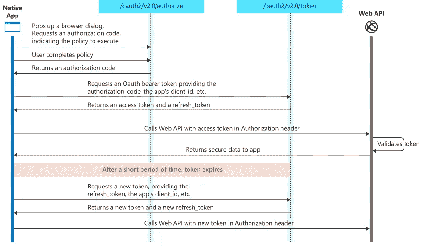
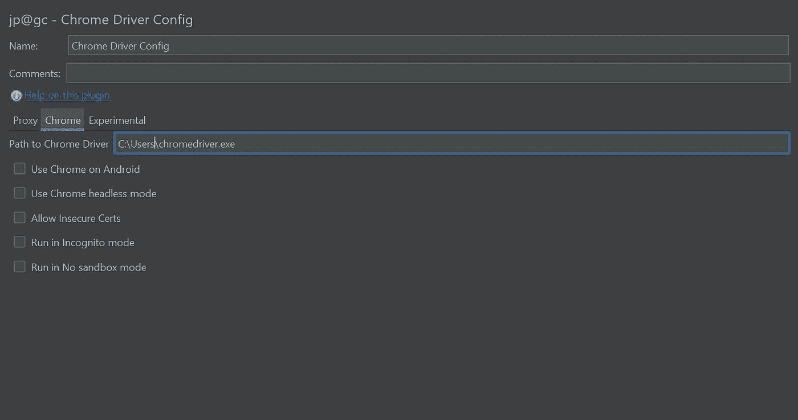
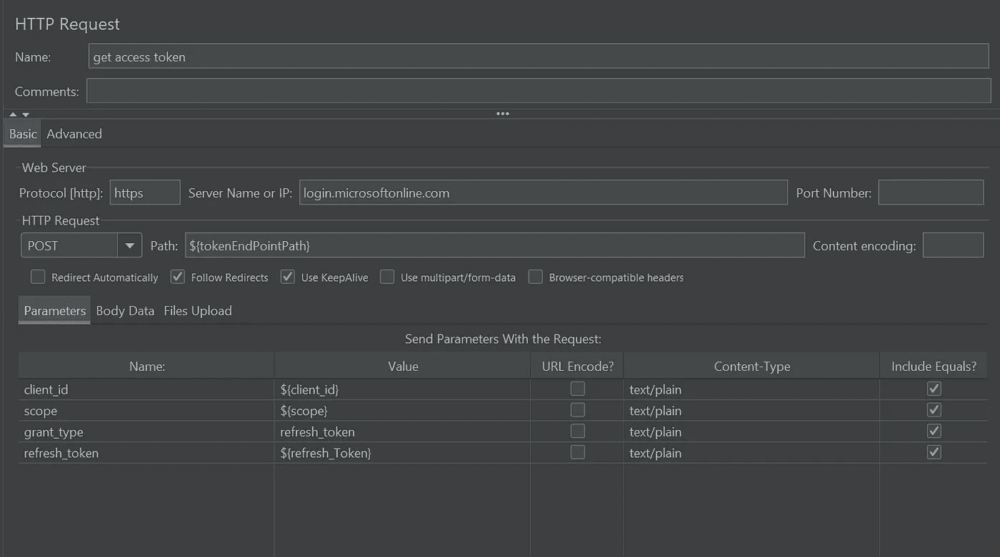
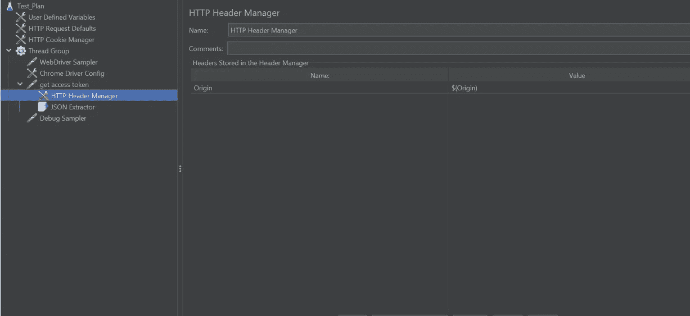
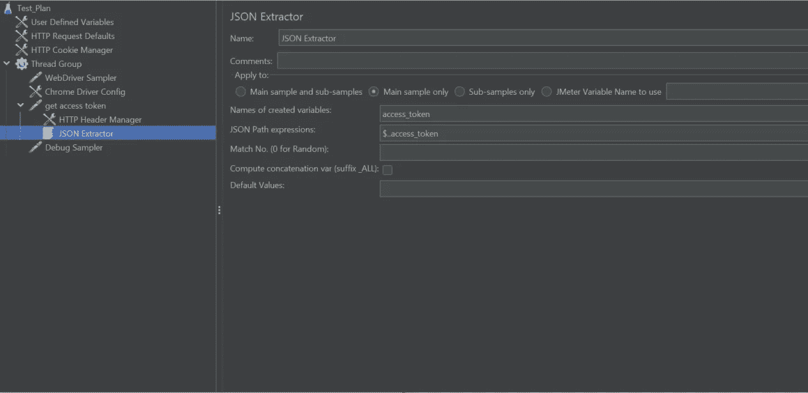
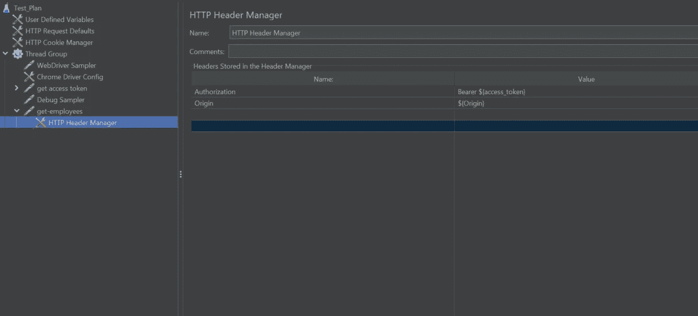

# 使用 JMeter 对 OAuth 2.0 授权代码保护的 API 进行性能测试

> 原文：<https://medium.com/version-1/performance-testing-of-oauth-2-0-authorization-code-secured-apis-using-jmeter-7a9d711716a1?source=collection_archive---------0----------------------->

Apache JMeter java 应用程序旨在测试功能行为和衡量性能。API 认证的实现使它变得更加有趣，因为我们需要编写脚本来获取访问令牌，稍后可以使用这些令牌从 API 获取资源。OAuth 2.0 授权代码授权类型身份验证实现需要基于用户的身份验证。这是通过使用 JMeter 中的 Selenium、JavaScript 和 web driver sampler 实现的。

# **什么是 OAuth 2.0？**

授权框架是一种协议，允许用户授予第三方网站或应用程序对用户受保护资源的访问权限。它是一种标准，旨在允许网站或应用程序代表用户访问其他 web 应用程序托管的资源，而不必暴露他们的长期凭据甚至身份。

# 先决条件

1.  关于 JMeter 工作原理的基本知识。
2.  Selenium web 驱动程序基础知识。
3.  应该安装 JDK。
4.  使用 JMeter 中的插件管理器安装 selenium/Web 驱动程序支持插件。
5.  设置环境变量。

# 它是如何工作的

1.  本机应用程序打开授权端点。
2.  会弹出一个浏览器对话框，要求输入用户名和密码。
3.  用户输入用户名和密码。
4.  授权端点返回一个授权码。
5.  请求被发送到令牌端点，提供授权码、客户端 id、范围和来源。
6.  令牌端点返回访问令牌和刷新令牌。
7.  使用授权头中的这个访问令牌，向 Web API 发出请求。
8.  Web API 验证令牌并将安全的数据和资源返回给应用程序。

# 授权代码流

1.  在测试计划下添加一个线程组。
2.  添加 WebDriver 示例。
3.  添加一个 Chrome 驱动配置。
4.  在 Chrome 驱动配置中设置 Chrome driver.exe 的路径，如下所示。

5.添加视图结果树。

6.从 JMeter 的配置元素中添加用户定义变量。

7.添加调试采样器。

# 获取访问令牌的 JMeter 脚本

1.  将代码放在 WebDriver Sampler 的脚本部分。
2.  在脚本中，web 驱动程序打开授权端点 URL。
3.  该脚本输入用户名并单击 next 按钮。
4.  该脚本输入密码并点击登录按钮。
5.  单击弹出窗口中的是按钮。
6.  用户身份验证完成后，脚本中使用的函数“allstorage()”从浏览器的本地存储中获取刷新令牌密钥的令牌存储值。
7.  令牌存储值为 JSON 格式的多个数据。
8.  使用“JSON.parse”方法，我们只从 JSON 中获取秘密值，并将其保存在一个名为“refress_Token”的变量中。

# 获取访问令牌的 HTTP 请求

创建一个 HTTP POST 请求来标记端点 URL，如下所示。

1.  添加从上述 web 驱动程序采样器脚本中检索的参数，如“cliend_id”、“scope”、“grant_type”和“refresh_token”。
2.  在 get token 请求中添加带有源名称值的 HTTP 头管理器，如下所示。

3.添加 JSON 提取器，从 get access token HTTP 请求的 JSON 响应中检索访问令牌，如下所示。

# 用 API 请求发送访问令牌

1.  创建新的 HTTP 请求
2.  添加路径、服务器名称和请求正文。
3.  在 HTTP 请求采样器中添加一个 HTTP 头管理器，如下所示

4.在 HTTP 头管理器中，将授权头名称和值添加为“Bearer ${access_token}”

5.添加源头名称和值。

6.发送请求后，API 对令牌进行身份验证，并将安全数据和资源返回给应用程序。

# 结论

这就是使用 JMeter 对 OAuth 2.0 授权代码保护的 API 进行性能测试需要执行的步骤。

# 关于作者:

Rajeev Kalal 是 Version 1 的测试自动化顾问。