# 使用 JMeter 进行性能测试

> 原文：<https://medium.com/version-1/performance-testing-using-jmeter-98020e5f01b4?source=collection_archive---------0----------------------->


# **概述**

*Apache JMeter 应用程序是一个 100%纯 java 应用程序，旨在测试功能行为和测量性能。它可以执行许多其他功能，最初是为 web 应用程序测试而设计的。它通常有 GUI 和非 GUI 两种操作模式。GUI 模式用于创建和调试脚本，非 GUI 模式用于执行。*

# **JMeter 的 GUI**

单击 bin 文件夹中的 jmeter.bat 文件可以打开 JMeter UI。它看起来像这样。

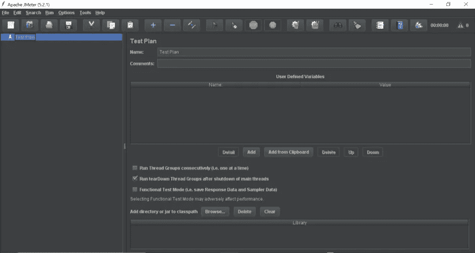

JMeter GUI 在顶部有菜单按钮，在左侧有测试计划面板。GUI 有不同的测试选项。右键单击测试计划项，然后将鼠标悬停在子项上，会打开大量的选项，您可以将它们添加到测试计划中。子菜单项 Threads(users)中的 Thread group 是您可以添加到测试计划中的选项之一。

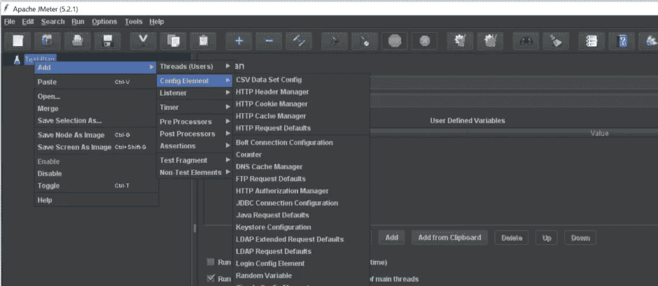

## **螺纹组**

thread group 元素控制 JMeter 用来执行测试的线程数量。线程组的控件允许您。

1.  设置线程数量(并发用户)。
2.  设置上升周期(上升时间)。
3.  设置执行测试的次数(迭代次数)。

每个线程将完整地执行测试计划，并且完全独立于其他测试线程。

右键单击线程组，然后将鼠标悬停在子项上，会打开大量选项，您可以在线程组中添加这些选项。

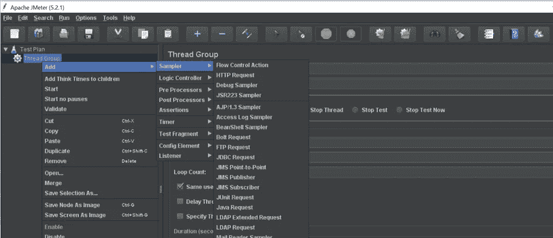

## **HTTP 请求**

从子菜单项 Sampler 添加 HTTP 请求。不同的采样器对应不同的协议。基于所使用的协议，相应的采样器可以被添加到线程组。采样器是对服务器的请求。

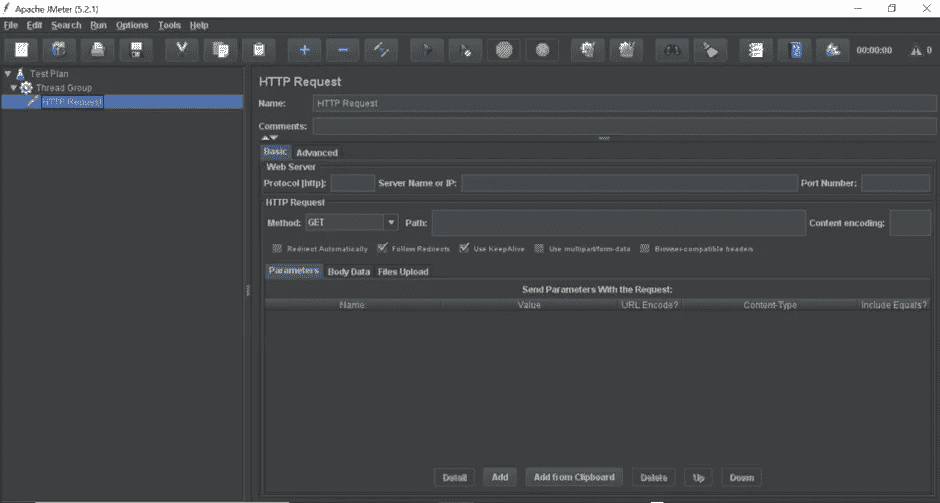

正如您在右窗格中看到的，我们有不同的字段，如请求名称、注释、协议、服务器名称、端口号、方法、路径和内容编码。

假设我们从 API“https://www . test . com/resource”获取资源。

1.协议部分将是“https”。

2.服务器名称将为“www.test.com”。

3.路径部分将是“/resources”。

4.该方法将被获得。

您可以使用底部的添加按钮添加参数。我们已经在请求中添加了 scope 参数。

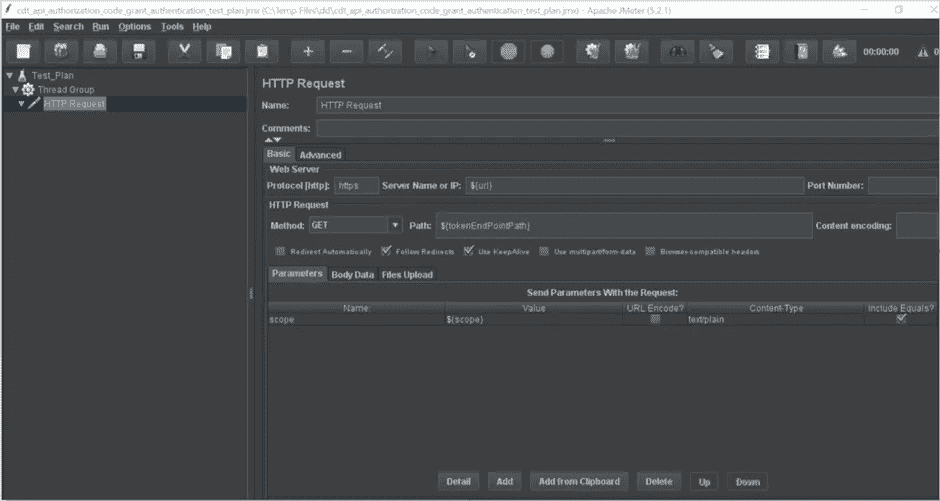

**HTTP 标头管理器** HTTP 请求具有请求标头，我们可以使用此标头管理器选项添加这些标头。右键单击 HTTP Request 并从子菜单项 Config 元素添加 HTTP 头管理器。

HTTP 头管理器有 4 个部分:

1.标题管理器名称。

2.评论。

3.标题名称。

4.标题值。

使用底部的添加按钮添加标题。我们已经在标题管理器中添加了源标题。

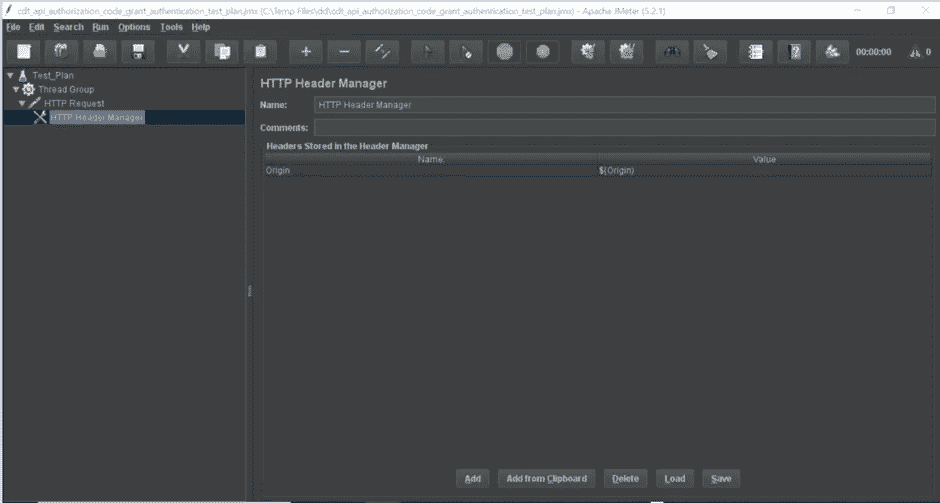

## **JSON 提取器**

假设 HTTP 请求产生一个 JSON 响应。为了从 JSON 中提取特定的响应值，我们可以使用 JSON 提取器。右键单击 HTTP Request 并从子菜单项 Postprocessors 中添加 JSON 提取器。

JSON 提取器有以下几个部分:

1.JSON 提取器的名称。

2.评论(如果有)。

3.适用于四种不同样品的选项。

4.保存提取值的变量名。

5.用于在 JSON 响应中唯一标识密钥的 JSON 路径表达式。

6.匹配号码:-1 代表全部，0 代表随机号码，n 代表第 n 个号码。

7.计算串联变量。如果发现许多结果，这个提取器将使用'，'分隔符将它们连接起来，并将其存储在一个名为 _ALL 的变量中。

8.默认值——有时我们的 JSON 会带来一个空值，所以我们可以使用默认值。

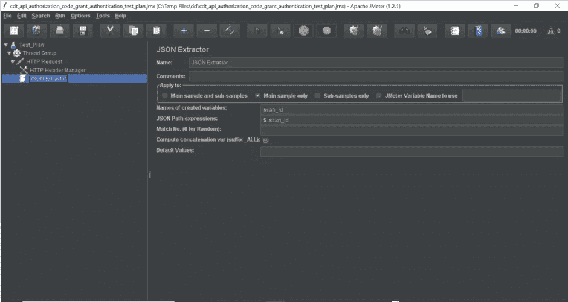

假设这个服务器用 JSON 响应。

```
{ "store": { "book": [ { "category": "reference", "author": "Nigel Rees", "title": "Sayings of the Century", "price": 8.95 }, { "category": "fiction", "author": "Evelyn Waugh", "title": "Sword of Honour", "price": 12.99 }, { "category": "fiction", "author": "Herman Melville", "title": "Moby Dick", "isbn": "0-553-21311-3", "price": 8.99 }, { "category": "fiction", "author": "J. R. R. Tolkien", "title": "The Lord of the Rings", "isbn": "0-395-19395-8", "price": 22.99 } ], "bicycle": { "color": "red", "price": 19.95 } }}
```

下表提供了从指定的 JSON 中提取数据的不同方法的一个很好的例子。

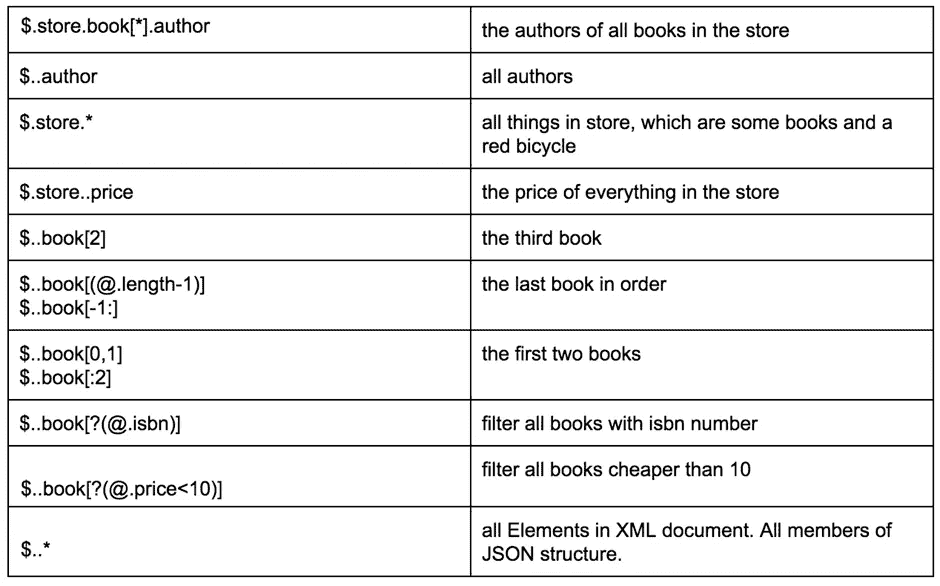

## **用户定义的变量**

用户定义变量 config 元素用于声明和定义 JMeter 脚本中使用的变量。如果您想要定义全局变量，那么在测试计划下添加这个元素。右键单击 HTTP Request 并从子菜单项 Config 元素中添加用户定义的变量。

用户定义的变量包含以下部分:

1.  变量名称。
2.  变量值。

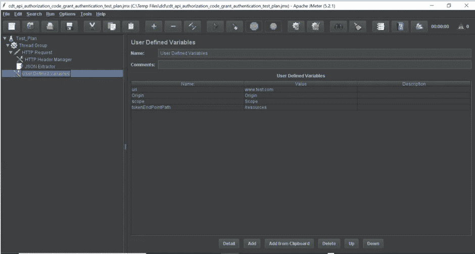

## **断言**

子菜单断言中有不同类型的断言。举几个例子，我们有响应、大小、持续时间和比较断言。右键单击 HTTP 请求，并从子菜单断言中添加响应断言。

响应断言包含以下几个部分。

1.姓名。

2.适用于不同样品的选项。

3.要测试的字段。

4.模式匹配规则。

5.要测试的模式。

6.自定义失败消息。

我们正在验证响应断言中的响应代码 200。

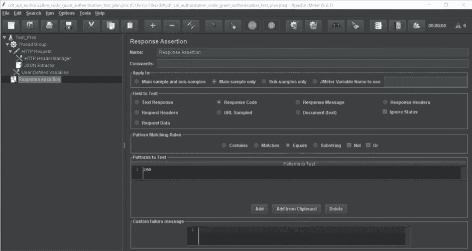

## **听众**

“监听器”子菜单中有不同类型的监听器。举几个例子，我们有查看结果树、摘要报告、聚合报告和聚合图。右键单击 HTTP 请求，从子菜单 listener 中添加视图结果树。

查看结果树包含以下部分:

1.姓名。

2.将结果写入文件/从文件读取的文件名。

3.选项，只将错误记录到文件中。

4.仅将成功记录到文件中的选项。

5.“配置”按钮以不同的格式保存配置，如 XML 或 CSV。

单击顶部的 play 按钮将运行测试计划，请求的结果将被输出到 View Results Tree 监听器。这包含元数据，如响应代码和响应数据。

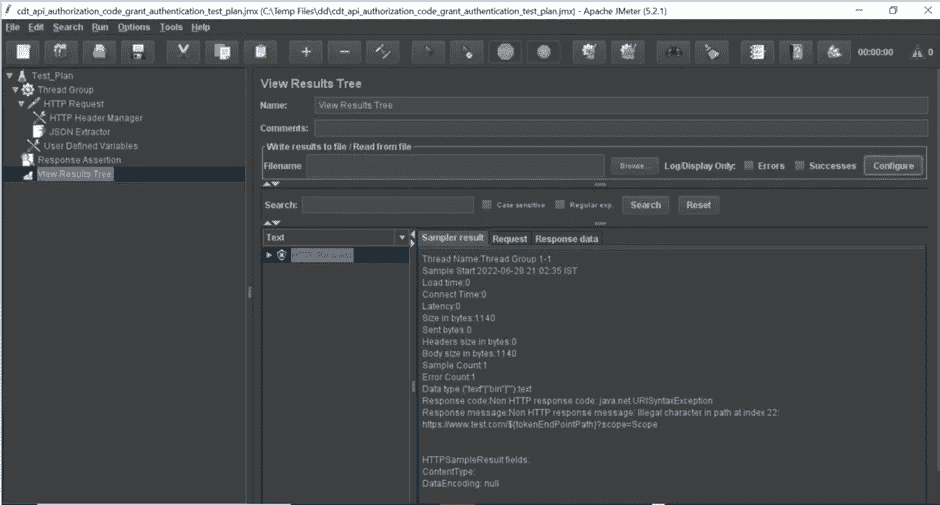

## **测试计划执行**

测试计划可以使用 GUI 和命令行来执行。要使用 GUI 运行，请单击顶部的播放按钮。

为了使用命令行运行测试计划，我们使用下面的命令行来执行。

```
jmeter -n -t $path_to_jmx_file -l result.jtl
```

结果将保存在“result.jtl”文件中。

为了执行测试计划并生成报告，我们使用下面的命令行来执行。

```
jmeter -n -t $path_to_jmx_file -l result.jtl -e -o $path_to_report_folder
```

## **结论**

*这些是使用 JMeter 进行性能测试需要遵循的步骤。现在，您有了一个使用 HTTP 端点的基本性能测试计划。JMeter 允许您做更多的事情，但这将是一个很好的起点。*


**关于作者:** Rajeev Kalal 是 Version 1 的测试自动化顾问。