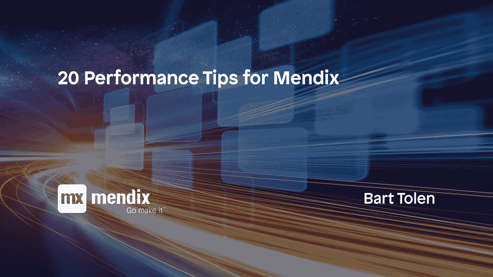

# MENDIX 的 20 个性能提示

> 原文：<https://medium.com/mendix/performance-tips-for-mendix-eaebffbc7669?source=collection_archive---------6----------------------->

几年前的 2016 年，我为 Mendix 写过一篇[十大性能提示。该列表包含了 Mendix 开发人员创建高性能应用程序的技巧，至今仍然有效！在这篇博客中，我会给你另外 10 个提升你的 Mendix 应用性能的好建议。](https://www.mansystems.com/blog/mendix/top-10-performance-improvement-tips-for-mendix)

# #11.使用工具分析问题

这样你就可以找到需要修理的地方，而不是在黑暗中工作。也尽量不要过早优化。

谷歌 Chrome 开发者工具可以测量页面的加载量，并显示时间是花在许多小查询上还是只是大量数据上。

# **#12。了解平台细节**

了解运行时设置。通过 Mendix 支持我了解到 Mendix 8 有一个运行时选项(DataStorage。UseNewQueryHandler)来生成 Mendix 7 风格的查询，这样会快很多。这在 Mendix 8.15 中已经成为默认。

还要理解 xpath，实体访问 XPath 是如何应用的，继承是如何应用的，以及建模对性能的影响。

例如，理解页面加载和 listviews 中数据视图的使用。有时，它们会向服务器发出大量单独的请求。这使得浏览器和 Mendix 运行时之间的有线协议非常繁琐，尤其是在低(额)延迟的情况下，这严重降低了性能。

# #13.尽量减少往返行程

为了最小化数据库往返，例如在循环外提交，在循环前查询查找列表，并在循环内使用 find。

为了最小化本地移动设备上的客户端服务器往返，使用具有适当同步的离线数据。

在客户端逻辑中使用纳米流，当然动作不做服务器调用。

# #14.防止长期交易和/或大额交易

经验告诉我们，Mendix 在大型长时间运行的事务上会变慢。因此，使用 community commons 模块中可用的特殊 java 操作来批量提交事务。

防止长时间执行事务的另一个原因是，事务中已修改的数据被锁定，以便在数据库中进行进一步的修改，因此您有因锁定而超时的风险。

同样好的建议是在微流结束时提交，使锁的持续时间尽可能短。

并且总是以相同的顺序提交不同的实体，因此不会出现死锁。

# #15.应用模型-视图-控制器模式

为页面创建一个非持久的实体，只收集显示的数据，尽量减少发送给客户端的数据。当然，您现在需要管理数据，包括安全性，以匹配底层数据模型。

当然，这个技巧使模型变得更加复杂，但是和往常一样，架构选择需要优化，有时性能超过了可维护性。

# #16.使用异步模式

如果用户不必等待结果，则在后台异步执行操作。如果用户确实想得到结果，但仍然需要很长时间才能得到，那么使用一种模式，用户可以看到进度，然后导航离开，再返回来查看进度。

# #17.分离数据

Mendix 在使用实体时加载引用和引用集 ID。所以使用你自己的键或中间实体创建一个软链接，而不是一个引用集，这样引用就在另一边，只在你需要的时候加载。

# #18.预计算数据

如果可能的话，当突变的数量很低(足够)时，你可以预先计算数据。

这有时可以应用于替换计算属性。

此外，智能数据模型可以设置为从配置模型中计算出运行时模型，目的是优化和简化查询。

# #19.使用并行

如果您需要处理大量数据，并且记录之间没有依赖关系，您可以考虑并行处理数据。这里有一些 App store 模块可以提供帮助。本质上是创建处理记录的 workers 和管理 workers 的池，因为您不希望同时处理所有记录。

# #20.使用高代码可能性

即使在低级代码工具中，有时也需要高级代码扩展，例如对逻辑有更好控制和更快循环的 java 代码。此外，在某些情况下，使用 OQL 进行复杂的查询，甚至使用 SQL 来使用数据库细节或更复杂的查询都会有所帮助。

这被视为最后的手段，因此也是这个附加列表中的最后一个技巧。

# 结论

我希望这个列表能帮助你创建更快的应用程序。学习如何解决性能问题和站在其他开发人员的肩膀上的其他资源可以在互联网上找到。

例如，搜索“Mendix performance ”,您可以找到:

*   [https://www . man systems . com/blog/mendix/top-10-performance-improvement-tips-for-mendix](https://www.mansystems.com/blog/mendix/top-10-performance-improvement-tips-for-mendix)
*   [https://www . man systems . com/blog/how-to-speed-your-mendix-app-part-1](https://www.mansystems.com/blog/how-to-speed-up-your-mendix-app-part-1)
*   [https://www . man systems . com/blog/how-to-speed-your-mendix-app-part-2](https://www.mansystems.com/blog/how-to-speed-up-your-mendix-app-part-2)
*   [https://www . man systems . com/blog/how-to-speed-your-mendix-app-part-3](https://www.mansystems.com/blog/how-to-speed-up-your-mendix-app-part-3)
*   [https://www . man systems . com/blog/performance-management/just-in-time-performance-management](https://www.mansystems.com/blog/performance-management/just-in-time-performance-management)
*   [https://medium . com/mendix/five-tips-for-working-with-large-database-tables-in-mendix-170210 F6 F6 FD](/mendix/five-tips-for-working-with-large-database-tables-in-mendix-170210f6f6fd)
*   [https://docs . mendix . com/how to/general/community-best-practices-for-app-performance](https://docs.mendix.com/howto/general/community-best-practices-for-app-performance)
*   [https://docs . mendix . com/how to/monitoring-trouble shooting/detect-and-resolve-performance-issues](https://docs.mendix.com/howto/monitoring-troubleshooting/detect-and-resolve-performance-issues)

还有更多…

编码快乐！

*来自发布者-*

*如果你喜欢这篇文章，你可以在我们的* [*媒体页面*](https://medium.com/mendix) *或我们自己的* [*社区博客网站*](https://developers.mendix.com/community-blog/) *找到更多类似的内容。*

*希望入门的创客，可以注册一个* [*免费账号*](https://developers.mendix.com/meetups/#meetupsNearYou) *，通过我们的* [*学苑*](https://academy.mendix.com/link/home) *获得即时学习权限。*

有兴趣加入我们的社区吗？你可以加入我们的 [*slack 社区频道*](https://join.slack.com/t/mendixcommunity/shared_invite/zt-hwhwkcxu-~59ywyjqHlUHXmrw5heqpQ) *或者那些想要更多参与的人，看看加入我们的* [*聚会*](https://developers.mendix.com/meetups/#meetupsNearYou) *。*