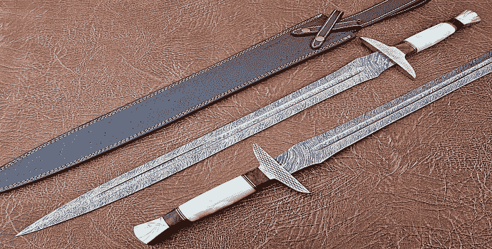

# Perlukah Melakukan Migrasi dari C ke C++?

> 原文：<https://medium.easyread.co/perlukah-migrasi-dari-c-ke-c-5b3deb02c64?source=collection_archive---------4----------------------->

sumber: [https://www.dictio.id/t/apa-yang-kamu-ketahui-tentang-pedang-tertajam-dalam-sejarah-dunia/86310](https://www.dictio.id/t/apa-yang-kamu-ketahui-tentang-pedang-tertajam-dalam-sejarah-dunia/86310)

Di [artikel pertama saya](https://medium.com/@yoseprib/lika-liku-perjalanan-competitive-programming-ku-29a713ec4f9e) , saya membahas mengenai lika-liku perjalanan *competitive programming* yang saya lewati. Pada artikel kali ini saya ingin memberikan perbandingan pengalaman saya dalam menggunakan bahasa pemrograman C dan C++ ketika mengikuti *Competitive Programming* .

*Competitive Programming* (selanjutnya saya sebut dengan **CP** ) itu ibarat berperang. Kita butuh senjata dalam menghadapinya. Senjata dalam berperang itu ibarat bahasa pemrograman dalam CP. Kita ditawarkan beberapa jenis senjata yang bisa kita digunakan. Begitu juga dengan CP. Ada beberapa bahasa yang dapat kita gunakan (tergantung kompetisinya). Antara lain C, C++, Java, dan Python (beberapa kompetisi ada yang tidak mengikutsertakan bahasa Python). Tentu masing-masing senjata punya keunikan dan ciri masing-masing. Namun, secanggih apa pun senjata yang kita gunakan, tidak akan berguna apabila kita tidak mengetahui bagaimana cara menggunakannya. Begitu juga dengan bahasa pemrograman.

Dalam tulisan kali ini, saya ingin membandingkan perbedaan penggunaan bahasa C dan C++ sepanjang saya mengikuti kompetisi. Saya memilih kedua bahasa ini karena keduanya merupakan bahasa yang sering saya pakai dalam mengikuti CP. Sedangkan Java, saya hanya mengunakannya kadang-kadang saja karena waktu eksekusi kode program untuk bahasa java relatif lebih lama dibandingkan ketika menggunakan C/C++.

Alasan utama saya menggunakan C, yaitu karena C merupakan bahasa pengantar saya dalam mengenal *programming.* Di kampus tempat saya belajar, ada mata kuliah yang bernama Dasar Pemrograman. Disinilah saya dan teman-teman saya mengenal apa dan bagaimana sebenarnya pemrograman itu. Kami dikenalkan dan diajarkan bagaimana menulis kode program menggunakan bahasa C. Oleh karena itulah, dalam masa awal kompetisi yang saya ikuti, saya memakai bahasa C.

Sepanjang mengikuti kompetisi dengan menggunakan bahasa C, ada beberapa persoalan yang sering saya hadapi. Yang pertama yaitu dalam proses *input* dan *output* di C. Ada beberapa cara yang bisa dilakukan untuk melakukan *input* dan *output* di bahasa C. Namun yang sering digunakan yaitu fungsi printf() untuk mengeluarkan *output* dan scanf() untuk meminta *input* . Dalam pengunaannya, kita harus mengingat apa *specifiers* dari tipe data yang akan kita *input* . Misalkan ketika ingin meng- *input* data berupa *integer* , maka *specifier* yang digunakan yaitu `**%d**` atau `**%i**` . Setiap tipe data tersebut punya *specifier* yang berbeda. Bahkan untuk *integer* sendiri, *integer, unsigned integer, long integer, short integer* , dan *integer-integer* yang lain punya *specifier* yang berbeda. Dan sekarang bayangkan kita harus mengingat itu semua.

Secara kasat mata, memang terlihat tidak terlalu berpengaruh. Ketika kita ingin menginput *short integer* dengan *specifier* `%d` , maka data tetap akan terbaca dan bisa ter- *print* sesuai dengan yang di- *input* . Namun, untuk beberapa *case* akan menjadi masalah ketika kita meng- *input* data dengan *specifier* yang salah. Saya pernah menemukan masalah yaitu fungsi yang saya buat dengan parameter bertipe *unsigned short int* , membaca nilai 0 pada parameter tersebut (padahal seharusnya tidak 0). Saya coba melakukan *debugging.* Nilai yang terbaca sebelum *variable* di- *parse* ke fungsi yaitu tidak sama dengan 0\. Namun setelah sampai di fungsi, nilai yang terlempar menjadi 0\. Setelah mencoba begitu banyak rekomendasi solusi, saya menemukan masalah di proses *input* . Saya menggunakan *specifier* yang salah. Kemudian saya mengganti *specifier* -nya dan pada akhirnya nilai yang dilempar ke fungsi sudah sesuai dengan yang diharapkan.

Ini adalah masalah yang bisa diselesaikan dengan menggunakan C++. Di C++, banyak metode yang bisa digunakan dalam proses *input* dan *output* . Salah satu yang sering saya gunakan yaitu menggunakan *stream* seperti cin dan cout. Untuk membaca *stream* , kita bisa menggunakan `**cin >> [variabel]**` dan untuk output kita bisa menggunakan `**cout << [variabel]**` . Kita tidak membutuhkan *specifiers* seperti yang kita lakukan ketika menggunakan C.

Sebelumnya kita perlu mengetahui bahwa C++ itu merupakan pengembangan dari C. Semua yang kita bisa lakukan di C akan dapat kita lakukan di C++ juga. Namun, apa yang dapat kita lakukan di C++, belum tentu kita dapat lakukan di C. Hal ini termasuk dalam proses *input* dan *output* . Kita bisa menggunakan scanf dan printf di C dan C++, namun kita tidak bisa menggunakan *stream* cin dan cout di C.

Masalah kedua yaitu pemecahan masalah mengenai ***String Manipulation*** . Di C, *string* itu dikenal sebagai *array of char* . Kita bisa menyelesaikan masalah *string* dengan konsep *array* dan dengan bantuan *library* `**string.h**` . Sedangkan di C++ kita dapat menyelesaikan *problem string manipulation* dengan `**std:string**` ataupun dengan C-Style. Sejauh yang saya sudah alami, penggunaan `std:string` jauh lebih efisien dan *powerful* dibandingkan dengan C-Style. Itulah alasan selanjutnya mengapa saya menggunakan C++. Untuk teknis penggunaan `std:string` akan saya bahas di artikel berikutnya.

Selain string, C++ juga menyediakan banyak library untuk banyak jenis struktur data, antara lain vector, map, linked list, stack, queue, dll. . Banyak *problem* dalam cp yang harus menggunakan struktur data yang lebih kompleks dibanding *array* . Dalam C, kita harus membuat struktur tersendiri untuk tipe data yang lebih kompleks. Sedangkan di C++, kita dapat dengan mudah menggunakannya yaitu cukup dengan meng- *include library* nya. Saya akan membahas teknis penggunaan beberapa *library (vector, pair, map* ) yang sering saya gunakan pada artikel berikutnya.

Hal terakhir yang saya suka dari C++ yaitu adanya *library* bits/stdc++.h. Dengan adanya *library* ini, maka semua *library* seperti *string, vector, iostream* , dll. sudah *included.* Ketika menggunakan bahasa C, kita harus mengingat setiap *library* yang menyimpan fungsi-fungsi yang ingin kita pakai. Bayangkan ketika kita sudah menulis kode program dengan benar, namun hasil eksekusi program kita menghasilkan *compile error* dikarenakan kita lupa *library* apa yang menyimpan fungsi yang kita pakai. Bayangkan hal itu terjadi saat kompetisi sedang berlangsung dan tidak ada *source* yang bisa dilihat.

Perlu diingat bahwa senjata bukanlah aspek tunggal yang menentukan apakah kita dapat memenangkan peperangan atau tidak. Jauh diatas itu kita memerlukan yang namanya strategi, Begitu juga dengan CP. Ahli dalam menggunakan suatu bahasa pemrograman tidak menjamin keberhasilan dalam memecahkan *problem* yang diberikan. Jauh diatas itu, kita memerlukan algoritma yang tepat dalam menyelesaikannya,

Sekedar berbagi, saat menggunakan C, saya dan tim hanya bisa menjawab maksimal 1 soal dalam 1 kompetisi. Ketika saya mencoba migrasi ke C++, kami dapat menyelesaikan 4–5 soal di kompetisi setara ICPC tingkat *multiprovincial* . Hal itu jugalah yang mengantarkan saya dan tim menjadi finalis untuk kompetisi yang kami ikuti (selain karena keberuntungan). Jadi, masih ragukah untuk migrasi ke C++?

***Talk less, < / > more***