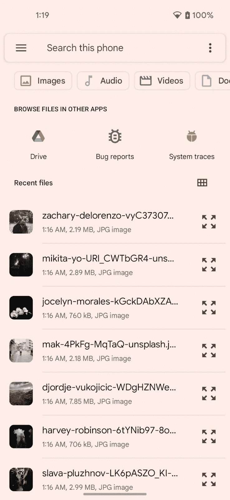
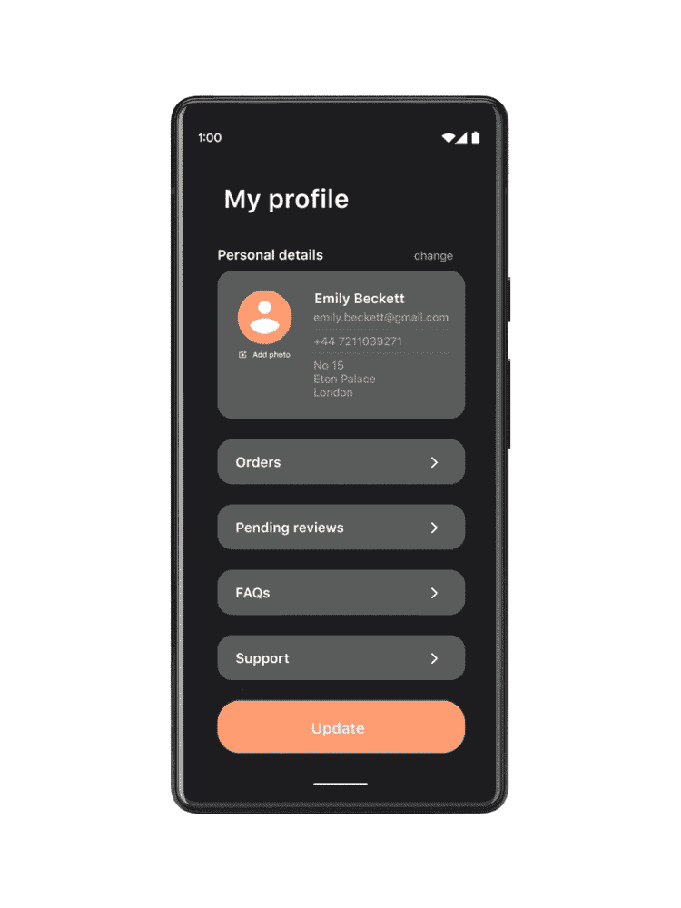
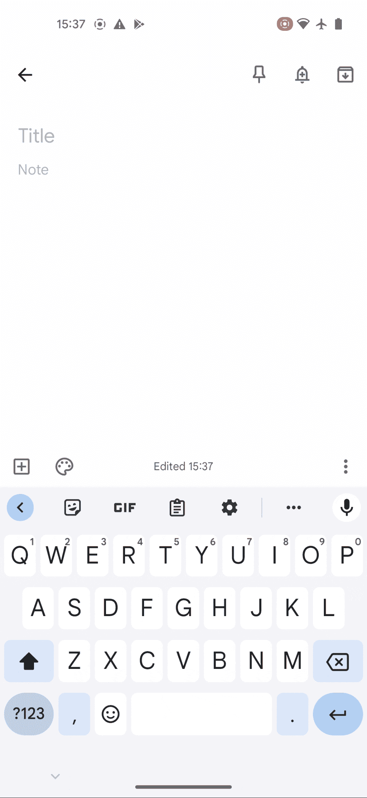
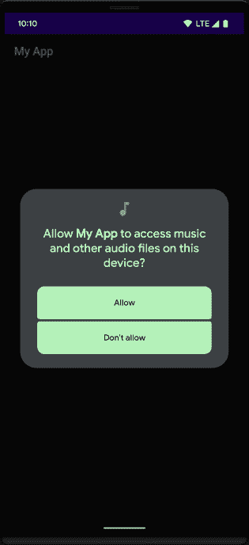
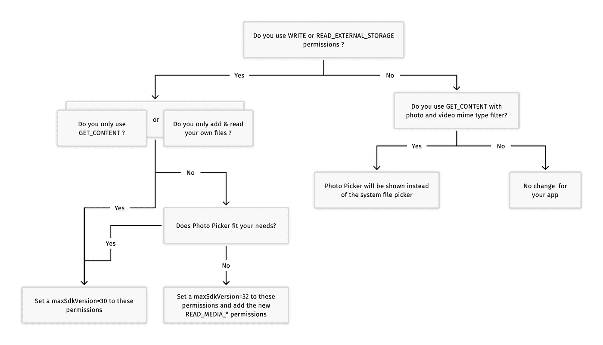

# 无许可是安卓存储的未来

> 原文：<https://medium.com/androiddevelopers/permissionless-is-the-future-of-storage-on-android-3fbceeb3d70a?source=collection_archive---------0----------------------->


无论是更改个人资料头像、分享度假照片，还是在电子邮件中添加附件，选择和分享媒体文件都是用户在移动应用程序上最常见的事情之一。在听取了 Android 用户的反馈后，我们对应用程序访问媒体文件的方式做了一些改变。根据我们从与开发人员的交谈中了解到的情况，我们引入了一个有用的新工具。

在 Android，我们认为让用户选择照片和视频应该是有帮助的，易于实施，并且有隐私意识。

# 现有存储权限的弃用

许多用户告诉我们，文件和媒体权限困扰着他们，因为他们不知道应用程序想要访问哪些文件。

在 Android 13 上，我们放弃了`READ_EXTERNAL_STORAGE`和`WRITE_EXTERNAL_STORAGE`权限，转而支持更好的替代 API 来访问媒体文件。

**请记住**从 Android 10 向共享存储添加文件不需要任何权限。所以如果你的应用程序**只在共享存储中添加文件**，你可以在 Android 10+上停止请求任何权限

历史上，应用程序要求`READ_EXTERNAL_STORAGE`请求用户授权访问文件&媒体。然后，他们实现了自己的媒体挑选体验，给开发者团队增加了沉重的开发&维护成本。或者，应用程序通过`ACTION_GET_CONTENT`或`ACTION_OPEN_CONTENT`依赖于系统文件拾取器，但我们从开发者那里听说它并没有很好地集成到他们的应用程序 UX:



System File Picker using `ACTION_OPEN_CONTENT`

# 介绍照片拾取器

在 Android 13 中，我们引入了一个新的视觉媒体拾取工具:Android photo picker。该工具为用户提供了一种选择媒体文件的方式，而无需授予对其整个媒体库的访问权限。

它提供了一个干净、可浏览的界面，向用户展示他们的照片和视频，并按日期排序。此外，“相册”部分允许用户通过有用的类别进行浏览，如截图或下载。通过指定用户应该只看到照片还是只看到视频，或者通过设置他们可以选择的最大项目数，照片选择器是可定制的。简而言之，这个解决方案是私有的，有一个干净和完整的 UX，并且易于实现。



我们还通过 Google Play 系统更新(【2022 年 5 月 1 日发布)在 Android 11 和 12*上移植了照片拾取器，以将其带给更广泛的 Android 受众。

虽然开发和更新您自己的媒体拾取器是一个复杂而费力的项目，但照片拾取器不需要您的团队进行任何维护。这是一个简单的启动意图，我们已经在 [ActivityX 1.6.0 版本](https://developer.android.com/jetpack/androidx/releases/activity#1.6.0)中为它创建了一个 [ActivityResultContract](https://developer.android.com/reference/androidx/activity/result/contract/ActivityResultContract) 。它将在可用时使用照片选择器，并在旧设备上回退到 ACTION_OPEN_DOCUMENT:

```
// Registering Photo Picker activity launcher with a max limit of 5 items
val pickMultipleVisualMedia = registerForActivityResult(PickMultipleVisualMedia(5)) { uris ->
    // TODO: process URIs
}// Launching the photo picker (photos & video included)
pickMultipleVisualMedia.launch(PickVisualMediaRequest(PickVisualMedia.ImageAndVideo))
```

如果您想添加类型过滤，可以这样做:

```
// Launching the photo picker (photos only)
pickMultipleVisualMedia.launch(PickVisualMediaRequest(PickVisualMedia.ImageOnly))// Launching the photo picker (video only)
pickMultipleVisualMedia.launch(PickVisualMediaRequest(PickVisualMedia.VideoOnly))// Launching the photo picker (GIF only)
pickMultipleVisualMedia.launch(PickVisualMediaRequest(PickVisualMedia.SingleMimeType("image/gif")))
```

您可以通过调用`[isPhotoPickerAvailable](https://developer.android.com/reference/kotlin/androidx/activity/result/contract/ActivityResultContracts.PickVisualMedia.Companion#isPhotoPickerAvailable()).`来验证照片拾取器在给定设备上是否可用

查看[文档](https://developer.android.com/training/data-storage/shared/photopicker)了解更多关于添加照片拾取器到你的应用程序的细节。

# `ACTION_GET_CONTENT`行为改变

正如我们刚刚看到的，采用 Android 照片拾取器只需要几行代码。虽然我们希望所有应用程序都使用它，但您的应用程序中的迁移可能需要一些时间。这就是为什么我们将 Android photo picker 的好处带到现有的使用`ACTION_GET_CONTENT`的应用程序中，在接下来的几个月里，无需任何代码更改，就可以将系统文件 picker 切换为引擎盖下的 photo picker。如果您使用图像和/或视频 mime 类型过滤器启动`ACTION_GET_CONTENT`意图，将显示照片选择器，而不是文档选择器。对于应用程序，预期的结果是一样的:一个`Uri`列表。



ACTION_GET_CONTENT will open the photo picker instead of the document picker

# 针对特定用例的新权限

虽然我们**强烈** **建议**您使用新的照片拾取器，而不是请求访问所有媒体文件，但您的应用程序可能有需要这种广泛访问的用例(例如图库照片备份)。对于这些特定用途，我们引入了新的权限，提供对特定类型媒体文件的访问，包括图像、视频或音频。你可以在文档中了解更多。

如果用户之前授予您的应用程序`READ_EXTERNAL_STORAGE`权限，系统会自动授予您的应用程序粒度媒体权限。否则，当您的应用程序请求任何新权限时，系统会显示一个面向用户的对话框。

**记住**你必须总是检查是否有任何权限仍然被授予，而不是存储它们的授予状态。通过应用程序休眠和过期许可授权



查看此决策树，帮助您了解这些变化:



通过这些公告，我们致力于不断改进照片拾取器和整体存储开发人员体验，同时保护用户隐私，以创建一个安全透明的 Android 生态系统。如果您有任何反馈或建议，请将票证提交给我们的问题跟踪器！

**:Android photo picker 后移植到所有 Android 11 & 12 设备，不包括 Android Go 和非 GMS 设备。*