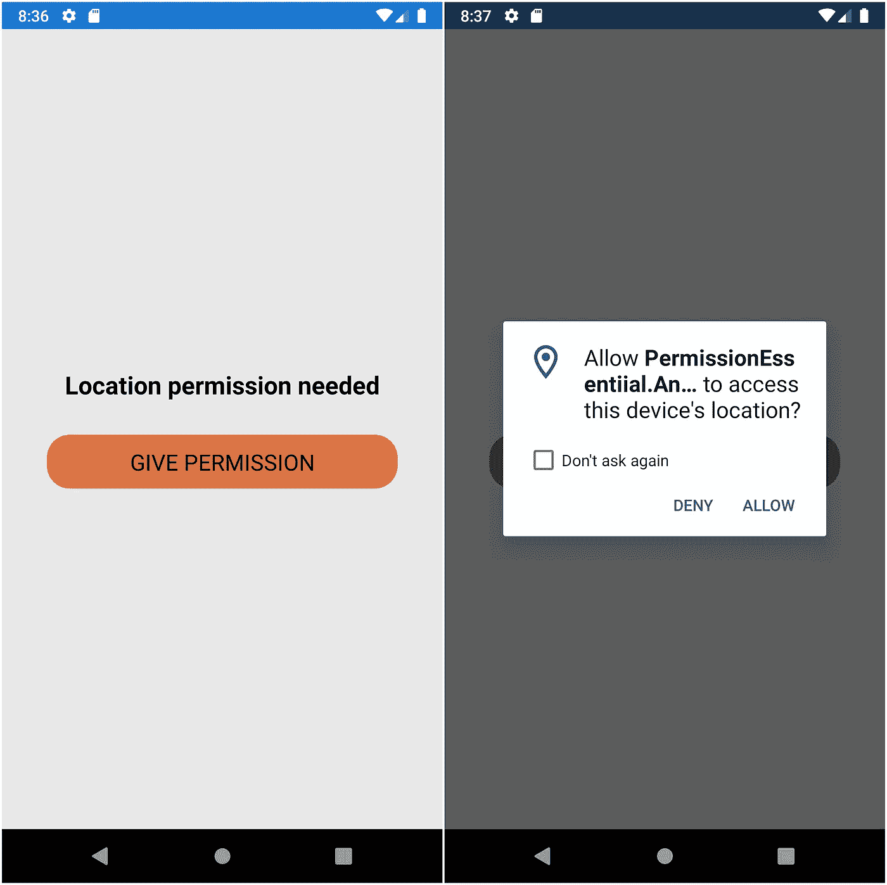

# Xamarin 简化了权限。必需品；要素

> 原文：<https://medium.com/globant/permissions-made-easy-with-xamarin-essentials-3cc05d55c2c?source=collection_archive---------0----------------------->


如果您需要使用地理定位、联系人或摄像头等功能，我们必须征得用户的同意。

在 Xamarin 表单中实现权限并不像我们必须使用本地组件那样简单。Xamarin 前来救援。要领 1.5。这使得实现地理定位、联系人或摄像头等权限变得很容易。

让我们看一个例子。

```
<?xml version="1.0" encoding="utf-8" ?>
<ContentPage
    x:Class="PermissionEssentiial.MainPage"
    ae kc" href="http://xamarin.com/schemas/2014/forms" rel="noopener ugc nofollow" target="_blank">http://xamarin.com/schemas/2014/forms"
    xmlns:x="[http://schemas.microsoft.com/winfx/2009/xaml](http://schemas.microsoft.com/winfx/2009/xaml)">
    <StackLayout
        Padding="30"
        Spacing="30"
        VerticalOptions="CenterAndExpand"> <Label
            FontAttributes="Bold"
            FontSize="Large"
            HorizontalTextAlignment="Center"
            Text="Location permission needed"
            TextColor="Black" /> <Button
            Margin="10,0"
            BackgroundColor="#EE7E4C"
            Command="{Binding PermissionCommand}"
            CornerRadius="20"
            FontSize="20"
            Text="Give permission"
            TextColor="Black" />
    </StackLayout>
</ContentPage>
```

在视图模型中

```
public class MainPageViewModel
    {
        public ICommand PermissionCommand { get; set; }
        public MainPageViewModel()
        {
            PermissionCommand = new 
            Command(async () => await    RequestPermissionAsync());
        }async Task RequestPermissionAsync()
        {
            var status = await  Permissions.CheckStatusAsync<Permissions.LocationWhenInUse>();
            if (status != PermissionStatus.Granted)
            {
                status = await Permissions.RequestAsync<Permissions.LocationWhenInUse>();
            }
        }
    }
```

这是你得到的输出



**注意**:需要在 android 的 manifest 文件和 iOS 的 Info.plist 文件中添加权限。