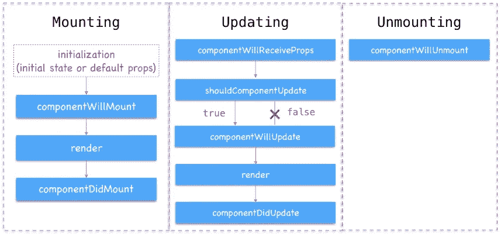
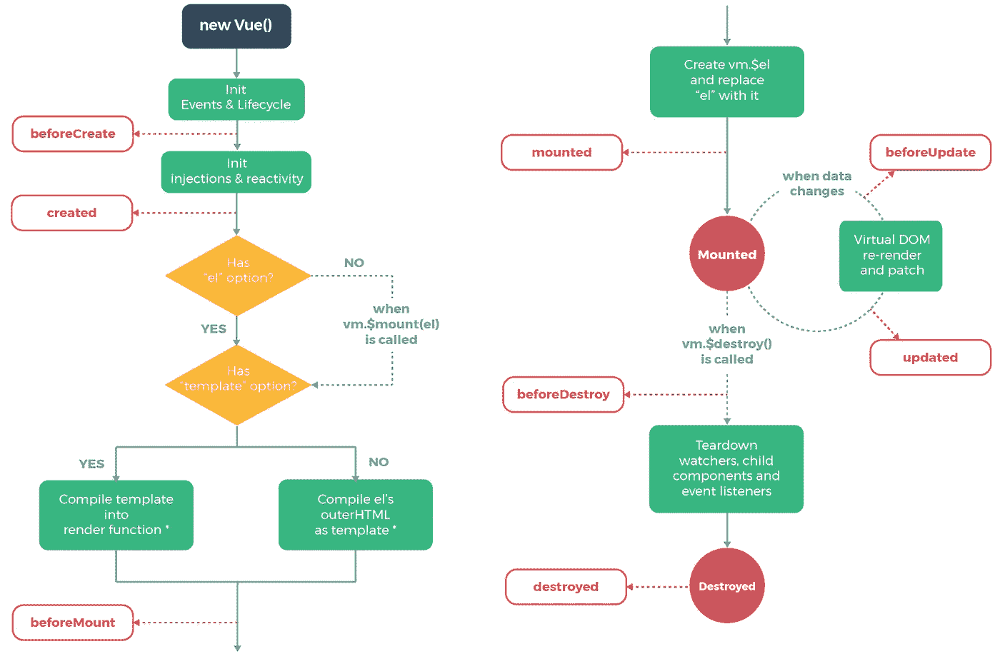
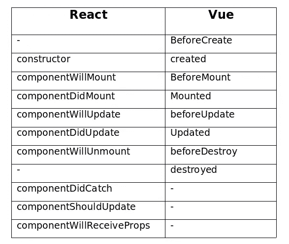
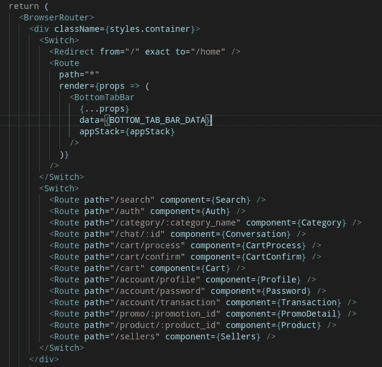
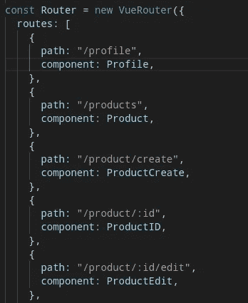
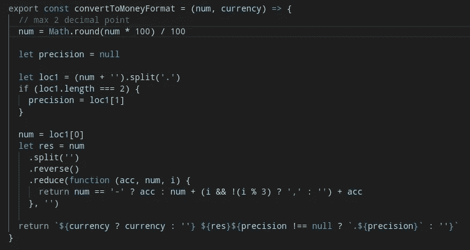
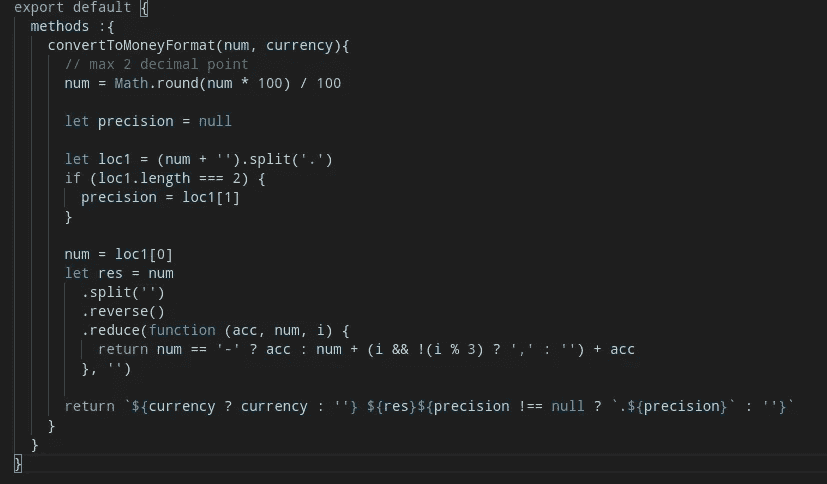
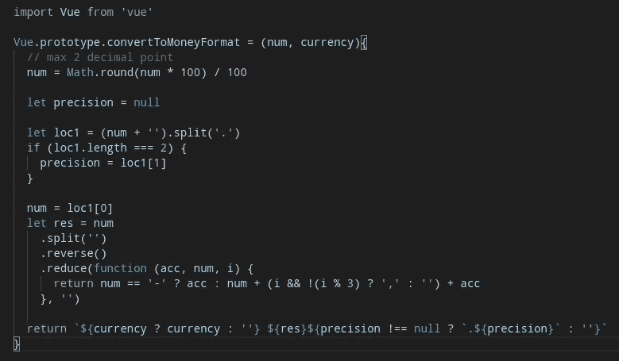
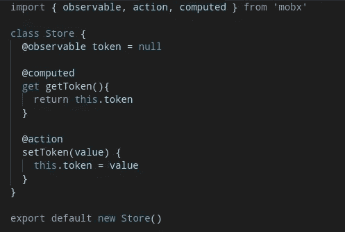
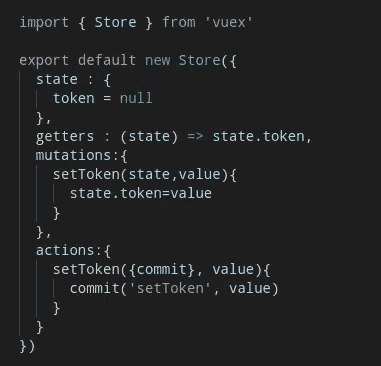

# Kesamaan Perilaku antara React dan Vue

> 原文：<https://medium.easyread.co/persamaan-perilaku-antara-react-dan-vue-f16ae8644e98?source=collection_archive---------5----------------------->

Logo React dan Vue

Seperti yang kita ketahui bersama, React (est. 2013) dan Vue (est. 2014) merupakan *library* atau *framework* Javascript yang populer dengan jumlah *star* lebih dari 100.000 di github. Persaingan “ *kejar-kejaran star”* keduanya cukup sengit sehingga dibuatkan salah seorang fans membuat sebuah situs yang dapat diakses [disini](https://hasvuepassedreactyet.surge.sh/) untuk menganalisa perbedaan jumlah *star* kedua *framework* ini.

Setelah melihat beberapa artikel yang membahas mengenai perbedaan dan perbandingan mengenai dua *library* atau *framework* ini, kali ini saya akan membahas tentang persamaan *behavior* (perilaku) antara React dan Vue berdasarkan pengalaman saya selama menggunakannya.

# Lifecycle Hooks

*Lifecycle hooks* atau *Lifecycle methods* merupakan fitur wajib untuk *library* atau *framework* Javascript modern — yaitu method yang mengatur *behavior* suatu komponen. Penggunaannya sangat penting untuk mengoptimasi dan merancang agar suatu komponen dapat berjalan sesuai keinginan kita.

Lifecycle hooks react

Lifecycle hooks vue

Dari kedua gambar diatas, dapat kita simpulkan bahwa kedua *library* atau *framework* ini memiliki *lifecycle* yang hampir sama — hanya berbeda penamaannya.

Jika dibuat ke dalam bentuk tabel, maka berikut adalah perbandingannya.

# Routing

*Routing* merupakan hal yang harus diperhatikan untuk membangun *Single Page Application* (SPA). *Routing* pada React dilakukan dengan menggunakan *package* *react-router-dom* dan mengintegrasikannya ke dalam *container component* . Dalam prosesnya, kita dapat menggunakan 4 komponen *router* , yakni *BrowserRouter/HashRouter, Route, Switch, dan Redirect* .

Routing pada React

Sedangkan pada Vue, dapat dilakukan dengan menggunakan *package* *official* vue-router dan menambahkan router ke dalam main.js atau dipisah dalam bentuk file router.js supaya lebih rapi. Kemudian diregistrasikan ke dalam Vue *instance* .

Routing pada Vue

# Global Function (U *til* )

Penggunaan *global function* atau *reusable function (util)* pada React umumnya dilakukan dengan membuat file tersendiri, kemudian mengimportnya ke dalam komponen.

File util pada React

Pada Vue, kita dapat menggunakan beberapa cara.

Yang pertama, dapat dengan membuat file tersendiri, kemudian mengimportnya ke dalam komponen. Cara yang sama persis dengan react.

Yang kedua, dengan menggunakan *mixin* . *Mixin* memungkinkan kita untuk menciptakan “komponen bayangan” tanpa mendeklarasikan *template* atau *view* . *Mixin* ini sekaligus dapat memiliki *lifecycle hook* komponen.

Penggunaan mixin pada Vue

Cara yang ketiga, kita dapat menggunakan Vue *global instance* . Yakni dengan memanfaatkan Vue.prototype, sehingga tidak perlu mengimport file.

Penggunaan *Vue.prototype pada Vue*

# State Management

Sayangnya, selama menggunakan React, saya masih baru mencoba satu *state management* , yaitu mobx. Karena menurut saya penggunaannya sangat sederhana dan mudah dimengerti.

MobX sebagai state management

Sedangkan pada Vue, saya menggunakan vuex sebagai *state management officialnya* .

Vuex sebagai state management

Kedua *state management* diatas penggunaannya cukup mirip dan menggunakan *verbal* yang mudah dimengerti ( *state, getters/computed, action* ). Hanya terdapat sedikit perbedaan *syntax* .

Diantara beberapa persamaan diatas, banyak sekali perbedaan kedua *library* atau *framework* ini mengingat baik React maupun Vue memiliki visi dan *background* yang berbeda. Tentu mereka ingin merepresentasikan keunikan dan keunggulan masing-masing. Perbedaan ini tentu baik untuk menambah variasi dan pilihan dalam memilih *library* atau *framework* .

Kesimpulannya, tidak ada *framework* yang paling baik. Semua memiliki kelebihan dan kelemahannya masing-masing. Tujuan *library* atau *framework* diciptakan adalah untuk mempermudah proses *development* . Sehingga seharusnya kita berhenti memperdebatkan tentang penggunaan *tool* dan mulai berkarya menciptakan sesuatu yang berguna.

Demikian uraian singkat saya mengenai perbedaan dan persamaan fitur dalam ReactJS dan VueJS. Jika ada statement yang salah mohon dikoreksi.

Terima kasih.

*Artikel ini di tulis oleh* [*Alif Irfan Anshory*](https://medium.com/u/6e41e9409c88?source=post_page-----f16ae8644e98--------------------------------) *ia menulis artikel mengenai Software Engineering dan Programming. Ikuti profilnya untuk mendapatkan update-an terbaru artikel-artikel miliknya.*

*Jika kamu merasa artikel ini menarik dan bermanfaat, bagikan ke lingkaran pertemanan kamu, agar mereka dapat membaca artikel ini.*