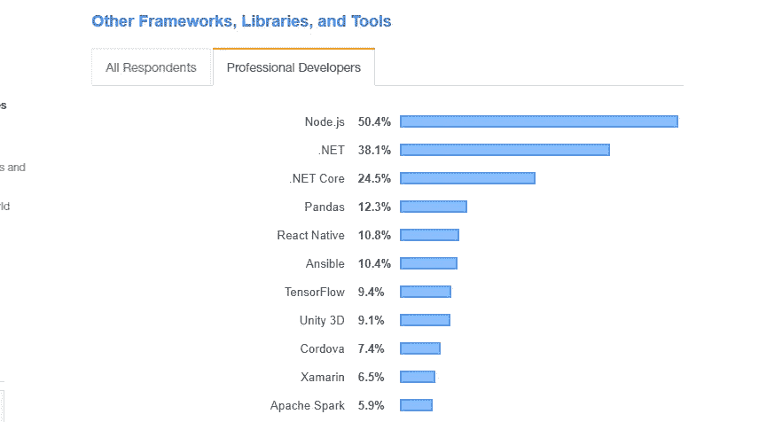
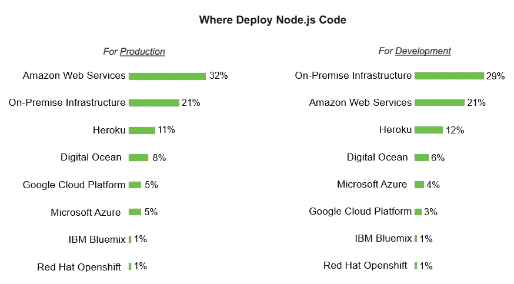
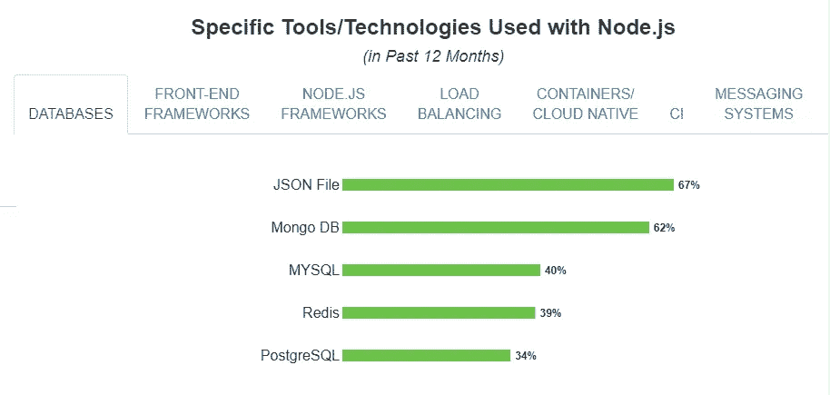
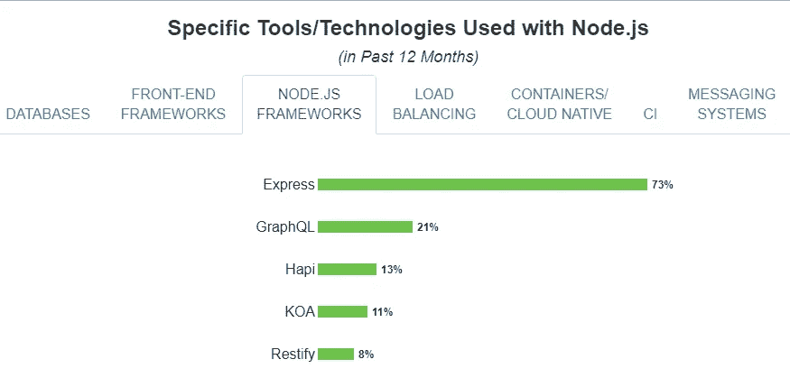
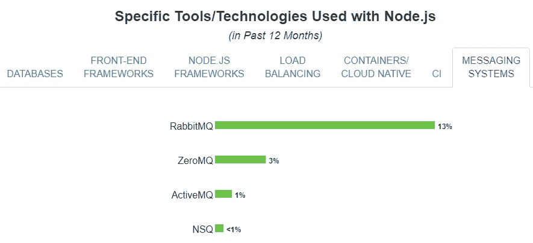
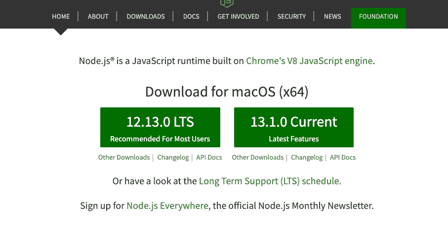
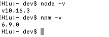
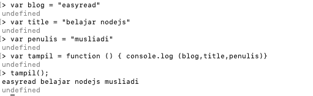

# NodeJS Series — Pengenalan & Persiapan Proyek dengan ExpressJS

> 原文：<https://medium.easyread.co/persiapan-untuk-pengerjaan-proyek-dengan-expressjs-7d2c30196dc0?source=collection_archive---------1----------------------->

## Part 1: Instalasi Node JS dan Persiapan Proyek


[Unsplash](https://unsplash.com/photos/j2gWpAqTG7w) & [TechMinner](https://www.thetechminers.com/nodejs)

# ExpressJS Series List

[**0\. NodeJS Series — Belajar ExpressJS dari Awal yok!**](https://medium.com/easyread/nodejs-series-belajar-expressjs-dari-awal-yok-400d9a88e73a) **1\. Persiapan untuk Pengerjaan Proyek dengan ExpressJS — (You’re here)** [**2\. Pengenalan ExpressJS dan Instalasi ExpressJS**](https://medium.com/easyread/nodejs-series-pengenalan-expressjs-dan-instalasi-expressjs-5fda39b9ea58)

# **NodeJS**

NodeJS merupakan teknologi untuk membangun aplikasi dari sisi server *(server-side)* . Beberapa tahun yang lalu teknologi javascript pada aplikasi web hanya digunakan pada sisi client *(client-side)* . Melihat permasalahan tersebut seorang programmer bernama ***Ryan Dahl*** menciptakan NodeJS dan memperkenalkannya pada tahun 2009\. Ryan Dahl mengembangkan NodeJS diatas Engine V8 dari Google.

Karena NodeJS dikembangkan dengan bahasa javascript, maka NodeJS juga mengadopsi cara kerja javascript yakni berbasis non-block. Hal inilah yang membuat Ryan Dahl tertarik. Jika konsep *blocking* akan memproses suatu kode berdasarkan urutan, dimana kode yang akan dieksekusi akan dijalankan sampai selesai terlebih dahulu baru kemudian menjalankan kode berikutnya. Maka konsep *non-blocking* dapat menjalankan *code* secara bersamaan, jadi yang akan di tampilkan terlebih dahulu adalah *task* yang memiliki proses yang sedikit.

# **Kepopuleran NodeJS**



[StackOverflow](https://insights.stackoverflow.com/survey/2019)

Berdasarkan laporan StackOverflow ditahun 2019 NodeJS menduduki posisi pertama sebagai teknologi yang paling banyak digunakan dalam pengembangan aplikasi.

## **Beberapa Kata Kunci yang Akan di Temukan di NodeJS**

Jika telah memutuskan akan menjadi programmer NodeJS, mau tidak mau harus belajar beberapa konsep lebih lanjut:

1.  ***Synchronous dan Asynchronous***
2.  ***Callback***
3.  ***Promise***
4.  ***Generator***

## **Perusahaan Yang Menggunakan NodeJS**

Berdasarkan catatan ToTheNew, beberapa perusahaan besar yang menggunakan NodeJS adalah:

1.  ***Netflix***
2.  ***Linkid***
3.  ***Walmart***
4.  ***Trello***
5.  ***Uber***
6.  ***Paypal***
7.  ***Medium***
8.  ***Ebay***
9.  ***NASA***
10.  dan perusahaan lainnya.

# **Deploy / Hosting NodeJS ?**

Bagian ini saya tambah karena banyak teman-teman pada bertanya kalau hosting NodeJS di Indonesia menggunakan apa? Alternatifnya ada Domainesia, Indowebsite, RumahWeb dan hosting lainnya. Kalau yang diluar alternatifnya, bisa dilihat dari laporan NodeJS Foundation berikut :



[NodeJS Foundation](https://nodejs.org/en/user-survey-report/#overview)

## **Framework Untuk Membuat Aplikasi Sisi Server**

Berikut ini alternatif *framework server-side* yang paling populer.

1.  ***ExpressJS***
2.  ***KoaJS***
3.  ***AdonisJS (mengadopsi konsep laravel)***
4.  ***NestJS (ngoding sisi server rasa angular, menggunakan Typescript)***
5.  ***FastifyJS***
6.  Dll

## **Teknologi Yang Sering di Gunakan Bersamaan dengan NodeJS**

Database :



Framework NodeJS :



Messaging System :



# **Instalasi NodeJS**

Kunjungi halaman [https://nodejs.org/en/](https://nodejs.org/en/) , *download* file file installer sesuai sistem operasi yang ada. Direkomendasikan untuk menggunakan versi LTS (Long Term Support) yang stabil.



Jika NodeJS berhasil diinstall, cek versi NodeJS dan versi npm (biasanya npm telah di *include* -kan di NodeJS). Masuk ke terminal dan jalankan perintah berikut:

```
**node -v**
```

Kemudian jalankan perintah

```
**npm -v**
```



Jika ingin memulai coding di terminal jalankan perintah **node** di terminal kemudian enter :



Sekian bagian pertama dari series belajar NodeJS, sampai berjumpa kembali.


Image taken from Google Images