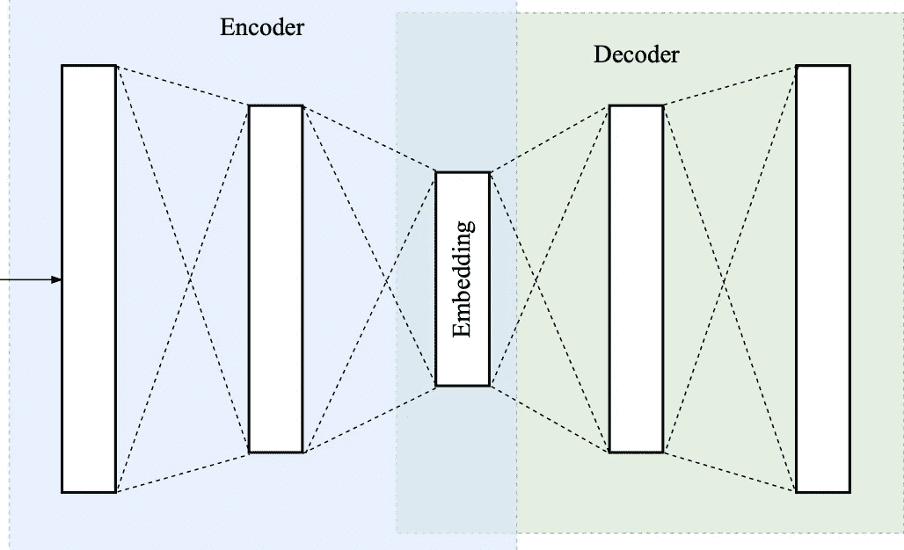
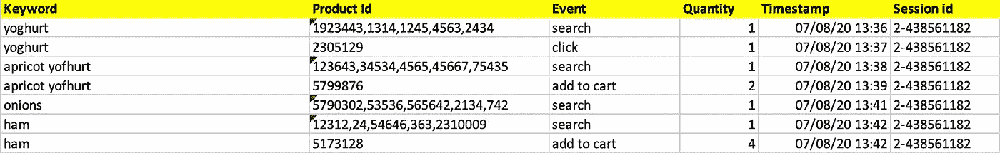
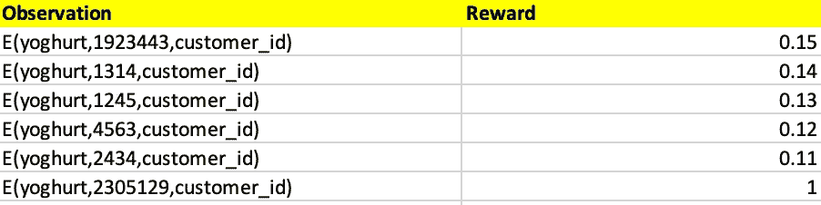
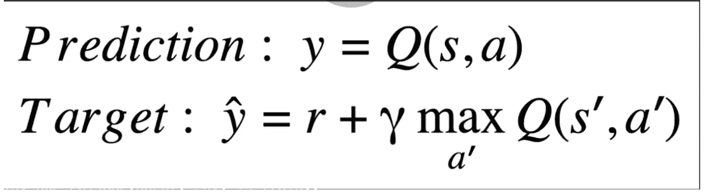

# 搜索个性化

> 原文：<https://medium.com/walmartglobaltech/personalization-for-search-cd4ecc68db8c?source=collection_archive---------0----------------------->

个性化！每个人都这么做，所以它还特别吗？这些天来，个性化已经成为一个非常热门的话题，在任何地方都被融合在一起，包括搜索结果。这意味着搜索结果的排序是为了满足消费者的个性化需求。在这里，我将带您了解个性化搜索在电子商务领域的应用，也称为**个性化搜索**。

Image: [Source](https://dt-cdn.net/wp-content/uploads/2016/08/Personalization-CX-Effects1.gif)

> 有太多的选择，你最终不知道你想要哪一个——黑镜

# 搜索

搜索服务在提供结果之前大致要经历三个阶段，即[、查询理解](https://towardsdatascience.com/understanding-the-search-query-part-i-632d1b323b50)(预处理)、检索(处理)、排序(后处理)。在预处理阶段，对接收到的查询进行结构化、标记并提取意图，然后将简化的查询传递给搜索引擎(solr、elastic 等)。)在处理阶段。在最后阶段，即后处理阶段，基于用户反馈，基于若干特征/信号对原始响应进行重新排序。

# 个性化搜索

这里，搜索的个性化被提议作为后处理步骤，其中来自搜索引擎的原始响应(召回集)可以通过利用深度强化学习按照用户偏好被重新排序。在我们深入建模方面之前，让我们了解一下模型的需求。对于文本嵌入，我们使用了来自 TensorFlow hub 的 [**BERT** 。为了压缩大尺寸的级联嵌入，可以使用**自动编码器**。](https://tfhub.dev/google/collections/bert/1)

## 自动编码器

[自动编码器](https://blog.keras.io/building-autoencoders-in-keras.html)是一种自我监督的降维技术，其编码器-解码器架构经过训练，可重构其输入。它在中间有一个瓶颈层，包含 D 维输入向量的嵌入；嵌入层通常具有比 d 少得多的单元。解码器的目标是从该嵌入中重构输入特征向量。自动编码器可以构建成几种类型，其中两种用于创建嵌入——前馈全连接和深度卷积全连接自动编码器。请关注这篇博客，它是一篇关于自动编码器的独立博客。

autoencoders

模型输入的三个嵌入是

1.  **查询嵌入** —这是一个简单的句子嵌入，我们可以得到关键字序列中每个单个术语的合并嵌入输出。假设它给出了形状(1，768)的一个嵌入 E(Q)。
2.  **产品嵌入** —基于显示名称、品牌、类别、价格、营养特性、评级和评论等几个特征。并将其连接在一起，我们可以生成产品嵌入。目录中的数字特征，如价格、评级等。可以在连接之前进行缩放，并且可以使用单词嵌入对单个文本特征进行编码。但是，结合在一起，嵌入维数增加。现在，为了降低维度，我们必须使用如上所述的深度前馈自动编码器来压缩，并在最后获得产品嵌入所需的降低维度。同样，相似的产品在 2D 空间中彼此接近，这可以通过 [PCA](https://en.wikipedia.org/wiki/Principal_component_analysis) 然后是 [tSNE](https://en.wikipedia.org/wiki/T-distributed_stochastic_neighbor_embedding) 来分析。假设这个过程给出了形状(1，512)的嵌入 E(P)。
3.  **客户嵌入** —我们可以使用客户的订单细节和配置文件细节来生成他们的个人嵌入，其中每个客户都可以通过一个浮点向量来表示。客户的所有特征和行为都可以在一次嵌入中捕获。订单详细信息包含过去订购项目的历史记录，可以选择其中的前 N 项。所有 N 个产品的嵌入已经通过 E(P)生成，并且在这里用于获取 N 个产品嵌入。因为每个 E(P)都有一个形状(1，512)，所以 N 个乘积合起来有一个非常大的形状(100，512)。因此，我们需要一个深度卷积自动编码器来压缩它们，以再次得到形状为(1，512)的嵌入 E(C)。这种嵌入可以与用户的与简档相关的细节(例如性别、年龄、位置等)连接在一起。在对它们进行编码以获得形状>(1512)的最终 E(C)之后。同样，具有相似行为的客户可以在 2D 空间中彼此靠近地被发现，这可以通过 [PCA](https://en.wikipedia.org/wiki/Principal_component_analysis) 接着 [tSNE](https://en.wikipedia.org/wiki/T-distributed_stochastic_neighbor_embedding) 来分析。

## 数据集

创建数据集的想法受到了[开放健身馆](https://gym.openai.com/docs/)的启发。由于特定用户在购物过程中搜索关键词时的交互被认为是一个环境，因此用户的整个会话被视为一个情节。观察应该是由上面讨论的嵌入三元组组成的查询式交互。如果从用户那里收到了关于点击/添加到购物车的积极反馈，那么我们将给予接近 1 的奖励，否则将给予接近 0 的奖励。样本数据集可以是-

Raw customer engagement feedback data

这里，用户在一个会话中搜索了四个关键字，但没有找到任何要添加关键字`onions`的内容。数据集的一集包含所有关键词交互的观察。让我们基于第一个关键字`yoghurt.`创建一个观察数据集

Observation for a query

E(X)代表 X 的嵌入。

## 模型

为了建模，我们需要一个基于深度 Q 网络(DQN)的模型，其中建立了一个[深度学习模型](https://towardsdatascience.com/explained-deep-learning-in-tensorflow-chapter-1-9ab389fe90a1)，以找到代理在每个状态下可以采取的行动。问题可以表述为 MDP，就强化学习而言，搜索结果页面被假设为环境，模型被假设为代理，每个查询的正确排序被假设为动作。每个查询的操作都是通过给最喜欢的产品打高分，将该产品显示在顶部。回报将是在显示结果集之后从最终用户那里收到的反馈。这个想法是在一个搜索会话中最大化整个篮子的大小。该模型以三元组{E(P)，E(C)，E(Q)}的嵌入作为输入。奖励可以根据未来的结果打折扣。

Discounted reward

以下是解释模型训练序列的一些代码片段/框架:

Model skeleton to train the deep DQN for personalized search

基于模型的损失函数，我们可以有两个模型

1.  基于**逐点损失**函数的模型——最简单的方法是逐点学习。在这种方法中，映射发生在用户-文档-查询对的每个三元组和它们的关系之间。这里，每个操作都是一个职位的选择文档，给出 0 到 1 之间的分数。
2.  基于**列表式损失**函数的模型——该模型获得查询和用户的所有文档的多特征作为输入，并学习在单个推断中预测所有文档的分数。密集层中的 user_context、search_term 的两个特征以及 LSTM 网络中以时间分布方式添加的所有产品特征可以作为输入传递给模型。最终层具有对应于每个产品的概率。自定义 [NDCG](https://github.com/tensorflow/ranking/blob/1ee0788997510c6e0a76c57bca7d7864b71be130/tensorflow_ranking/python/losses_impl.py#L888) 在这里可以作为损失函数使用。[进一步引用](https://arxiv.org/pdf/1804.05936.pdf)。

Keras 中的样本 DQN 深度学习模型[此处](https://github.com/philtabor/Youtube-Code-Repository/blob/master/ReinforcementLearning/DeepQLearning/dqn_keras.py)。

# 推理

大多数深度学习模型在生产中不是实时提供的，因为它变得太重了。但是在这里，模型非常简单，我们所要做的就是将预先生成的嵌入存储在可快速访问的数据存储/缓存中。该模型可以通过 [REST API 协议](/@sonusharma.mnnit/building-a-microservice-in-python-ff009da83dac)公开，并使用 [TensorFlow serving](/analytics-vidhya/elmo-embedding-the-entire-intent-of-a-query-530b268c4cd) 提供服务。对于逐点损失法，必须预测整个召回集的分数，因此，将对所有产品并行(异步)调用模型以获得分数。基于接收到的分数，回忆集被重新排序并呈现给用户。对于列表式损失方法，由于所有产品的分数都是在对模型的一次调用中获取的，所以我们只需要对输出进行重新排序，并将其呈现给用户。

请务必阅读我的其他故事，并留意这个空间的更多东西！如果需要帮助，请随时联系我。

***参考文献***

1.  [https://static . Google user content . com/media/research . Google . com/en//pubs/archive/45530 . pdf](https://static.googleusercontent.com/media/research.google.com/en//pubs/archive/45530.pdf)
2.  [https://blog . grid dynamics . com/customer 2 vec-representation-learning-and-automl-for-customer-analytics-and-personalization/](https://blog.griddynamics.com/customer2vec-representation-learning-and-automl-for-customer-analytics-and-personalization/)
3.  [https://blog . Twitter . com/engineering/en _ us/topics/infra structure/2019/split net-architecture-for-ad-candidate-ranking . html](https://blog.twitter.com/engineering/en_us/topics/infrastructure/2019/splitnet-architecture-for-ad-candidate-ranking.html)
4.  [http://jad . shahroodut . AC . IR/article _ 1446 _ ee 0 e 6 aa 7 FCA 267836619 e 59 b 697 e 7 bb 5 . pdf](http://jad.shahroodut.ac.ir/article_1446_ee0e6aa7fca267836619e59b697e7bb5.pdf)
5.  [http://www . bigdatalab . AC . cn/~徐俊/publications/sigir 2017 _ RL _ l2r . pdf](http://www.bigdatalab.ac.cn/~junxu/publications/SIGIR2017_RL_L2R.pdf)