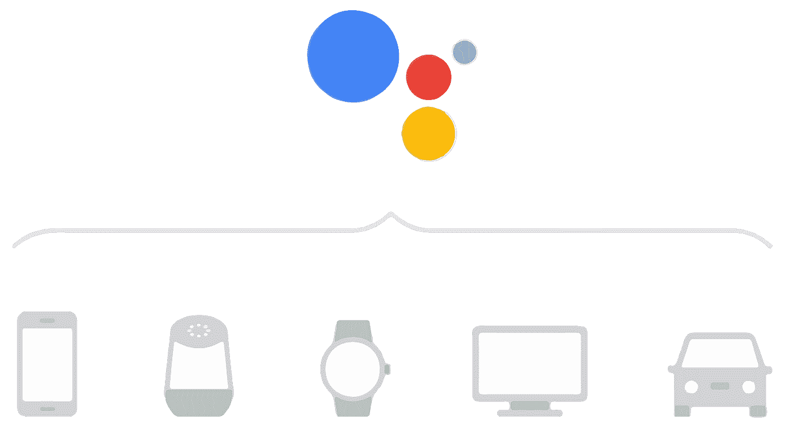
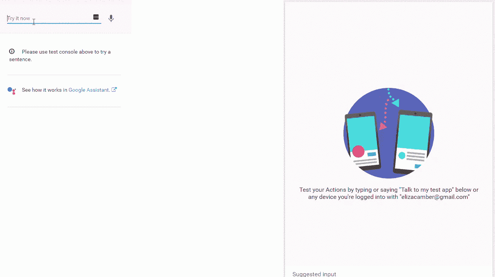
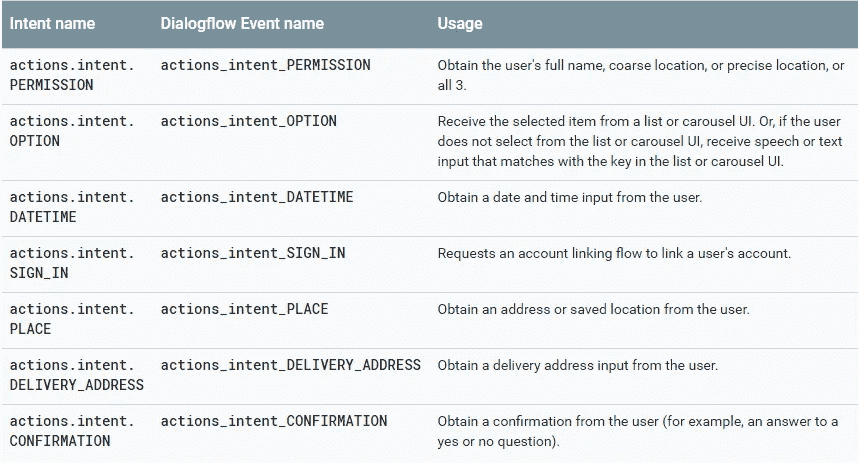
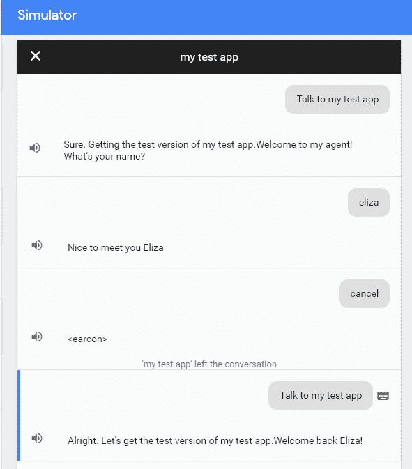
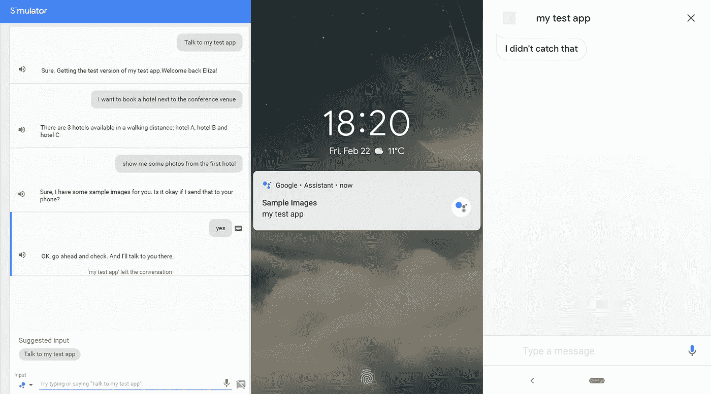
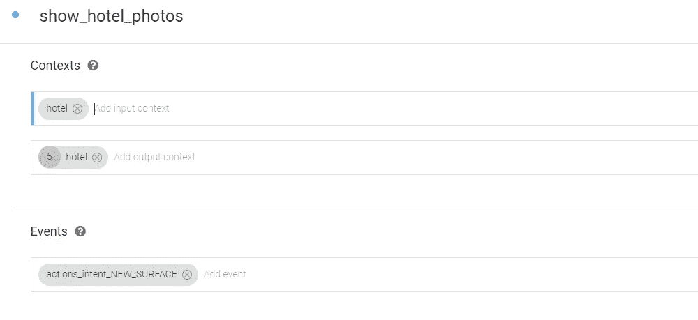
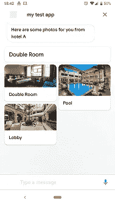
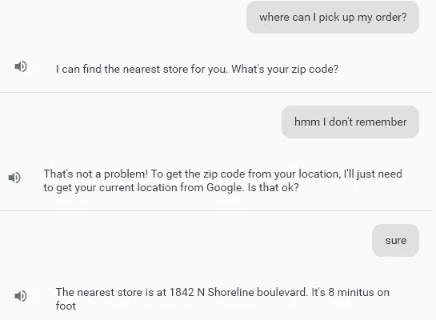

# 针对每个用户和设备的个性化:神奇的对话对象

> 原文：<https://medium.com/google-developer-experts/personalize-for-each-user-device-the-magic-conversation-object-def0785582f9?source=collection_archive---------0----------------------->



一个优秀的代理能够为每个用户提供个性化的体验，适应他们的需求，并为他们当前使用的任何设备提供最佳体验。有了谷歌(AoG)的 Actions，定制响应、存储信息和操作显示响应的媒介，都可以通过学习如何利用对话对象来实现。

*如果你已经熟悉了* `DialogflowConversation` *对象，并且想看一些现实世界例子中的代码，* [*跳转到这里*](#c82d) *。*

如果你现在开始在 Google 和 DialogFlow 上操作，你会多次遇到一个名为`conv` ( `DialogflowConversation`)的对象。你还会看到，你在你的项目的 webhook 上的开始代码，与文档有很大的不同。这两个平台都非常新，并且在不断改进，所以这很自然。

文档片段:

```
function simpleResponse(conv) {
  conv.data.count = 1;
  conv.ask('Hi there, what can I help you with today?');
}
```

起始代码

```
// ...const agent = new WebhookClient({ request, response });

  function welcome(agent) {
    agent.add(`Welcome to my agent!`);
  }let intentMap = new Map();
  intentMap.set('Default Welcome Intent', welcome);
  // ...
  agent.handleRequest(intentMap);
});
```

那么我在哪里找到那个`conv`物体呢？它其实就藏在你的`agent`里面。你需要做的就是在初始化`agent`之后添加这一行:

```
let conv= agent.conv();
```

请注意，conversation 对象不是一个常量。此外，对话对象仅适用于 Google Assistant。如果您试图在 DialogFlow 中测试它，它总是会返回 null。如果你在谷歌平台上尝试这种方法，它会非常有效。背后的原因是因为有两个不同的库:`[dialogflow-fulfillment](https://github.com/dialogflow/dialogflow-fulfillment-nodejs#readme)`和`[actions-on-google](https://github.com/actions-on-google/actions-on-google-nodejs)`。



Right: Testing on DialogFlow platform. Left: Testing on Actions on Google platform

# 储存；储备

有一篇由 [Jeremy Wilken](/@gnomeontherun) 撰写的关于存储会话数据和存储会话间数据的精彩文章，所以我不会在这里深入探讨。

 [## 使用 Google Actions 在会话期间和会话之间存储数据

### 有时，在构建语音机器人时，您需要跟踪对话过程中的信息。有一个…

medium.com](/@gnomeontherun/storing-data-during-a-session-and-between-sessions-with-google-actions-ec23a49a40e) 

简而言之，Google 上有两种类型的动作存储:

1.  存储会话数据；这些数据仅在该会话中可用→ `conv.data`
2.  在会话之间存储数据；这些数据将在多个会话中对特定用户可用→ `conv.user.storage`

此外，如果你希望从另一个平台访问用户的数据，或者将它们存储在其他地方，你可以使用 Firebase( [1](/google-developers/do-you-need-to-share-data-between-your-actions-and-your-mobile-and-web-apps-8cf6464d85fd) )( [2](/google-developers/update-and-customize-queries-on-your-cloud-firestore-data-for-actions-on-google-7eb1010b417f) )或者你的后端。


# ⚠️🛑

在某些国家，如果您想要访问或保存 userStorage、Firebase 或您的后端中的信息，您必须使用[确认助手](https://developers.google.com/actions/assistant/helpers#confirmation)请求用户同意，并在您可以开始存储信息之前获得同意。

# 表面性能

超过 10 亿台设备上都有谷歌助手。从扬声器和智能显示器到汽车和冰箱，并不是所有的产品都有相同的输出。重要的是，当你制定行动时，要考虑到这一点，并为每个人提供独特的体验。再一次，`DialogflowConversation`对象拥有了我们需要的一切。为了检查正在进行的这一特定对话的设备功能，我们将以下内容添加到我们的实现中:

```
const hasScreen =
  conv.surface.capabilities.has('actions.capability.SCREEN_OUTPUT');const hasAudio =
  conv.surface.capabilities.has('actions.capability.AUDIO_OUTPUT');const hasMediaPlayback = 
  conv.surface.capabilities.has('actions.
                                  capability.MEDIA_RESPONSE_AUDIO');

const hasWebBrowser =
  conv.surface.capabilities.has('actions.capability.WEB_BROWSER');
```

# **助手**

有些事情你不能问你的用户而不赌博。例如，如果你想派一辆出租车去接你的用户，口头询问他们当前的地址是不理想的。帮助者是在这种情况下提供帮助的特定意图。



available helper intents: [https://developers.google.com/actions/assistant/helpers#tab2](https://developers.google.com/actions/assistant/helpers#tab2)

# 真实世界的例子

很高兴知道所有这些都存在以及它们是如何工作的，但是有哪些真正的用例呢？

## 会话数据(conv.data)

会话数据在很多情况下非常有用。如果你想通过一遍又一遍地重复同样的事情来使你的行动不那么令人讨厌，你可以用它来计算你的行动没有完成的次数，并提供更多有用的提示。它可以帮助你记录一场比赛的分数，或者如果是一场智力竞赛的话，给你一些提示！

```
const LIST_FALLBACK = [
   `Sorry, what was that?`,
   `I didn\'t catch that. Could you tell me which one you prefer?`,
   `I'm having trouble understanding. Which one of those do you prefer?`];

const FINAL_FALLBACK = `I'm sorry I'm having trouble here. Let's talk again later.`;function fallback(agent) {
  conv.data.fallbackCount++;
  if (conv.data.fallbackCount > 2) {
      conv.close(FINAL_FALLBACK);
  } else {
      let response = LIST_FALLBACK[conv.data.fallbackCount];
      conv.ask(response);
  }
    agent.add(conv);
}
```

## 存储数据(转换用户存储)

这使得每个用户的操作都是个性化的。从问候用户的名字到记住他们宠物的名字



Greet back your users

```
function welcome(agent) {
    if(conv.user.storage.name === undefined) {
      conv.ask(`Welcome to my agent! What's your name?`);
    } else {
      conv.ask(`Welcome back ${conv.user.storage.name}!`);
    }
    agent.add(conv);
  }

  function setName(agent) {
    let user_name = agent.parameters.name;
    conv.user.storage.name = user_name;
    conv.ask(`Nice to meet you ${user_name}`);
    agent.add(conv);
  }
```

# 表面性能



Asking my action to show photos from hotels. If a screen isn’t available, it will prompt me to show the results on my phone. When we open the phone though nothing happens

```
const { NewSurface } = require('actions-on-google');function showHotelPhotos(agent) {
   const context = 'Sure, here are some images';
    const notification = 'Hotel photos';
    const capabilities = ['actions.capability.SCREEN_OUTPUT'];
    if (hasScreen) {
      conv.ask(new NewSurface({context, notification,
        capabilities}));
    } else {
      conv.close("You can ask another time for the photos. Anything
        else I can help with?");
    }
    agent.add(conv);
  }
```

为了展示我们的照片，我们需要创造一个新的事件意图:



事件应该是:

`actions_intent_NEW_SURFACE`



然后我们可以像处理任何其他意图一样处理来自我们实现的那个意图。我们添加我们的图像以及任何我们想提供给用户的信息，瞧。

# **助手**



使用助手也有两个步骤:请求用户的许可和从助手那里得到结果。请求示例如下所示:

```
function getZipCode(agent) {... // check if we know it already.
   const options = {
   context: 'That\'s not a problem! To get the zip code from your
         location',
   permissions: ['DEVICE_PRECISE_LOCATION']};
   conv.ask(new Permission(options));
   agent.add(conv);
}
```

为了从权限请求中获得结果，我们需要再次创建一个单独的 intent，其中事件是`actions_intent_PERMISSION`。

```
function findStore(agent) {
   const { latitude, longitude } = conv.device.location.coordinates; let zipcode = ... ... // Get from Google's geocoding api
   let nearestStore = ... ... // Get from your database
   conv.ask(`The nearest store is at ${nearestStore}. It's
         ${distance} minutes ${means}`);
   agent.add(conv);
}
```

更多真实的例子可以在[这里](https://developers.google.com/actions/design/tips)找到。

# **结论**

这个`DialogflowConversation`物体是让你的体验变得更好的王牌。起初，这可能有点吓人，因为有时与您目前使用的简单 intent ← → webhook 关系非常不同。一旦你这样做了几次，你会发现这只是一些你需要注意的棘手的部分，你就万事俱备了。

有兴趣找出更多方法让您的代理更上一层楼吗？看看这个[对话](http://bit.ly/dfOnAir_improved_agent)。你会发现一些最佳实践和一些从我在 [Pixplicity](https://medium.com/pixplicity) 建立的一些行动中学到的教训。