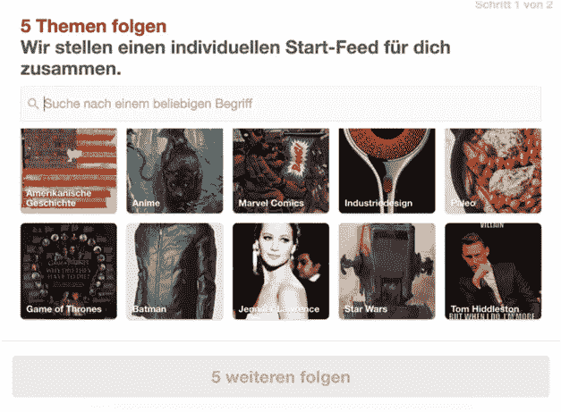
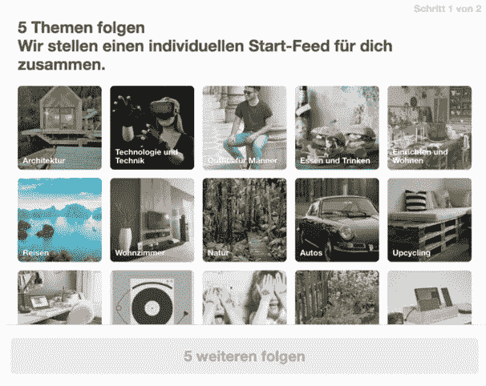

# 个性化 Pinterest 在国外的新用户体验

> 原文：<https://medium.com/pinterest-engineering/personalizing-pinterests-new-user-experience-abroad-60f8f55177ac?source=collection_archive---------0----------------------->

廖骏伦|发现网站 Pinterest 工程师

Pinterest 是一个人们用来发现和做他们喜欢的事情的想法目录。随着超过一半的 Pinners 在美国以外使用我们的应用程序，我们已经做出了重大改进，向人们展示符合他们独特品味的内容，无论他们住在哪里，说什么语言。之前，当我们与世界各地的 Pinners 交谈时，一个常见的反馈是，Pinterest 从他们注册的那一刻起就对他们感到陌生。在本帖中，我们将介绍我们如何为美国以外的用户改进新的用户体验，使其更加个性化，并将新用户激活率和保留率提高了 5-10%。

## 重塑新的用户体验

我们改善美国以外用户注册体验的第一步是了解人们在 Pinterest 上寻找什么。从概念上讲，Pinterest 将兴趣和想法组织成我们所说的主题。当有人第一次注册时，我们会要求他们从一系列话题中找出自己的兴趣，然后我们会将这些话题转化为个性化的主页订阅。以前，国际 Pinners 从与美国相同的一组主题中选择，但由于世界各地的兴趣不同，我们希望个性化这种体验。

*图 1:之前德国男性新用户话题选择器*

## 确定地方利益

为了找到最相关的话题，我们分析了人们在 Pinterest 上最感兴趣的内容，以及他们如何参与这些内容。我们查看了各个国家最常见的电路板主题，因为将 Pin 保存到电路板是用户兴趣的重要信号。我们还分析了一个大规模的搜索查询日志，使用按国家排列的热门搜索查询来识别相关主题。综合这些信号后，我们将候选主题发送给国内团队进行审核。这种方法利用了来自 Pinner 项目的数据信号和来自当地专家的领域知识。

## 支持各国的内容

在为一个国家确定了一系列主题后，下一步是寻找最佳内容。随着越来越多的国际使用，我们现在比以往任何时候都有更多语言的 pin。从之前的 A/B 实验中，我们知道 Pinners 更有可能在他们的语言中保存 pin，所以对于候选主题，我们只显示与本地相关的内容。最好的方法之一是显示其他本地用户正在保存的 pin。最近，我们开发了一种新的方法，通过显示相关论坛的 pin 来支持不同国家的主题。

查找与给定主题相关的论坛的一个简单方法是将主题名称与论坛标题相匹配。我们没有使用严格的标题匹配，而是使用带有同义词的模糊匹配来增加候选项的数量。在我们的匹配策略中，我们忽略了空白和非字母字符。例如，当匹配“狗”的时候，我们也看相似命名的板，像“狗”、“狗”和“小狗！！♥".

接下来，我们使用一系列丰富的信号对候选人进行排名，包括 Pinner 参与度、董事会相关性和最近的董事会活动。为了增加本地内容，如果有大量与 Pinner 的语言相关的 pin，我们会给板子打高分。排名后，我们通过将这些板发送给我们的国内团队来进一步审查这些板，以帮助确保高相关性和质量。

*图 2:德国男性全新用户话题选择器*

## 影响

当我们在国外推出这些变化时，我们看到新用户激活量大幅增加，那些注册用户回来使用 Pinterest 的可能性增加了 5-10%。我们的实验证实，个性化对于帮助美国以外的 Pinners 从 Pinterest 获得更多价值至关重要。讲法语、德语、日语、葡萄牙语或西班牙语的任何人都可以获得这种新的用户入门体验，我们计划很快将其推广到更多语言。

## 后续步骤

虽然这次大修是一个很大的改进，但它只是向为世界各地的 Pinners 提供更个性化的体验迈出的又一步。展望未来，我们将通过为更多国家和更多语言的 Pinners 提供更好的内容，积极致力于进一步改善体验。