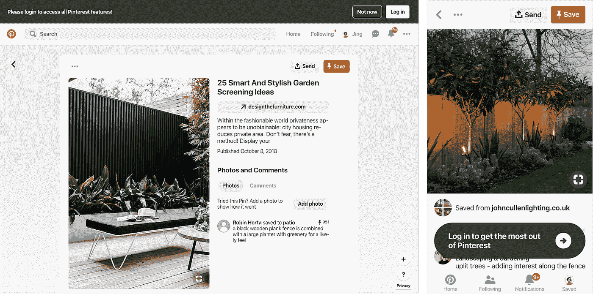
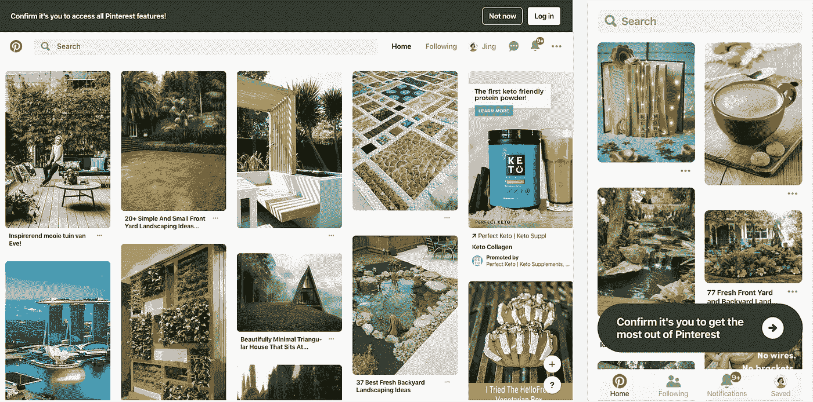
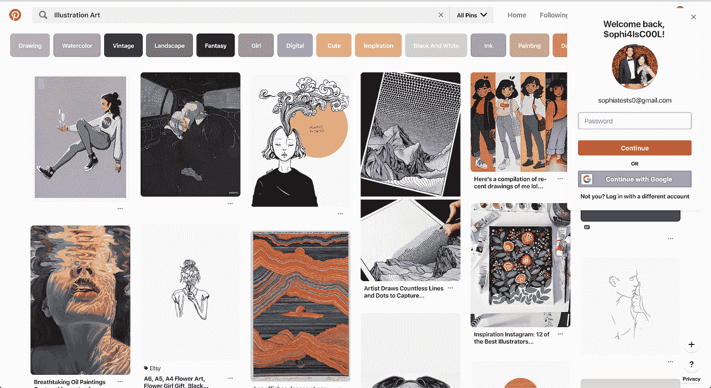
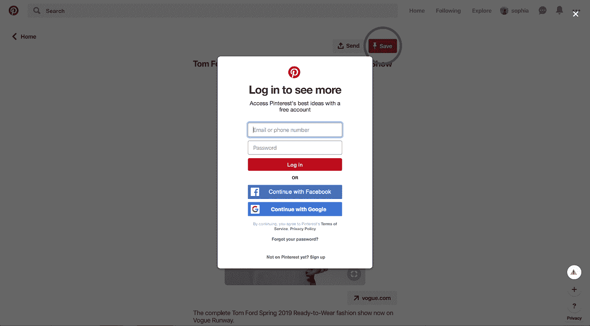
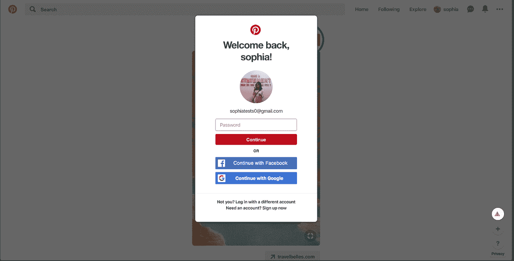
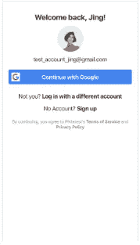
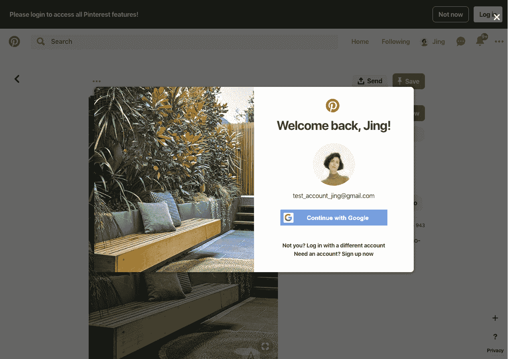

# 个性化电子邮件登陆体验

> 原文：<https://medium.com/pinterest-engineering/personalizing-the-email-landing-experience-919bac7e1c76?source=collection_archive---------4----------------------->

*胡与冯|成长激活*

电子邮件是我们与品客沟通和接触的主要渠道之一。目标是提供吸引人的相关建议，鼓励他们进一步探索 Pinterest 上的想法。然而，通过电子邮件将 Pinner 带回到 Pinterest 存在一个挑战:*我们如何平衡无缝连接用户从电子邮件到 Pinterest 上查看他们的内容，同时保持 Pinner 帐户的安全？*

Pinterest 过去几年的解决方案一直是为用户提供有限的体验，在这种体验中，他或她可以无限制地浏览他们的公共内容，但不能参与任何“写”操作(例如保存 pin)，以防止他们的电子邮件落入坏人手中(例如通过电子邮件转发)。然而，即使有了这个解决方案，用户也面临着不理解他们对 Pinterest 的访问是有限的，以及为什么他们会被提示登录的挑战。在过去的几个月里，我们通过两种关键方法在解决这个问题上取得了重大进展:优化登录提示和个性化他们的登录体验。

# **优化我们的登录提示**

Original login prompt

*Testing different copies on the login prompt*

对于用户来说，最初的有限体验看起来与完全登录的体验没有什么不同，从而使副本“*请登录…* ”变得混乱和格格不入。我们从小处着手，相信一个简单的拷贝更改(“*确认是你…* ”)可能有助于更好地告知用户他们的有限访问权限。不幸的是，仅仅是副本并没有对他们完全登录的可能性产生重大影响。

*Web flyout login modal with personalization*

然后我们探索向用户显示一个更吸引眼球的提示，将单调的灰色横幅换成一个弹出的，这在以前对于注销的用户是成功的。这种体验显著增加了显式登录，甚至导致节省 pin 的用户增加了 7%,因为他们可以在完全登录状态下执行写操作。

# 输入个性化

虽然优化登录提示确实增加了登录和下游用户的参与，但这种体验仍然感觉平淡无奇，因为我们从用户那里获得了来自电子邮件的信息，但我们没有充分利用这些信号。我们决定探索定制他们返回体验的关键方面，以进一步鼓励他们明确登录，包括:

*   使用他们的姓名和个人资料照片个性化登录模式
*   通过基于他们最初的注册方式展示熟悉的选项来增加登录
*   通过预先填写他们的电子邮件来减少摩擦
*   在他们从受限登录状态过渡到完全登录状态时促进内容连续性

*Original web login modal with no personalization*

*Web login modal personalized with name, avatar, email and original signup method (email/password)*

*Mobile web personalized login screen with original signup method (Google)*

*Web login modal showing content as users are prompted to explicitly log in*

这些努力共同促使受限状态下的显式登录增加了 14%，验证了我们的假设，即用户返回体验的个性化增加会对下游参与产生积极影响。

鉴于我们在个性化电子邮件登陆体验方面的成功和经验，我们期待着让更多的体验更加无缝和个性化，以使 Pinners 能够参与激发他们的想法。

*致谢:*

黄，李一泽，，尼拉杰·钱德拉，邝维多利亚和成长团队