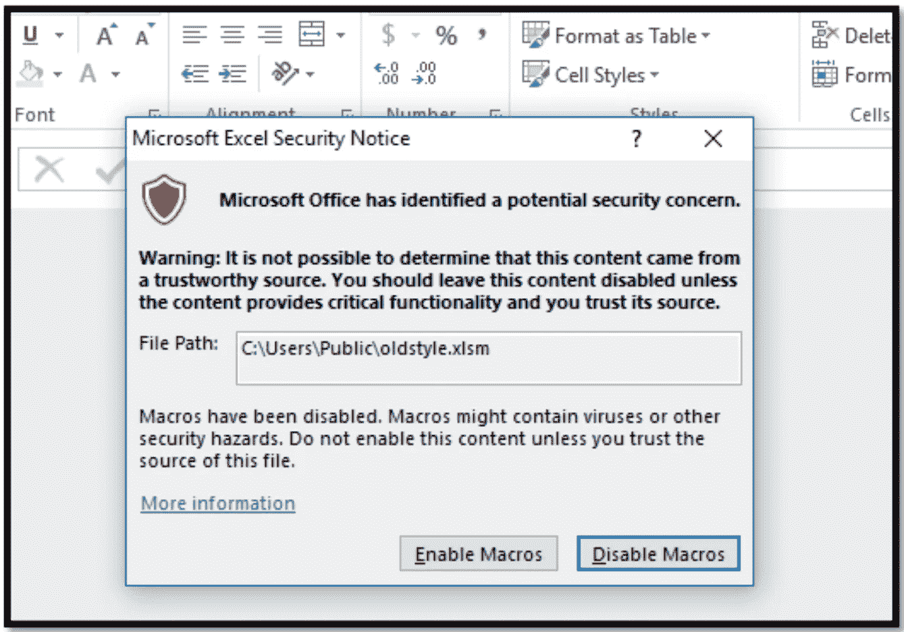
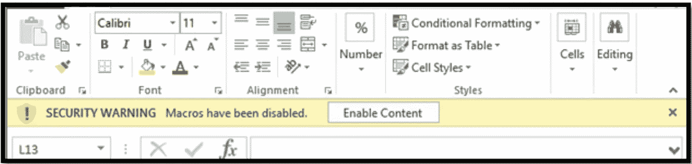
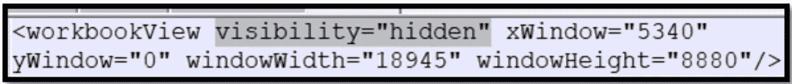
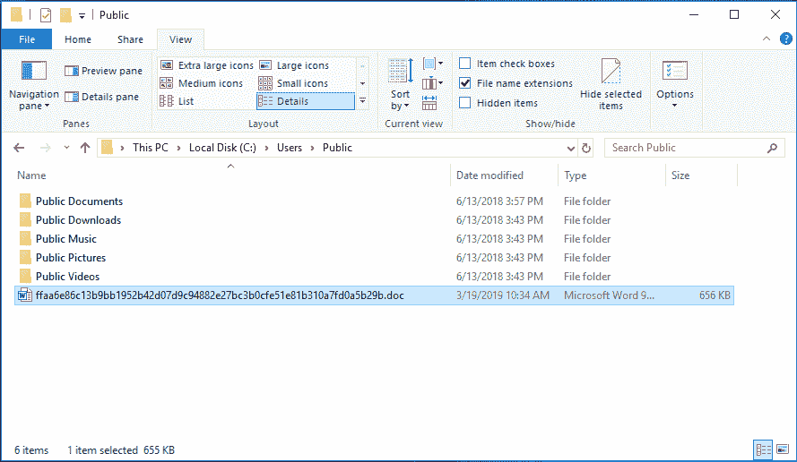
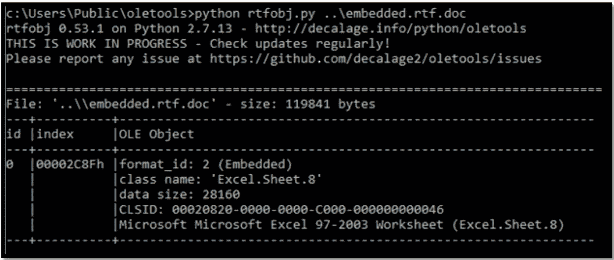
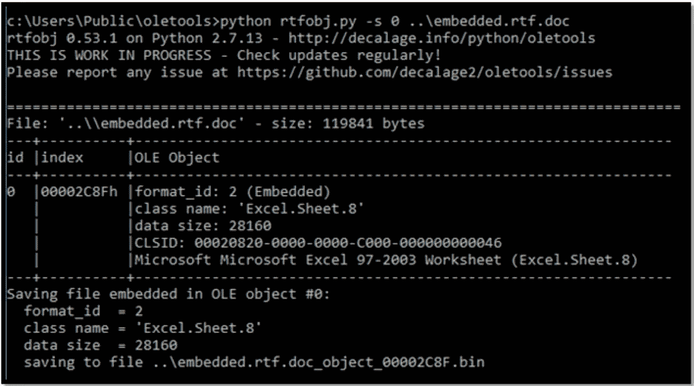
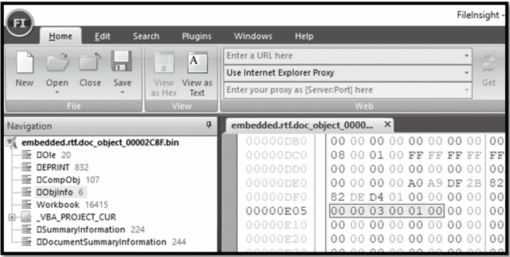
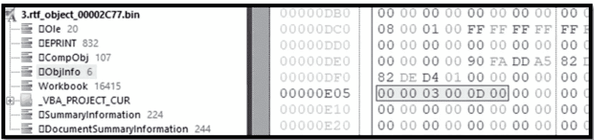
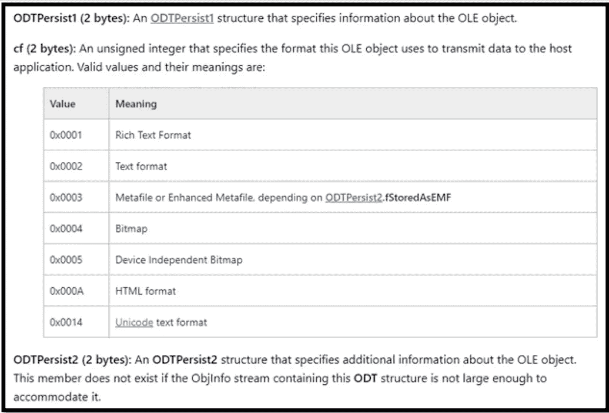
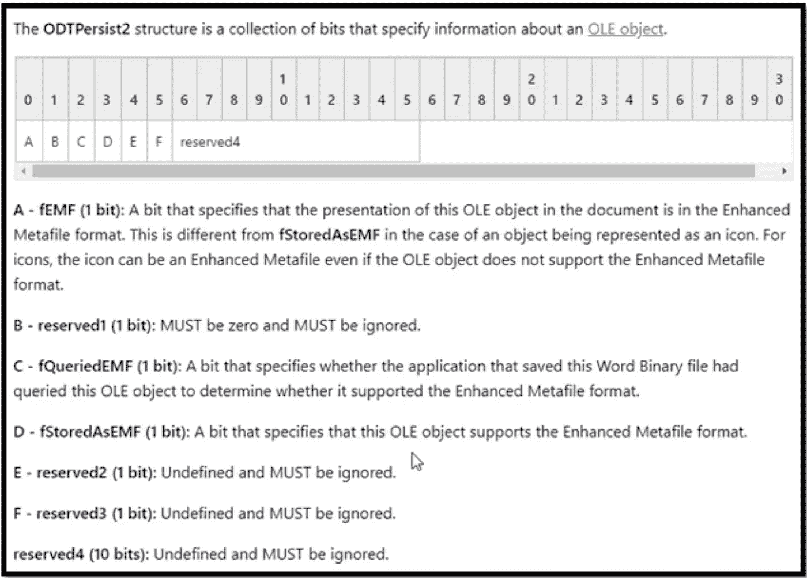

# 讨厌的旧式宏弹出窗口——高级 Maldoc 技术

> 原文：<https://medium.com/walmartglobaltech/pesky-old-style-macro-popups-advanced-maldoc-techniques-8868ed02d845?source=collection_archive---------2----------------------->

作者:凯莉·罗伯茨( [@OrOneEqualsOne](https://twitter.com/OrOneEqualsOne) )

还记得旧式的启用宏对话框吗？您可以将它重新投入使用，以提高网络钓鱼活动的点击率。旧式对话框如下所示。

这比我们已经习惯的黄色通知更“直接”地显示在你的面前，如下所示。

当 Excel 工作簿设置为隐藏时，将显示旧式对话框。以下步骤将为启用宏的 xlsm 文件完成此操作。

1.  重命名。xlsm 到。拉上拉链和拉开拉链
2.  将 visibility="hidden "属性添加到 xl/workbook.xml 文件中的 workbookView 元素。
3.  再次将所有文件压缩成一个 xlsm 文件

因此，至少对于 Excel 来说，这是一个增加网络钓鱼活动趣味的好方法。我们能用 PowerPoint 或 Word 做同样的事情吗？不幸的是，这些格式没有隐藏的可见性属性。

然而，在查看来自 VirusTotal 的恶意软件样本时，我们在 Word 文档中遇到了一些讨厌的旧式宏弹出窗口。这些弹出窗口不会消失，除非你启用了宏，并且它们没有使用之前描述的 visibility="hidden "参数。例如，哈希为 FFA a6 e 86 c 13 b 9 bb 1952 b 42d 07d 9 c 94882 e 27 BC 3 b 0 cfe 51 e 81 b 310 a 7 FD 0 a 5 b 29 b 的 VirusTotal 文件在放弃之前会弹出 5 个对话框。文档本身是一个 Word 文档，以 RTF 格式保存，并嵌入了启用宏的 Excel 电子表格。下面的动画图像显示了这款恶意软件的用户体验。

可以通过以下步骤创建如上所示的恶意软件示例。

1.  创建启用宏的 Excel 文档，文档一打开，宏就运行。(例如使用 Workbook_Open 函数)。您可以将此文件保存为 xls 或 xlsm 文件。
2.  创建一个 Word 文档，并将启用宏的 Excel 文档嵌入其中。使用“插入”菜单，从功能区文本区域的下拉列表中选择“对象…”并选择“从文件创建”选项卡，然后浏览至 Excel 文档。不要点击“链接到文件”或“显示为图标”。选择“禁用宏”关闭出现的对话框。
3.  重复第二步任意次。嵌入项目的数量控制用户将收到的弹出窗口的数量。
4.  可以选择隐藏嵌入的对象，方法是选择它们并按“Ctrl+Shift+H ”,或者将它们移动到文档中后面的页面。
5.  将 Word 文档保存为 RTF 文件，然后将。rtf 扩展到。文件
6.  编辑。将“\objemb”替换为“\objupdate\objemb”

这种恶意软件启发我们寻找其他方法，不使用 RTF 文件中的“objupdate”字符串就可以完成同样的事情。这导致了以下方法的发现。与第一种方法相比，第二种方法可能不太容易被检测为恶意软件。

1.  创建启用宏的 Excel 文档，文档一打开，宏就运行。(例如使用 Workbook_Open 函数)。您可以将此文件保存为 xls 或 xlsm 文件。
2.  创建一个 Word 文档，并将启用宏的 Excel 文档嵌入其中。使用“插入”菜单，从功能区文本区域的下拉列表中选择“对象…”并选择“从文件创建”选项卡，然后浏览至 Excel 文档。不要点击“链接到文件”或“显示为图标”。选择“禁用宏”关闭出现的对话框。
3.  重复第二步任意次。嵌入项目的数量控制用户将收到的弹出窗口的数量。
4.  可以选择隐藏嵌入的对象，方法是选择它们并按“Ctrl+Shift+H ”,或者将它们移动到文档中后面的页面。
5.  将 Word 文档保存为. docx 文件。关闭并重新打开. docx。
6.  现在保存。docx 文件作为 RTF 文件。

是的，你必须做第五步！当您按照概述的步骤操作时，在最终的 RTF 文件中会发生神奇的事情。为了理解这种魔力，我们将提取代表 RTF 文件中嵌入的 Excel 文档的二进制 OLE 对象。我们将使用来自 [oletools](https://github.com/decalage2/oletools) 的 rtfobj.py 脚本进行提取。如果在此步骤中遇到错误，请使用标记为 v0.53.1 的 oletools 版本。

对 RTF 文件运行 rtfobj.py:

确定嵌入的 Excel 文档的流编号。在这种情况下，流编号为零。现在将它提取为一个 OLE 对象。

我们的 OLE 文件已经输出到最后一行所示的目录中。现在，在理解 OLE 格式的十六进制编辑器中打开这个提取的文件，例如迈克菲实验室的 [FileInsight](http://download.nai.com/products/mcafee-avert/fileinsight.zip) 。

我们正在寻找的“魔法”就在上图中突出显示的 **Objinfo** 流中。对于 **Objinfo** 流，我们需要看到的幻数是“000003000100”。如果您跳过文档创建过程中的第 5 步，您将在应该是“1”的地方以“D”结束，并且您将不会得到“启用宏”弹出窗口。

那么，这个神奇的十六进制数字到底是什么？我们可以在这里阅读更多关于 **ObjInfo** stream [的内容。具体来说，该流包含用于 **ODTPersist1** 结构的 2 个字节、用于 **cf** 结构的 2 个字节和用于 **ODPerstist2** 结构的 2 个字节。](https://docs.microsoft.com/en-us/openspecs/office_file_formats/ms-doc/13ba10a8-d8b2-433b-bf3b-ec238dc8f9ce)

请记住，在文档中，这些字节是从“最低有效位”(LSB)到“最高有效位”(MSB)排列的，也就是您可能提到的反向排列。所以 **cf** 值为 0x0003，表示嵌入文件的格式不是“元文件”就是“增强型元文件”。为了决定它是否是一个“增强元文件”，我们需要查看 **ODTPersist2** 结构，最后两个字节。当 **ODTPersist2** 为 0x000D 时，左 3 个字节为 1011。下面的图表表明这意味着该文件是一个增强型图元文件，并且 OLE 对象支持这种格式。

在我们的例子中，我们希望打开 RTF 文档，让它自动启动 Excel 并提示用户启用宏。当 **ODTPersist2** 结构中的 **fStoredAsEMF (D)** 位被置位时，这种情况不会发生。实际上，我们只需要一个值来设置 **fEMF (A)** 位，而*不会*设置**fstoredasmf(D)**位。或者换句话说，我们指定 OLE 对象是不支持这种文件格式的增强型图元文件。因此，我们可以将 **ODTPersist2** 的值设置为 0x0001 来完成我们的设计。

哇，我们刚刚向您展示了如何以编程方式强制在打开文档时显示旧式的启用宏弹出窗口的痛苦细节。如果您执行第 5 步(将文档保存为 docx 文件，关闭文件，重新打开并另存为 RTF ),这将自动发生。为什么？我不知道，但这总比做这些逆向二进制的东西强。

有趣的是，你可以结合这篇文章中的文档创建方法 1 和 2，从一个嵌入的 OLE 对象中得到两个启用宏弹出窗口。

关于检测:您对检测带有嵌入宏的文档的 RTF 文件感兴趣吗？哈罗德·奥格登([@哈罗德·奥格登](http://twitter.com/HaroldOgden))提供了这两条亚拉法则。第一个规则检测具有多个嵌入的启用宏的文档的 RTF 文件，而第二个规则范围较广，更容易出现误报，但有利于搜索。