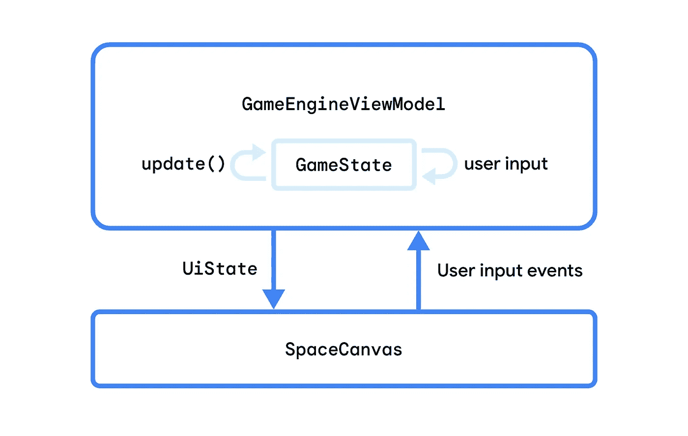
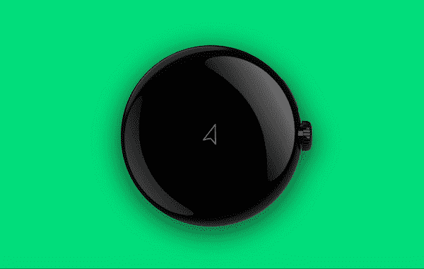
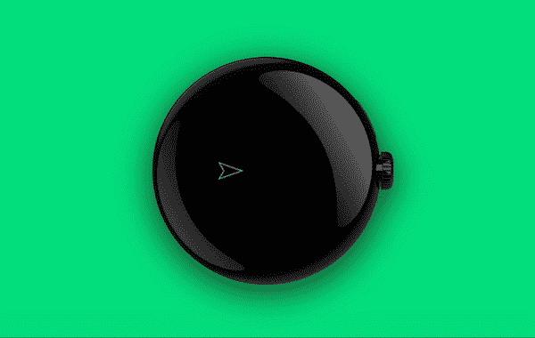
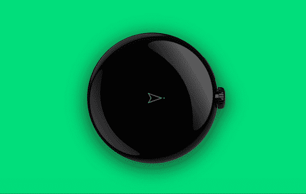
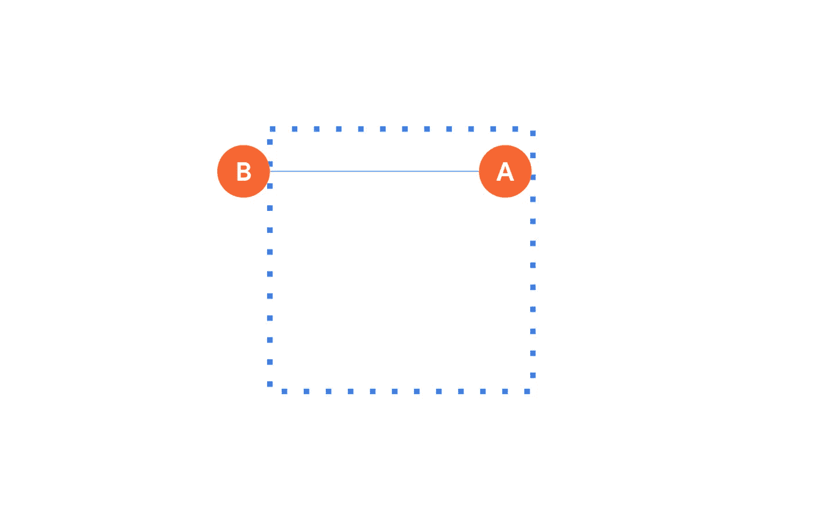
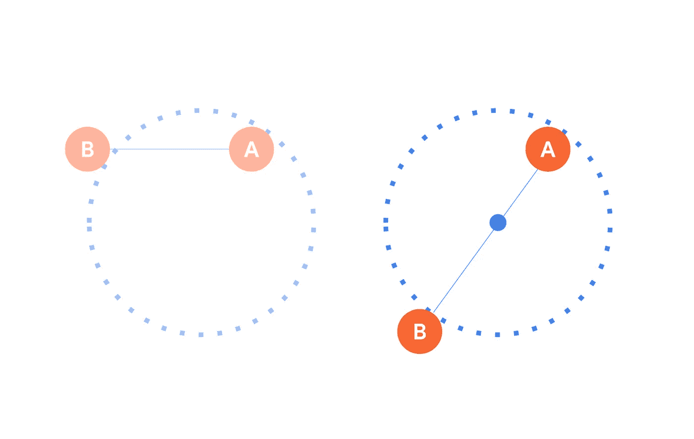
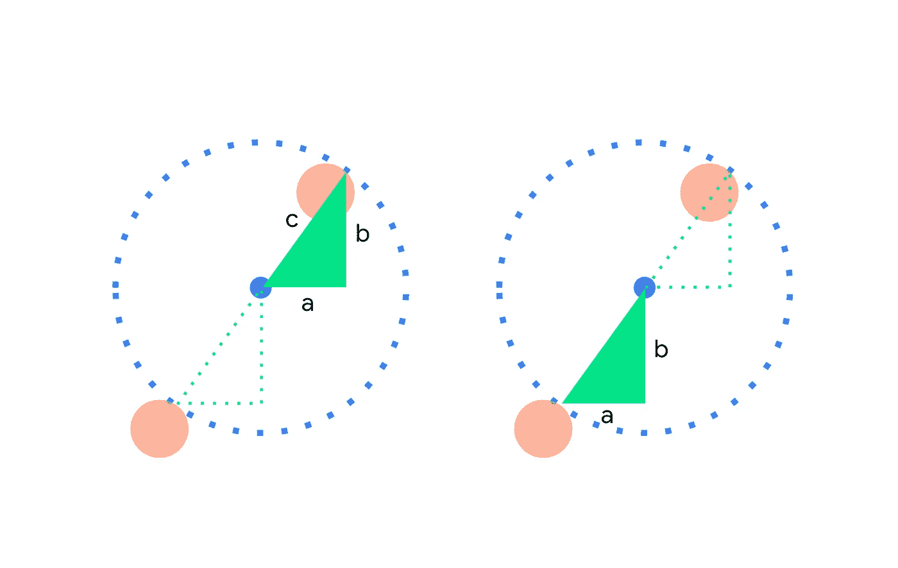
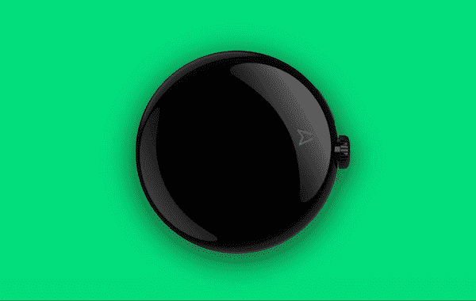

# 皮尤皮尤！在 Wear OS 上用 Compose Canvas 制作游戏👾

> 原文：<https://medium.com/androiddevelopers/pew-pew-making-a-game-with-compose-canvas-on-wear-os-9a37fa498d3?source=collection_archive---------5----------------------->

几周前， [Sara Hamilton](https://www.linkedin.com/in/sara-hamilton-552026a5/) 和我通过使用 [Compose for Wear OS](https://developer.android.com/training/wearables/compose) 制作了一个 Wear OS 游戏，稍微偏离了我们通常感兴趣的领域。

我们的目标包括:

*   使用我们现有的 Jetpack Compose(在移动设备上)和 Compose for Wear OS 的知识
*   尝试佩戴操作系统设备特有的输入(如[旋转输入](https://www.youtube.com/watch?v=2CzWz5Ad4iM)通过旋转挡板和侧按钮)
*   了解在 Wear 操作系统上玩游戏还需要考虑哪些因素

我们首先制作了一个克隆的 Chrome Dino 游戏，在这个游戏中，一只霸王龙跳过了仙人掌(除了我们的是一只跳过甜点的鸭子——这同样有意义，伙计们！)，并以一个激光发射宇宙飞船的演示结束，这样我们就有更多的空间去探索。

# 创建游戏循环

这个游戏的基础是由一个无限循环驱动的，这个无限循环间歇地调用一个函数来处理游戏状态并产生 UI 状态。由于`GameEngineViewModel`是屏幕级别的状态持有者，这就是游戏循环(业务逻辑)将存在的地方。

`update()`是 ViewModel 中的一个私有函数，在这里我们可以处理对`GameState`的更改，并使用它生成一个新的`UiState`。

我们的可组合函数`SpaceCanvas`会在发出新消息时呈现`UiState`，并通知 ViewModel 用户输入事件。

# 用合成画布呈现用户界面

用 Compose Canvas 渲染我们的游戏世界是理想的，因为它有一个简单的坐标系，并包括用于绘图的 API，这些 API 也可以在 Wear OS 上工作。

Canvas composable 的`[onDraw](https://developer.android.com/jetpack/compose/graphics/draw/overview#drawscope)` [参数](https://developer.android.com/jetpack/compose/graphics/draw/overview#drawscope)提供了对`[DrawScope](https://developer.android.com/reference/kotlin/androidx/compose/ui/graphics/drawscope/DrawScope)`的访问，允许我们单独绘制每个元素，使用扩展函数来保持我们的`SpaceCanvas` composable 简短且易于管理。

每当`SpaceCanvas`的参数改变时，它会重新组合并绘制一个新帧。激光是用`[drawCircle()](https://developer.android.com/reference/kotlin/androidx/compose/ui/graphics/drawscope/DrawScope#drawCircle(androidx.compose.ui.graphics.Brush,kotlin.Float,androidx.compose.ui.geometry.Offset,kotlin.Float,androidx.compose.ui.graphics.drawscope.DrawStyle,androidx.compose.ui.graphics.ColorFilter,androidx.compose.ui.graphics.BlendMode))`绘制的:

而飞船本身就画有`[drawPath()](https://developer.android.com/reference/kotlin/androidx/compose/ui/graphics/drawscope/DrawScope#drawPath(androidx.compose.ui.graphics.Path,androidx.compose.ui.graphics.Color,kotlin.Float,androidx.compose.ui.graphics.drawscope.DrawStyle,androidx.compose.ui.graphics.ColorFilter,androidx.compose.ui.graphics.BlendMode))`。

使用`[rotate()](https://developer.android.com/reference/kotlin/androidx/compose/ui/graphics/drawscope/package-summary#(androidx.compose.ui.graphics.drawscope.DrawScope).rotate(kotlin.Float,androidx.compose.ui.geometry.Offset,kotlin.Function1))`转换让我们不用处理大量的数学运算就能确定船的方向。

# 避免不必要的工作

我们每次绘制时都在创建飞船路径，因为它当前依赖于飞船的位置和大小。

由于在游戏的生命周期中，尺寸只改变一次(当“SpaceCanvas”尺寸改变时),我们可以通过记住路径，并使用`[translate()](https://developer.android.com/reference/kotlin/androidx/compose/ui/graphics/drawscope/package-summary#(androidx.compose.ui.graphics.drawscope.DrawScope).translate(kotlin.Float,kotlin.Float,kotlin.Function1))`变换来正确定位它，从而避免每帧昂贵的初始化。

我们写一个函数在位置(0，0)创建飞船路径。这就消除了对飞船位置的依赖性，因为飞船位置经常更新:

然后我们可以在`SpaceCanvas`组合中使用它:

`remember(spaceship.width, spaceship.length)`意味着`spaceshipPath`只会在飞船的宽度或长度发生变化时更新，而不是每一帧都更新。

# 检测转动的旋转输入

作为用户，我们需要执行三个动作:转身、推进和开火。旋转输入似乎非常适合第一个用例:旋转。

佩戴操作系统设备，如 Pixel Watch，可以配备物理旋转侧按钮或表盘周围的旋转表圈。边框可以是物理硬件的一部分，也可以只是软件的一部分，就像三星 Galaxy Watch5 一样。旋转侧边按钮和挡板将输入事件的相关信息发送到焦点视图。

我们可以在画布上获得焦点，以便将这些旋转滚动事件发送到那里。[修改器的顺序很重要](https://developer.android.com/jetpack/compose/modifiers#order-modifier-matters):`focusRequester`和`[onRotaryScrollEvent](https://developer.android.com/reference/kotlin/androidx/compose/ui/input/rotary/package-summary#(androidx.compose.ui.Modifier).onRotaryScrollEvent(kotlin.Function1))`都需要应用在可聚焦的东西上。这意味着它们应该出现在`focusable()`修饰符之前，或者在同一个修饰符链中(如本例)，或者在一个父组件中:

现在，我们可以在视图模型中修改船的状态:

当下一次调用`update()`生成新的`UiState`时，画布将使用`rotationDegrees`来转换飞船的路径。

# 检测用于按压的触摸输入

我们可以认为抽插是一种布尔状态；当飞船的推进器工作时，我们想施加一个向前的力，当它们脱离时，我们想施加“摩擦力”使飞船减速。为此，我们使用带有 `[detectTapGestures](https://developer.android.com/jetpack/compose/gestures#tapping)` [功能](https://developer.android.com/jetpack/compose/gestures#tapping)的`[pointerInput](https://developer.android.com/jetpack/compose/gestures#tapping)`[修改器检测屏幕上的按压:](https://developer.android.com/jetpack/compose/gestures#tapping)

在前面的代码片段中，`onPress`不是一个简单的回调函数——它是一个带有`PressGestureScope`接收器的挂起函数。这里，我们可以用`tryAwaitRelease()`来区分 down 和 up 事件。

当用户按下屏幕(`thrusting == true`)时，ViewModel 将施加向前的力，这将导致船只加速或减速，这取决于船只的方位和动量。

`detectTapGestures`接收另一个有用的参数，即`onDoubleTap` lambda，我们可以用它来检测用户何时双击使船只发射激光，如下所示。

# 处理不同的设备形状

游戏的一个机制包括“传送”宇宙飞船，这样当它飞出视口时，它会重新出现在另一边。

在矩形设备上，当飞船的 x 坐标小于 0 或大于视口宽度时，我们将其设置为相反的值(y 坐标和视口高度的逻辑类似)，例如从 A 到 B。

“A” indicates the current position of the spaceship as it flies off towards the right edge of the screen, and “B” indicates its next position

这在圆形设备上不起作用，原因有二:

*   画布的角被设备框架夹住，因此它们对用户来说是不可见的，但实际上仍然存在。这意味着如果宇宙飞船飞向角落，它会消失，但需要更长的时间才能在另一边重新出现，因为它仍然在穿越“看不见的”空间
*   圆的“相对”面在概念上是不同的

Left: shows the same behavior with a circle canvas where the Y-coordinate does not change, Right: shows the desired behavior with a circle canvas, where “B” is on the opposite side of the circle to “A”.

为了解决这个问题，我们根据屏幕类型应用不同的传送逻辑，我们可以通过一个可组合的函数来检查:

我们知道“a”和“b ”,因为这是宇宙飞船的位置和圆心之间的绝对差值。利用毕达哥拉斯定理，我们可以计算出“c”。

如果“c”大于圆的半径，它就在圆的外面，我们需要把飞船传送到对面，使用“a”和“b”来计算新的位置。

# 下一步是什么？

在 Wear OS 上使用 Canvas 和在 mobile 上使用 Canvas 没什么区别。这很有意义，因为它来自于`compose-foundation`工件，该工件在 Wear OS 、mobile 和其他支持 Jetpack Compose 的表面上[工作。](https://developer.android.com/training/wearables/compose#compose-compiler)

我们为自定义组件添加了旋转输入支持，并通过一次布尔检查将设备形状考虑在内！我们可以使用相同的技术在 Wear OS 上构建应用程序，而不仅仅是游戏，那么我们还需要考虑什么？

保护电池是可穿戴设备的重中之重。使用深色或柔和的颜色(正如我们所做的)可以帮助显示器使用更少的能源。如果你正在制作一个需要互联网接入的应用程序，请考虑网络使用情况，并且更喜欢在设备连接到 WiFi 和充电器时进行同步。

当您使用旋转输入等设备功能时，请确保它们是支持它们的设备的增强功能，而不是不支持它们的设备所必需的。在我们的情况下，我们应该增加另一种方式让飞船旋转，例如，`onPressDownEvent()`可以改变飞船的方位以及控制推力。

**你有 Wear OS 应用、游戏或演示的想法吗？给我们展示一下**[**#穿缀**](https://kotlinlang.slack.com/archives/C02GBABJUAF) **松弛通道，上** [**乳齿象**](https://androiddev.social/@ataulm) **，** [**碎碎念**](https://twitter.com/ataulm) **或以下！**

本演示中显示的代码是[，可在此处](https://gist.github.com/ataulm/7a6b4b63ed45a5cfda013427c2212536)获得。