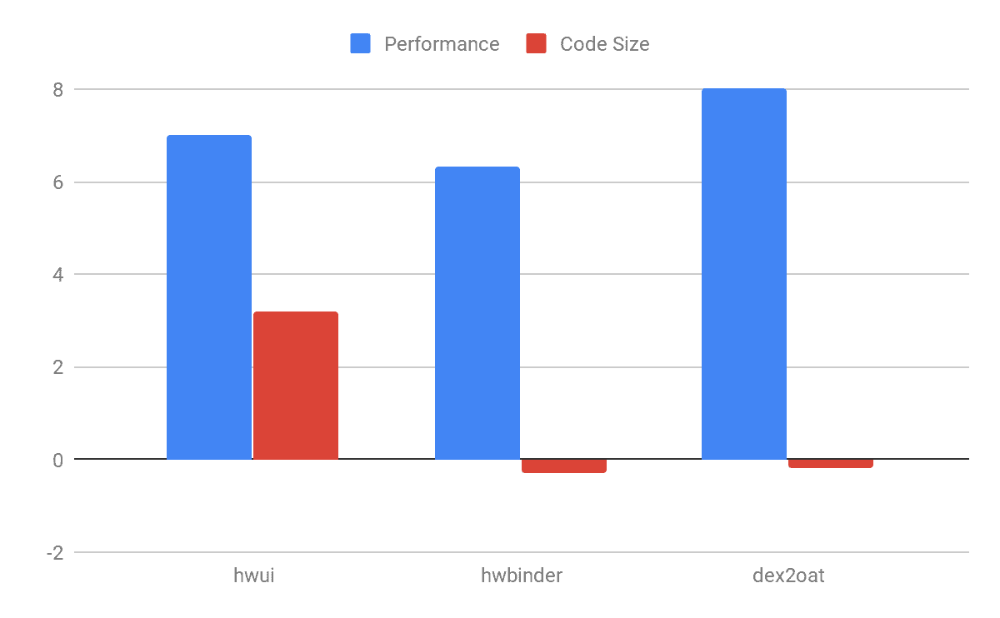

# 针对原生 Android 应用的配置文件引导优化

> 原文：<https://medium.com/androiddevelopers/pgo-for-native-android-applications-1a48a99e95d0?source=collection_archive---------2----------------------->

Illustration by Claudia Sanchez

*由软件工程师 Pirama Arumuga Nainar 发布*

Profile-guided optimization (PGO)是一种众所周知的编译器优化技术。在 PGO 中，编译器使用程序执行的运行时配置文件来对内联和代码布局做出最佳选择。这导致了性能的提高和代码量的减少。开发者现在可以利用谷歌的工具包轻松部署 PGO 工具，并改进他们的原生 Android 应用程序。

在选定的 Android 系统组件上，启用 PGO 可将性能提高 6–8%。PGO 还在一个组件中提供了代码大小的改进，同时略微增加了其他两个组件的代码大小。

Benefits of PGO for Android system components

# 可以通过以下步骤将 PGO 部署到您的应用程序或库中:

1.  确定有代表性的工作负载。
2.  收集个人资料。
3.  在发布版本中使用概要文件。

# 步骤 1:确定代表性的工作负载

首先，为您的应用程序确定一个有代表性的基准或工作负载。这是一个关键的步骤，因为从工作负载中收集的概要文件可以识别代码中的热区域和冷区域。当使用概要文件时，编译器将在热点区域执行积极的优化和内联。编译器也可以选择在牺牲性能的同时减少冷区域的代码大小。

确定一个好的工作负载也有利于跟踪总体性能。

# 第二步:收集个人资料

通过在应用程序的检测构建上运行步骤 1 中的工作负载来收集概要文件。要生成一个插装的构建，将`-fprofile-generate`添加到编译器和链接器标志中。这个标志应该由一个单独的构建变量控制，因为在默认的构建过程中不需要这个标志。

在运行检测的二进制文件时收集配置文件，并在退出时写入文件。然而，用`atexit`注册的功能不会在 Android 应用程序中调用——应用程序会被终止。应用程序/工作负载必须通过调用`__llvm_profile_write_file`函数来明确触发配置文件写入。

**Example for triggering profile write at end of workload**

如果工作负载是一个独立的二进制文件，那么编写概要文件会更简单——只需在运行二进制文件之前设置 [LLVM_PROFILE_FILE 环境变量](https://clang.llvm.org/docs/SourceBasedCodeCoverage.html#running-the-instrumented-program)。

配置文件为`.profraw`格式。使用 NDK 中的`llvm-profdata`实用程序将`.profraw`转换为`.profdata`，然后可以将其传递给编译器。

**Command to convert .profraw files to .profdata**

使用来自同一个 NDK 版本的`llvm-profdata`和`clang`来避免配置文件格式的版本不匹配。

# 使用概要文件构建应用程序

通过将`-fprofile-use=<>.profdata`传递给编译器和链接器，在应用程序的发布构建过程中使用上一步中的概要文件。这些概要文件甚至可以随着代码的发展而使用 Clang 编译器可以容忍源代码和概要文件之间的轻微不匹配。

# 个案研究

“`dex2oat`”是 Android 的车载 AOT 编译器。为了获得`dex2oat`的代表性工作负载，我们在 Play store 中随机选择了前 100 个安装量最大的应用中的 25 个。我们还随机生成了 [dex2oat 的编译选项](https://source.android.com/devices/tech/dalvik/configure#compilation_options)。

为了生成 PGO 概要文件，我们构建了一个装有 PGO 的`dex2oat`二进制文件，并使用它来编译工作负载。然后，我们生成了一个使用这些 PGO 配置文件的`dex2oat` 发布版本，并评估了 100 个安装量最大的应用中剩余的 75 个应用的性能增益。

我们利用 Android 团队可用的测试基础设施来自动收集这些 PGO 配置文件，以便可以轻松地保持更新。

# 结论

PGO 是一种非常有用的性能优化技术。在工作负载的初始设置和构建过程中的集成之后，它以最少的维护提供了令人印象深刻的性能改进。

以下是一些有助于提高 Android 应用程序性能的其他主题:

1.  [链接时间优化](https://llvm.org/docs/LinkTimeOptimization.html) : LTO + PGO 各自比各自好。
2.  [面向 Java 应用的云配置文件](https://android-developers.googleblog.com/2019/04/improving-app-performance-with-art.html)