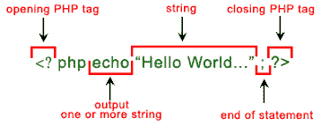

# PHP Series — Syntax PHP

> 原文：<https://medium.easyread.co/php-series-belajar-php-dasar-27221541978c?source=collection_archive---------0----------------------->

## Part 5 — Opening Tag, Closing Tag dan Semicolon

The image was taken from Google Image

# PHP Series List

[**0\. PHP Series — Kita Mulai Dari 0, ya!**](https://medium.com/easyread/php-series-kita-mulai-dari-0-ya-25533e6d087e)[**1\. PHP Series — “Know First, then Act”**](https://medium.com/easyread/php-series-think-first-then-act-f1345edc3dea)[**2\. PHP Series — Protokol HTTP**](https://medium.com/easyread/php-series-protokol-http-6f1303940115)[**3\. PHP Series — HTTP Lanjutan**](https://medium.com/@jansutris10/php-series-http-lanjutan-a55e8ab4637d)[**4\. PHP Series — Instalasi XAMPP**](https://medium.com/easyread/php-series-instalasi-xampp-c19f1bf106a9) **5\. PHP Series — Syntax PHP— You are here!** [**6\. PHP Series — Variabel**](https://medium.com/easyread/php-series-variabel-3986f58b88d1)[**7\. PHP Series — Tipe Data**](https://medium.com/easyread/php-series-tipe-data-7d389bd5d5eb)[**8\. PHP Series — Kondisi**](https://medium.com/easyread/php-series-kondisi-33f8812a380d)[**9\. PHP Series — Fungsi**](https://medium.com/easyread/php-series-fungsi-4f44b612ab96)[**10\. PHP Series — Perulangan**](https://medium.com/easyread/php-series-perulangan-385d952e9c8a)

Pada episode series kali ini, anda akan belajar tentang dasar-dasar dari PHP, mulai dari cara penulisan/ *syntax* PHP, kemudian di simpan dengan ekstensi apa dan bagaimana cara menjalankannya di *localhost* atau web-server lokal PC.

Bagi yang belum tau apa itu web-server dan apa itu *localhost* , pembaca disarankan baca tulisan saya part [***Protocol* HTTP**](https://medium.com/easyread/php-series-protokol-http-6f1303940115) hingga part [**Instalasi XAMPP**](https://medium.com/easyread/php-series-instalasi-xampp-c19f1bf106a9) . Kalau sudah paham, anda baru boleh lanjut ke series ini.

# Syntax PHP

Syntax PHP adalah aturan penulisan agar mampu dimengerti dengan benar oleh *compiler* saat membaca bahasa pemrograman. Dalam penulisan PHP diawali dengan `“**<?php**”` , jika kode program anda hanya terdiri dari syntax PHP maka tidak perlu diakhiri dengan `“**?>**”` .
Akan tetapi di dalam file PHP juga dapat berisi tag seperti HTML dan skrip sisi klien seperti *JavaScript* . Jika kode program anda mencakup hal selain syntax PHP, maka kode program anda harus diakhiri dengan `“**?>**”` .

Syntax PHP

Aturan terpenting adalah di setiap akhir baris dari syntax php harus di akhiri dengan `**semicolon ” ; ”**` atau titik koma sebagai tanda bahwa baris syntax PHP tersebut sudah selesai.

Semicolon

Untuk langkah selanjutnya kita akan mencoba beberapa syntax dasar PHP untuk mencoba menjalankan PHP di localhost anda. Silahkan buka text editor anda dan ketik syntax berikut:

Selanjutnya simpan file tersebut dengan menggunakan ekstensi `**.php**` . Diasumsikan untuk pembelajaran dasar anda boleh menyimpannya dengan `**sintaks.php**` sebagai nama file. Simpan ke direktori *localhost* anda seperti saat penginstalan.

Umumnya banyak orang yang menyimpan atau menginstallnya di `**C://xampp/htdocs/**` bagi anda yang menggunakan XAMPP di windows dan di `**/var/www/**` jika anda yang menggunakan Linux. Oleh sebab itu simpan di folder tersebut file `**sintaks.php**` yang sudah di buat tadi.

Kemudian aktifkan Apache seperti yang sudah di jelaskan pada part [sebelumnya](https://medium.com/easyread/php-series-instalasi-xampp-c19f1bf106a9) dan akseslah *localhost* pada URL anda. Kemudian ketikkan alamat *localhost* anda dan file PHP yang ingin dieksekusi.

Misalnya pada contoh ini anda bisa mengetikkan `**http://localhost/sintaks.php**` atau boleh juga dengan menggunakan alamat IP localhost `[**http://127.0.0.1/sintaks.php**](http://127.0.0.1/sintaks.phpd)` dan hasilnya adalah:

hasil ketika menjalankan file sintaks.php

Dari contoh di atas dapat di lihat bahwa kita telah berhasil menjalankan file PHP di localhost. Series akan dilanjutkan dengan pengenalan variabel dan tipe data. *So, Stay tune ya!*